## 一、事件背景

3CX是一家软件公司，该公司为客户提供基于软件的电话系统，用于企业或组织内部的通讯。

3CX电话系统可以在Windows或Linux服务器上部署，并提供包括VoIP、PSTN和移动电话在内的多种通讯方式。此外，3CX还提供一系列的通讯软件，包括用于电脑、移动设备及浏览器的应用程序，可以让用户通过各种方式与他人通讯。据3CX称，其提供的软件服务了600,000多个客户，遍布全球190多个国家。

2023年3月29日，CrowdStrike发出告警，指出具备合法签名的二进制程序3CXDesktopApp存在恶意行为。

## 二、事件过程

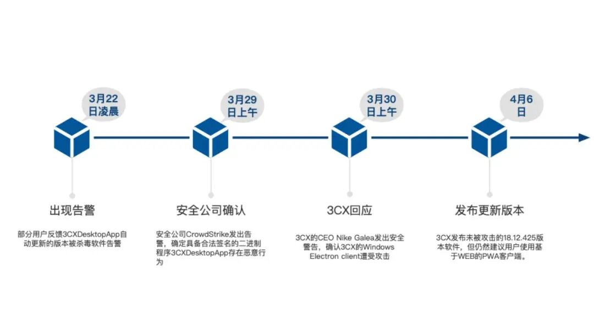

### 2023年3月22日

凌晨一点，部分用户反馈3CXDesktopApp自动更新的版本被杀毒软件告警。此时部分用户还将其定性为误报。

SentinelOne的告警信息显示软件存在shellcode或代码攻击能力。

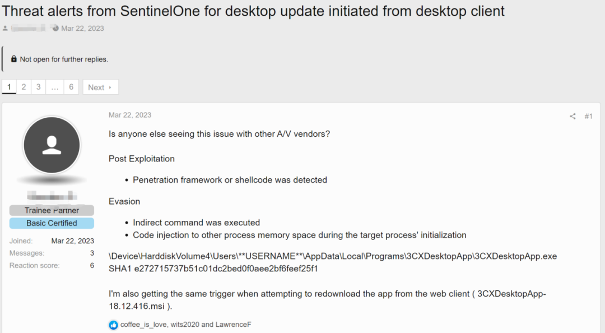

### 2023年3月29日

上午十一点，安全公司CrowdStrike发出告警，确定具备合法签名的二进制程序3CXDesktopApp存在恶意行为，危害Windows和macOS。

CrowdStrike怀疑其攻击行为源于LABYRINTH CHOLLIMA，这是一个具有有朝鲜相关背景的专业APT组织。

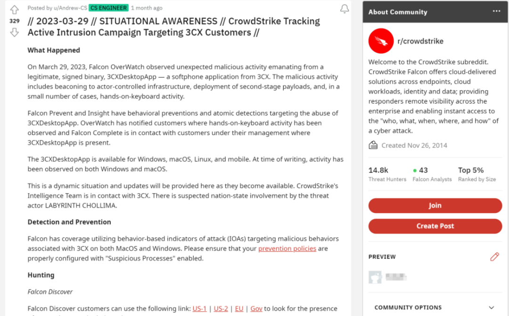

### 2023年3月30日

上午六点，3CX的CEO Nike Galea发出安全警告，确认3CX的Windows Electron client遭受攻击，并建议用户卸载该应用程序改而选择基于WEB的PWA客户端。

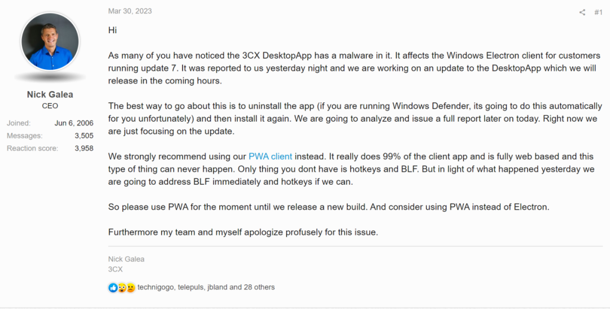

### 2023年4月6日

3CX发布未被攻击的18.12.425版本软件，但仍然建议用户使用基于WEB的PWA客户端。

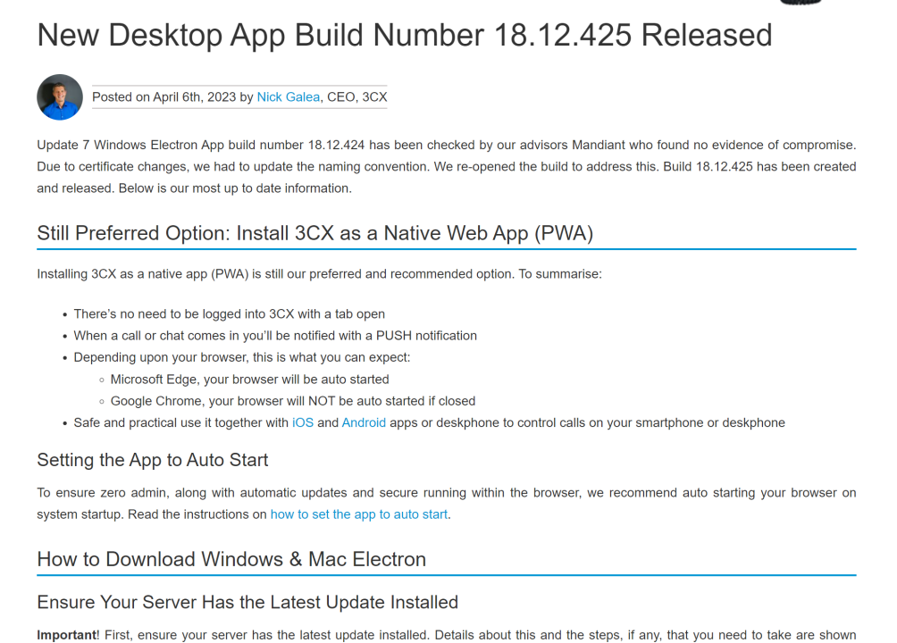

## 三、技术分析

### 受影响版本

👉Windows versions 18.12.407 and 18.12.416

👉Mac OS versions 18.11.1213, 18.12.402, 18.12.407, and 18.12.416.

部分文件及对应hash如下：

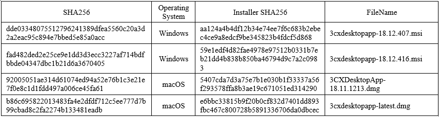

### 攻击分析

安装程序具有合法签名，安装后的3CXDesktopApp启动时会主动加载安装目录下没有签名的ffmpeg.dll。

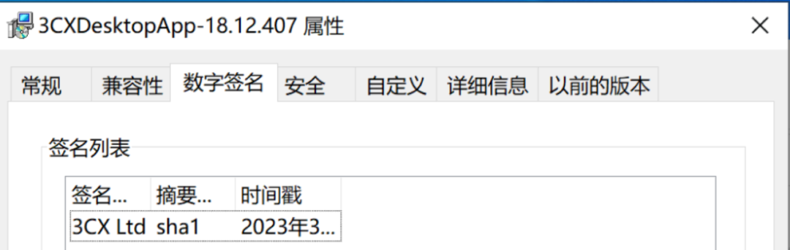

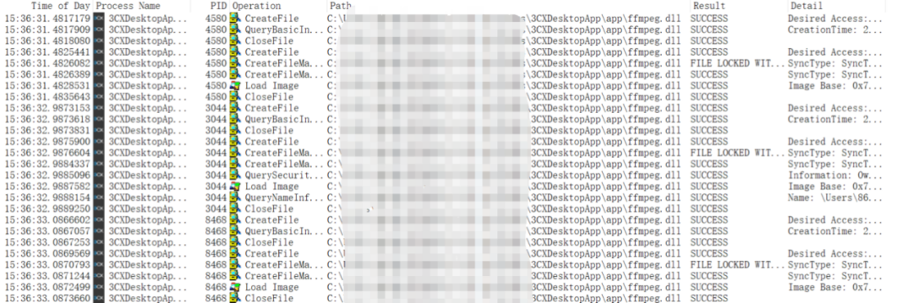

ffmpeg.dll被加载的时候会进行以下行为：

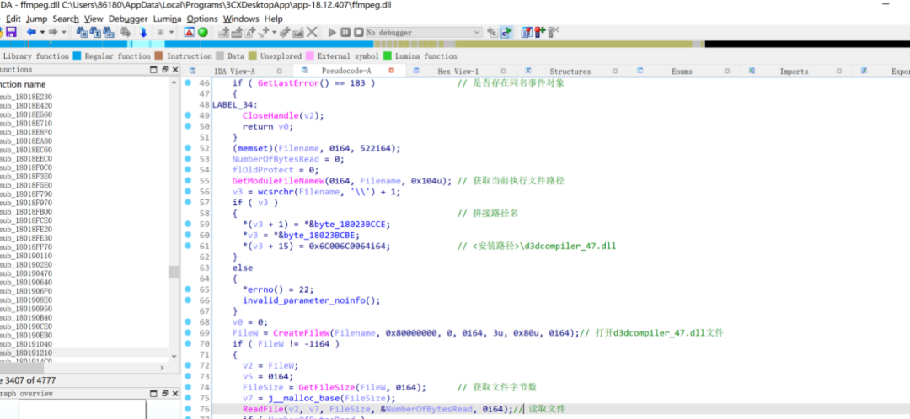

首先打开安装路径下的d3dcompiler\_47.dll文件，并读入内存。

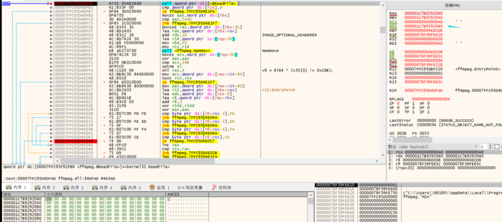

对比读入内存数据与磁盘数据发现一致，且读入数据大小为0x4EDCD8。

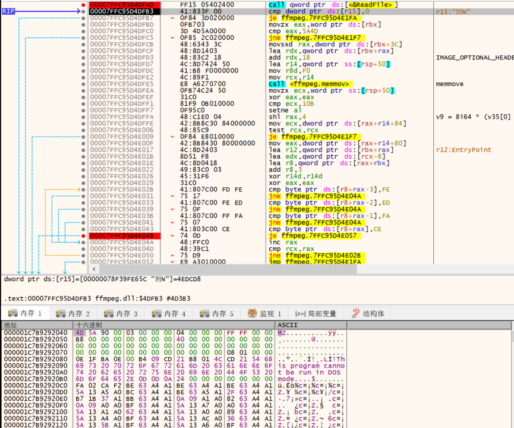

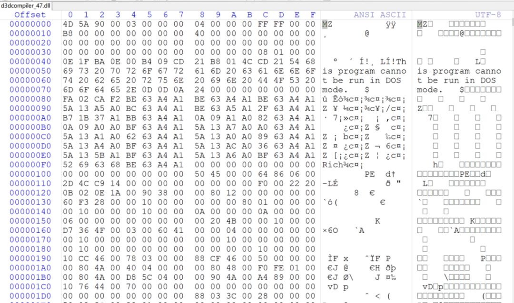

随后定位shellcode，shellcode使用RC4算法进行了加密，密钥为3jB(2bsG#@c7。

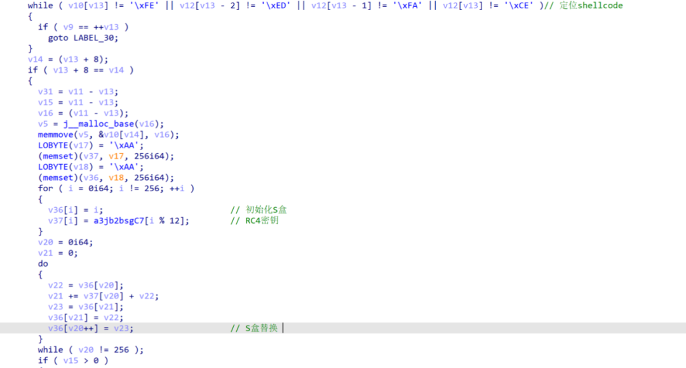

如下图所示，shellcode由8字节\\xFE\\xED\\xFA\\xCE\\xFE\\xED\\xFA\\xCE定位，后续0x43B08字节为其shellcode。

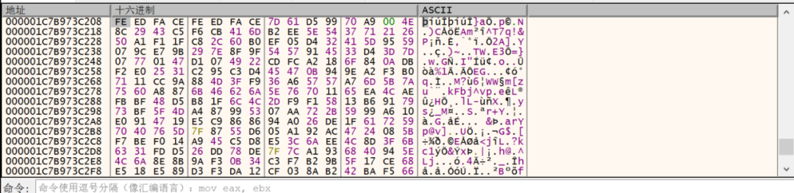

然后跳转到shellcode执行。

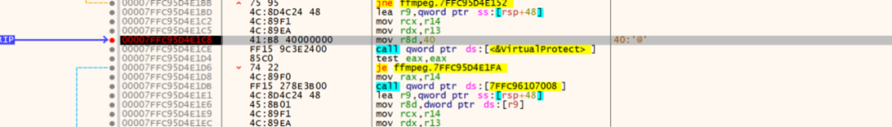

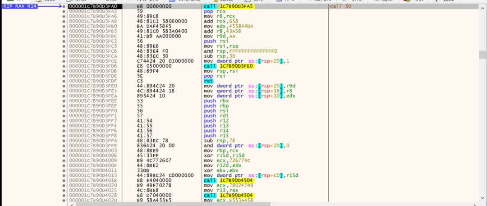

此时0x000001C7B90D3FA0为shellcode地址。

随后使用反射dll注入技术加载了放在shellcode中的dll文件，这里获取了一些dll函数用来后续修复导入表。

shellcode偏移0x65D处为dll文件开始处。

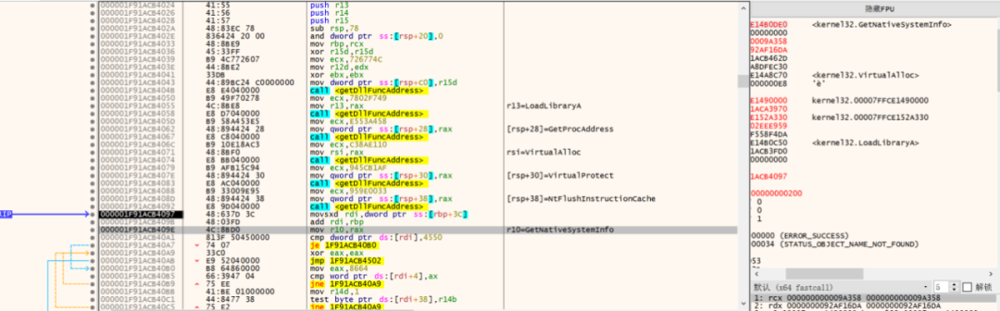

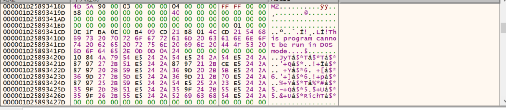

对该dll进行分析，发现其行为如下：

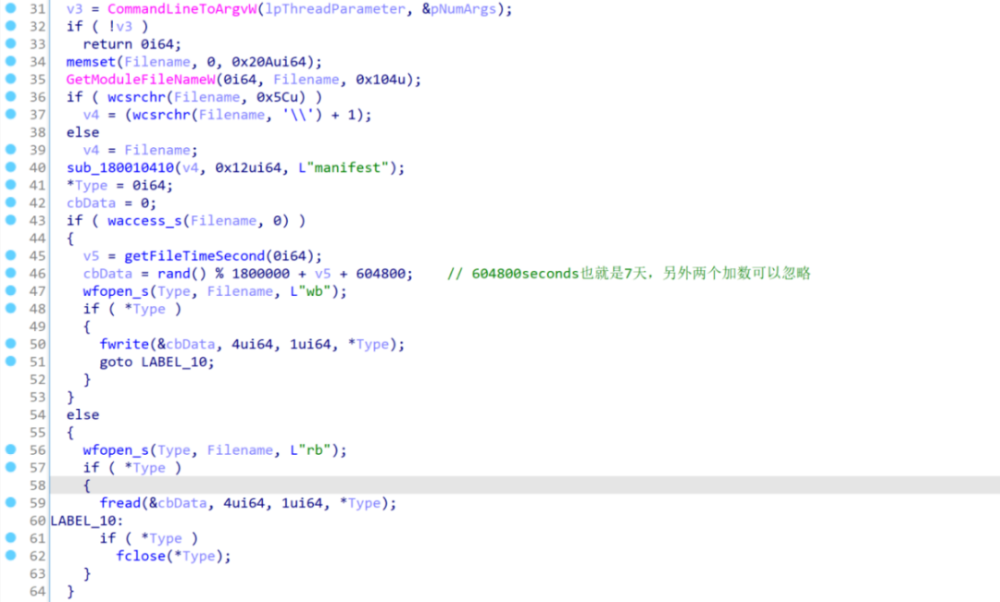

如果首次执行，写入manifest当前时间，后续执行判断是否过了604800s（七天），如果已经过了七天则向https://raw.githubusercontent.com/IconStorages/images/main/icon%d.ico发送请求，加载后续的payload。

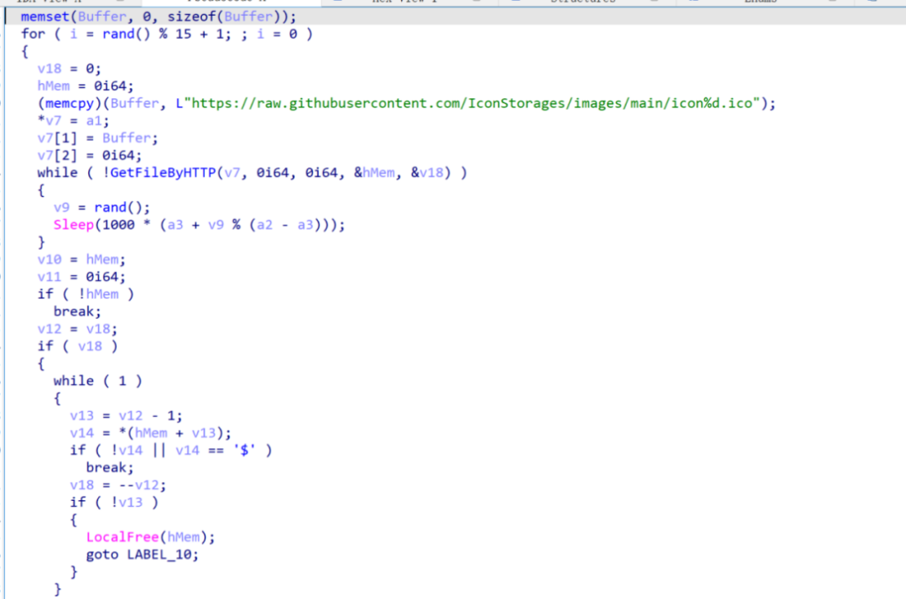

七天正好与3月22号的首次更新至3月29日首次确定攻击行为的间隔一样。

在本文章所写的2023年5月9日，由于其Github仓库已关闭，无法获取后续payload。但是通过静态分析可以得出，后续会使用AES-GCM算法进行解密从icon中获取的数据。解密结果为C2服务器域名，域名如下：

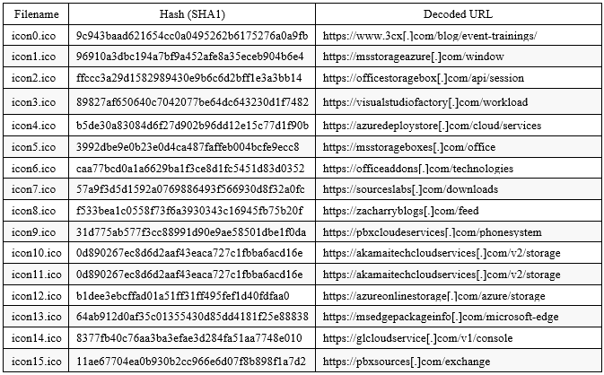

## 四、相关反应

2023年3月30日，3CXDesktopApp的提供商在官网上发出安全警告。

2023年3月31日，ffmpeg声明，其只提供源代码，编译的”ffmpeg.dll“由供应商提供。

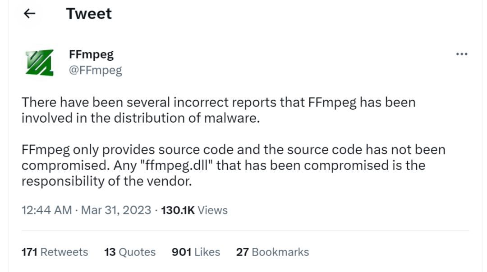

2023年4月6日，3CX发布未被攻击的18.12.425版本软件。

## 五、事件启示

本次事件，确定是一起供应链攻击事件，攻击者以3CX公司作为攻击对象。

最初的攻击定位在2022年4月，一名员工在其个人计算机上安装了受感染的X\_TRADER软件，该软件于2020年停用，但其软件签名有效期持续到了2022年10月。

随后攻击者通过该恶意软件获取了管理员级别的权限并且使用frp工具在3CX网络中横向移动，最终破坏了Windows和macOS的构建环境。

具体的破坏手法没有公布，据笔者猜测，可能是类似SolarWinds事件(被攻击者破坏了产品的构建系统)，也可能是篡改了构建的基础源码。

两次攻击的过程极为类似，都是使用已签名的安装包安装了软件，安装过程释放了恶意文件，最后通过反射dll注入，外联C2服务器。3CX的攻击过程如下图：

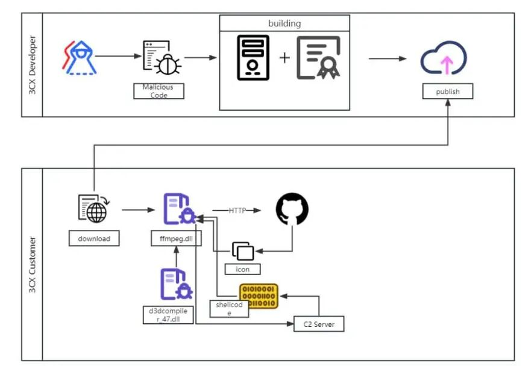

在3月22日3CXesktopApp首次被杀毒软件告警的时候，部分用户认为是杀毒软件的误报，可以看出由于应用更新的时候已经经过了签名和认证，所以用户对该应用保持了一定的信任，然而这种信任会导致供应链上游环节的安全问题在下游环节被放大。并且在更上游，从3CX员工因为下载X\_TRADER软件导致构建环境被破坏可以看出，互联网从业者与普通用户对带有合法签名的软件均无防范。

因此，供应链安全的保证不仅在于供应商对安全的重视，客户也应加强对供应链安全的重视，定期对其使用的组件、软件等进行安全检测。