## 0x01  前言

很多场景下需要大范围的扫描漏洞和快速排查互联网暴露面的漏洞，需要使用这种自动化的手段，常规渗透测试的找互联网暴露面是，域名>子域名>IP>C段>端口，可以手动收集，也可以借助一些网络搜索引擎（fofa、zoomeye、hunter等）然后进行指纹识别、存活探测等等，再用xray或者nuclei、afrog之类的工具过一遍，手工渗透一下。

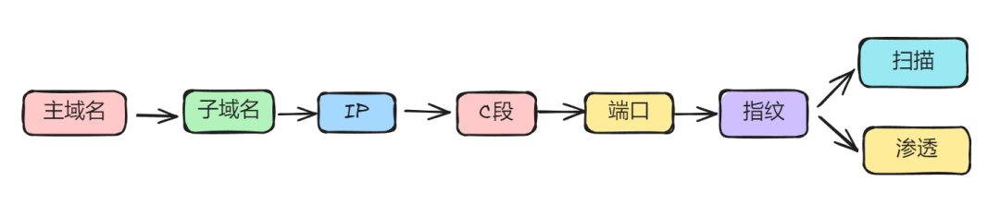

大概就是这样一个流程。

后面逐渐的出现了很多自动化的工具，直接从网络搜索引擎拉资产，然后子域、端口、指纹、各种扫描器、弱口令，一条龙过一遍。

像这种自动化的方案有很多套，比如：Goby+xray或者Goby+AWVS、ARL+XRAY、ARL+AWVS，还有Rengine这种赏金自动化工具，主要的流程还是各种自动化信息收集最后漏洞扫描，通过工作流把不同的工具组合起来，使这个流程自动化。

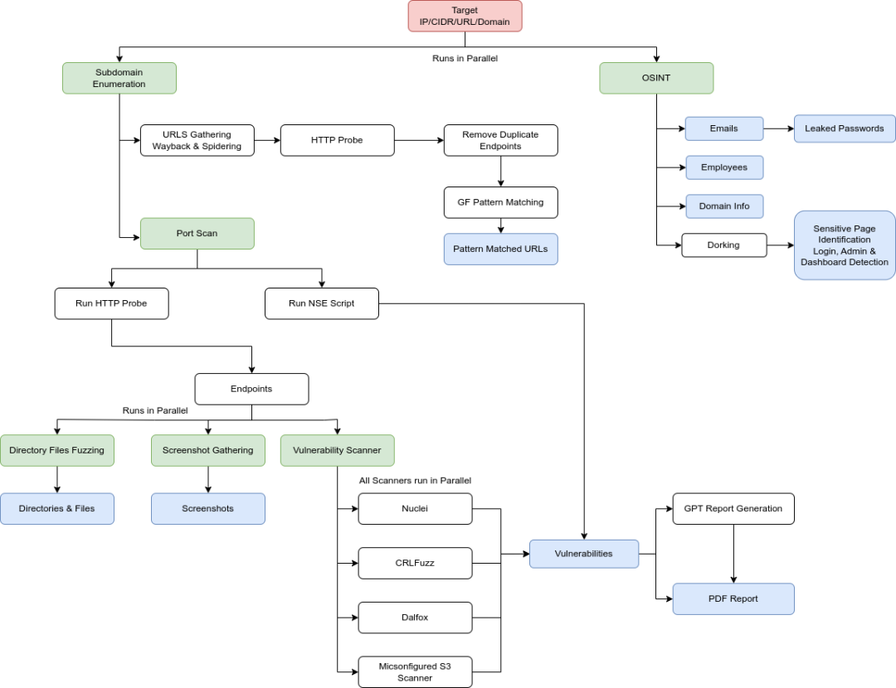

这里我们主要实践一下ARL和AWVS联动去进行漏洞扫描，为什么要用这一套方案呢，主要还是用过很多后发现这这一套算是比较好用的一个方案，ARL可以做这些信息收集的工作，同时在新一点的版本都内置了Nuclei，可以对一些通用漏洞做快速扫描，然后配合AWVS扫一些WEB应用的漏洞。后面也可以根据自己的需要加入XRAY、Aforg，再或者一些爬虫，配合自己的POC进行扫描。都很自由可以通过小脚本互相联动起来。

## 0x02  准备工作

> 两台linux服务器：(AWVS比较占配置)
> 
> 两台：64位+2H4G（最低配置要求）
> 
> 使用的两台vps，一台国内搭建灯塔系统，一台国外vps作为漏扫服务器
> 
> ARL使用Ubuntu,AWVS能跑docker就行
> 
> 灯塔ARL【资产收集】：https://github.com/adysec/ARL
> 
> AWVS【漏洞扫描】
> 
> 这里我用了两台国外的VPS，国外找github学生包白嫖的各种厂家账号，十几块钱可以买一二百刀的余额，用完连账号一起丢了。

## 0x03  工具安装配置

**Docker 内源码安装（最新版）**

``` Bash
docker run --privileged -it -d -p 5003:5003 --name=arl --restart=always centos/usr/sbin/init
```

docker内执行后直接exit退出即可。

Ubuntu 下可以直接执行 apt-get install docker.iodocker-compose -y 安装相关依赖。

**DNS爆破优化**

本机安装smartdns，以ubuntu为例。

``` Bash
    apt install smartdns -y
```

**查看服务运行状态**

``` Bash
    systemctl status arl-web
```

**登录并修改密码**

``` Bash
    url：http://127.0.0.1:5003
```

**多用户登录**

由于灯塔本身没有设计用户管理的功能，而且是单点登录，如果有多用户登录需求的需要到数据库中添加用户。

这里我们添加一个用户方便后续其他工具调用使用。

``` Bash
    docker exec -ti arl mongo
```

**优化字典**  

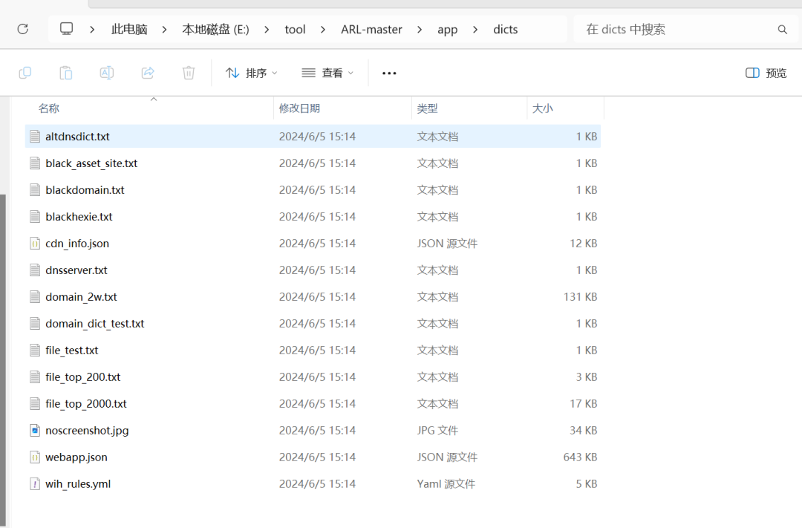

ARL的app/dicts目录下放着子域名字典和一些文件扫描，可以自己对这些字典文件进行修改扩充，这里我们加强一下子域名字典。

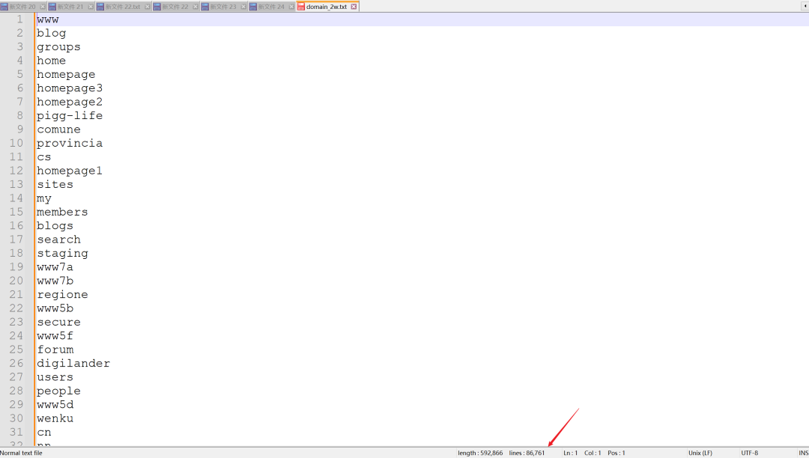

默认只有2W，加强到八万多，然后放到容器里面。

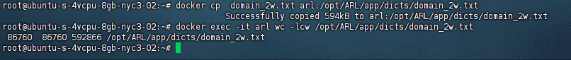

进入容器修改第三方网络搜索引擎接口

**修改API接口**

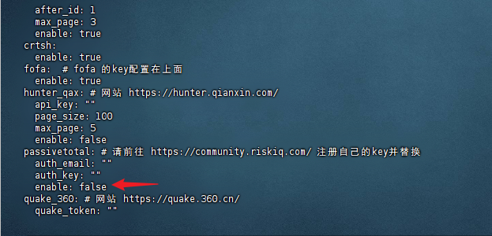

配置完要注意开启这些插件。

**ARL安装完成**

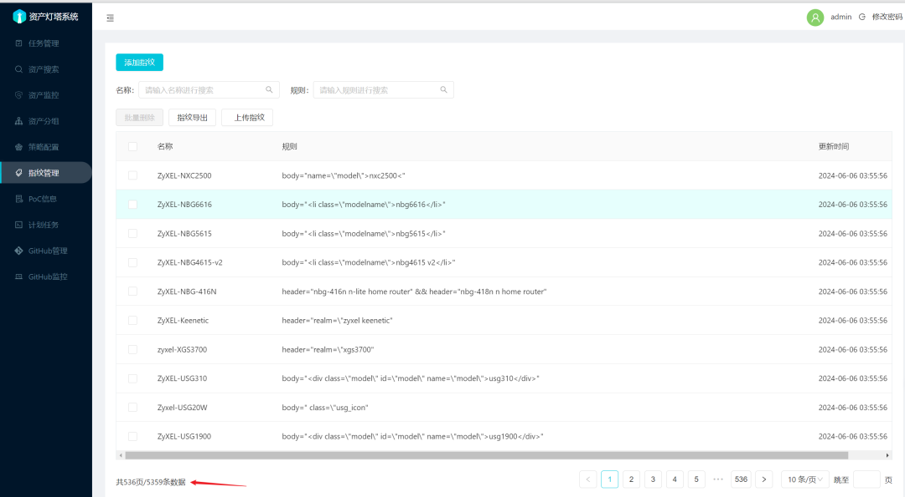

指纹已经添加。

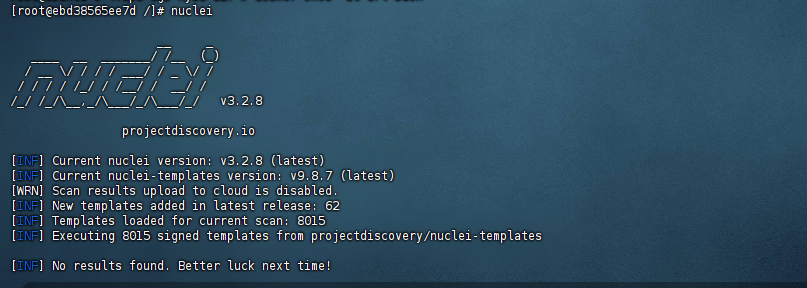

nuclei使用最新版本(通过github action每日更新)。

**安装AWVS(很坑，docker拉取方便一点)**

``` Bash
    docker pull 0xgkd/awvs
```

登录信息：

> https://ip:13443/
> 
> 用户名：[\[email protected\]](/cdn-cgi/l/email-protection)
> 
> 密码：Oxgkd123
> 
> 记得修复改密码！！！

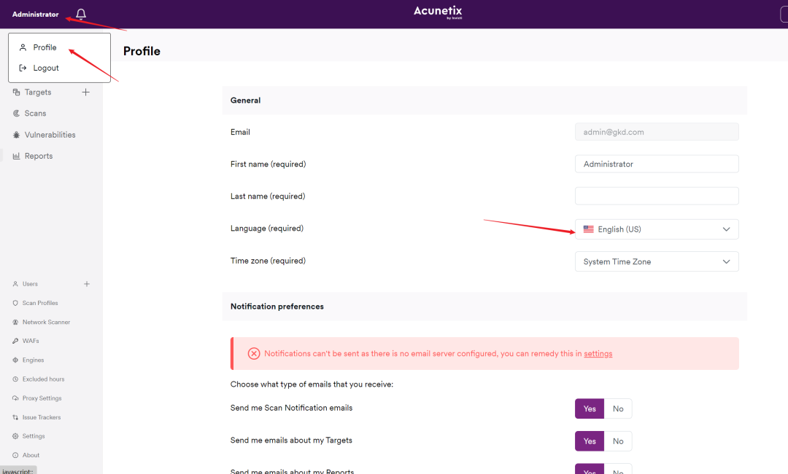

登录后可以修改个人信息，将界面改为中文，保存的时候随便改一下名字 就可以保存了。

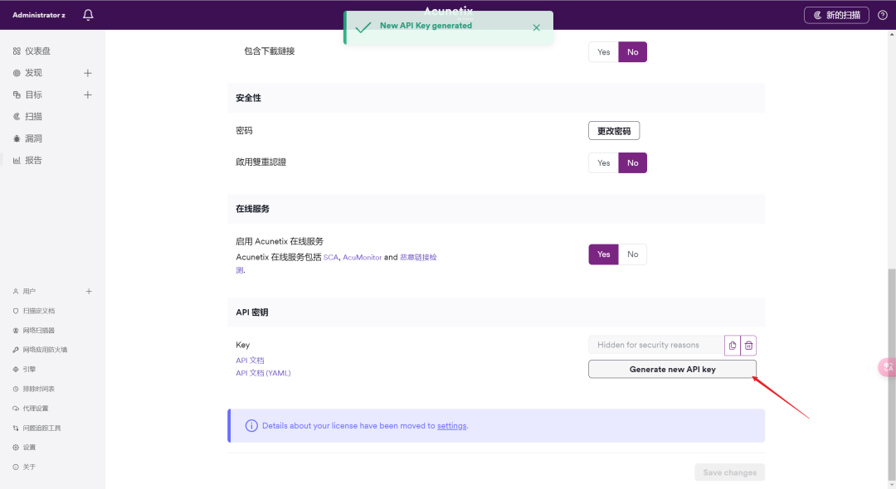

然后获取API密钥。

**AWVS误报太多**

可以先扫描，然后自己创建扫描策略，将一些误报多的漏洞排除，比如一些TLS之类的漏洞、HTTP不安全之类，直接就不选了。

## 0x04  联动脚本

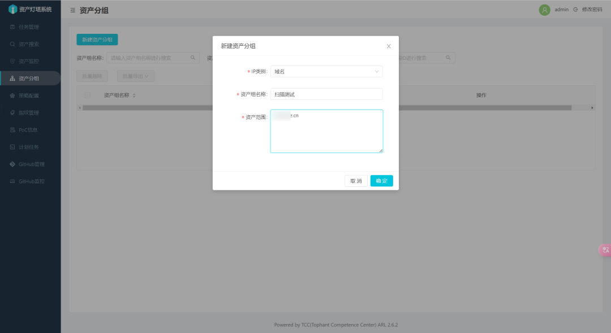

先创建一个要扫描的资产分组。

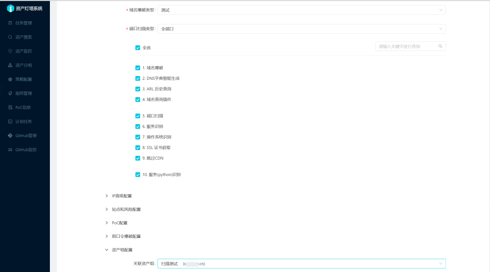

创建一个扫描策略，全都选择了，这里域名爆破和端口选大字典和全端口，这里测试我就选了测试小字典。

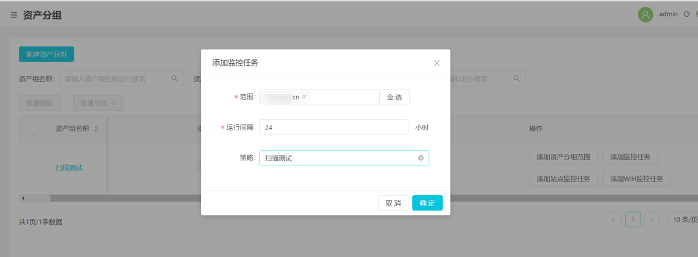

然后下发任务，根据情况来选择，可以设置风险巡航任务还是资产侦察，巡航的话会持续进行扫描。我这里使用的是监控任务，持续对这个域名进行扫描。

这套扫描方法主要找的是一些高端口资产和比较偏的关联资产，主要还是信息收集，收集的信息越多，发现的问题越多。

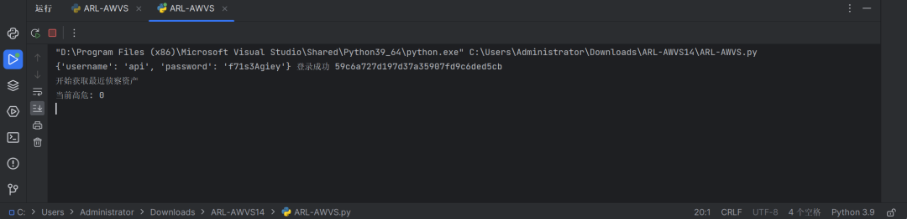

运行脚本，开始循环监测，ARL新增资产后会进行扫描。

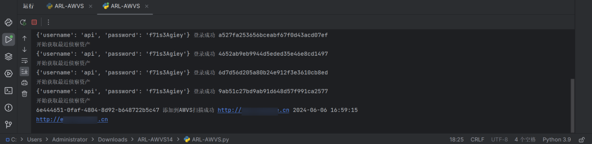

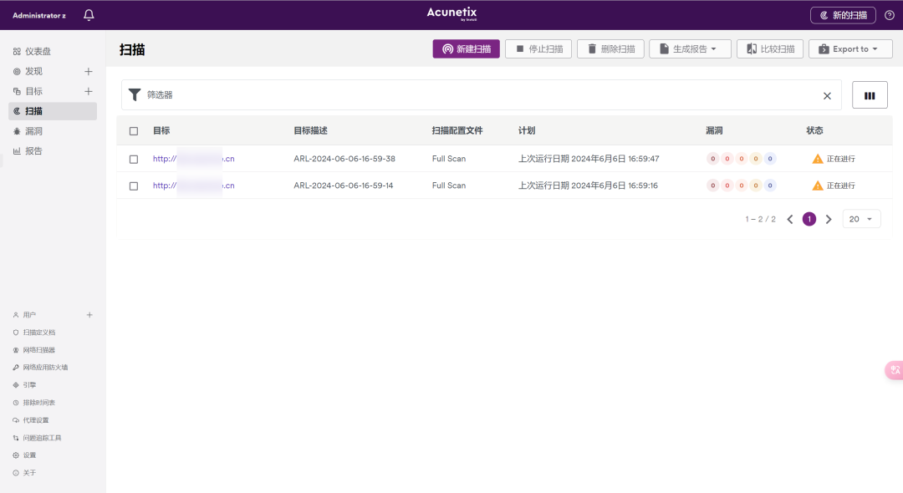

## 附录

项目地址：https://github.com/InsBug/ARLtoAWVS