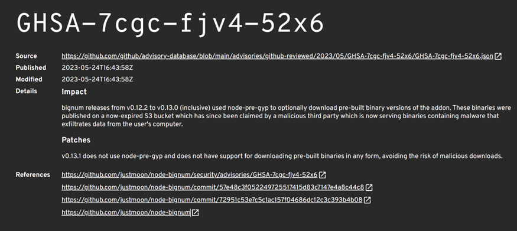
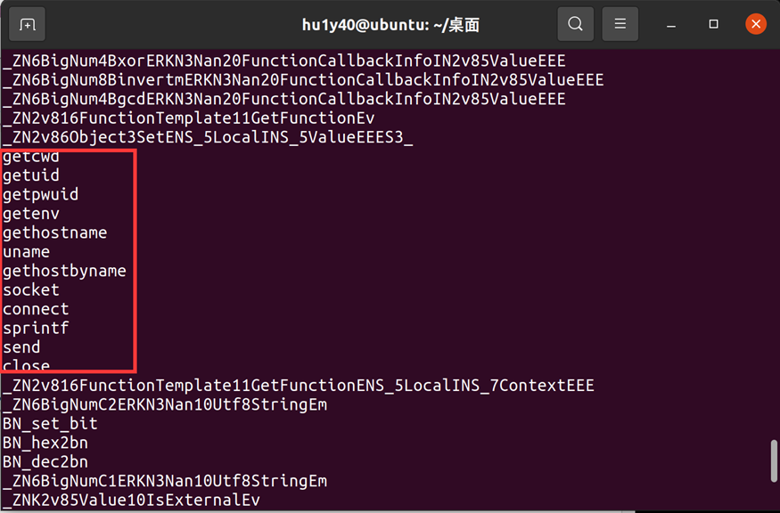
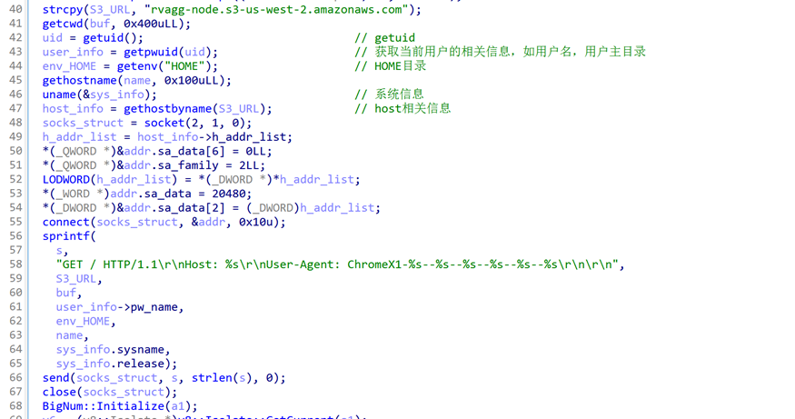
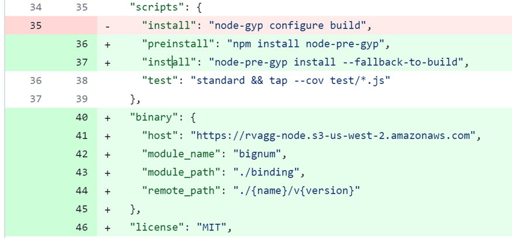
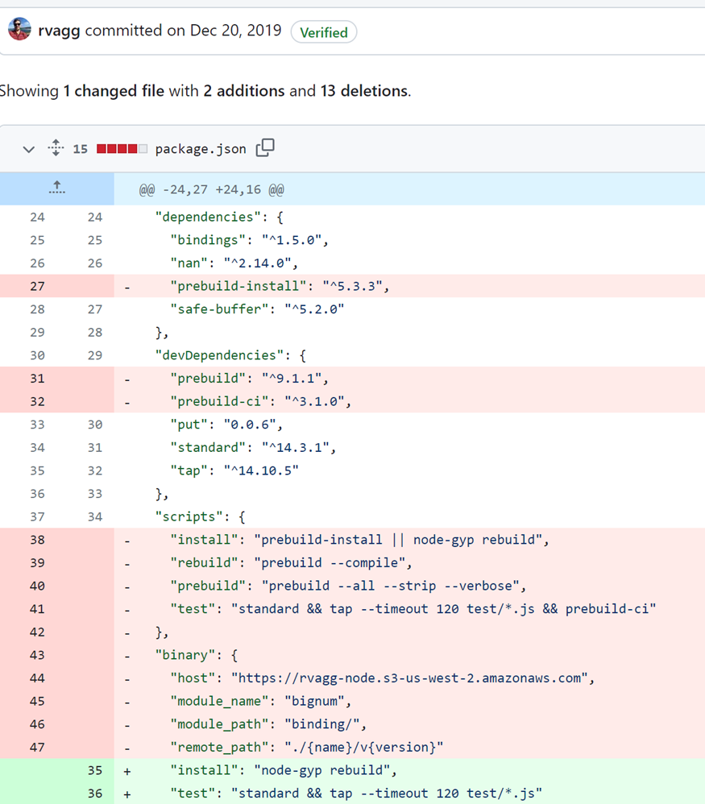
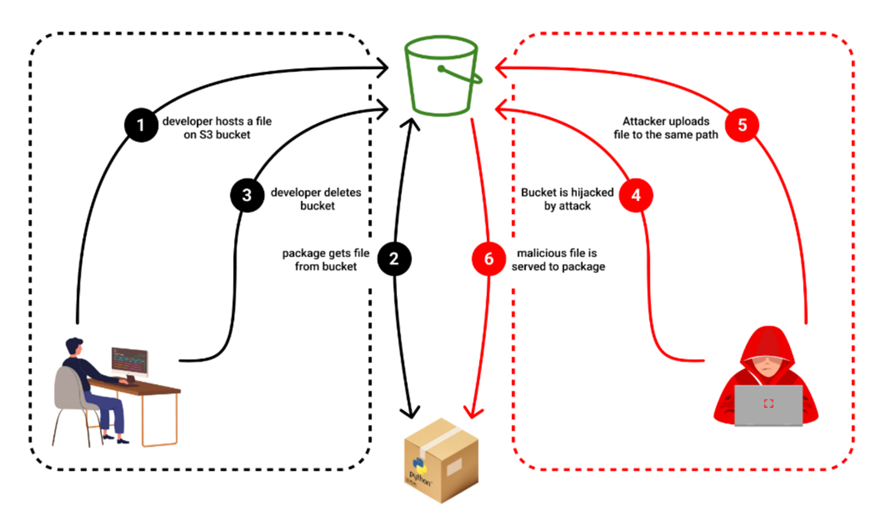
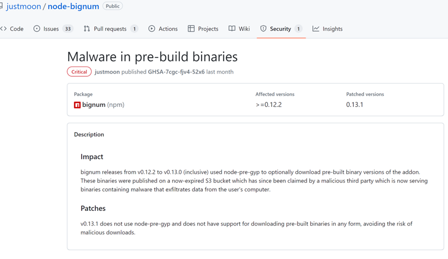
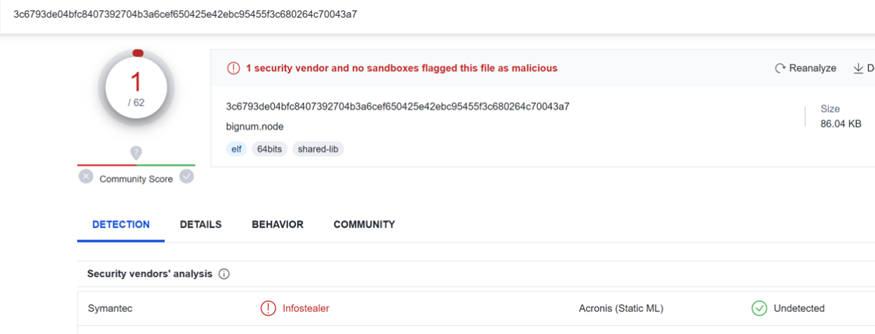
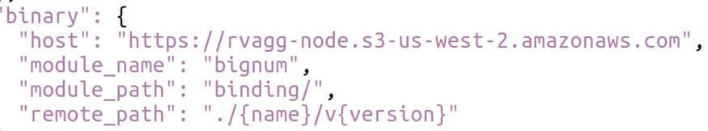

## 0x00 事件背景

NPM（Node Package Manager）是Node.js的软件包管理器，用于管理和分发JavaScript代码库。通过NPM，用户可以方便地安装、更新和删除JavaScript库，以及管理项目的依赖关系。

node-pre-gyp是一个用于简化 Node.js 本机模块构建和发布的工具，它提供了统一的构建和安装流程，并自动处理不同平台和架构的差异。这样，开发人员可以更方便地创建和分发本机模块，同时提供更好的跨平台兼容性和易用性。

S3 Bucket是 AWS (Amazon Web Services ，亚马逊云) 提供的一种存储资源，允许用户通过 Internet 存储和检索海量数据。它作为可扩展且安全的对象存储服务，可存储文件、文档、图像、视频和任何其他类型的数字内容。S3 Bucket可以使用唯一的 URL 进行访问，使其广泛用于各种用途，例如网站托管、数据备份和归档、内容分发和应用程序数据存储。

近期Node.js使用的开源包bignum由于Bucket被劫持导致用户在安装该包时会下载恶意软件。

## 0x01 事件过程

**2023年1月**

bignum下载预构建版本的S3 Bucket被删除。

**2023年5月24日**

GitHub Advisory Database（GAD）报告 v0.12.2 到 v0.13.0版本的 bignum 包使用 node-pre-gyp 下载预构建的二进制版本。这些二进制文件发布在一个现已过期的 S3 Bucket上，该Bucket已被恶意第三方占用，用户安装bignum时会下载恶意的二进制文件，这些恶意软件会从用户计算机中窃取数据。

## 0x02 技术分析

本次bignum存在问题的版本为v0.13.0，v0.12.5，v0.12.4，v0.12.3，v0.12.2，笔者下载的是v0.13.0。

对下载的预构建文件进行分析。发现存在一些获取Linux系统相关信息的函数。这与bignum本身提供的功能不符，是恶意软件的特征。

对该恶意软件进行反汇编分析。该恶意文件的功能是收集执行该文件的用户信息以及系统相关信息，并通过User-Agent字段发送给了攻击者所接管的S3 Bucket。

查看该开源包的Github仓库，发现其2016年6月15日提交的commit引入了node-pre-gyp工具。相关package.json文件配置为，在npm install bignum之前，会安装node-pre-gyp工具，并在npm install时，从 https://rvagg-node.s3-us-west-2.amazonaws.com 下载预编译的二进制文件，如果预编译的二进制文件无法使用，才在本地进行构建。

该功能并无漏洞，攻击行为的产生在于2019年10月20日的新版本v0.13.1的bignum弃用了该预构建方法。而其在今年删除了持有的S3 Bucket，导致恶意第三方接管了该Bucket，因而旧版本的bignum会从该Bucket下载恶意软件。

综上，攻击的具体过程如下：

**01**

1bignum包的开发者启用S3 Bucket供用户下载预构建二进制文件。

**02**

用户可从该S3 Bucket下载预构建二进制文件。

**03**

bignum包更新弃用该预构建功能，并删除对应的S3 Bucket。

**04**

攻击者接管该Bucket（创建同名Bucket即可）。

**05**

攻击者上传与之前同样Path的文件。

**06**

用户安装时自动下载该恶意文件。

## 0x03 相关反应

2023年5月24日，GDA报告该bignum的S3 Bucket被劫持，并在其Github仓库标识，标识符为GHSA-7cgc-fjv4-52x6。

2023年6月20日，Virustotal查询该恶意文件，一家厂商对该文件进行标记。

## 0x04 事件启示

本次事件采用了一个较为新颖的攻击手法，结合了云存储的使用，通过创建同名的S3 Bucket并构造Path使得安装旧版本bignum的用户下载到恶意的二进制文件。获取S3 Bucket与Path并不困难，可以很简单的从包管理文件中获取。如下图：

并且，从上文Virustotal的检出结果可以看出，对于此次的造成信息泄露的恶意文件62家杀毒软件只有一家能检出，该原因可能在于恶意软件并没有对敏感文件的信息进行窃取。但是如若恶意文件具有更完备的功能以及免杀手段，那么用户对于开源包的信任也可能导致攻击行为的落地。

此外，Bucket可被劫持不仅是bignum包存在的问题，整个开源生态系统中存在着许多会受到这种攻击的软件包和存储库。它们所使用的废弃的S3 Bucket，如果被攻击者利用也可能造成较大危害。

因此，废弃的资产不仅仅是一个被遗忘工具，其若被攻击者接管，也会成为信息窃取和入侵的有力武器。这提醒了组件提供方，除了最新版本的组件安全外，也应注意以往旧版本的组件所使用资产可能存在的风险，因为系统版本较低或是依赖版本较低会使用户安装旧版本的组件，这样如若旧版本组件所使用资产被攻击者劫持，那么就会导致攻击行为的产生。同时，用户也应注意自己所使用的第三方组件的安全性，以确保它们没有潜在的漏洞或恶意代码。