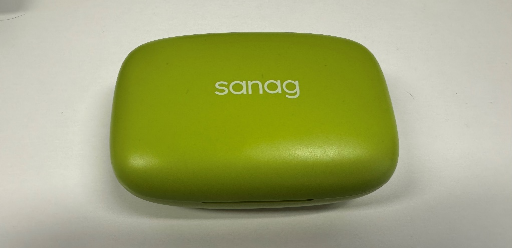
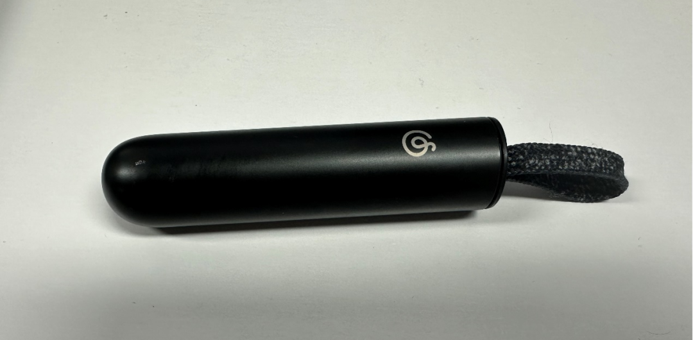
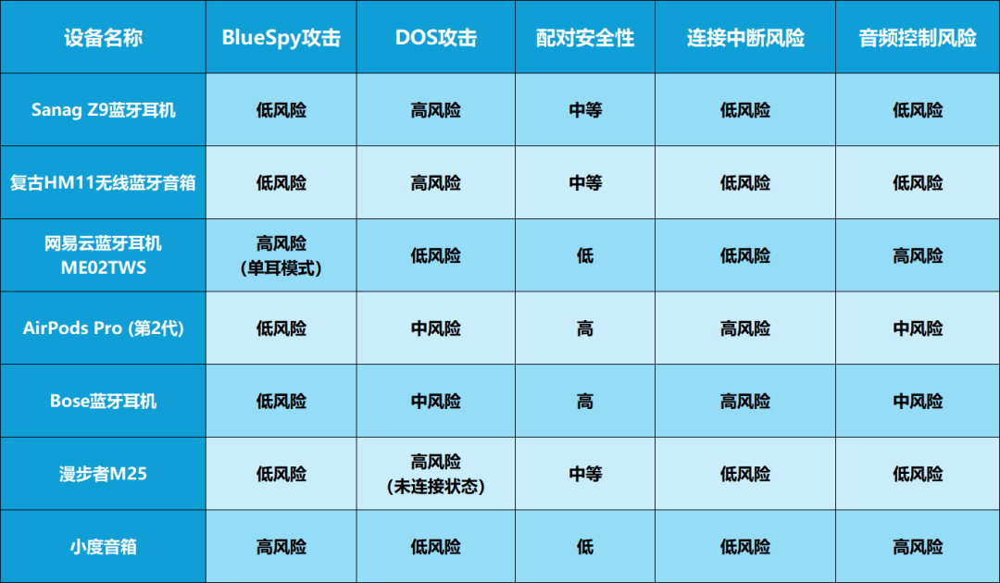

---
title: 蓝牙音箱和耳机安全测评报告
slug: bluetooth-speakers-and-headphones-security-evaluation
author: 裴伟伟
date: 2024-08-16 20:00
categories: 安全测评
tags:
  - 蓝牙
  - 音箱
  - 耳机
  - 安全测评
  - 无线安全
  - IoT安全
---  

## 引言

### 1. 背景说明

近年来，随着智能设备的普及和音频技术的发展，蓝牙音箱和耳机在消费电子市场上占据了重要地位。

这些设备为用户提供了便携、无线的音频体验，但同时也带来了潜在的安全隐患。

蓝牙技术本身存在一定的安全漏洞，加之这些设备通常连接到用户的智能手机并访问个人数据，以及智能家居或智能酒店场景下蓝牙音箱的应用，使得蓝牙音箱和耳机的安全问题变得尤为重要。

今年以来，CVE-2023-45866漏洞和BlueSpy攻击概念的出现，更是让蓝牙智能设备（尤其搭载Android系统）和蓝牙智能耳机/音箱的安全性成为安全界关注的焦点，但同时这些风险的存在也凸显了对蓝牙音频设备进行全面安全评估的必要性。

作为消费者有必要了解蓝牙音箱和耳机中可能存在的安全风险，作为生产厂家，也有必要在设计和生产蓝牙设备时着重注意蓝牙应用的安全性。

### 2. 报告目的

本研究的目的是利用蓝牙安全评估方法（BSAM，Bluetooth Security Assessment Methodology）对目前市场上常见蓝牙音箱或耳机的安全性进行分析。

通过这份报告，我们旨在：

1）评估市面上主流蓝牙音箱和耳机的安全性能，识别潜在风险。

2）为消费者提供选购和使用蓝牙音频设备的安全指南。

3）为制造商提供改进产品安全性的建议。

4）为监管机构制定相关政策提供参考依据。

5）提高公众对蓝牙音频设备安全问题的认识。

## 市场概况

### 1. 主要品牌

在蓝牙音箱市场中，根据RUNTO对2023年的蓝牙音箱销量报告数据\[1\]，以下是一些主要品牌及其国内市场占有率：

**1) 哈曼卡顿 (Harman Kardon)**

哈曼卡顿是全球知名的音响品牌，以其高品质的音频设备和创新设计闻名。产品线涵盖家庭音响、汽车音响和便携式音响，以13.6%的销额份额位居市场第一。

**2) Marshall**

Marshall最初以生产吉他和乐器音箱起家，2017年进入民用消费级音箱市场。其产品以复古造型和出色的音质著称，拥有10.7%的线上市场份额，并持续增长。

**3) 漫步者 (Edifier)**

漫步者是中国知名的音响品牌，产品涵盖家庭音响、便携式音响和耳机。其蓝牙音箱以性价比高和设计新颖著称，以10.3%的销额份额位列市场前三。

**4) Morrorart**

Morrorart是一个新兴的高端音响品牌，以其高端艺术品音箱R1和歌词音箱、壁画音箱等产品在中高端市场占据一席之地，在线上市场的份额达到3.7%，主要定位于中高端市场。

在蓝牙耳机市场中，根据方正证券在2023年发布的数据\[2\]和IDC在2024年发布的报告\[3\]，以下是蓝牙耳机的主要品牌及国内市场占有率情况：

**1) 苹果 (Apple)**

苹果的AirPods系列是市场上最受欢迎的蓝牙耳机之一，以其无缝的iOS集成、卓越的音质和主动降噪功能著称，旗下AirPods系列蓝牙耳机2022年第四季度在中国TWS（真无线）耳机市场的出货量占比为19%，位居市场第一。

**2) 漫步者 (Edifier)**

漫步者是中国知名的音响品牌，产品涵盖家庭音响、便携式音响和耳机。2022年第四季度，漫步者在中国TWS耳机市场的出货量占比为13%，位列市场前三。

**3) 小米 (Xiaomi)**

小米的蓝牙耳机以其高性价比和广泛的产品线著称，小米蓝牙耳机2022年第四季度在中国TWS耳机市场的出货量占比为11%。

**4) 华为 (Huawei)**

华为的FreeBuds系列耳机以其双驱动音质和智能动态降噪功能受到市场欢迎。2022年第四季度，华为在中国TWS耳机市场的出货量占比为10%。

**5) OPPO**

OPPO是一家中国领先的智能设备制造商，主要专注于智能手机、高端音响设备、可穿戴设备和其他相关配件。2022年第四季度，OPPO在中国TWS耳机市场的出货量占比为8%。

### 2. 市场趋势

蓝牙音箱和蓝牙耳机市场近年来呈现出显著的增长和创新趋势。随着移动设备使用的增加和无线音频技术的快速发展，消费者对便携性和音质的需求不断上升。

以下是一些关键的市场趋势：

**1) 技术创新**

市场上的蓝牙音箱和耳机不断集成新技术，如主动降噪(ANC)、空间音频、自适应传输技术等，以提供更丰富的音频体验。

**2) 音质提升**

高分辨率音频和高质量的音频编解码器（如LDAC和aptX）的应用越来越广泛，提升了无线音频的音质。

**3) 智能化助手**

集成智能助手（如Siri、Google Assistant）的蓝牙设备越来越受欢迎，提供语音控制和智能家居设备集成。

**4) 个性化和定制**

用户现在可以根据自己的偏好调整音效设置，许多品牌提供专用的应用程序来定制EQ设置。

**5) 健康监测**

一些蓝牙耳机开始集成健康监测功能，如心率监测和运动追踪，这在可穿戴设备市场中越来越常见。

**6) 生态系统集成**

蓝牙设备越来越多地与特定的生态系统（如苹果的AirPods与iOS设备的无缝集成）集成，提供更好的用户体验。

**7) 环保趋势**

随着环保意识的增强，使用可持续材料制造的蓝牙音箱和耳机越来越受到消费者的青睐。

**8) 市场细分**

针对特定使用场景（如运动、旅行、办公室）的产品线不断扩展，以满足不同用户的具体需求。

总体来看，蓝牙音箱和蓝牙耳机市场正朝着更智能、更个性化、更集成化的方向发展，同时也在不断探索新的应用场景和市场细分。

## 蓝牙安全风险

### 1. 蓝牙技术概述

蓝牙（Bluetooth）是一种无线通信技术标准，用来让固定与移动设备，在短距离间交换资料，以形成个人局域网（PAN，Personal Area Network）。蓝牙技术目前由蓝牙技术联盟（SIG）负责维护其技术标准，其成员已超过三万，分布在电信、电脑、网络与消费性电子产品等领域。

蓝牙技术使用短波特高频（UHF）无线电波，经由2.4至2.485GHz的ISM频段（即Industrial Scientific Medical Band，其中2.4GHz为各国共同的ISM频段）来进行通信。

蓝牙技术分为基础率/增强数据率（BR/EDR）和低耗能（LE）两种技术类型。其中BR/EDR型是以点对点网络拓扑结构建立一对一设备通信；LE型则使用点对点（一对一）、广播（一对多）和网格（多对多）等多种网络拓扑结构。

基础率/增强数据率蓝牙传输将传输的数据分成数据包，并在79个指定的蓝牙信道中传输每个数据包，每个通道的带宽为1Mhz，它通常每秒执行1600跳，启用自适应跳频（AFH，该技术可以根据信号质量调整跳频序列，以避免干扰和提高通信质量）。而低耗能（LE）频段被分为40个信道，每个信道的带宽是2MHz。

### 2. 蓝牙安全类型

蓝牙技术作为无线通信的主流标准，在便利性和功能性方面有显著优势，但同时也面临着多种安全威胁。蓝牙音箱和耳机作为日常生活中广泛使用的设备，其安全风险尤其值得关注。

以下是蓝牙音箱和蓝牙耳机设备可能面临的主要安全风险：

**1) 蓝牙嗅探**

蓝牙嗅探是一种被动攻击方式，攻击者通过特殊设备捕获空中的蓝牙通信数据。尽管蓝牙使用跳频扩频（FHSS）技术，但仍然可能被诸如Ubertooth类的设备截获。

**此类风险的安全影响如下：**

**a) 音频数据泄露：** 攻击者可能截获未加密的音频流，侵犯用户隐私。

**b) 元数据暴露：** 设备名称、MAC地址等信息可能被收集，用于进一步攻击。

**c) 配对信息泄露：** 在配对过程中敏感信息可能被捕获，导致后续安全隐患。

**2) 蓝牙欺骗**

攻击者伪装成合法设备，试图与目标设备建立连接。这种攻击利用了蓝牙协议在设备认证方面的弱点。

**此类风险的安全影响如下：**

**a) 未授权访问：** 攻击者可能获得对音箱或耳机的控制权。

**b) 恶意固件植入：** 通过伪装成正常更新，植入恶意固件。

**c) 数据窃取：** 访问存储在设备上的配置信息或用户数据。

**3) 中间人攻击**

攻击者在两个蓝牙设备之间的通信进行通讯拦截并修改传输的数据，这种攻击意味着攻击者可以破解加密的通讯信息，或者绕过加密机制。

**此类风险的安全影响如下：**

**a) 音频劫持：** 攻击者可以监听或篡改音频内容。

**b) 控制命令注入：** 向设备发送未经授权的控制命令。

**c) 凭证窃取：** 截获在配对过程中交换的密钥或PIN码。

**4) 蓝牙恶意软件**

通过蓝牙传播的恶意软件可能感染音箱或耳机的固件，或利用这些设备作为攻击其他设备的跳板。

**此类风险的安全影响如下：**

**a) 功能破坏：** 恶意软件可能导致设备功能异常或失效。

**b) 隐私泄露：** 收集并传输用户数据或使用习惯。

**c) 僵尸网络：** 感染的设备可能被用于分布式拒绝服务（DDoS）攻击。

**5) 固件漏洞利用**

蓝牙音箱和耳机的固件可能存在安全漏洞，攻击者可以通过这些漏洞获取设备控制权或执行未授权操作。

**此类风险的安全影响如下：**

**a) 远程代码执行：** 攻击者可能在设备上运行任意代码。

**b) 权限提升：** 获取设备的管理员权限，进行深度定制或破坏。

**c) 后门植入：** 在固件中植入后门，长期控制设备。

**6) 蓝牙协议漏洞**

蓝牙协议本身的漏洞可能被利用，即使设备制造商实施了良好的安全措施也可能受影响。

**此类风险的安全影响如下：**

**a) 电池耗尽：** 持续的攻击可能导致设备电池快速耗尽。

**b) 功能中断：** 设备可能无法响应正常的连接请求或命令。

**c) 系统崩溃：** 严重情况下可能导致设备操作系统崩溃或需要重启。

**7) 隐私泄露**

蓝牙设备可能泄露用户的位置信息或使用习惯，即使没有主动连接也可能发生。

**此类风险的安全影响如下：**

**a) 位置追踪：** 通过设备的蓝牙广播信号追踪用户位置。

**b) 使用模式分析：** 收集设备使用时间、频率等信息，分析用户行为。

**c) 社交关系推断：** 通过分析经常同时出现的设备，推断用户的社交网络。

**8) 越权访问**

某些蓝牙音箱和耳机可能实现了不当的访问控制，允许未经授权的设备执行特权操作。

**此类风险的安全影响如下：**

**a) 配置篡改：** 修改设备的音频设置或其他配置。

**b) 固件降级：** 强制设备回退到存在已知漏洞的旧版本固件。

**c) 数据访问：** 获取存储在设备上的配对历史、联系人等敏感信息。

**9) 侧信道攻击**

通过分析设备的功耗、电磁辐射或处理时间等物理特性,推断出敏感信息。

**此类风险的安全影响如下：**

**a) 密钥提取：** 分析配对过程中的功耗模式，提取加密密钥。

**b) 指令推断：** 通过设备的功耗特征，推断正在执行的操作。

**c) 数据重建：** 在某些情况下，可能通过电磁辐射重建音频数据。

### 3. 经典蓝牙漏洞

根据上面的蓝牙安全风险类型，在过去的几年里出现了许多不同类型和影响范围的蓝牙安全漏洞，典型的蓝牙安全漏洞\[4\]（包括协议漏洞、系统漏洞、应用漏洞）包括：

**1) KNOB（Key Negotiation Of Bluetooth）**

这种攻击是一种针对蓝牙设备的安全漏洞，正式编号为CVE-2019-9506。这个漏洞影响了许多蓝牙设备，因为它涉及到蓝牙安全协议的一个关键部分——加密密钥协商过程。

蓝牙设备在配对时会协商加密密钥的强度，这个过程称为密钥协商。KNOB攻击利用了配对过程中的一个弱点，允许攻击者降低协商的加密密钥的复杂性，从而使得密钥容易被破解。

KNOB漏洞影响所有使用蓝牙BR/EDR（Basic Rate/Enhanced Data Rate）协议的设备，这包括了大量消费电子产品，如耳机、扬声器、键盘、鼠标等。

**2) BIAS (Bluetooth Impersonation Attacks)**

这是一组影响蓝牙技术的漏洞，其官方漏洞编号为CVE-2020-10135。这个漏洞是由安全研究人员发现的，主要影响蓝牙BR/EDR（Basic Rate/Enhanced Data Rate）设备。

BIAS漏洞利用了蓝牙BR/EDR中的安全认证过程的缺陷。在蓝牙BR/EDR的配对过程中，理论上需要进行相互认证来防止中间人攻击。然而，BIAS漏洞表明，在某些蓝牙设备上，配对过程可以被绕过或操纵。

由于BIAS漏洞影响蓝牙BR/EDR标准，它可能影响几乎所有使用蓝牙BR/EDR技术的设备，包括智能手机、耳机、扬声器、键盘、鼠标等。

**3) BlueBorne**

BlueBorne漏洞利用了蓝牙协议栈中的多个安全缺陷，包括数据包边界条件、中间人攻击、远程代码执行、拒绝服务攻击、信息泄露等，因此该漏洞包含了众多CVE漏洞，包括CVE-2017-0781、CVE-2017-0782、CVE-2017-0783、CVE-2017-8628、CVE-2017-1000250、CVE-2017-1000251、CVE-2017-14315。

BlueBorne影响了超过十亿的设备，这包括智能手机、平板电脑、笔记本电脑以及其他各种智能设备，受影响的操作系统包括但不限于Android、iOS、macOS、Windows以及Linux。

**4) SweynTooth**

这是一个针对蓝牙低功耗（Bluetooth Low Energy，BLE）设备的漏洞集合，于2020年被披露。这个漏洞由一系列安全问题组成，它们主要影响BLE协议栈的实现，允许攻击者对受影响的设备进行各种形式的攻击。

因此，SweynTooth漏洞影响使用特定BLE协议栈实现的设备，包括智能家居设备、健康监测设备、可穿戴设备等。

**5) BlueFrag**

BlueFrag漏洞允许攻击者在不与目标设备配对的情况下，通过蓝牙连接向设备发送恶意数据包。这个漏洞主要利用了Android蓝牙堆栈中的一个缺陷，该缺陷存在于处理L2CAP（逻辑链路控制和适配协议）数据包的过程中。

攻击者可以构造一个恶意的L2CAP数据包，其中包含伪造的源地址和目的地址，使得目标设备接受并处理这些数据包。由于Android系统在处理这些伪造的数据包时未能正确验证，攻击者可以利用这一点来执行远程代码或导致设备崩溃。

因而，BlueFrag漏洞影响多个版本的Android操作系统，包括Android 10以及之前的版本，也包括某些Android TV等家庭智能设备。

**6) BrakTooth**

BrakTooth 是一组严重的蓝牙安全漏洞，于2021年被披露。这些漏洞影响了许多流行的系统级芯片（SoC）中的蓝牙软件堆栈，使得攻击者能够利用这些漏洞对设备进行各种恶意操作。

BrakTooth 特别针对的是广泛使用的蓝牙BR/EDR（基本速率/增强数据速率）模式，因此漏洞影响的设备数量可能达到数十亿，包括各种类型的设备，如笔记本电脑、智能手机、工业设备以及多种智能“物联网”设备。

**7) BlueDucky**

BlueDucky是基于CVE-2023-45866漏洞的攻击概念，这个漏洞利用了包括Windows、MacOS、Android、iOS系统在内的不同操作系统的蓝牙实现漏洞，实现通过蓝牙协议的键盘注入，攻击者可以利用该漏洞远程在目标设备上执行键盘输入，比如打开网页等。

**8) BlueSpy**

BlueSpy是一种攻击概念，利用蓝牙设备的无需配对特性，允许未经授权的用户在蓝牙音箱上录制和播放音频。这个漏洞属于蓝牙经典的安全漏洞，影响了蓝牙音箱和蓝牙耳机的安全性。

BlueSpy利用了蓝牙设备的无需配对特性，允许它们在不经过配对的情况下，直接连接到其他蓝牙设备。这使得攻击者可以在没有用户确认的情况下，连接到蓝牙音箱或蓝牙耳机，并通过蓝牙或硬件端口（例如USB）读取和录制音频。

这种攻击技术可以用于窃听私人对话，监控用户的活动，甚至攻击其他蓝牙设备。例如，攻击者可以利用BlueSpy攻击蓝牙音箱，录制音频，并将其发送到远程服务器，从而窃取用户的隐私信息。

## 测评设备清单

**1. Sanag Z9 蓝牙耳机**

Sanag Z9是一款真无线蓝牙运动耳机，具备挂耳式设计，适合跑步、健身、骑行等运动场景。它拥有超长续航能力，支持IPX5级防水，以及DECE降噪技术，确保音质清晰且佩戴稳固。

**2. 复古HM11 无线蓝牙音箱**

HM11是一款复古设计的无线蓝牙音箱，提供沉浸式的音质体验。它支持蓝牙连接，并且具有易于使用的教程，帮助用户快速上手，享受音乐。

**3. 网易云蓝牙耳机ME02TWS**

一款由网易推出的真无线蓝牙耳机，采用全新架构的蓝牙5.0芯片，提供高清传输和出色的聆听体验。它拥有3.5克的小巧耳塞和6mm微型动圈，支持IPX5级防水，适合户外运动使用。

**4. AirPods Pro (第2代)**

苹果公司的高端蓝牙耳机，AirPods Pro第2代配备了H2芯片，提供更好的降噪效果和音质体验。它支持自适应通透模式，可以针对突发声音进行单独降噪。

**5. Bose 蓝牙耳机**

Bose品牌的蓝牙耳机，以其卓越的音质和降噪功能闻名。Bose QuietComfort Earbuds ll是一款真无线降噪蓝牙耳机，它采用了蓝牙5.3技术，提供稳定的连接和快速的响应。这款耳机具备IPX4的防水等级，配备了CustomTune智能耳内音场调校技术，能够自动优化耳内的音场效果。

**6. 漫步者M25**

漫步者M25是一款桌面音响，内置声卡，支持USB连接，简化了桌面线路布局。它使用蓝牙5.3协议进行无线连接，用户可以通过APP进行多种模式的切换和氛围灯调节。

****

**7. 小度音箱**

百度推出的智能音箱，小度音箱是一款智能助手APP，能够连接多款小度旗下智能设备，提供自然语言交互体验。它具备多种功能，包括实时资讯、天气预报、音乐播放等，还可以控制智能家居设备，通过小度APP进行操作和设置。

**8. 小度智能屏（1C4G）**

小度在家1C4G版是一款带屏幕的智能音箱，搭载MediaTek芯片，提供流畅的系统响应和视频播放体验。它具备7英寸的高清触摸屏和200万像素的摄像头，支持视频通话功能。此外，它还支持LTE语音通话和手势识别功能，为用户提供丰富的智能交互体验。

  
## 设备安全性对比

为对比不同品牌的音箱和耳机的安全性，我们选取上述经典蓝牙漏洞中的BlueSpy和蓝牙协议Dos（拒绝服务攻击）作为攻击手段测试。

**风险等级说明：**

**· 低风险**：设备在该类攻击下表现良好，受影响较小。

**· 中风险**：设备在某些情况下可能受到影响，但影响有限。

**· 高风险**：设备容易受到该类攻击的影响，存在明显的安全隐患。

**类型说明：**

**· BlueSpy攻击**：测试设备是否容易被未授权连接并录音。

**· DOS攻击**：测试设备是否容易被干扰导致无法正常连接。

**· 配对安全性**：评估设备在配对过程中的安全措施。

**· 连接中断风险**：评估设备在受到攻击时是否容易断开现有连接。

**· 音频控制风险**：评估攻击者是否能够控制或干扰设备的音频输出。

### 1. 音箱/耳机安全性对比结果

### 2. 隐私泄露风险

**1) 网易云蓝牙耳机ME02TWS**

在单耳模式下，BlueSpy攻击能够允许攻击者与设备在未授权情况下成功连接并录音，可能导致用户交流或周围环境音频被窃听。

在公共场所使用单耳模式时，攻击者可能悄悄录制用户的交谈或周围对话。

**2) 小度音箱**

即使在不可见状态下，BlueSpy攻击能够允许攻击者与设备在未授权情况下建立蓝牙连接并进行录音，没有任何提示或指示灯警告。

攻击者可能在用户不知情的情况下远程访问智能音箱，录制私密对话或获取敏感信息。

**3) 小度智能屏**

在屏幕保持息屏的状态下，BlueSpy攻击可以让攻击者与设备在未授权情况下建立蓝牙连接，并持续监听音箱周围的声音，仅有蓝牙连接提示音，且通过蓝牙连接功能无法查看到已连接的蓝牙设备。

攻击者可以在用户未察觉的情况下通过设备持续监听用户所在家庭的私密对话或谈话。

### 3. 服务中断风险

**1) Sanag Z9蓝牙耳机 / 复古HM11无线蓝牙音箱**

在未连接状态下易受Dos攻击，导致其他设备无法连接。

在重要会议或演讲前，攻击者可能阻止演讲者连接蓝牙音箱，造成延误或中断。

**2) AirPods Pro (第2代) / Bose蓝牙耳机**

受到ping或连接尝试时会断开当前连接的设备。虽然无法直接控制，但频繁的连接尝试可能导致设备反复断开和重连。

在嘈杂的公共场所，攻击者可能反复中断用户的音频连接，影响通话或音乐体验。

**3) 漫步者M25**

在Dos攻击期间，其他设备无法连接。在户外聚会中，攻击者可能阻止主办方连接音箱播放音乐。

### 4. 设备控制风险

**1) 网易云蓝牙耳机ME02TWS**

在单耳模式下，攻击者与目标设备在未授权情况下建立蓝牙连接，可以推送音频进行播放，覆盖用户正在收听的内容。
  
攻击者可能在用户听音乐或进行语音通话时插入虚假信息或干扰音频。

**2) 小度音箱**

攻击者可以远程与目标设备在未授权情况下建立蓝牙连接并推送本地音频文件至目标设备进行播放。

攻击者可能在夜间远程激活音箱并播放声音，造成滋扰或恐吓。

**3) 小度智能屏**

攻击者可以通过未授权与目标设备建立蓝牙连接，并推送本地音频文件至目标设备进行播放。

攻击者可能在夜间远程激活音箱并播放声音，造成滋扰或恐吓。
  
## 安全测评总结

本次分析重点关注了BlueSpy概念验证工具所揭示的问题和Dos攻击。研究涵盖了多种常见蓝牙设备，包括耳机、音箱和智能音箱等。

**主要发现：**

**1. 设备安全性差异显著：** 不同设备对BlueSpy和Dos攻击的抵抗能力各不相同。部分设备（如网易云耳机、小度音箱、小度智能屏）在某些情况下表现出较高的安全风险。

**2. 配对模式的重要性：** 多数设备在已配对状态下表现出较好的安全性，但在开放配对模式时容易受到攻击。

**3. 单耳模式的潜在风险：** 部分耳机（如网易云ME02TWS）在单耳模式下特别容易受到攻击，可能导致隐私泄露。

**4. 智能音箱的特殊风险：** 如小度音箱、小度智能屏即使在不可见状态下仍可被攻击，存在严重的隐私风险。

**5. Dos攻击效果：** 多数设备在未连接状态下容易受到Dos攻击，影响设备的正常使用。

**6. 高端设备的意外风险：** 如AirPods Pro和Bose耳机在受到连接尝试时会断开现有连接，可能影响用户体验。

## 行业发展建议

**1. 制造商安全改进建议\[5\]**

蓝牙音箱和耳机制造商应将安全性作为产品开发的核心考虑因素。实施“安全即设计”原则，确保每个产品特性都经过全面的安全评估。

这包括在设计初期就考虑潜在的安全风险，并在整个开发过程中持续进行安全测试，特别要注意避免蓝牙连接时的身份验证绕过问题，该问题是许多蓝牙漏洞攻击成功的前提。

例如，小米的小爱音箱通过产品设计，在15分钟内没有设备连接时会主动关闭蓝牙功能，这是一个值得借鉴的安全设计。

**固件安全是产品安全的基础。** 制造商应实现安全启动机制，防止未经授权的固件修改。同时，对固件进行签名验证，确保只有经过认证的更新才能安装。这不仅可以防止恶意固件的植入，也能保护用户免受潜在的降级攻击。

在蓝牙协议实现方面，**制造商应优先采用最新的蓝牙协议版本**，如蓝牙5.3或更高版本。确保正确实施所有安全特性，包括安全简单配对(SSP)和LE安全连接。这些新版本的协议通常包含了针对已知漏洞的修复和增强的安全特性。

**加强加密措施对保护用户数据至关重要。** 制造商应使用强加密算法，如AES-256，并实施完美前向保密。这可以确保即使密钥在未来被破解，过去的通信内容仍然安全。

**建立有效的漏洞管理系统至关重要。** 制造商可以考虑建立漏洞赏金计划，鼓励安全研究者报告潜在问题。同时，建立快速响应机制，确保及时修复报告的安全漏洞。这不仅可以提高产品的安全性，还可以增强用户对品牌的信任。

**持续的安全更新支持是维护产品长期安全的关键。** 制造商应提供长期的安全更新支持，包括对已停产产品的支持。实现无缝的自动更新机制，减少用户干预，确保安全补丁能够及时应用。

**定期进行第三方安全审计和渗透测试，** 可以帮助发现潜在的安全问题。制造商应公开审计结果，提高透明度和消费者信任。这种做法不仅可以改善产品安全性，还能树立负责任的企业形象。

最后，**用户教育是提高整体安全性的重要环节。** 制造商应提供清晰、易懂的安全使用指南，并通过多种渠道（如应用内提示、邮件通知）持续向用户普及关于安全实践，这可以帮助用户更好地保护自己的设备和数据。

**2. 监管政策建议**

**制定行业安全标准：** 政府或相关标准化组织应制定强制性的蓝牙设备安全标准，涵盖数据传输、设备配对、用户隐私等方面的规范。这些标准应定期更新，以应对新兴威胁。

**实施安全认证制度：** 建立蓝牙设备安全认证制度，要求所有上市产品通过安全测试。使用认证标识帮助消费者识别符合安全标准的产品。

**加强市场监管：** 监管机构应加强对蓝牙音箱/耳机产品的市场监管，确保产品符合安全标准，对不符合标准的产品进行下架处理。

**完善漏洞披露机制：** 要求制造商及时披露已知安全漏洞，并制定漏洞响应时间标准，确保快速修复。为安全研究者提供法律保护，鼓励负责任的漏洞披露。

**规定安全更新义务：** 要求制造商为产品提供最低安全更新支持期限，并在产品停止安全更新支持前通知消费者。

**保障消费者知情权：** 要求制造商提供清晰、易懂的产品安全信息，强制披露产品的数据收集和共享做法。

**推动行业自律：** 鼓励成立行业自律组织，制定行业最佳实践。支持建立信息共享平台，促进安全威胁情报的交流。

**加强用户安全教育：** 通过公共渠道进行用户安全意识教育，提高用户对蓝牙设备安全风险的认识，并指导用户采取安全措施保护自己的信息安全。将物联网安全知识纳入学校课程。

**建立安全事件响应机制：** 建立国家级的蓝牙安全事件报告和响应机制，定期发布安全趋势报告，指导行业发展。

## 结论与展望

本次蓝牙音箱和耳机安全测评揭示了当前市场上多款主流产品在安全性方面存在的差异和潜在风险。

通过对BlueSpy攻击和DoS攻击的测试，我们发现：

**安全性表现差异明显：** 不同品牌和型号的设备对相同攻击的抵抗能力存在显著差异。高端品牌如Apple和Bose在某些方面表现较好，但也存在意外的弱点。

**配对模式是关键弱点：** 多数设备在开放配对模式时最容易受到攻击，这凸显了加强配对过程安全性的重要性。

**智能音箱面临特殊挑战：** 如小度音箱等智能设备即使在不可见状态下仍可能被攻击，存在严重的隐私泄露风险。

**单耳模式存在隐患：** 部分耳机在单耳模式下特别容易受到攻击，制造商需要重视这一使用场景的安全性。

**DoS攻击广泛影响：** 大多数设备在未连接状态下容易受到DoS攻击，影响用户体验。

展望未来，蓝牙音频设备的安全发展趋势可能包括：

**安全设计升级：** 制造商将更多地采用“安全即设计”原则，在产品开发初期就考虑安全因素。

**协议优化：** 随着蓝牙技术的发展，新版本协议将不断优化安全特性，修复已知漏洞。

**智能防护：** 设备可能会集成更智能的安全防护机制，如异常行为检测和自动防御。

**用户意识提升：** 随着安全意识的增强，用户将更重视设备的安全性能，推动市场向更安全的产品倾斜。

**安全更新常态化：** 持续的安全更新支持将成为产品的标准配置，延长设备的安全生命周期。

总的来说，虽然当前蓝牙音频设备的安全状况参差不齐，但随着技术进步、用户意识提升和监管加强，未来市场上的产品安全性有望得到全面改善。制造商、监管机构和消费者需要共同努力，构建一个更安全的蓝牙音频生态系统。

## 参考资料

\[1\] https://finance.sina.com.cn/tech/roll/2024-02-20/doc-inaisvsh0842502.shtml

\[2\] https://www.vzkoo.com/read/20230421ba23a37a8dc66313adcdecd0.html

\[3\] https://www.idc.com/getdoc.jsp?containerId=prCHC51925724

\[4\] https://evilpan.com/2021/07/10/bluetooth-sec/

\[5\] https://www.secrss.com/articles/9318