## 0x00 漏洞背景

**curl是一个跨平台的命令行工具和库**，用于进行各种网络数据传输操作，包括文件下载、上传、HTTP请求和支持多种网络协议，同时也提供了丰富的自定义选项，使其成为系统管理员、开发者和测试人员在终端上进行网络操作的强大工具。

这个漏洞导致curl在SOCKS5代理握手过程中产生了堆溢出。

当要求curl将主机名传递给SOCKS5代理以允许其解析地址，而不是由curl自己完成时，主机名的最大长度为255字节。

如果检测到主机名超过255字节，curl会切换到本地名称解析，然后仅将已解析的地址传递给代理。由于一个错误，表示“让主机解析名称”的本地变量可能在SOCKS5握手过程中获取错误的值，与本意相反，将太长的主机名复制到目标缓冲区，而不仅仅是复制已解析的地址。


## 0x01 漏洞信息

**2023年9月30日**，Hackerone上的用户raysatiro创建了关于curl堆溢出漏洞的报告。

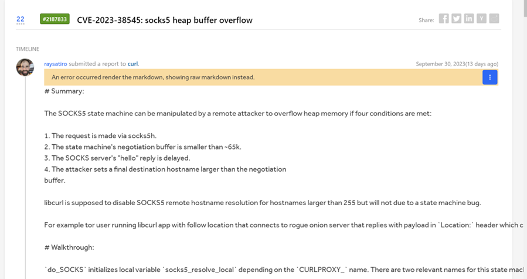

**2023年10月4日**，curl的维护者bagder宣告了10月11日将随着curl8.4.0版本的发布报告curl前版本严重的安全问题。

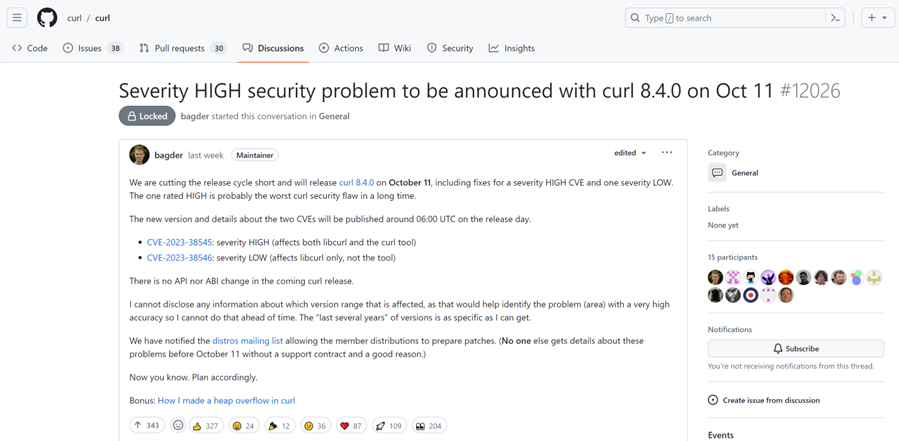

**2023年10月11日**，curl发布修复版本8.4.0。


## 0x02 漏洞影响

该漏洞影响版本为：**libcurl 7.69.0 ~ 8.3.0**


## 0x03 环境搭建

笔者选择8.3.0的curl版本进行构建。

首先从Github获取curl源码。

随后autoconf生成./configure文件，如果未成功，报错configure.ac: error: possibly undefined macro，使用sudo apt install automake libtool m4 autoconf安装依赖。

再然后./configure CFLAGS="-fsanitize=address -g" LDFLAGS="-fsanitize=address" --without-ssl  --prefix=/path/to/install配置Makefile（这里用ASAN帮忙辅助分析）。

最后make，make install生成可执行文件。


## 0x04 漏洞复现

**1.配置socks5代理**

``` bash
$ git clone https://github.com/MisterDaneel/pysoxy

$ cd pysoxy

$ python3 pysoxy.py
```

**2.配置域名解析**

将 127.0.0.1 「一万个 A」解析加入到/etc/hosts 中，用于传递 hostname 到代理解析时返回结果。

**3.PoC**

``` bash
curl--limit-rate 1025 -vvv -x socks5h://localhost:\[port of socks5\] $(python3 -c "print(('A'\*10000), end='')")
```

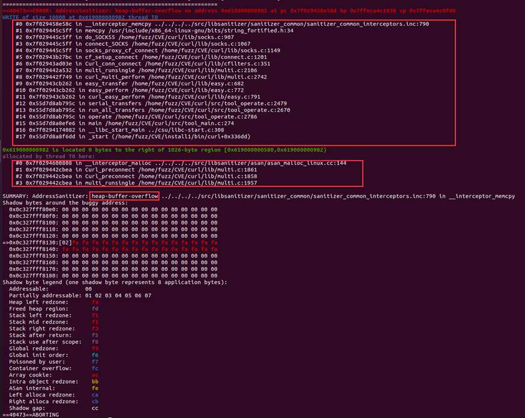


## 0x05 漏洞分析

分析ASAN错误信息，发现是一个heap-buffer-overflow，


GDB分析。

首先产生的原因在于hostname\_len>255的时候，会将socks5\_resolve\_local设置为TRUE，代表本地解析。这里hostname\_len为10000。

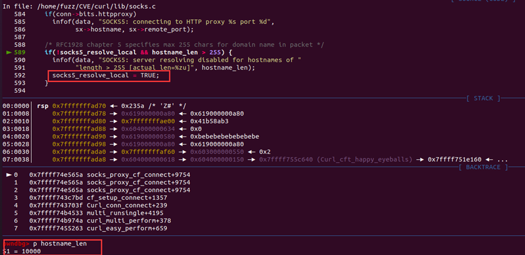

Curl\_preconnect()函数通常在网络连接开始前被调用，它的目的是在实际建立连接之前执行一些准备工作。通常在执行 HTTP 请求时，需要进行多次网络连接，例如在处理重定向时。这里动态分配的内存由state.buffer指向，state结构是struct UrlState state是用于状态信息和其他动态目的的字段的结构。buffer结构是用于下载数据的缓冲区。

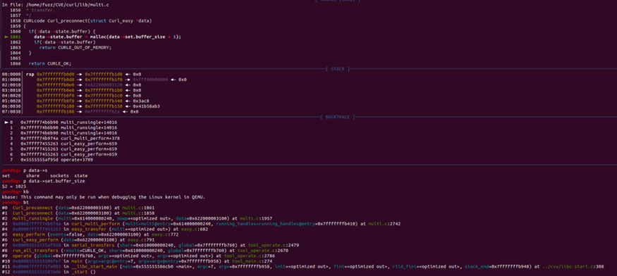

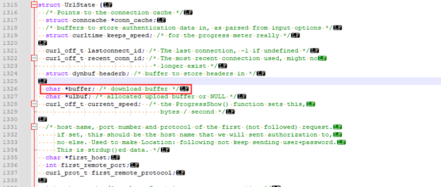

最后在socks.c:907的do\_SOCKS5函数中会将sx->hostname写入上述Curl\_preconnect函数malloc的1026大小的内存中。

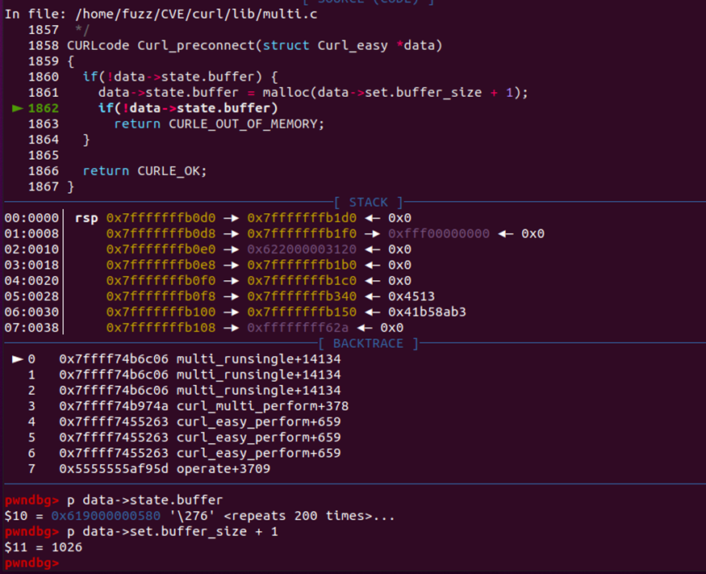

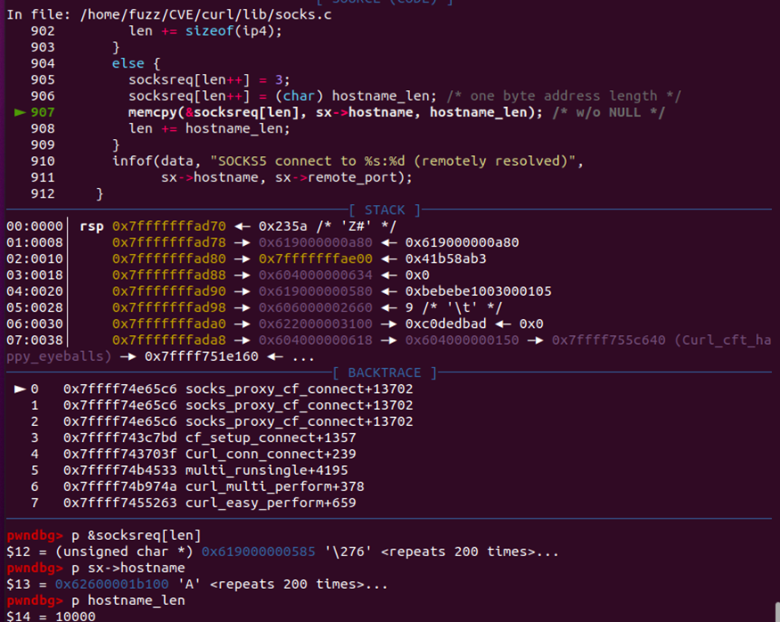


## 0x06 补丁分析

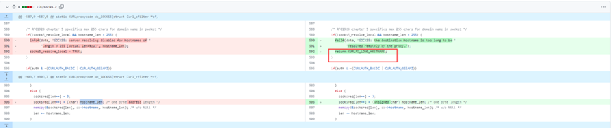

对于hostname过长的情况不进行本地解析，直接返回错误。


## 0x07 总结

漏洞流程总体如下：  

**01**

首先初始化socks5\_resolve\_local变量

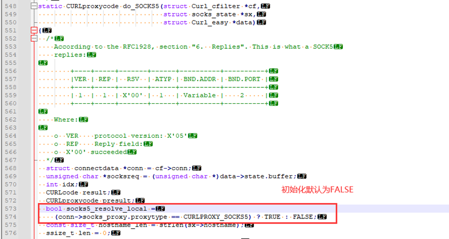

**02**

随后第一次do\_SOCKS由于hostname\_len=10000>255设置socks5\_resolve\_local=TRUE。

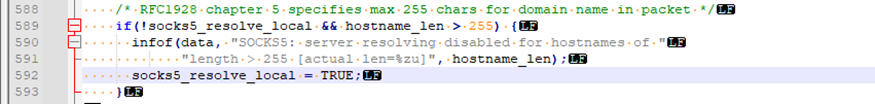

**03**

在后续的do\_SOCKS调用中，socks5\_resolve\_local会被重置，为FALSE。其在socks服务器回复有效的情况下会进入CONNECT\_RESOLVE\_REMOTE。

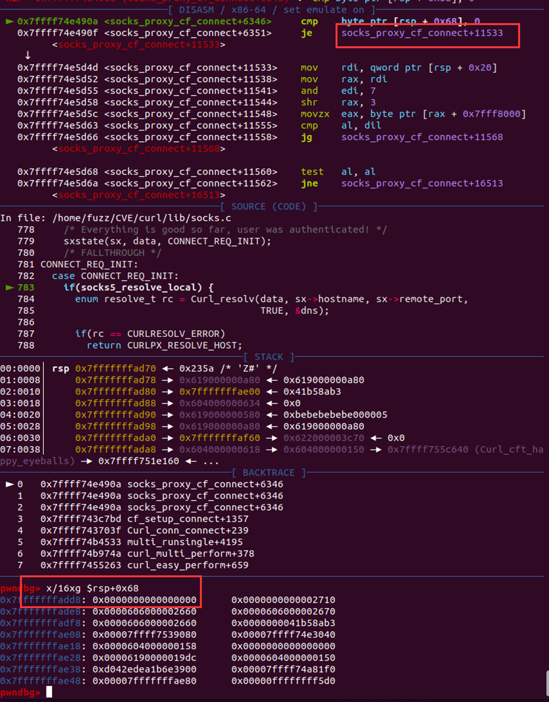

**04**

最后此处socks5\_resolve\_local依旧为FALSE，hostname被memcpy到堆socksreq中，造成堆溢出。

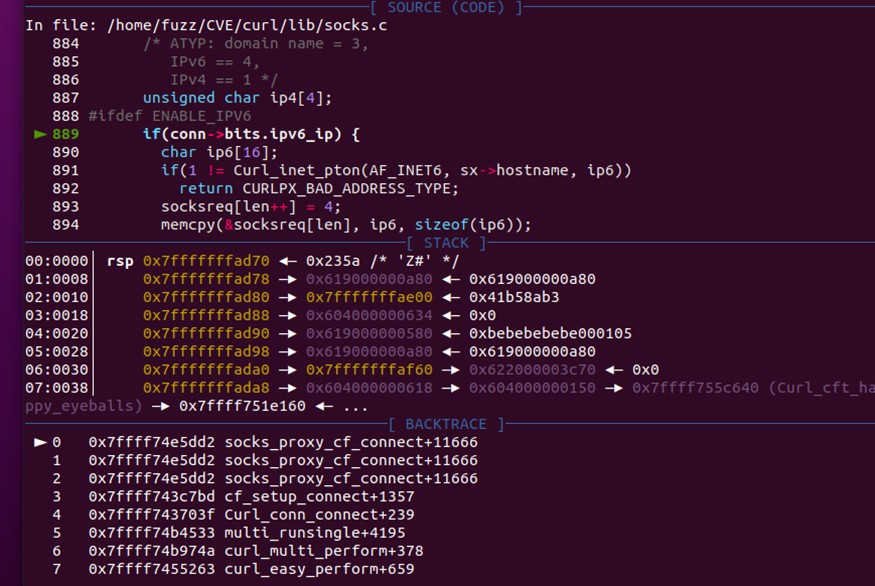