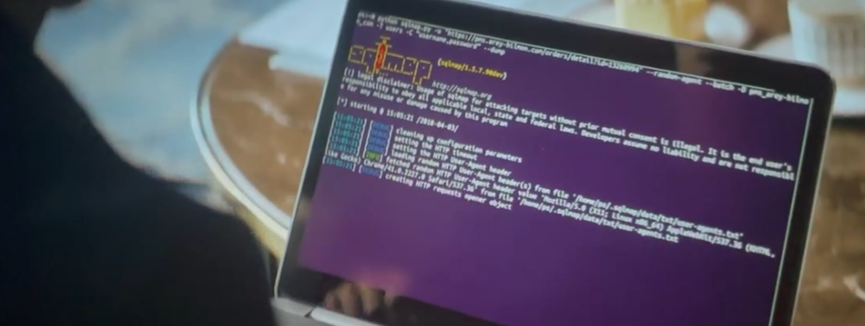
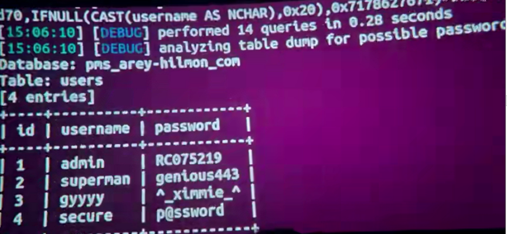
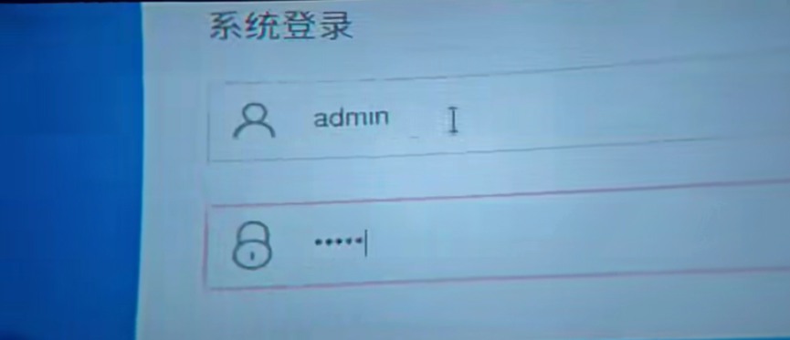
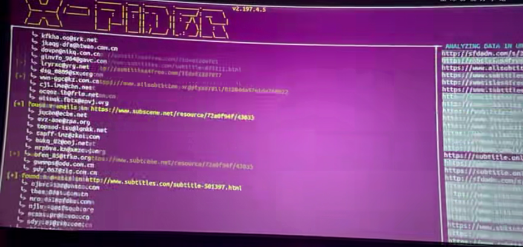
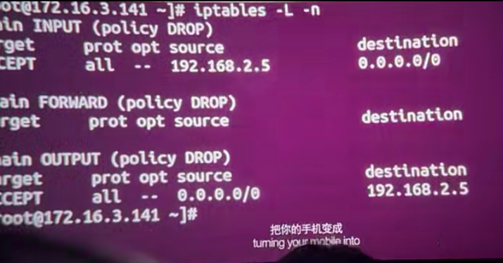
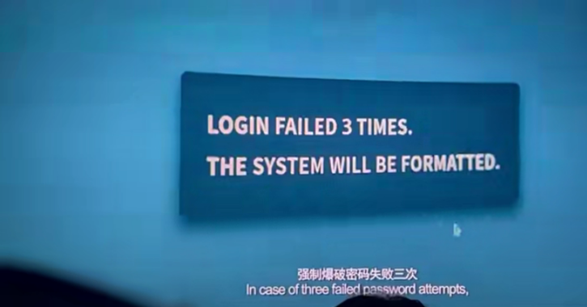
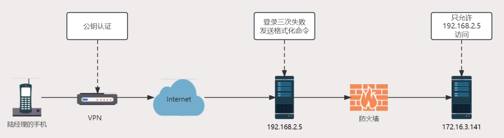

---
title: 安全专家眼中的电影《孤注一掷》
slug: cybersecurity-expert-perspective-on-the-movie-all-in
author: 裴伟伟
date: 2023-08-24 12:00
categories: 技术解析
tags:
  - 技术解析
  - 孤注一掷
  - 影视分析
  - 安全专家
  - 安全教育
--- 

近日，一部名为《孤注一掷》的犯罪影片正在大银幕上热映，这部影片以揭秘网络诈骗全产业链内幕为主题，全方位拆解了电信诈骗套路。由于有包括俞华辰等安全专家的参与，其中也不乏专业的技术场景。


本文将按照电影情节先后，介绍和分析电影场景中的技术手段及原理，看哪些是真实存在的技术，哪些又是艺术加工的结果。

## 酒店会场里的恶作剧

影片开始，潘生在离开会场之后使用**SQLMap工具**利用SQL注入漏洞进入到了酒店管理系统，最后“篡改”了正在演讲的屏幕。







电影中使用的完整的命令是：

``` Python
    python sqlmap.py -u "https://pms.arey-hilmon.com/orders/detail?id=13260994" --random-agent --batch -D pms_arey-hilman_com -T users -C "username,password" –drop
```

即利用https://pms.arey-hilmon.com/orders/detail?id=13260994 中的SQL注入漏洞，导出了数据库pms\_arey-hilman\_com下的users表中的用户名和口令字段，继而获取了系统管理员账户口令，未授权访问到酒店系统。

上述的域名并未被注册，是电影拍摄需要模拟构建的本地系统，同时为了方便观众理解，导出的用户口令也未做哈希处理或加密处理（现实中通常都会对用户口令做加密存储，避免数据库泄露后的用户口令泄露），这样一眼可以看出主角获得了系统账户权限。

通常酒店会场演示的屏幕是通过独立的投影系统实现，比如有专用电脑连接投影仪投屏。因此，电影中配有声效的emoji表情的快速出现在屏幕中是电影的艺术处理，现实中要对已操控电脑实现相同效果，最好的办法是是播放恶搞视频。

## 会“算卦”的新员工

影片中，潘生在新员工们前往新公司的航班上透露了每个人的姓名，有人以为他会算卦，而他自称是黑掉了“才哥”的手机。


按照潘生的说法，大概的攻击方式是：

首先， 通过OSINT（开源情报搜集）获得才哥的个人信息

然后，通过社会工程学的方式“诱导”或“引诱”才哥下载安装了App（影片才哥使用的是Android手机）

最后，利用带有木马程序的App获得手机上的其他信息，比如才哥下载在手机本地的新员工名录或清单。

潘生没有通过才哥手机得知才哥真实身份及诈骗集团相关信息，说明才哥在手机讯息管理上非常严谨，又或者才哥有多部手机（至少一部用来“招聘”，一部用于“工作”），电影末尾得知才哥确实是持有两部手机，潘生黑掉的只是没有问题的那部。

## 被逼写爬虫的潘生

在后面的情节中，潘生被骗到诈骗园区，被陆经理和才哥软硬兼施要他写个爬虫，收集字幕组资料。




爬虫程序是通过自动解析目标网站的结构和页面，将使用者需要的信息或特定的信息自动爬取下来的程序，常常用于批量获取网站特定信息，比如搜索引擎抓取网站信息和页面用的也是爬虫。Python中常见的爬虫框架有Scrapy等，影片中的X-Pider应该是拍摄需要自行开发或展示的程序（电影要兼顾真实和艺术，既要贴近现实，也需要让观众能看懂）。

## 字幕组收到的新邮件

影片中，潘生爬取的字幕组资料，之后被用于发送广告邮件，称只要字幕组将网址和信息嵌入字幕之中，便可获得3000元酬劳。


字幕组在诈骗链条中起到了推广营销的作用，只不过营销内容是诈骗信息，所以对于字幕组而言这封新邮件更像是广告邮件。

现实生活中，大多数的邮件服务商对于带有图片等媒体格式的内容都默认不显示或不展示，用户看到的图片往往是打叉的内容，除非主动点击邮件中加载图片的按钮或链接，这种设置可以大大降低广告邮件（垃圾邮件）或钓鱼邮件成功的概率。

## 扫街的伪基站

影片中，除了字幕组推广链接和网址之外，另外一种办法是使用伪基站。


伪基站指的**是未经过通信运营商授权和管理的基站，并伪装成运营商合法基站的非法通信设备**，所有靠近它的手机，信号强度上伪基站更强，因此手机会自动连接伪基站，伪基站因而可以获取手机用户的移动用户识别码（IMSI），给连接到的手机群发广告短信或诈骗短信。

由于伪基站设备不大，故不法分子会将伪基站放置在汽车后备箱、摩托车后备箱等运输工具上，通过四处移动的方式，在旅店、商业街等人员流动较多的场所，实施诈骗短信推广。

另外，影片中似乎还出现了**猫池**，这是一种**可以提供多组模拟电话号码的设备**，在猫池设备上可以同时管理大规模的电话手机卡（也就是诈骗集团本身拥有大量用于诈骗的手机号码，或称黑卡），通过配套的软件可以实现同时接收、发送短信，拨打电话的功能。诈骗集团通过这种方式与受害者联系进行电话诈骗，因为电话号码可以自动切换的，所以追踪难度非常大。

## 用于诈骗的群聊机器人

影片后半段，潘生向陆经理提出做一个**自动化程序**，把人工客服的功能放到软件里，受害人扫码后直接跳转到群里，通过机器人群聊的方式对受害人实施统一话术和自动回复。


影片中的设想逻辑上是没问题的，但在现实生活中，微信自动群聊机器人和涉嫌欺诈的微信群一直是微信官方和警方联合打击的对象，为的就是避免诸如恶意营销和诈骗事件的发生，甚至为了逃避官方的封禁和打击，有黑产或灰产人员会向普通人收购建立时间较长（超过1年以上）的微信群从事非法活动。

## 陆经理的唯一终端

影片结尾，陆经理的手机成为了访问诈骗集团服务器唯一的终端，从情节介绍很容易理解，甚至片中还有一幕使用到了iptables设置访问来源IP。







现实生活中，设置特定的访问来源或终端有很多种办法，iptables是Linux系统中用于配置防火墙访问规则的命令，影片中设置的唯一访问来源IP是192.168.2.5，而配置该命令的服务器IP是172.16.3.141，同样是内网网段IP地址。

可能的技术方案是通过陆经理手机配置VPN（密钥验证）连接动态IP绑定的192.168.2.5（这也是必须拿到陆经理手机的原因），潘生设计和编写的程序在该服务器上运营和管理172.16.3.141的服务器数据，故陆经理连接服务器之后还需要输入账户名和口令才能进行管理，一旦输入次数超过3次，则执行系统层面的格式化命令，将172.16.3.141中的数据格式化。而潘生留下所谓的后门，大概率是应用中硬编码的账户口令，或者万能账户，只有他本人知道。



## 孤注一掷

除了上述的技术场景之外，影片中还有为了绕过社交软件内容安全审查采用截图方式传递自己被绑架的消息，利用NFC（近场通讯）复制才哥门禁卡的场景，以及利用梁安娜指纹进入新的诈骗场所（另一种办法是通过提取犯罪嫌疑人指纹信息并伪造指纹进入），这些也都涉及到信息安全技术和管理。

电影是艺术创作，避免不了艺术的加工和技术的妥协，但《孤注一掷》中的技术场景表现已然是非常专业。另外，潘生在影片中的攻击行为已然违反了《刑法》第285、286条，现实生活中也切不可模仿。