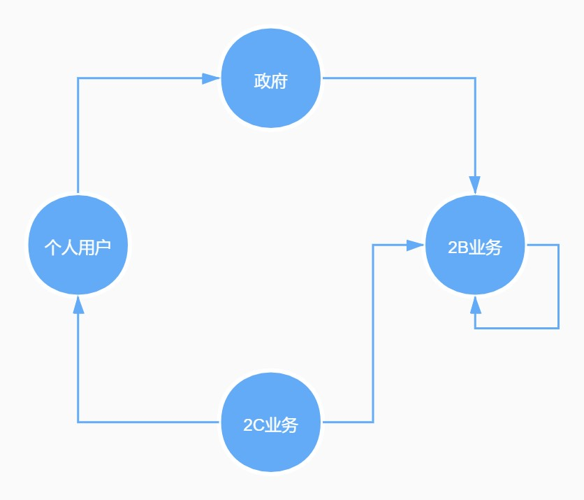
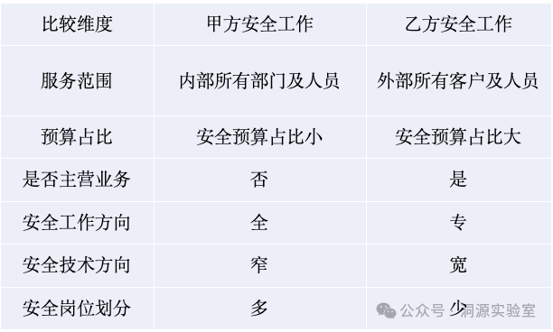

信息安全工作，总会被人分成甲方和乙方，甲乙方原本只是商务层面需方和供方的代称，在安全领域，成了做公司内部安全和为客户提供安全的区别。

通常意义上，什么是甲方安全人员呢？就是在非安全业务的公司从事信息安全工作的人。什么是乙方安全人员呢？就是在主业是安全业务的公司从事信息安全工作的人。由于多年以来的刻板印象，似乎技术人员都不大倾向在乙方工作，对于乙方安全工作的印象是：

> 工作贼多、收入贼少、福利稀少、管理混乱、产研紊乱。

而对甲方安全工作的印象则是：

> 工作不多、收入特多、福利多多、管理规范、产研标准。

既然是刻板印象，说明其印象是不准确的。首先要搞清楚的是，到底什么是甲方，什么是乙方。根据业务的商业模式划分的话，甲乙方关系中的角色能够分为四类：政府机关、个人用户、2B业务和2C业务，其中2B业务是to business的业务，或面向客户的业务，如广告公司给客户做广告、SaaS公司给客户卖帐号，2C业务是to customer的业务，或面向用户的业务，如饭店给用户卖小龙虾、电商平台给用户卖商品。这四种角色的组合不算在内，诸如C2C（比如某乎）、B2B2C（比如某宝）。同一家公司也会经营不同商业模式的业务，既经营2C业务，也经营2B业务，比如多数银行既做个人业务，也做企业业务，而中国人民银行则只做企业业务，不做个人业务。

图中箭头指向的是角色双方的乙方，另一方是甲方。可以看到，许多人印象中的甲方，只不过是做2C业务的公司，在甲乙方关系中，2C业务因为面向用户，没有明确的、清晰的甲方，比如电影没有客户，只有用户，即个体存在的普通观众，而印象中的乙方，是做2B业务的公司，有着明确的、清晰的甲方，比如电视剧没有用户，只有客户，即各个电视台购片部门。

但安全从业者眼中的甲乙方区分，又不止如此，比如阿里，既有2B业务，又有2C业务，但因其经营的业务并非安全业务，安全人员并非处在业务前沿，因此阿里的安全工作也是甲方安全。所以，当我们说甲方安全和乙方安全的时候，实际上是说安全工作是否是业务工作，比如某个不足百人的，主营业务是2B业务的公司，招聘的安全人员，也是甲方安全人员。而由如绿盟、启明星辰这类传统的老牌上市安全公司，因为安全工作就是业务内容，即便公司规模大，业务多，其招聘的安全人员，也是乙方安全人员。

搞清楚了所谓甲乙方之分，工作量的差别就一目了然，业务人员直接影响着公司的营收，势必要比非业务人员整体工作量要大，之所以说整体工作量，是因为具体到个人的工作量大小，由部门整体管理水平以及人数决定。比如SaaS公司的实施交付人员，负责产品在客户现场的交付、配置和培训，对比安全公司的安全服务工程师，负责在客户现场的漏洞扫描、渗透测试和报告编写，都直接和业务目标相关，都需要人工实施，同等工作量的情况下，没有谁比谁更轻松。

所以，觉得甲方安全工作量不如乙方，原因包括，所谓的甲方安全工作对公司和业务而言不是第一位的，在技术人员偏向甲方的情况下，乙方安全人员能力和人数不占优势。

看多了各个大型互联网公司的安全人员的待遇，很多人会觉得甲方安全人员的收入相比乙方更高更稳定，但实际并非绝对。相比安全业务，有很多业务自身的天花板要更高，盈利空间更大，毛利更多，马云说“最好的商业模式是国家”，而除了战争时期，一个国家的军工行业一定不是最赚钱的。不同行业决定了业务的天花板，纯粹的互联网技术领域容易形成垄断或寡头，而服务行业（比如餐饮）的市场占有率则是正太分布，是不会出现垄断或寡头的。所以，即便是甲方安全工作，也会因为公司所在的行业和商业模式不同，盈利能力不同，而薪酬待遇只是公司营收能力的间接体现。

比如一家大型互联网公司，每年营业额1000亿，共10000名员工，其人效为1000万，即平均每人贡献1000万营业额，在利润率足够好的前提下，人均百万薪酬不是问题。而一家小型互联网公司，每年营业额1亿，共100名员工，其人效为100万，在相同利润率的情况下，是无法保证人均百万薪酬的。

所以，收入和福利，取决于公司现金流以及人力建设成熟度，而非甲乙方。一个人的能力体现，薪酬是一方面，另一方面是人力成本占比。

企业管理，本质上都是人的问题，公司管理是否规范，是否完善，很大程度上取决于创始人的能力和眼界，因为企业文化和管理风格，都沿袭自创始人的作风。很多大型互联网公司，都会因为规模原因，造成管理上的不规范或过于规范，不规范会造成做事无章法、无规范，过于规范会造成做事保守、刻板，因人而异，没有一种管理水平或风格是能够让所有人都满意的，毕竟商业公司追求的是盈利结果，而非乌托邦。另外，管理规范是随着公司规模的增长而逐渐规范，所以规模越小的公司，其管理越不规范，但这种不规范，反过来也是安全工作的挑战，如果挑战成功，就是升职加薪、赢取白富美，如果不成功，就是怨天怨地、跳槽另一家。

产研是否规范，结果是否可靠，决定了甲方安全工作的上限，以及乙方安全工作的下限。很大程度上，也是企业管理的结果，即找人、用人、育人、留人，产研不规范、不可靠，本质上是找不对人、用不对人、育不了人、留不下人。

所以，管理和产研是否规范，与甲方或乙方无关，可遇不可求。

就安全工作而言，甲方和乙方工作也存在较大的差异：

服务范围指的是安全部门服务的对象，甲方的服务对象局限在公司内部，在公司运营稳定后，面对的是熟悉的文化、业务、人群，犹如服务存量客户。而乙方由于面向所有的客户，理论上是没有上限的，会面对各种不同的文化、业务、人群，业务压力下会面对更多增量客户。

预算占比是指安全预算在公司整体预算中的比例，无论大型公司的安全预算有多么充沛，相比整体的预算都是相对占比小的，比如我国军费开支虽然排名世界第二，但GDP占比只有1.2%。乙方的安全公司，由于业务就是安全，可能安全预算体量不大，但占公司整体支出占比可能要大，毕竟，需要靠安全吃饭。

安全工作的涵盖内容多，方向多，在甲方做安全建设，需要解决不同维度和层面的安全问题，因此安全工作的方向涵盖方方面面，比如：外部有物理安全、主机安全、网络安全、应用安全、数据安全、业务安全，内部有人员安全、身份安全、终端安全、内网安全、物理安全，每一个方面在安全建设逐渐完善过程中都会遇到，但又无法每一方面都自研，因此需要向乙方安全公司采购。而乙方安全公司，由于业务指向和专业性，无法兼顾所有的安全方向，比如做应用安全，会更专注黑盒、白盒、灰盒等安全检测能力。

甲方的安全建设，需要基于已有的资源和预算着手，而任何一种信息技术都存在安全风险，也就有相应的安全技术方向，但服务范围和资源限制，导致甲方安全工作不大可能脱离现有的业务范围进行其他方面的技术发展和研究，比如业务形态只有App的公司，其安全工作几乎无法涉猎IoT安全、工控安全等领域，安全技术工作需要跟随业务的发展和需要，但同时也局限在业务形态之内。乙方安全公司，则因为会面临各种不同的客户、业务和安全需求，其安全技术的涉猎和拓展无论多宽泛，都可以是为下一个客户做准备，另外，从客户的角度，由于对信息安全的刻板印象，不全面的安全知识体系会让客户认为对方不够专业，就像隔壁阿婆会认为程序员应当会修电脑，如果修不了，可能会觉得做程序员不合格。

乙方安全公司的安全岗位如果要划分，除了售前、售后，需要的岗位类型并不会太多，比如安全服务工程师、开发工程师、解决方案专家等，而甲方安全工作中涉及的安全方向多，可能几乎每一个方向都需要有相关的岗位，比如安全培训、安全运营、安全开发、安全测试、安全合规、隐私安全等。

是不是甲方安全工作比乙方安全工作好做呢？并不是。乙方安全工作由于业务属性，安全工作的价值评估更为清晰、透明，安全工作的落地执行更为简洁、明确，干的好，业绩就好，干不好，业绩也会看出来，前有销售、售前分担职责，后有售后、客服支撑工作。而甲方安全工作的非业务属性，最大的难点在于，如何衡量安全工作的结果和价值，如果推动安全工作的落地，可能辛辛苦苦一整年，一把汗水一把泪，但就是无法将安全部门的价值向上展现，又或者被业务部门一句业务需要怼地落地工作一拖再拖，干好的觉得安全没用，没干好也被觉得安全没用。

如此，是否一定要执着于甲方或乙方呢？只要入水由若蛟龙，又哪管是河是江是大海。