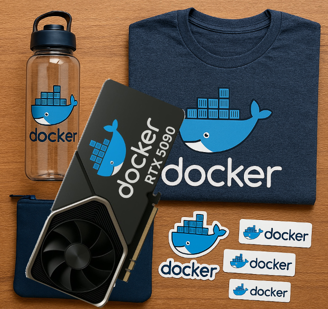

## 一、漏洞概述

### 1.1 漏洞基本信息

漏洞编号：CVE-2025-9074

漏洞类型：CWE-668（将资源暴露给错误范围 ）

CVSS评分：9.3（CVSS v4.0）

危害等级：严重

影响范围：Docker Desktop（Windows和macOS系统）

影响版本：>4.25，<4.44.3

发现时间：2025年

修复状态：已修复（4.44.3以后版本）

### 1.2 背景介绍

Docker Desktop是面向Windows和macOS的Docker平台，广泛用于开发者在本地构建、测试容器化应用。

CVE-2025-9074漏洞是由安全研究员Felix Boulet无意中发现，他在几年前注意到一款主流虚拟机软件允许虚拟机环境在默认配置下访问宿主机的接口，于是一直在担心本地的Docker环境也存在类似的问题，于是扫描了默认配置下自己本地的Docker环境，却发现了一样的问题。

由于对Docker环境隔离不太熟悉，所以他请教了好朋友Philippe Dugre进行确认和复现，并最终一起提交了CVE漏洞。

## 二、漏洞详情

### 2.1 漏洞成因

容器内可以通过未经认证的方式访问Docker引擎API，尤其是指向内网地址类似192.168.65.7:2375的API端点，且容器隔离增强机制 (ECI，Enhanced Container Isolation) 无法阻止该访问。具体来说，Docker Desktop默认存在一个启用的监听地址，无需挂载Docker socket、无需身份验证，任何容器便能调用Docker API。

### 2.2 漏洞影响

在未打补丁的Docker Desktop应用中，任何一个运行中的Docker容器都能够利用该漏洞实现以下操作：

*   访问Docker Desktop中守护进程dockerd的TCP协议的2375端口；
    
*   创建和启动另一个特权容器；
    
*   加载宿主机的磁盘驱动目录到当前容器中，实现对宿主机文件系统的访问；
    
*   获取宿主机的全部权限，即攻击者可以发起SSRF（Server-Side Request Forgery）攻击。

## 三、漏洞原理

Docker引擎套接字（Docker Engine socket）原本绝不应该被不可信的代码或用户访问，该套接字是Docker管理的API接口，一旦获取其访问权限，就等同于获得了Docker应用程序所能执行的所有操作权限，包括创建和删除容器，但更具危害性的功能是卷挂载（volume mounting）。

举个例子，假设Docker引擎运行着一个生产环境应用，该应用使用的数据库同样部署在Docker中，攻击者只需创建一个新容器，并挂载数据库对应的卷，就能对数据库中的所有数据进行读写操作。

然而，更可怕的危害是挂载主机文件系统，这会让攻击者得以读写宿主机上的文件。

在Windows系统中，由于Docker引擎通过WSL2运行，攻击者可通过管理员权限挂载整个文件系统，读取任何敏感文件，最终甚至能通过篡改系统DLL文件，将自身权限提升为主机的管理员。

但在macOS系统中，Docker Desktop应用仍存在一层隔离机制：若尝试挂载用户目录，系统会提示用户授权。默认情况下，Docker应用无法访问文件系统的其他部分，也不会以管理员权限运行，因此相比Windows，该漏洞对于macOS主机的影响要小很多。不过，攻击者仍能利用该漏洞完全控制Docker应用及所有容器，甚至可通过挂载并修改应用配置的方式植入后门，而这一操作无需任何用户授权。

Linux系统并未为Docker引擎的API使用TCP套接字，而是在主机文件系统上使用命名管道。除非采用了特定的不安全配置，否则容器无法访问该命名管道。需要注意的是，此漏洞也在Linux下被记录（见CVE漏洞通报），是因为在 “Docker 中运行 Docker”（Docker-in-Docker）的部署架构下也存在一样的问题，而这种情况属于设计层面的特性，正因为存在这样的风险，所以生产环境中才不应使用这种部署方式。

## 四、漏洞复现

### 4.1 利用条件

根据上面的漏洞原理可知，该漏洞的利用条件包括：

*   宿主系统运行受影响版本的Docker Desktop（<4.44.3）；
    
*   Docker Desktop在容器内部开启了指向Docker Engine的API访问；
    
*   攻击者需能以容器内部用户身份执行命令（即已有原始容器内的权限）；
    
*   或者在Linux环境中使用了Docker-in-Docker的部署方式。
    

### 4.2 复现步骤

以Windows环境为例，在PowerShell中运行

``` Bash
    docker run -it alpine '/bin/sh'
```

进入alpine容器中，接着在容器中执行以下命令（其中192.168.65.7要替换成宿主机IP地址）：

``` Bash
    wget --header='Content-Type: application/json' \
```

## 五、修复方案

升级Docker Desktop到4.44.3以上版本。

## 六、漏洞启示

关键的安全漏洞往往源于最基础的认知偏差。作者发现这个问题的方法很简单，针对Docker文档中记载的私有网络快速运行了一次nmap扫描，并针对不认识的端口进行了进一步的探索。

现实的生产环境中，扫描所有私有网段仅需几分钟，而结果可能会让你意识到：你的网络隔离程度远不如自己想象中那么可靠，除此之外，资产情况也远不如想象的那么清晰，不要想当然地认为所有安全机制在默认情况下都是协同生效的。

*   内部接口并非天生安全。
    
*   评估每一条访问路径和入口点：外部与内部的测试及扫描同样至关重要。
    
*   鼓励外部协作（例如通过公开或私有漏洞赏金计划），争取在攻击者发现之前，先修复这些容易发现和利用的漏洞。
    

另外，由于Docker没有漏洞奖励计划，漏洞发现者最终收到了Docker官方寄来的一些奖品。



## 参考资料

1. https://blog.qwertysecurity.com/Articles/blog3.html

2. https://pvotal.tech/breaking-dockers-isolation-using-docker-cve-2025-9074/

3. https://thehackernews.com/2025/08/docker-fixes-cve-2025-9074-critical.html