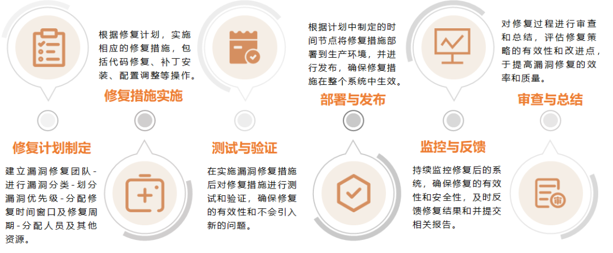

## 一、背景

根据最新的数据统计显示，全球每天有**数十万次**的安全漏洞攻击事件发生，其中**一半以上**是由**未修复的已知漏洞**引起的，这些攻击可能导致企业损失数百万甚至数亿的资金，从而损坏企业品牌和声誉，甚至使企业面临政府机关或客户的问责或法律诉讼。

因此，对已知安全漏洞的修复是企业在安全建设工作中不可或缺的一项重要任务。

## 二、安全漏洞识别与评估

企业进行漏洞修复的前提是对漏洞进行识别和评估。只有在识别、掌握、记录了安全漏洞的信息之后，才能在该基础上开展漏洞修复的工作。

常见的安全漏洞识别方法：

*   使用漏洞扫描工具
    
*   源代码安全审计
    
*   渗透测试
    
*   使用软件成分分析工具/系统
    
*   攻防演练
    
*   网络流量分析
    
*   订阅安全漏洞通告
    
## 三、安全漏洞修复策略

企业在进行漏洞修复时，应建立一套相应的漏洞修复策略，漏洞修复策略包含以下六个因素：

1. **团队构建和合作**

在进行漏洞修复前首先需要建立一个漏洞评估和修复团队，团队成员及具体分工如下：

*   **安全人员：**提供安全技术支持，如漏洞分析评估、修复指导、漏洞修复验证等；
    
*   **研发人员：**支持应用相关漏洞的修复工作；
    
*   **运维人员：**负责服务器、网络设备、数据库、安全设备等的系统升级、补丁下发、策略配置、安全加固相关工作；
    
*   **团队负责人：**负责人员、资源的协调。
    
2. **漏洞修复优先级**

开展漏洞修复时，团队需要对漏洞修复紧急程度进行分类，制定漏洞修复优先级。漏洞修复优先级可以参考以下方面：

*   漏洞严重性
    
*   业务影响程度
    
*   攻击概率评估
    
*   漏洞修复复杂性评估
    
*   业务需求和合规要求

3. **漏洞修复成本**

在投入资源进行漏洞修复之前，需要对漏洞修复的成本进行评估。评估的目的是平衡修复成本和安全风险，实现安全工作的成本效益最大化。

漏洞修复成本的评估包括以下方面：

*   是否影响运营环境或基础环境的操作；
    
*   是否会影响到业务的正常运行，如果是，影响的业务损失预计是多少；
    
*   修复工作需要投入多少一次性资源，如过渡的计算资源；
    
*   修复工作需要投入的人员及工时；
    
*   修复工作是否涉及公司其他部门的协助，协助内容及时长；
    
*   修复工作是否需要引入外部资源，预计的费用是多少。
    
通过以上六个方面评估漏洞修复的成本，来确保投入修复漏洞资源的有效性。

**即：漏洞数量\*（修复前漏洞利用概率\*漏洞利用预计损失）-漏洞数量\*（修复后漏洞利用概率\*漏洞利用预计损失）>漏洞修复成本**

4. **修复时间分配**

不同优先级的漏洞修复时间也是不同的，通常来说，优先级越高的漏洞需要在越短的时间被修复。

常见的漏洞修复窗口如下：

| 漏洞修复优先级 | 漏洞修复窗口 |
| :---: | :---: |
| 严重 | 1天 |
| 高 | 1-3天 |
| 中 | 3-7天 |
| 低 | 15-20天 |

5. **修复资源分配**

在修复安全漏洞前，需要对人员及资源进行需求评估；在漏洞修复中，应根据实际情况对现有资源进行动态调整；在漏洞修复后，要做好资源协调监控。

合理的资源分配是确保漏洞修复工作能够高效进行的关键之一。主要参考如下内容进行资源分配：

*   修复工作量评估
    
*   资源合理分配
    
*   优化修复流程
    
*   外部资源合作
    
*   优先级调整和动态分配
    
*   监控和评估
    

6. **持续监控与反馈策略**

在完成漏洞修复工作后，企业需持续监控已修复的安全漏洞，并向安全团队及时反馈监控到的异常情况，在保证漏洞修复措施有效性的同时，也可以及时发现新产生的安全漏洞。

## 四、漏洞修复方案

1. **漏洞修复流程**

2. **漏洞修复方式**

## 五、持续漏洞管理

企业在进行漏洞修复的同时也需要做好持续漏洞管理工作，漏洞修复工作只是解决了目前发现的安全漏洞，而新发现的漏洞以及潜在的风险都可能给企业带来很大损失。

以下是持续漏洞管理需要做的工作：

*   定期进行漏洞扫描和评估
    
*   根据漏洞扫描结果，及时修复和应用相关的安全补丁
    
*   进行漏洞跟踪，提供最新漏洞信息
    
*   漏洞优先级和风险评估
    
*   漏洞修复计划和策略
    
*   建立有效的安全补丁管理流程
    
*   进行漏洞验证和渗透测试
    
*   定期进行安全意识培训和教育
    
*   持续改进漏洞管理流程

## 六、总结

通过修复企业安全漏洞，企业可以实现以下重要目标：

*   保护企业内部数据
    
*   提高系统的稳定性和可靠性
    
*   防止恶意攻击导致的业务中断
    
*   保护企业品牌声誉
    
*   避免潜在的经济损失
    
*   维护客户对企业的信任
    
*   有助于企业遵守行业标准和最佳实践
    
*   使企业符合法规及合规要求

## 附录

完整版方案下载：[点击下载](./assets/企业安全漏洞综合治理方案.pdf)

> 版权所有 © 洞源实验室 2023
>
> 未经授权，禁止用于商业用途。
>
> 如需授权使用，请联系：repoog#gmail.com