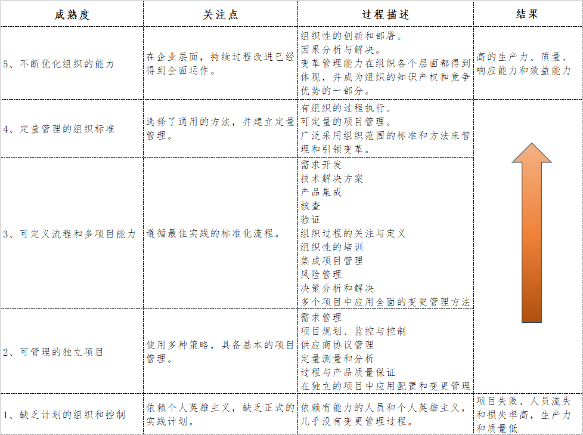

每年的年底，都是各个部门向上总结、汇报当年工作成果的时候，安全部门也是其中之一。作为大家眼中的成本中心，做的好，往往意味着花钱也多，做的不好，往往意味着钱花的不值。对于企业内其他部门或岗位而言，会对安全部门的存在有着近乎天然的疑惑：

安全部门的同事们每天在做什么工作？

为什么我们已经有了测试部门，还要做安全测试？

安全部门对于业务的发展和拓展有什么样的作用？

同样，作为安全工作的最高负责人（CISO或CSO），或安全部门的负责人（安全总监或安全经理），如何在年终汇报或向上汇报中体现安全工作的价值，不仅影响到管理层或其他部门对于安全工作的认识，而且影响到安全部门下一年工作的顺利与否，比如公司是否会增加到安全部门的资金预算和人员预算，是否会对安全工作提出更高的要求。最坏的结果是，企业管理层对于安全工作的不回应，这意味着对于管理层而言安全工作没有任何印象，也不抱有任何期待。

企业中的安全部门其实是**成本效益部门**，也是**业务支撑和运营部门**，需要在保障业务开展的同时构建业务运行的安全保障体系，以及体系构建过程中尽可能的让企业打消对于安全工作“为什么这样”的疑虑。因此，作为安全负责人或管理者，职责包括：

**管理层的沟通**

**资源、成本与预算管理**

**信息安全政策制定**

**法规与合规**

**信息安全风险评估**

**安全技术评估与选择**

**安全培训与教育**

**业务连续性**

**安全事件应急响应**

**供应链安全管理**

**持续监控与改进**

但核心是需要将工作的结果或成果进行量化，如果无法量化安全工作的结果，那么无论是对于之后的安全工作，还是对于向上的工作汇报，都无法呈现相应的效果（怎么判断今年的工作比去年好，怎么判断明年相比今年要做哪些规划）。

所以，**安全工作汇报的核心在于成本效益和工作量化**，并可以参考下面的模型评估安全工作的成熟度。

上图中的成熟度类似于CMMI模型中对于项目成熟度的定义，不同之处在于过程的描述。安全工作建设过程中，上述所有的职责内容如果归纳为三类工作，是安全的意识、风险的管控和安全的能力。

假设企业中每个人都具有完美的安全意识和行为，那么可以省去绝大多数日常的安全工作，因此无论在各种的安全模型和安全标准中，教育与培训始终是关键的工作之一，甚至是第一位的工作内容。

而企业风险的来源，假设在某个静止的节点企业方方面面都不存在安全风险，那么风险的来源是源于企业自身的演变与更新，主要是业务变更所引起的资产变更、人员变更、系统变更等，而变更便容易失去安全的控制措施或手段，因而安全部门最大的难点是对于这些变更的未知和失控，尤其是企业内部发起某个保密项目的时候，安全部门的一切控制手段可能都会被排除在外，在非办公区的私人住宅里组织新的团队使用新的设备建设新的项目。

上述成熟度等级中对于项目的描述，即是将企业内部的行为从项目角度划分后，安全工作对于相关项目的管控能力，包括系统的研发、资产的采购、人员的变更、网络的变动、资产的变化等等。能够达到等级3便代表着非常高的安全能力，而等级5则是更近一步能够对于企业的发展产生正向的、积极的作用。成本效益的含义正指的是，安全工作的成果一方面能够降低企业潜在的损失，一方面能够降低企业业务的成本损耗，甚至是直接的节约业务成本，比如，有的企业将业务系统交付给客户，由于客户对于待交付系统的安全要求或标准，导致系统退回重新进行安全能力的加强，从而增加了交付的周期和交付的成本，并影响到交付并发能力和人力资源的使用率，以及最终业务的年度规模。

除此之外，对于以软件为主要业务的企业，也可以使用OWASP SAMM模型作为软件安全成熟度评估的模型，该模型从治理、设计、实施、验证、运营五个维度的十五个实践中分别划分了三种成熟度能力，比如GitLab公司的安全能力建设便参考了该模型。

仅仅使用上述的模型进行安全工作结果的量化对于向上汇报依然是不够的，对于企业高层而言，专业的术语和表达无异于是天书，模型能够帮助安全部门自我量化和评估工作的成果，但不完全能够呈现安全工作的价值，因此需要将量化的成果进一步转换为业务视角和企业管理视角。

一方面，需要安全管理者充分与业务部门负责人（business line leader）以及利益相关者（stakeholder）进行充分的沟通，对于安全工作的政策制定、方法落地能够让对方给与充分的理解和支持，以及理解业务线运作的机制和逻辑，从而方便再制定政策和评估技术手段时考虑到业务的影响，并最终便于评估安全工作的开展对于业务运行的正面作用。如果缺乏充分的交流与沟通，业务部门负责人或管理层则更多需要靠感觉来评价安全工作，可能辛苦一年之后得到一个毁誉参半的结果。

一方面，需要安全管理者时刻跟进与了解企业的运作机制与逻辑，除了安全风险的评估与控制，还有企业管理与运行中可能存在的潜在风险与效率瓶颈，比如业务连续性管理、系统的统一账户管理，在提升企业运行和运营稳定性和可靠性的同时，不仅降低了企业安全风险，也提升了管理效率与运行效率。

当将安全工作成果转换业务和管理视角，并按照所有管理层能够听得懂的时间和收益呈现，那么安全工作结果对于企业的价值便一目了然。笔者曾经在某一年的安全工作汇报中，首先提及的便是当年安全部门400万+的收益，此收益是通过同其他部门的结算而取得的，因此那年安全部门的年终汇报只用了10多分钟，绩效是A+。

最终，安全工作的价值将会不仅仅局限于安全工作，而是之于业务和企业发展的推动作用。