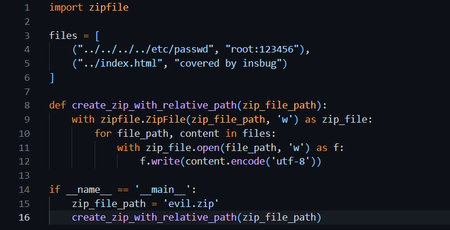
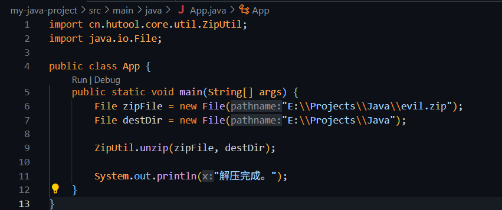
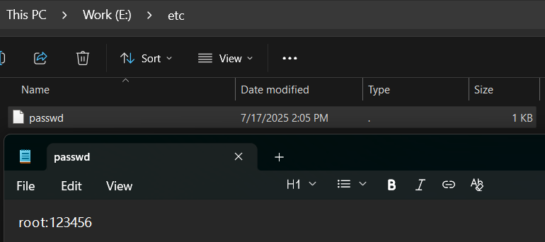
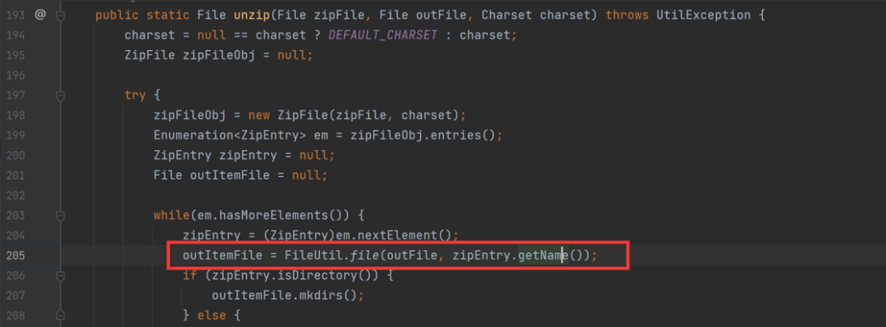
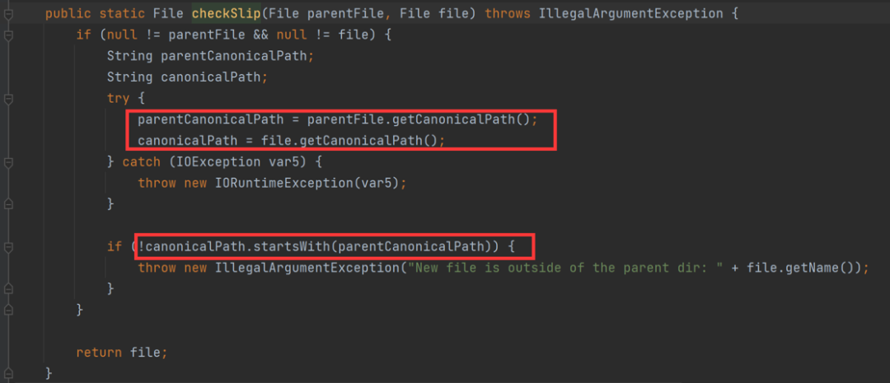

本文是是根据《从Top20开源组件漏洞浅谈开源安全治理困境》中，我们梳理的最常见组件漏洞制作的漏洞分析系列。

本篇是该系列的第一篇分析报告。

## 一、漏洞概述

### 1.1 漏洞基本信息

漏洞编号：CVE-2018-17297

漏洞类型：CWE-22路径遍历

CVSS评分：7.5（CVSS v3.1）

危害等级：高危

影响组件：Hutool Java工具库

影响版本：Hutool < 4.1.12

发现时间：2018年

修复状态：已修复（4.1.12 版本后）

### 1.2 背景介绍

Hutool是一款轻量级、功能强大的开源Java工具库，提供了丰富的工具方法和组件，用于简化Java开发过程中的常见任务和操作。它的目标是提供简洁、易用且高效的API，让开发人员能够更快速地编写高质量的Java代码。

然而，其提供的\`ZipUtil\`类中的\`unzip()\`函数在早期版本中存在路径遍历（Zip Slip）漏洞，攻击者可借助精心构造的压缩包，实现任意文件写入，造成严重安全后果。

## 二、漏洞详情

### 2.1 漏洞成因

在解压ZIP文件的过程中，\`ZipUtil.unzip()\` 函数未对压缩包中包含的文件路径进行规范化与越界路径检测，导致攻击者可通过构造如\`../../../../etc/passwd\`等路径，在解压时将文件写入任意系统目录。

这类问题归类为路径遍历漏洞（CWE-22），类似这样的漏洞也被统称为Zip Slip，于2018年6月由Snyk公司披露，这类漏洞通过使用精心制作的存有目录遍历文件名（例如../../evil.sh）的归档文件来加以利用，可能会影响多种归档格式，包括tar、jar、war、cpio、apk、rar和7z。

### 2.2 漏洞影响

攻击者可通过上传或诱导用户解压特制的恶意Zip文件，实现以下攻击效果：

*   覆盖服务器敏感文件（如 \`/etc/passwd\`）
    
*   向Web根目录写入恶意网页（如篡改 \`index.html\`）
    
*   植入WebShell或持久化后门
    
*   进一步进行远程代码执行（RCE）或系统提权

只要使用了早期版本（<4.1.12版本）的Hutool并在组件使用中用到\`ZipUtil.unzip()\`进行解压，系统便存在被攻击的风险。

## 三、漏洞利用分析

### 3.1 漏洞利用前提

1.  应用使用了Hutool工具库且版本小于4.1.12；
    
2.  使用了 \`ZipUtil.unzip()\` 或相关未校验路径的解压接口；
    
3.  攻击者可以控制或提供ZIP文件内容。
    
### 3.2 恶意压缩包构造

Windows系统不允许直接创建含\`../\`的路径文件名，但可使用以下Python脚本构造带有路径穿越的压缩包：



该脚本创建一个包含两个文件的压缩包：

*   \`../../../../etc/passwd\`：模拟覆盖系统密码文件；
    
*   \`../index.html\`：模拟覆盖Web根目录的首页文件。
    


### 3.3 利用步骤

1. 使用上方脚本生成名为 \`evil.zip\` 的压缩包；

2. 在目标Java应用中调用标红的代码解压该压缩包，以下是完整示例代码：



3. 上述代码执行后，会根据压缩包中的两个文件名的放置到穿越后的目录下，如果有同名文件存在，则可被覆盖。




### 3.4 利用结果

若系统权限设置不当，或解压目录与敏感路径重合，将导致文件被恶意替换。例如：

*   \`/etc/passwd\` 被篡改，造成身份认证异常；
    
*   \`/var/www/html/index.html\` 被替换为恶意内容，网站主页被劫持；
    
*   执行目录中植入 \`.jsp\`/\`.php\` WebShell 文件，供远程控制使用。
    
## 四、漏洞修复方案

Hutool官方在4.1.12版本中修复了该漏洞，根据漏洞原理和修复方案，可以采取以下任一方式修复该漏洞：

1. 升级Hutool至安全版本（推荐）

升级到Hutool 4.1.12或更高版本。新版本的\`ZipUtil\`中通过调用\`FileUtil.file()\`方法创建文件，自动加入安全校验逻辑，防止路径穿越。

核心原理是使用新增的FileUtil替代原先的File对象。



FileUtil创建File对象的时候会调用checkSlip函数，该函数通过获取传入文件的规范路径来消除路径的冗余和符号链接，然后检查file的规范路径是否以parentFile的规范路径开头，如果不是，则说明file不在parentFile目录下，将抛出异常；如果在，则返回file本身。这是一种安全性检查，以确保文件在指定的父目录下，防止越界访问。



此方法推荐通过构建工具如Maven/Gradle统一升级组件，避免手动更新出现维护负担。

2. 手动添加路径校验代码（适用于不便升级项目）

第一种修复方案的本质是对解压文件内的文件名进行了校验，所以也可以通过自己实现相关校验代码避免漏洞的产生。如果组件版本升级困难（如老项目中依赖限制），可参考如下代码，在解压逻辑中加入路径规范性校验：

``` Java
String canonicalDestPath = destinationDir.getCanonicalPath();
File destFile = new File(destinationDir, zipEntry.getName());
String canonicalFilePath = destFile.getCanonicalPath();
if (!canonicalFilePath.startsWith(canonicalDestPath + File.separator)) {
 throw new SecurityException("Zip Entry is outside of the target dir: " + zipEntry.getName());
}
```

此代码会阻止任何尝试越出解压目录的Zip文件内容写入，是应对Zip Slip攻击的常见方式。

3. 降权操作系统用户权限（缓解措施）

在无法直接升级或修复代码的场景中，可以通过创建权限受限的系统用户来执行解压操作，控制其文件系统访问范围。例如：

*   禁止写入 \`/etc\`, \`/var/www\` 等敏感目录；
    
*   将应用运行在容器内隔离执行环境；
    
*   配合 AppArmor、SELinux 等机制限制文件访问权限。

## 五、风险评估与建议

漏洞等级：高危

攻击门槛：中等（需控制 ZIP 内容）

利用影响：可覆盖任意文件、破坏系统完整性

漏洞广泛性：高（Hutool 在国内项目中使用广泛）

修复难度：低（升级组件或增加简单路径校验）

推荐处置方式：立即升级组件，或手动修复源码并加强权限隔离

## 六、参考资料

*   \[Hutool 官方 GitHub 仓库\](https://github.com/dromara/hutool)
    
*   \[CVE-2018-17297 漏洞信息 - CVE Details\](https://www.cvedetails.com/cve/CVE-2018-17297/)
    
*   \[OWASP Zip Slip 攻击模型\](https://owasp.org/www-community/attacks/Zip\_Slip)
    
*   \[Hutool 4.1.12 发布日志\](https://github.com/dromara/hutool/releases/tag/v4.1.12)
    
## 七、附录：Hutool常见使用场景概览

Hutool作为Java工具库广泛用于以下开发场景：

*   Web开发：参数解析、HTTP 客户端、加密签名等；
    
*   数据处理：字符串操作、正则表达式、文件读写；
    
*   系统工具开发：配置文件解析、系统信息获取、日志记录；
    
*   测试与调试：Mock 数据生成、命令行工具辅助、调试打印等。

在使用过程中需注意：虽然 Hutool 提供了高度封装的便捷方法，但应始终保持安全意识，尤其在涉及文件读写、网络通信、加解密等安全敏感功能时，审慎使用。