## 事件背景

工商银行（ICBC）是中国最大的商业银行之一，成立于1984年，总部位于北京。作为全球最大的银行之一，ICBC拥有庞大的资产规模和全球业务网络，提供广泛的金融产品和服务，涵盖零售银行、公司银行、金融市场等领域。其国际化业务参与全球金融市场，为客户提供全面的金融解决方案。ICBC在全球银行业排名中一直居于前列，是中国金融体系的重要组成部分，对促进国内外经济发展起着关键作用。

工行旗下的ICBC Financial Services（工行金融服务）在2023年11月8日遭受勒索病毒攻击，导致部分金融服务系统中断，以至于不得不通过U盘手动传递结算信息完成金融交易。

## 事件过程

**2023年10月10日**

Citrix Bleed漏洞被披露。

**2023年10月25日**

AssetNote公布Citrix Bleed漏洞的PoC以及分析。

**2023年11月9日**

ICBC Financial Services遭受了勒索病毒攻击。

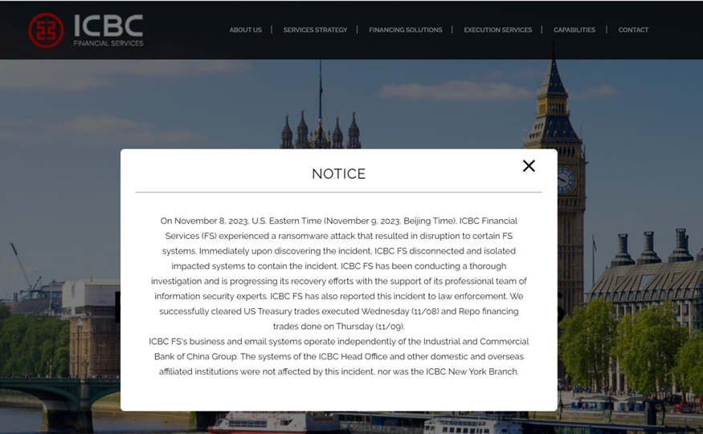

**2023年11月10日**

网络犯罪组织Lockbit在Tox（一款加密通讯软件）上证实其入侵ICBC Financial Services的行为。

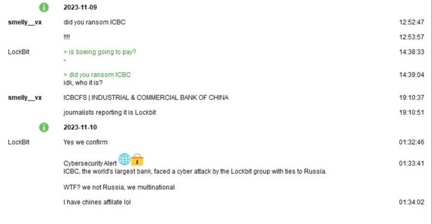

**2023年11月13日**

Lockbit代表通过Tox告诉路透社ICBC交了赎金，但并未透露赎金金额（TLP RED）。

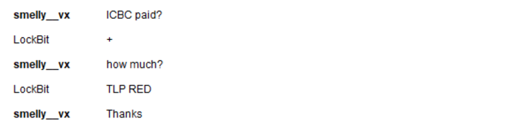

## 事件分析

据瑞典网络安全公司 Truesec 创始人 Marcus Murray 表示，此次事件中Lockbit使用的勒索软件为LockBit 3.0。

有关此次入侵手段的消息大多指向CVE-2023-4966（Citrix NetScaler ADC & Citrix NetScaler Gateway信息泄露漏洞），攻击者通过未打补丁的Citrix NetScaler设备进行了入侵。

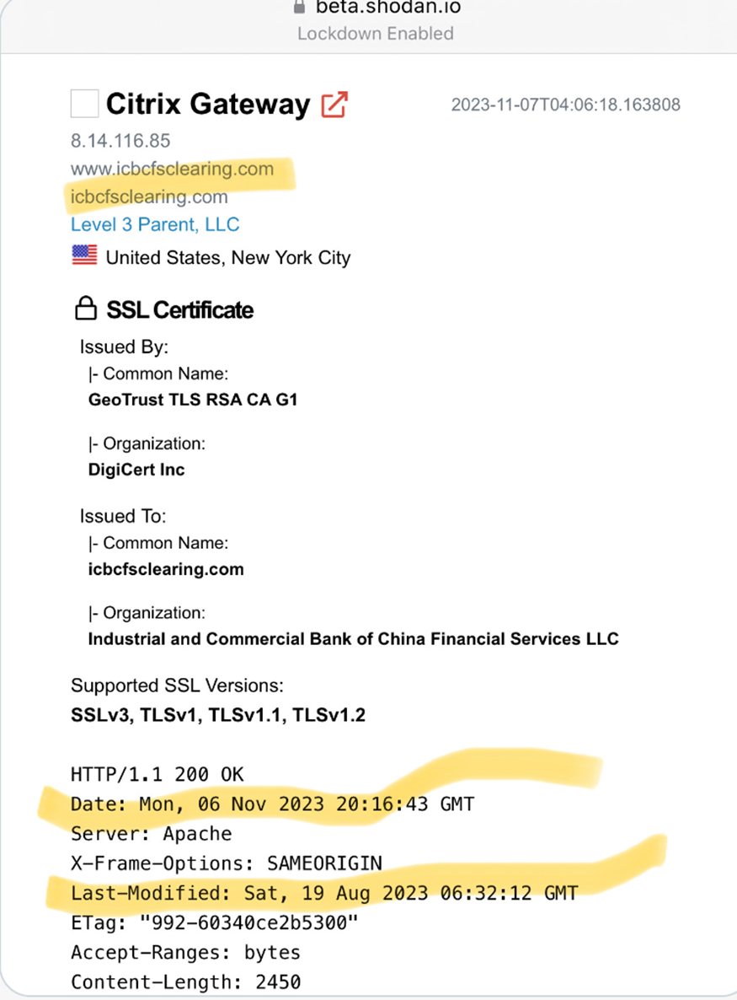

由于此次事件没有更多细节流出，下面笔者将从漏洞原理以及勒索软件（样本分析见附录）两个方面进行分析。

CVE-2023-4966是Citrix的一个缓冲区溢出漏洞，由于Citrix的开发者对snprintf函数返回值的理解有误，造成了缓冲区越界读取，从而导致了敏感信息（会话Cookie）的泄露。

漏洞位于/netscaler/nsppe二进制文件中，nsppe是NetScaler的数据包处理引擎，它包含完整的 TCP/IP 网络堆栈以及多个 HTTP 服务。在13.1-49.15和13.1-48.47的nsppe对比中，可以发现ns\_aaa\_oauth\_send\_openid\_config和ns\_aaa\_oauthrp\_send\_openid\_config执行了额外的边界检查，这些两个函数都分别可以通过/oauth/idp/.well-known/openid-configuration和/oauth/rp/.well-known/openid-configuration进行未经身份验证的访问。

漏洞代码如下：

``` C
iVar3 = snprintf(print_temp_rule,0x20000,
               "{\"issuer\": \"https://%.*s\", \"authorization_endpoint\": \"https://%.*s/oauth/ idp/login\", \"token_endpoint\": \"https://%.*s/oauth/idp/token\", \"jwks_uri\":  \"https://%.*s/oauth/idp/certs\", \"response_types_supported\": [\"code\", \"toke n\", \"id_token\"], \"id_token_signing_alg_values_supported\": [\"RS256\"], \"end _session_endpoint\": \"https://%.*s/oauth/idp/logout\", \"frontchannel_logout_sup ported\": true, \"scopes_supported\": [\"openid\", \"ctxs_cc\"], \"claims_support ed\": [\"sub\", \"iss\", \"aud\", \"exp\", \"iat\", \"auth_time\", \"acr\", \"amr \", \"email\", \"given_name\", \"family_name\", \"nickname\"], \"userinfo_endpoin t\": \"https://%.*s/oauth/idp/userinfo\", \"subject_types_supported\": [\"public\"]}"
               ,uVar5,pbVar8,uVar5,pbVar8,uVar5,pbVar8,uVar5,pbVar8,uVar5,pbVar8,uVar5,pbVar8);
authv2_json_resp = 1;
iVar3 = ns_vpn_send_response(param_1,0x100040,print_temp_rule,iVar3);
```

这段代码的漏洞在于snprintf函数的返回值作为ns\_vpn\_send\_response函数向客户端返回的字节数。编写此段代码的人员可能认为snprintf函数返回的数据大小会在0和第二个参数之间，比如此处是0~0x20000，然而snprintf返回值却不是**写入print\_temp\_rule的长度**，而是**格式化字符串拼接后的实际的长度**。

以下用一段测试代码来说明：

``` C
int main() {
    char buffer[20];
    int num = 42;

    // 将格式化的数据写入缓冲区，最大长度为20
    int result = snprintf(buffer, sizeof(buffer), "12345678The answer is %d", num);

    if (result > 0 && result < sizeof(buffer)) {
        printf("Result: %s\n", buffer);
        printf("RetLen: %s\n", result);
    }
    else {
        printf("Result: %s\n", buffer);
        printf("RetLen: %d\n", result);
        printf("Error occurred.\n");
    }

    return 0;
}
```

num为42，填充进format后总计24字节，而由于buffer只有20字节，并且使用sizeof(buffer)设置了第二个变量指定了写入的最大大小，故而buffer只有前20字节的内容，然而，此时的返回值result为24，因此可以确定返回值为format被拼接后的大小，而与buffer或是指定大小无关。

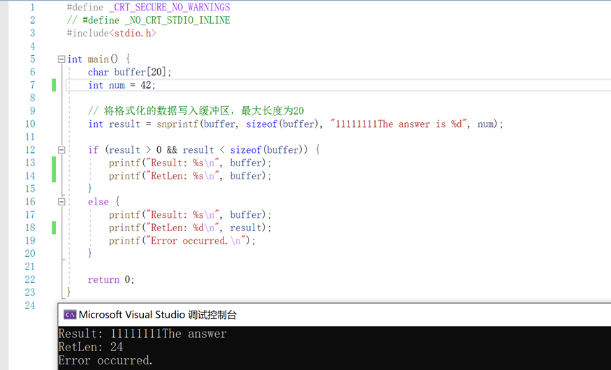

因此，若漏洞代码中传入给snprintf的uVar5或pbVar8可控，并且让其填充完format后字符串大于0x20000就可以造成越界读取。而其变量恰可以通过请求包的Host字段控制，这从目前公开的PoC和Exp也可以看出来。

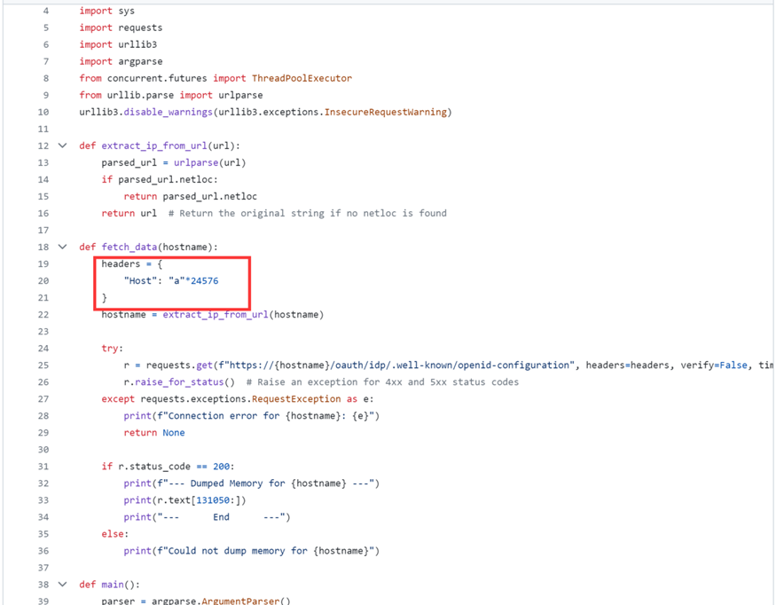

最后可以对漏洞版本的Cirtrix NetScaler ADC & Citrix NetScaler Gateway进行攻击可以获取Cookie，或是内存中其余的敏感信息。

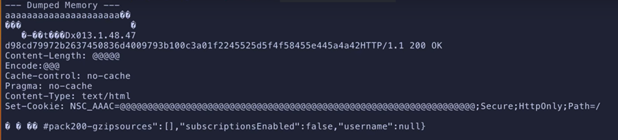

此漏洞的修复为对snprintf的返回值进行了检查。

``` C
uVar7 = snprintf(print_temp_rule,0x20000,
               "{\"issuer\": \"https://%.*s\", \"authorization_endpoint\": \"https://%.*s/oauth/ idp/login\", \"token_endpoint\": \"https://%.*s/oauth/idp/token\", \"jwks_uri\":  \"https://%.*s/oauth/idp/certs\", \"response_types_supported\": [\"code\", \"toke n\", \"id_token\"], \"id_token_signing_alg_values_supported\": [\"RS256\"], \"end _session_endpoint\": \"https://%.*s/oauth/idp/logout\", \"frontchannel_logout_sup ported\": true, \"scopes_supported\": [\"openid\", \"ctxs_cc\"], \"claims_support ed\": [\"sub\", \"iss\", \"aud\", \"exp\", \"iat\", \"auth_time\", \"acr\", \"amr \", \"email\", \"given_name\", \"family_name\", \"nickname\"], \"userinfo_endpoin t\": \"https://%.*s/oauth/idp/userinfo\", \"subject_types_supported\": [\"public\"]}"
               ,uVar5,pbVar8,uVar5,pbVar8,uVar5,pbVar8,uVar5,pbVar8,uVar5,pbVar8,uVar5,pbVar8);
uVar4 = 0x20;
if (uVar7 < 0x20000) {
    authv2_json_resp = 1;
    iVar3 = ns_vpn_send_response(param_1,0x100040,print_temp_rule,uVar7);
    ...
}
```

此漏洞的原理和影响与Heartbleed（心脏滴血）很相似，同样是返回数据长度的错误处理导致的越界读取，最后造成信息泄露。这也是为什么此漏洞会有Citrix Bleed的别名。

## 关于Lockbit组织

Lockbit勒索软件组织于2019年9月首次被观察到，是2022年-2023年期间非常活跃的勒索软件组织。

Lockbit3.0是一个RaaS（Ransomware as a Service，勒索软件即服务）组织，RaaS是匿名托管的恶意软件平台，功能包括分发勒索软件、收取赎金以及恢复访问权限。Lockbit3.0延续了LockBit 和 LockBit 2.0 的传统，在部署双重勒索、初始访问代理以及在暗网论坛上进行广告等方面非常活跃。

Lockbit3.0采用双重勒索手段，在加密文件之前首先会窃取文件，随后勒索者会通过威胁泄露数据或出售敏感信息增加勒索成功的可能性。

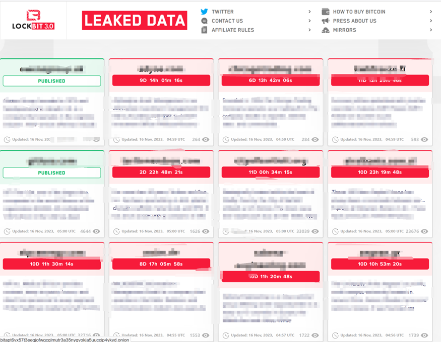

  

## 应对方案

### 01 预防

**1.1 网络配置**  

首先将企业网络划分为多个区段，根据不同的功能和敏感性级别进行隔离。这有助于限制勒索病毒横向传播，即使一个部分受到感染，也不会轻易传播到其他部分。

并且在各个局域网通信的过程中对访问权限进行限制，勒索病毒通常需要高权限进行服务的关闭，进程的关闭等操作，可将敏感性较低的主机对敏感性较高的主机的访问权限严格控制，避免其损害扩大。

此外可以在内网各网络边界使用IPS、IDS、WAF来监控和过滤网络流量，定期审查流量日志以检测异常活动，以及使用安全邮件网关来过滤和检测潜在的勒索病毒，钓鱼攻击和恶意附件。

**1.2 员工培训**

RaaS组织的附属机构会分发大量的钓鱼邮件对企业员工进行钓鱼，所以需要为员工提供定期的网络安全培训，以提高他们对勒索病毒和其他威胁的认识，让他们知道如何安全地使用企业网络。

另外，员工需要在使用的终端设备上安装终端防护软件如EDR，杀毒软件等，确保病毒库的更新以检测潜在的恶意软件。

**1.3 数据备份**

对于数据进行定期备份，可以通过不同的备份方案如增量备份，差异备份，云备份以增加存储效率或是备份速度。并且制定好勒索病毒发生时的临时处理方案和恢复方案，以防在数据被加密情况下业务的中断。

**1.4 漏洞管理**

对于持有资产进行管理，如网络设备，网络服务等，及时更新网络设备的固件版本以及服务所依赖的组件版本，以防止使用漏洞版本的软件导致被攻击。对于废弃资产（域名，云存储桶等）也需要进行管理，避免现有服务依赖于废弃资产，在废弃资产被劫持时导致攻击的产生。

### 02 止损

**2.1 中断**  

从Splunk发布的各勒索软件对98561个测试文件进行加密的测试结果可以看出，各勒索软件加密需要时间，加密完成时间平均在42分52秒，可以在勒索病毒还在加密的过程中关机，保证还存在部分未加密文件，或是提前在主机上部署蜜罐文件，当勒索软件访问到蜜罐文件，自动终止勒索软件进程，此外需要及时对感染主机进行断网，避免其横向移动影响其余的主机。

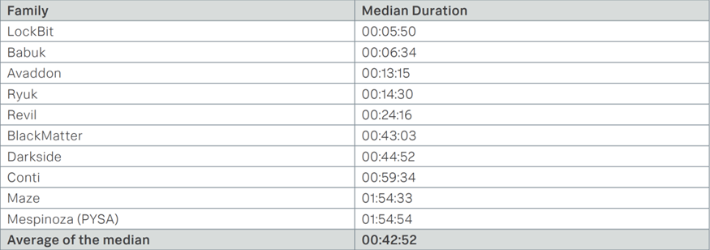

**2.2 取证**

通知网络管理员、安全团队和其他相关人员，以便能对现状进行确定，并且最后可能从感染的病毒样本上获取解密密钥。

## 恢复

**3.1 备份恢复**  

使用未受感染的备份还原系统和数据。确保备份是可靠的，并定期测试还原过程。

**3.2 确定泄露信息**

通过勒索组织的网站或是感染主机的日志确定是否存在信息被窃取的情况。

## 附录

### 样本分析

由于ICBC的样本未知，但是为Lockbit3.0，故而选择历史上的Lockbit3.0样本进行分析。此次分析样本hash为80e8defa5377018b093b5b90de0f2957f7062144c83a09a56bba1fe4eda932ce。

首先Lockbit3.0在主函数中会根据命令行参数进行解密，如果没有传入特定的密码会导致程序解密失败，阻止分析。

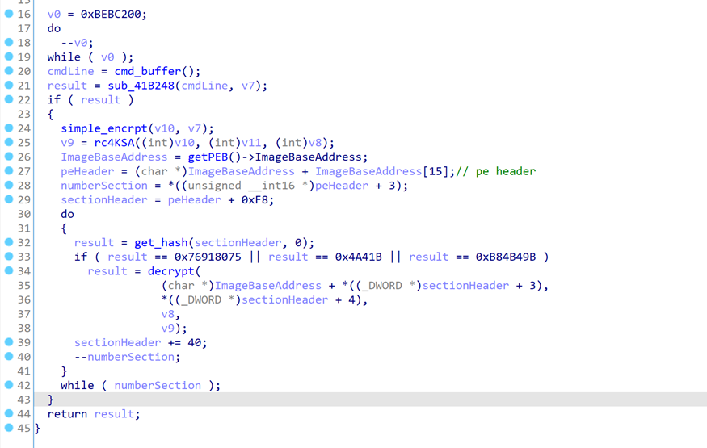

随后动态加载DLL并且将API地址填充到分配的地址中。

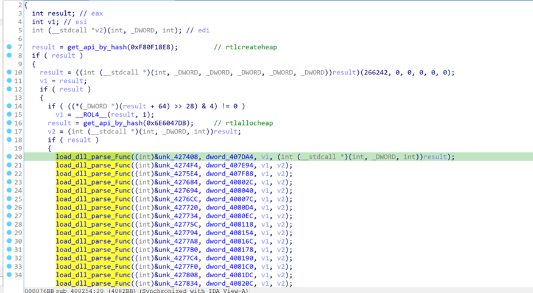

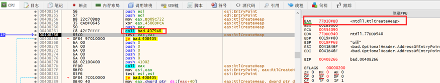

随后使用两种方式反调试

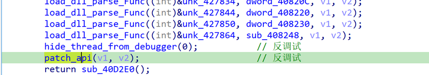

1.设置线程对调试器隐藏，导致在线程中打断点调试器会产生异常。


2.对关键API进行PATCH，绕过调试器。

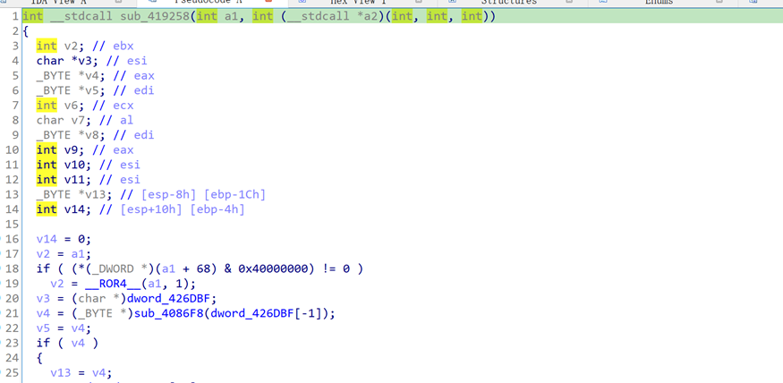

随后会读取.pdata中的配置信息，检查默认语言，管理员权限以及系统版本。

然后关闭服务和进程并删除文件阻碍文件恢复。

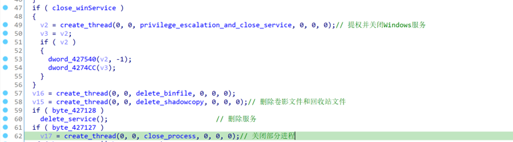

接着是多线程加密，线程数为2 \* CPU核心数 + 1。

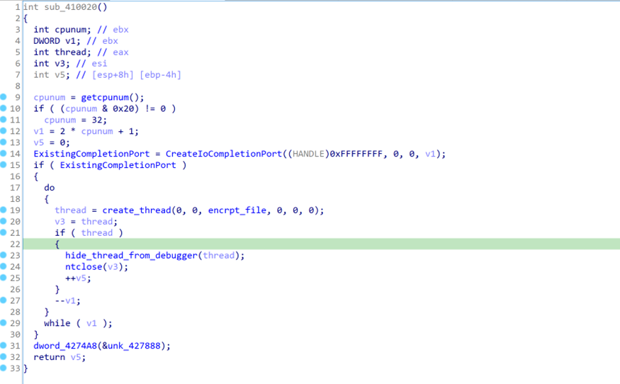

以本地磁盘上的文件加密为例，它会递归遍历整个磁盘上的文件，并且根据三步来判断当前文件是否需要加密。

1.判断文件是否为当前目录，上一级目录，系统文件，隐藏文件。

2.判断文件是否为目录。

3.判断文件是否在白名单，大小是否为0，是否为README文件。

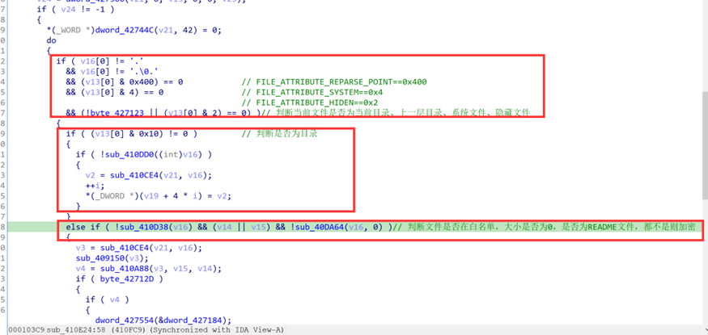

最后删除日志，替换桌面，启动新的进程删除原文件。

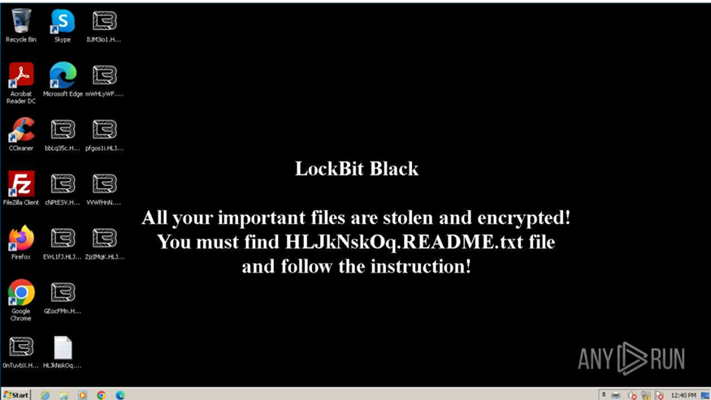