这段时间，B站的知名UP主“老师好我叫何同学”因为一则《我用36万行备忘录做了个动画…》的视频备受争议，将这名UP主再次推上了舆论的风口浪尖，视频内容主要介绍利用备忘录的功能，手动输入字符，并通过下滑功能制造动画效果，结合多部手机来协同做出惊艳的动画短片，主要目的当然还是做某款手机的软广。

说是争议其实不合适，因为这次舆论的焦点几乎是一边倒地指责何同学犯下的低级错误，因为在这则视频的原始版本的55秒处，何同学介绍说“我们专门写了一个软件，可以把预览动画里面的色块转换成字符”，作为有上千万关注者的UP主，这个说法自然会被注意到，于是很快有人发现这款所谓“专门写的软件”其实是直接用的GitHub上的开源项目：

https://github.com/vietnh1009/ASCII-generator

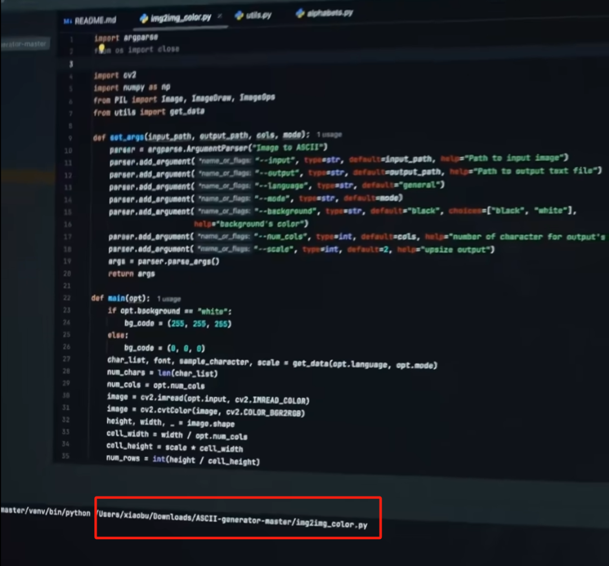

从视频57秒处的截图也可以看出，这个开源项目是直接通过Zip包下载后执行的，目录名称是ASCII-generator-master。根据GitHub的公开资料显示，这个项目的作者和维护者来自德国柏林，是德国WIGE传媒集团旗下sporttotal.tv的一名资深AI工程师。

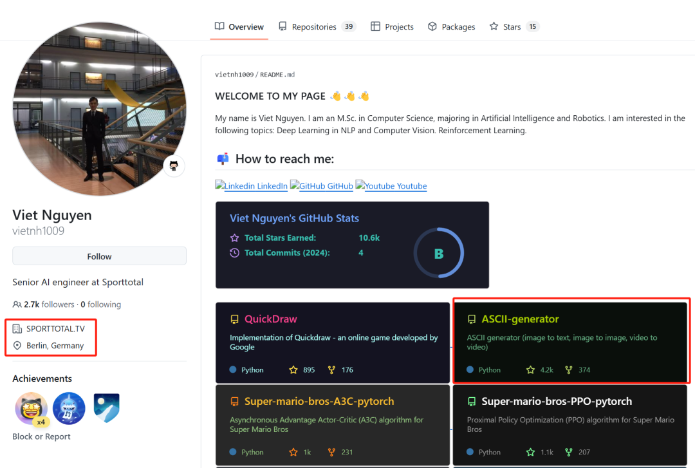

事件之后，许多人在ASCII-generator发布issues，这个原本用于反馈项目问题（建议、缺陷）的地方被当作了起哄的论坛，涌入了不少针对何同学的issues，在一些用户的提醒下，作者关闭了这些issues，这个行为类似在《黑神话 • 悟空》的steam社区中键政，在故宫的墙壁上刻上“王小娟我爱你”，在停车场里占着三个不属于自己的车位。

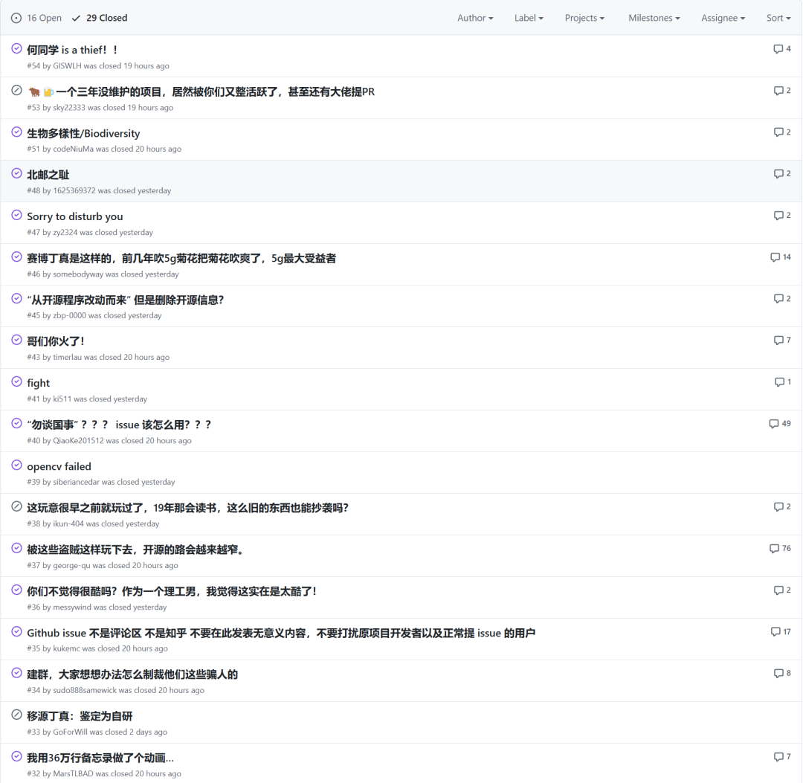

之后，何同学修正了视频内容，将55秒至60秒的旁白改成了“我们改了这个开源的软件”，并在评论区置顶中道歉说明：

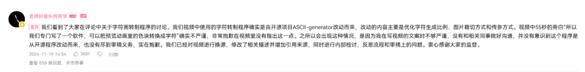

随着互联网技术的发展和开源社区的繁荣，开源软件已成为技术开发中不可或缺的一部分。然而，开源并不等于无条件自由使用，也不意味着可以忽略原创作者的权益，因此，才有了开源协议的存在。从这款开源项目声明中，也可以明显看到作者使用的是MIT开源协议，在协议文件中可以清晰的看到这个协议对于所属项目权益的声明。

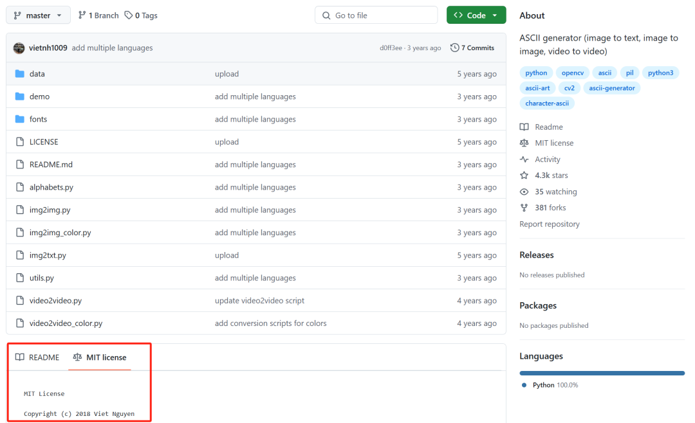

## 什么是开源协议

开源协议是开源软件的核心规则，用于规范用户在使用、修改、分发开源代码时的权利和义务。通过协议，作者可以在共享代码的同时保留自己的权益，例如要求保留版权声明，或限定代码的商业化使用方式。常见的开源协议有：

*   **MIT协议：** 最宽松的许可协议，允许自由使用、修改和分发，但需保留原作者的版权声明。
    
*   **GPL协议：** 要求修改后的代码及衍生作品必须同样开源，被称为“传染性”协议。
    
*   **Apache协议：** 提供专利授权，并限制将原作者名义用于宣传。
    
*   **BSD协议：** 类似MIT，但早期版本有广告声明要求，新版已删除。
    
开源协议既鼓励技术共享，又明确保护原创作者的权益，使开源社区的合作得以持续。总之，开源协议的目的是在保护原创作者权益的同时，促进知识共享和技术发展。

尽管开源协议为用户提供了极大的自由，但这些自由是有条件的，用户需要遵守协议中的规定。例如，有的协议要求必须标注原作者信息，有的协议对代码的商业化使用提出了具体限制。不了解这些规则可能导致使用者在无意间触犯法律或道德规范。

ASCII-generator项目使用的MIT协议是开源社区中最宽松、最常见的协议之一（也是笔者最喜欢用的开源协议）。这个开源协议的主要特点包括：

1.  **允许使用、复制、修改和分发**
    
    用户可以任意地使用代码，包括将其用于个人项目、商业项目甚至闭源软件中。
    
2.  **需要保留版权声明和许可声明**
    
    MIT协议要求在软件或其衍生作品的任何分发中保留原作者的版权声明和协议文本。这是对作者知识产权的基本尊重。
    
3.  **没有担保条款**
    
    软件“按原样”提供，作者对其不承担任何形式的担保责任。这意味着使用者需要自行评估和承担软件的风险。

需要特别说明的是，开源协议是根据开源项目作者的意愿设置的，有的开源项目可能并不会声明开源协议，比如笔者的这个项目（https://github.com/repoog/loveyou3000）：

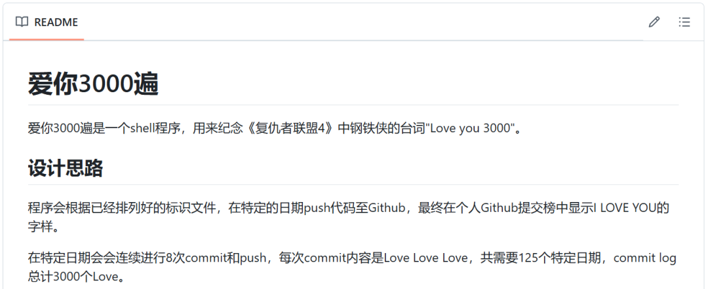

## 违反MIT协议的风险与问题

在该案例中，何同学声称代码为其原创，却未在视频中以任何一种方式提及该代码的实际来源（截至到本文发布，“老师好我叫何同学”在YouTube中发布的视频依然是原来的“我们专门写了个软件”）。

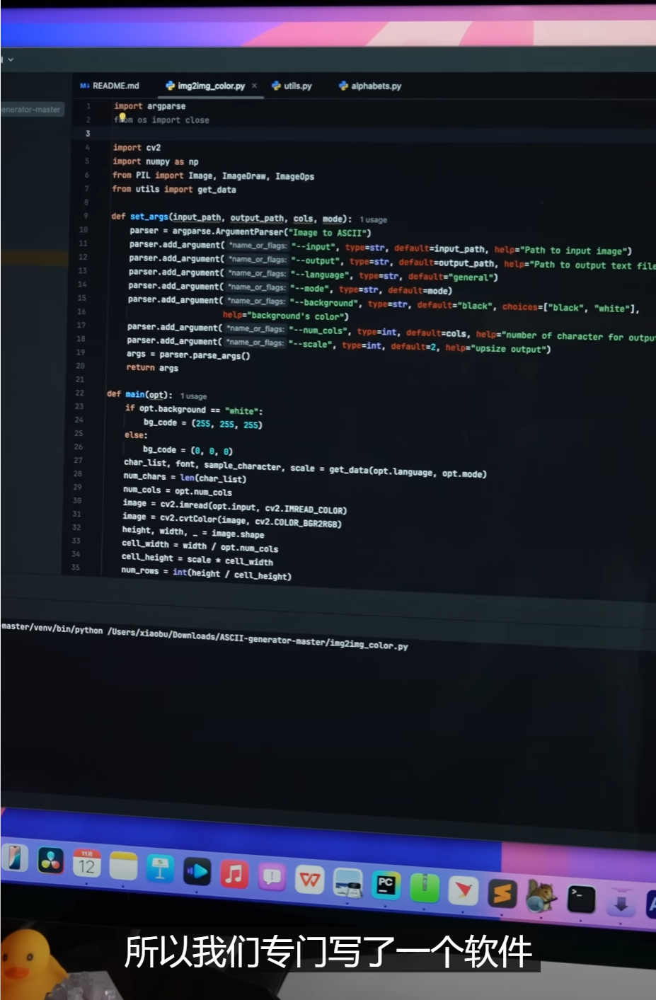

从上图中可以看到，img2img\_color.py文件开头的作者声明也被删掉了，而原文件中是这样的：

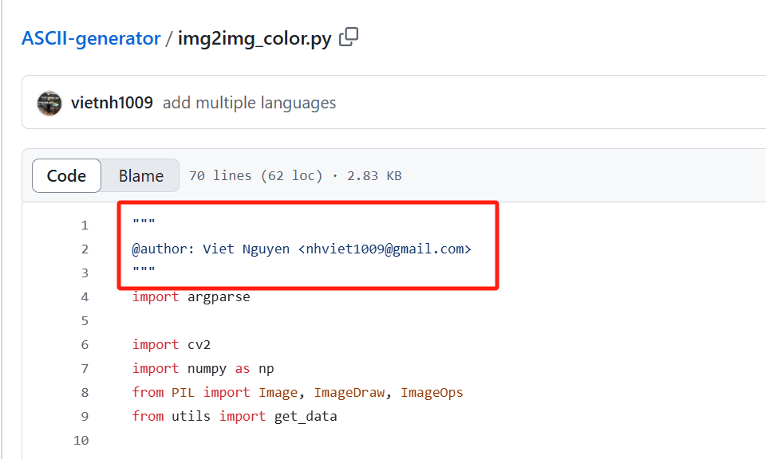

根据MIT协议的要求，虽然何同学可以使用这款开源软件并修改源代码，但是并未遵循MIT协议的要求保留原作者的版权声明。这种行为涉及以下问题：

1.  **违反MIT协议**
    
    MIT协议的核心条款之一是“保留版权声明和许可声明”，何同学将原代码中的作者声明移除，违反了MIT协议的这条核心条款，这一行为既侵犯了原创作者的权利，也损害了何同学自己的诚信。
    
2.  **未声明来源，误导观众**
    
    何同学将开源项目直接称为“原创软件”，未给予原作者应有的署名，属于不实陈述，误导了观众，同时损害了原作者的声誉。
    
3.  **潜在法律责任**
    
    违反MIT协议的行为使原创作者有理由通过法律途径要求侵权方停止使用其代码、公开致歉或索赔。
    
## 为什么要遵守开源协议

1.  **尊重原创作者的劳动成果**
    
    开源协议是原创作者与使用者之间的“契约”，使用者通过遵守协议来认可和尊重作者的劳动价值。这种尊重不仅是道德层面的义务，也是开源社区可持续发展的基石。
    
2.  **维护开源社区的健康生态**
    
    开源社区的核心在于合作与分享。如果协议频繁被忽视，开发者可能会对开源失去信心，从而转向闭源或设立更严格的使用条件。这将限制技术的传播和创新。
    
3.  **规避法律风险**
    
    尽管开源协议的维权诉讼在现实中（尤其是国内）并不多见，但这并不意味着使用者可以肆意违规。开发者完全有权利通过法律途径保护自己的权益，尤其是在代码被商业化或用于有害目的时。
    
4.  **提升个人和企业声誉**
    
    严格遵守开源协议不仅能体现个人或企业对知识产权的尊重，还能提升社会责任感与公信力。在技术圈中，这种声誉是长远发展的重要资产，何同学也是因为并非第一次做这类事，因而被人冠上“赛博丁真”的名头。

## 如何安全使用开源代码

为了避免类似案例中的问题，以下是一些安全使用开源代码的建议：

1. **阅读并理解协议条款**

在使用任何开源代码之前，仔细阅读其协议条款。确保清楚其使用条件，尤其是版权声明、修改要求和分发限制。

2. **保留原作者的版权声明**

不管协议多么宽松，保留原作者的版权声明是使用开源代码的基本要求。这通常包括在代码文件中保留许可证文本或在项目文档中注明出处。比如下图是笔者基于另一个开源项目做的修改（https://github.com/repoog/hexo-theme-apollo ），即便原作者已经将项目归档（Archive），不再继续维护。

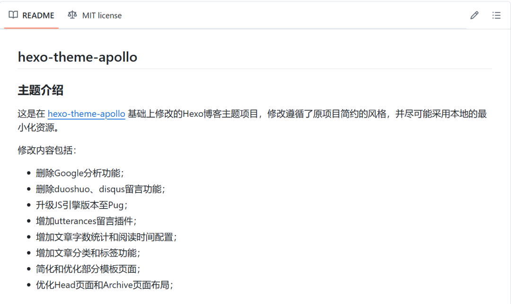

3. **避免“占为己有”**

即使对代码进行了修改或扩展，也应承认原作者的贡献，声明“基于某某项目开发”是一种良好的习惯。比如笔者早年的一个开源项目（https://github.com/repoog/ReName ）中，涉及到对于日期模块的修改，故特意在ReadMe中加以说明。

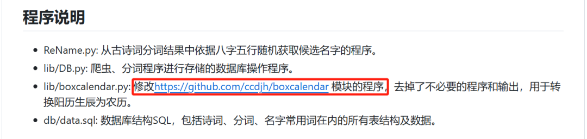

4. **使用SCA确保开源协议使用的合法性**

SCA的全称是Software Composition Analysis（软件成分分析），这类工具或产品可以帮助企业识别其软件项目中使用的开源组件，并评估这些组件的安全性、许可证合规性和质量状况，使企业能够主动管理开源组件的使用，降低安全和法律风险。正如下图所示的那样，它可以更清晰的、一目了然的看到开源协议的许可限制，图中的风险等级是无风险，主要是指商用方面的风险，可能产品方也没有预料到版权声明是如此重要。

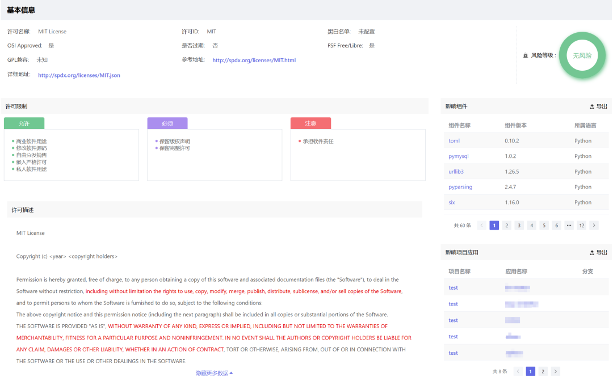

最后，笔者想说明，开源协议是技术发展中不可或缺的一部分，它在促进代码共享的同时，明确了使用者和开发者的权利与义务。这次的事情提醒我们，无论是个人还是企业，都应在使用开源代码时保持敬畏之心，遵循协议条款，就是尊重知识产权，就是尊重原作者，就是尊重开源生态和社区。

开源是一种自由，但自由绝非没有规则，只有在规则的框架内，开源精神才能真正得以弘扬与传承。