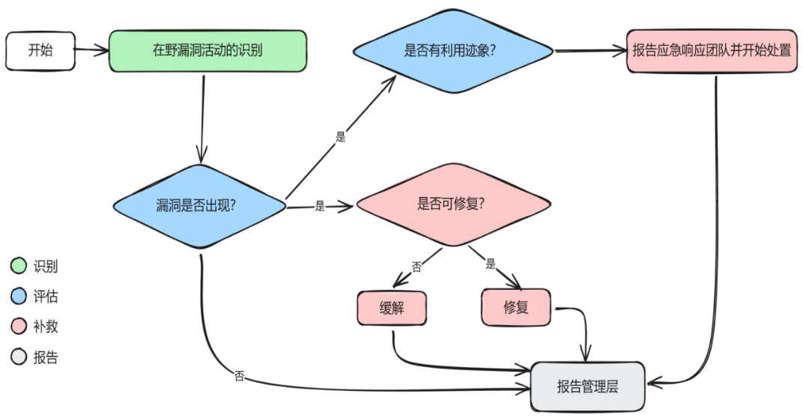

许多时候，对于负责安全工作又不太擅长安全漏洞技术的人员而言，如何应对突发漏洞是工作中主要的难点，这里的突发漏洞指的是两类：一类是通过新闻、咨询推送，被社会舆论所有关注的CVE漏洞，比如前段时间所谓的核弹级别Windows Server漏洞，一类是没有引起足够社会关注，但又在安全行业流传的0-day漏洞，但也仅限于传说，而很少有人真正见过的0-day漏洞。

本文结合美国CISA（Cybersecurity and Infrastructure Security Agency，网络安全和基础设施安全局）的漏洞应急响应手册介绍的正是上文第二类漏洞的应急流程和方法，即在野（in-the-wild）漏洞或在野0-day漏洞。

## 准备工作

有效的安全管理需要建立在有效的资产管理基础之上，在突发漏洞应急之前，日常的工作中首先需要建立和维护健全的资产管理，其中包括：

1. 机构运营的系统、网络；

2. 涉及其他机构或组织（即合作伙伴）的系统、网络；

3. 由供应商提供、托管运营的系统、网络，包括云、承包商和供应商系统。

定期的资产盘点或实时的资产监测，能够跟踪所有业务系统的网络设备、操作系统、应用程序、应用服务等信息，并以此了解漏洞与资产环境的相关性，以及漏洞对于机构系统运行的影响。

## 响应流程

标准的漏洞响应流程包括识别、评估、补救和报告漏洞四个阶段：

**识别阶段**

漏洞识别阶段的识别方法主要通过包括但不限于威胁情报来源进行判断和识别，这个阶段首先是要确认漏洞是否真实存在，需要针对信息来源进行判断和鉴别，避免虚假的漏洞信息或过时的漏洞信息。

除了威胁情报之外，漏洞信息来源还包括CVE漏洞库、国家漏洞库和漏洞预警库，以及机构内部的态势感知或SOC或SIEM监测到的可能有漏洞利用的现象。

识别阶段通过漏洞的基本信息，可以帮助确定漏洞响应接下来的应对和处置方式，这些基本信息包括漏洞的严重性、易受影响的资产信息（如软件版本、服务类型、配置情况、设备品牌及型号等等）。

如果漏洞信息与资产信息吻合，接下来则需要确定漏洞是否有存在被利用的迹象。

**评估阶段**

在漏洞的影响范围确定之后，可以通过机构的资产管理工具快速判断漏洞影响的资产范围，对于软件类或配置类的漏洞，则可能需要通过PoC进行手动扫描和评估。

同时，对于环境中确定存在脆弱点的安全漏洞，需要通过以下步骤查找漏洞被利用的迹象：

1. 扫描与漏洞利用相关的已知IOC（Indicator of Compromise），如恶意IP、文件散列值等等；

2. 监测易受攻击系统或服务相关的异常活动，包括异常访问和行为；

3. 与第三方安全公司合作。

这个阶段的目标是确认资产受到漏洞影响的状况：

一种是完全不受影响（即漏洞影响范围不涉及相关资产）；

一种是易受攻击（即系统存在漏洞，但漏洞尚未被利用）；

一种是已被利用（即系统存在漏洞，且漏洞已经被利用）。

**补救阶段**

对于第2阶段中的结果，补救阶段主要是针对易受攻击和漏洞已被利用的两种状态，在大多数情况下，补救措施都是打补丁，但在野0-day往往是没有补丁可打，在这种情况下，可以采取的缓解措施包括：

1. 限制访问；

2. 隔离易受攻击的系统、应用程序、服务、配置文件或其他资产；

3. 更改相关配置，比如最近的CVE-2024-38077漏洞更高Windows Server的RDL配置。

如果漏洞的技术细节不清楚，无法采用以上措施缓解漏洞影响，还可以采取以下办法

1. 禁用相关的服务；

2. 配置防火墙等安全设备阻断访问；

3. 增加安全监测规则持续监测漏洞利用迹象。

如果漏洞在未来有正式的补丁发布，则应该在打补丁修复后移除上述的缓解措施，以免造成不必要的资产管理影响，或成为无人记得的历史配置，以至于造成资产管理和配置的冗杂。

对于采取缓解措施的漏洞，或者打补丁的漏洞，其影响的系统根据第2阶段的漏洞状态也可以分为：

1. 已补救，补丁或配置更改已应用，系统不再存在漏洞；

2. 已缓解，采取其他补偿控制措施降低漏洞被利用的可能性；

3. 易受影响或已被利用，未采取任何措施，系统仍然存在被利用风险或已经被利用。

**报告阶段**

报告阶段的目的是为了形成漏洞应急和处置的知识体系，同时在必要的情况下，让管理层能够了解漏洞处置的状态和结果，在2017年WannaCry勒索病毒大肆感染的期间，笔者所在公司的CIO（首席信息官）便问到，这种病毒会不会对公司的员工电脑造成影响和危害，我们是怎么处置的？

以上流程能够顺利执行存在一个大的前提，即机构自身有专业的安全人员具备技术能力能够对漏洞进行基础的分析和鉴别，如果自身不具备专业的技术能力，则可以选择第三方安全公司进行合作和辅助。