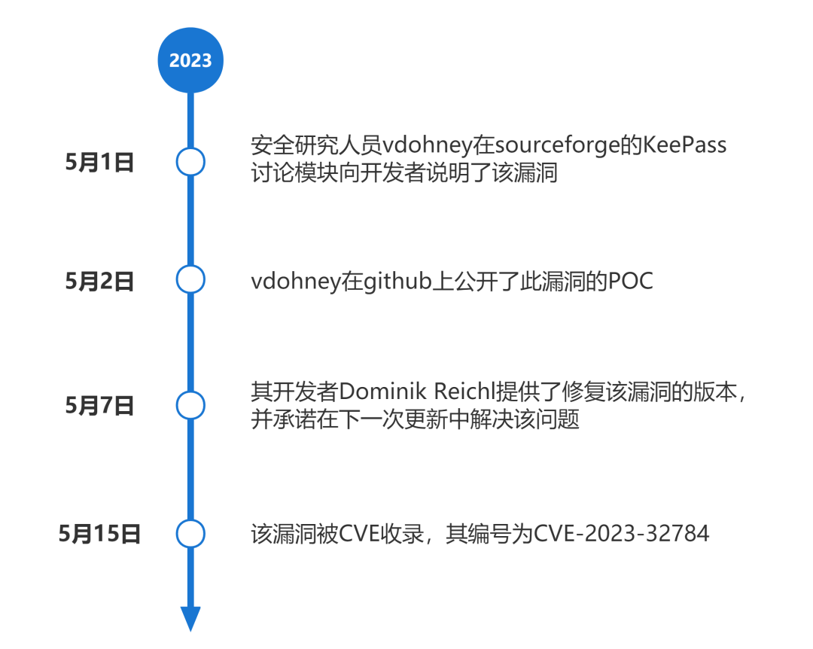
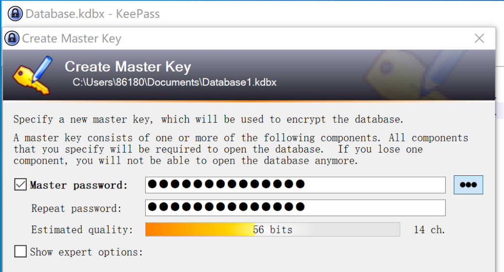
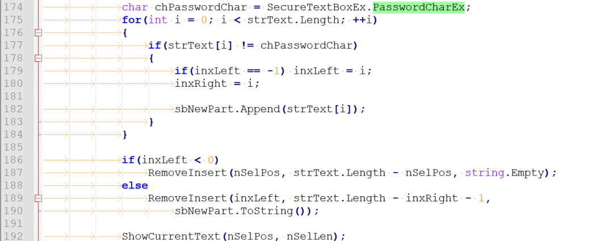
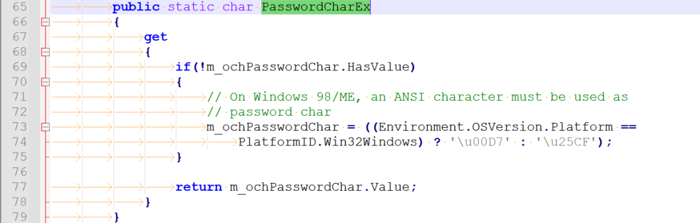
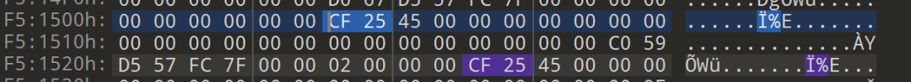
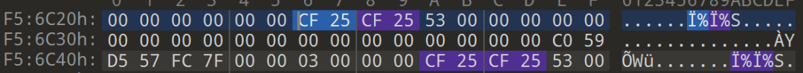
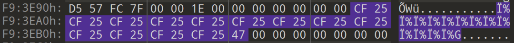
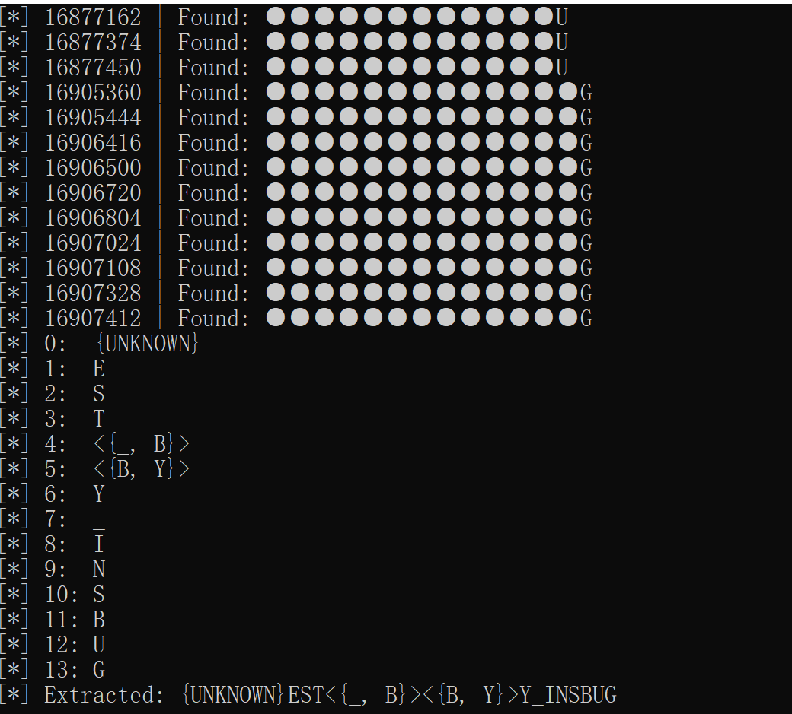

## 漏洞背景

KeePass是一款开源密码管理软件。它旨在帮助用户存储和管理他们的密码和敏感信息，以便安全地访问各种在线服务和应用程序。

KeePass提供一个安全的数据库，其中可以存储用户名、密码、网站链接、附加说明和其他自定义字段。这些信息被加密保护，并需要一个主密码或密钥文件才能解锁和访问。

## 漏洞信息

## 漏洞影响

该漏洞存在于2.54之前的KeePass2.x版本中。成因是由于KeePass文本框内容输入时，会在其进程内存中创建托管字符串，如果将其内存进行转储，则会导致主密码泄露问题。

## 漏洞分析

笔者选择KeePass2.53.1版本进行漏洞分析与验证。

首先输入了14个字符的主密码。

产生漏洞的代码在KeePass/UI/SecureTextBoxEx.cs文件中。首先在输入过程中，.NET CLR执行代码的时候，会产生托管字符串，输入的字符会以明文存储在内存中，而该字符之前输入的字符会是以chPasswordChar用来占位。

根据PasswordCharEx的定义，64位机器的占位符为\\xCF\\x25。

在输入密码后，对进程进行内存转储。笔者使用Windows任务管理器创建了该进程的转储文件。

随后使用二进制编辑器打开DMP文件。根据已知的信息搜索占位符\\xCF\\x25。如下图所示发现首先出现的是一个占位符，随后是明文字符E。

继续搜索，发现此时出现了两个占位符，随后是明文字符S。

按照上述搜索方法慢慢搜索，发现占位符从1个递增到了13个，每一串占位符后都有一个明文，如下图是13个占位符，最后的明文是G。

使用自动化分析工具发现其占位符+明文的二进制数据得出的结果为{UNKNOWN}EST<{\_, B}><{B, Y}>Y\_INSBUG。其给出了4种可能的结果，而EST\_BY\_INSBUG这个结果是笔者所输入的14位密码中的后13个字符。

综上所述，在设置主密码的文本框输入一串密码，除密码第一位无法从内存中获取外，其余的每一位字符在内存中均以占位符+明文字符的托管字符串形式存储。如果输入123，内存中能获取的托管字符串具体形式如下：

1、\\xCF\\x25\\x32

2、\\xCF\\x25\\xCF\\x25\\x33

在Mono（可以让.NET应用程序运行Linux、macOS下）平台下，KeePass2.x也可以运行，并且同样存在该问题，所以根源问题可能与.NET CLR相关。

## 修复方法

KeePass开发者对源码的修复方案如下：

1、在 Windows 上运行时，KeePass 现在调用 Windows API 函数来直接获取/设置文本框的文本，以避免创建托管字符串。对于大多数长度，“●...●?”的托管字符串不再出现在进程内存中，但对于一些长度，仍然有一个托管字符串。（可能是WindowsAPI函数也会创建一个缓冲区）

2、KeePass 现在在进程内存中创建一些虚拟片段（包含随机字符的随机片段，其长度约为当前密码的长度）。有了这个，确定正确的托管字符串应该会更加困难。

用户可通过 https://keepass.info/filepool/KeePass\_230507.zip 下载未签名的修复版本进行修复。或是等待下载开发者更新的5.24稳定版本。