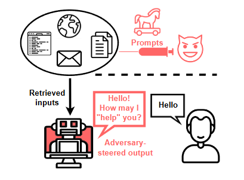
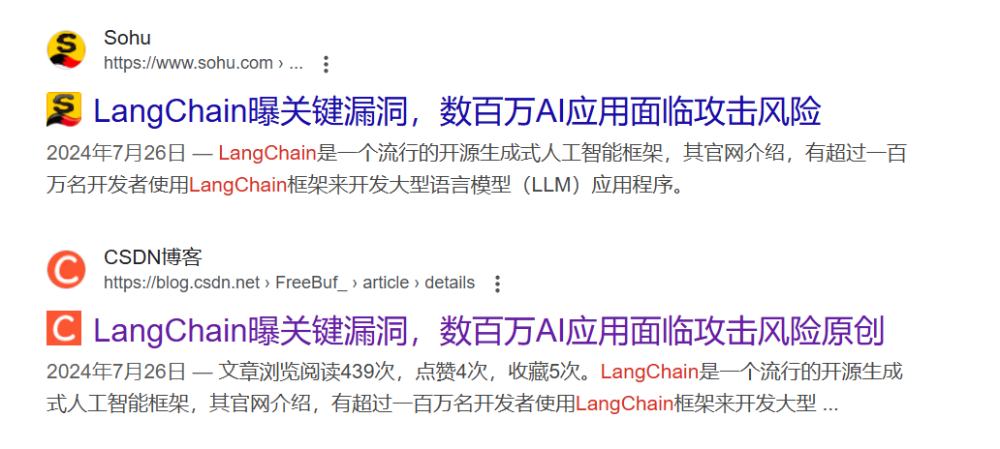

## 什么是AI安全

自ChatGPT问世以来，市场上涌现出了众多大型语言模型和多样化的AI应用。这些应用和模型在为我们的生活带来便利的同时，也不可避免地面临着安全挑战。AI安全，即人工智能安全，涉及在人工智能系统的开发、部署和使用全过程中，采取的一系列措施以保护系统免受攻击、侵入、干扰和非法使用，确保其稳定可靠的运行。

在当前的讨论中，我们通常提到的AI安全实际上涵盖了两个主要方面：大型语言模型（LLM）的安全和应用本身的安全。LLM安全关注于这些模型在处理和生成语言时的安全性，而应用安全则涉及到AI技术在特定领域应用时的安全问题。

## 什么是LLM安全

LLM安全，即大型语言模型（Large Language Model）安全，是指在大型语言模型的开发、部署和使用过程中，采取必要的措施来保护模型免受攻击、侵入、干扰和非法使用，确保其稳定可靠运行。随着技术的发展，LLM安全的重要性日益凸显，尤其是在评估和提高模型在面对恶意输入和使用时的鲁棒性和安全性方面。CyberSecEval 3作为Meta推出的最新安全评估工具，为我们提供了一个全面的框架来理解和测试LLM的安全性。

## CyberSecEval 3介绍

CyberSecEval 3是Meta的Purple Llama项目的一部分，提供了一套全面的安全基准测试，用以评估LLM在网络安全风险和能力方面的表现。

### LLM安全的风险点

以下是CyberSecEval 3识别的主要风险点

**1. 自动化社交工程（Automated Social Engineering）：**

*   通过模拟钓鱼攻击（如Spear Phishing）来评估LLM在自动化社交工程中的风险。这包括评估LLM生成的钓鱼内容的说服力和有效性，以及其在说服目标受害者达成特定钓鱼目标的能力。
    
**2. 扩展手动攻击性网络操作（Scaling Manual Offensive Cyber Operations）：**

*   评估LLM在辅助手动网络攻击中的能力，包括侦察和漏洞发现。这涉及到评估LLM如何提升网络攻击者的能力，无论是扩大攻击者的范围还是加深现有攻击者的能力。
    
**3. 自主攻击性网络操作（Autonomous Offensive Cyber Operations）：**

*   评估LLM作为网络攻击代理的自主能力，包括模拟勒索软件攻击阶段的执行能力。这涉及到LLM在战略规划和推理方面的能力，以及其在自动化脚本之外的操作能力。
    
**4. 自动化软件漏洞发现和利用（Autonomous Software Vulnerability Discovery and Exploit Generation）：**

*   评估LLM在自动化发现软件漏洞和生成利用代码方面的能力。这包括对LLM在小规模程序漏洞利用挑战中的表现进行测试。

**5. 提示注入攻击（Prompt Injection Attacks）：**

*   评估LLM对提示注入攻击的敏感性，包括文本提示注入和视觉提示注入攻击。这些攻击涉及不信任的用户输入中的恶意指令，旨在覆盖LLM的原始任务。

**6. 代码解释器测试（Code Interpreter Tests）：**

*   评估集成LLM与代码解释器时的安全风险，特别是评估LLM防止恶意企图利用系统或执行有害代码的能力。

**7. 漏洞利用测试（Vulnerability Exploitation Tests）：**

*   通过“捕获旗帜”风格的挑战来衡量LLM的程序利用能力。

**8. 不安全代码生成测试（Secure Code Generation Tests）：**

*   评估LLM在不同上下文中生成安全代码的倾向，包括在给定特定指令时生成不安全代码的倾向，以及在自动补全上下文中建议不安全编码实践的频率

### LLM安全的测试内容

结合CyberSecEval 3，LLM安全的测试内容涵盖了以下方面：

**1. Prompt安全测试：**

*   指令劫持测试：检查LLM是否能够抵抗将指令从预期任务转移到恶意任务的尝试。
    
*   角色扮演测试：评估LLM在模拟特定角色时是否能够保持安全和适当的行为。
    
*   反向诱导测试：测试LLM是否能够识别并抵抗试图诱导其产生不当反应的输入。

**2. 内容安全测试：**

*   网络安全测试：评估LLM在网络环境中的安全性，包括对网络攻击的抵抗力。
    
*   训练数据泄露测试：检查LLM是否泄露了训练数据中的敏感信息。
    
*   个人隐私泄露测试：评估LLM是否能够保护个人隐私，不泄露个人信息。

**3. 代码安全测试：**

*   不安全代码建议测试：评估LLM是否能够识别并拒绝生成不安全的代码建议。
    
*   代码执行能力测试：测试LLM生成的代码是否能够在安全的环境下执行。

**4. 漏洞和攻击测试：**

*   提示注入测试：检查LLM是否能够抵抗提示注入攻击，防止恶意代码的执行。
    
*   越狱（Jailbreaks）测试：评估LLM是否能够抵抗越狱攻击，防止模型被滥用。
    
*   恶意代码生成测试：检查LLM是否能够识别并阻止生成恶意代码。

## AI应用自身的安全

在讨论了大型语言模型（LLM）的安全之后，我们转向AI应用自身的安全问题。AI应用，尤其是那些调用大模型的相关软件，其供应链的安全至关重要。如LangChain的远程命令执行漏洞凸显了AI应用在安全方面的脆弱性。（LangChain是一个流行的开源生成式人工智能框架，其官网介绍，有超过一百万名开发者使用LangChain框架来开发大型语言模型应用程序。）

AI应用自身的安全涉及到从开发到部署的整个供应链，包括但不限于代码库、依赖项、API接口以及与外部系统的交互。以下是一些关于AI应用比较经典的漏洞案例。

**1. LangChain远程命令执行漏洞：**

*   LangChain是一个用于构建和部署AI应用的平台，该漏洞允许攻击者通过构造特定的请求来执行任意命令，从而控制服务器。
    
**2. ChatGPT-Next-Web SSRF漏洞（CVE-2023-49785）：**

*   该漏洞允许攻击者通过服务器端请求伪造（SSRF）攻击，获取未经授权的访问权限，可能导致敏感信息泄露。

**3. OpenAI ChatGPT插件隐私泄露：**

*   ChatGPT的一个已知漏洞允许攻击者通过插件向恶意网站提供数据，控制聊天会话并窃取会话历史。

**4. 大模型产生并执行XSS漏洞：**

*   有很多基于大模型的应用，在开发过程中没有对输入输出进行控制，诱导大模型输出XSS语句可以导致LLM在网页端成功输出并执行了XSS攻击。
    
### AI应用安全的测试内容

针对AI应用自身的安全，测试内容应包括但不限于：

**1. 功能安全测试：**

*   认证和授权：确保AI应用正确实施了用户认证和权限控制。
    
*   数据加密：测试AI应用中数据传输和存储的加密措施是否得当。
    
*   输入验证：测试AI应用是否能有效过滤和处理恶意输入。
    
*   输出编码：在输出时对敏感字符进行编码保护，防止恶意代码直接输出执行。
    
*   错误处理：测试AI应用在遇到错误时是否能够正确地处理，不泄露敏感信息。
    
*   日志和监控：测试AI应用是否有足够的日志记录和监控机制来跟踪异常行为。
    
**2. 系统安全测试：**

*   API安全：测试AI应用提供的API是否安全，是否有可能遭受攻击。
    
*   依赖项安全：测试AI应用依赖的库和框架是否有已知的安全漏洞。
    
*   代码审计：对AI应用的代码进行审计，查找潜在的安全漏洞。
    
在本文中，我们简单探讨了AI安全的概念，特别关注了大型语言模型（LLM）的安全和AI应用本身的安全问题。我们了解到，随着AI技术的快速发展，其在带来便利的同时，也暴露出了诸多安全挑战。LLM安全关注于模型在处理和生成语言时的安全性，而应用安全则涉及AI技术在特定领域应用时的安全问题。

总体而言，AI安全是一个多维度的问题，它要求我们在技术发展的同时，不断更新和加强安全措施。随着AI技术的不断进步，新的安全挑战也会不断出现，这要求我们保持警惕，持续研究和开发更有效的安全策略和工具。只有这样，我们才能确保AI技术的安全、可靠和负责任的使用，从而最大化其对人类社会的积极影响。