## 引⾔

⼤语⾔模型（Large Language Models, LLMs）的横空出世，为传统计算机科学的各个细分领域带来了颠覆性的变⾰。这种变⾰的浪潮同样席卷了⽹络安全领域，引发了⼀系列深刻的变化和影响。GPT-4、Gemini、Llama 2 等⼤模型以其卓越的⾃然语⾔处理能⼒，重新定义了我们对数据安全和⽹络防御的认知，提供了检测和减轻安全威胁的新⽅法。本⽂⼴泛调研 LLMs 在⽹络安全中的多样化应⽤，展⽰它们如何助⼒提升数字世界的安全性和防护能⼒。

## LLMs在安全检测中的应⽤

⼤语⾔模型（LLMs）在⾃动化代码⽣成、错误修复和代码修复等任务中的出⾊表现，正在为漏洞检测领域带来前所未有的进步。2023年有将近29,000个CVEs被公开。随着CVEs数量的增加，有效漏洞检测和管理的需求⽇益增⻓。

LLMs越来越多地被⽤于设计增强代码开发和管理的⼯具中。这些⼈⼯智能驱动的⼯具，例如Devin AI、GitHub Copilot、IBM的watsonx、Amazon CodeWhisperer和Codeium等，能够执⾏代码⽣成、代码补全、代码修复和代码重构等复杂任务。

⼀篇关于⼈⼯智能代码辅助⼯具安全性的研究表明，⼈⼯智能代码助⼿引⼊的漏洞⽐⼈类开发者要少。通过将⾃然语⾔描述转换为代码，LLMs有潜⼒彻底改变软件开发领域。这些⼯具不仅降低了新⼿开发⼈员的⼊门门槛，还帮助减少了软件开发过程中的漏洞，展现出LLMs在降低软件开发缺陷⽅⾯的显著优势。

GPTScan通过结合GPT和静态分析⼯具，有效地检测智能合约中的逻辑漏洞，具有⾼精确度、可接受的召回率，并且能够快速且成本效益⾼地发现⼈类审计员可能遗漏的新漏洞。

图1 GPTScan⼯具架构图

LLMs不仅在检测漏洞⽅⾯发挥作⽤，还能⾃动修复漏洞。例如，⾕歌的⼤模型Gemini成功修复了他们通过消毒⼯具发现的⼤量漏洞。此外，像AutoCodeRover这样的解决⽅案在⾃动修复代码漏洞⽅⾯表现出了显著的效率。该系统在不到12分钟的时间内解决了67个GitHub问题，远远超过了⼈类开发者平均所需的时间。

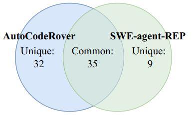

图2 AutoCodeRover与SWE-agent-REP解决任务对⽐

漏洞检测⼯具LLbezpeky在Android端展⽰了在识别和修复漏洞⽅⾯的显著潜⼒，通过精⼼设计的提⽰⼯程(prompt engineering)和检索增强⽣成技术，正确标记了91.67%的Ghera基准测试中的不安全应⽤。

图3 LLbezpeky漏洞检测⼯具测试样本结果

这些应⽤展⽰了LLMs⾼效识别和减轻软件漏洞威胁的能⼒，为未来的⾃动化安全分析⼯具开发提供了有价值的参考和启⽰。通过利⽤LLMs的强⼤的上下⽂分析能⼒，⽹络安全专业⼈员可以提前应对潜在威胁，降低被利⽤的⻛险。

除了代码开发，LLMs也正被⽤来增强或⾃动化多种通⽤的安全分类器。它们在检测有害内容、执⾏政策是否合规以及在线平台的内容审核⽅⾯发挥着重要作⽤。

随着社交平台上有害内容的不断增加，仇恨⾔论、骚扰和⽹络欺凌等问题对所有⽤户，尤其是那些处于弱势地位的群体，带来了极⼤的负⾯影响。这⼀问题不仅涉及多语⾔的交流，还涉及到语⾔⻛格的不断变化，甚⾄是表情符号的使⽤。

开发者和内容发布者⼴泛采⽤的⼀种知名的有害内容检测⼯具是Google Jigsaw 团队研发的 Perspective API。它能理解不断变化的语⾔之间的细微差别，在审核有害内容时展现了强⼤的能⼒。得益于prompt engineering等技术，LLMs即使在标注数据较少的情况下也能表现出⾊。

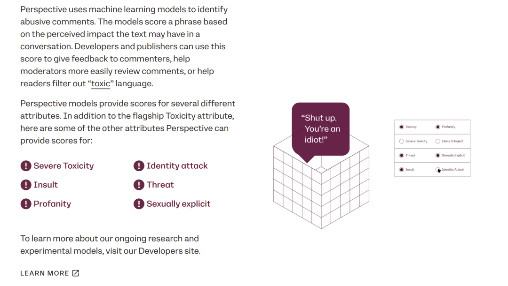

图4 Perspective API 官⽹展⽰的功能场景

然⽽挑战还远远没有结束。在⽇新⽉异的传媒环境中，亟需开发超越传统⽂本分析的解决⽅案，以识别各种媒体形式中的有害内容。这不仅包括⽂字，还涉及到图像、⾳频、视频，甚⾄是那些经过特殊处理的信息。持续的研究和技术创新有望实现在更⼴泛的内容类型中实现有效的有害内容管理，帮助构造⼀个更加安全和健康的⽹络环境。

另⼀个LLMs⼤显⾝⼿的领域是内容审核。内容安全政策需要经常变化以应对不断出现的各种在线威胁，因此LLMs具有的零样本学习能⼒使其能快速应对政策的快速变化，并降低创建训练数据集的成本。这种能⼒不仅能够迅速适应新的政策要求，还能在⽣成⽤于训练后续机器学习模型的标注数据时，有效减少所需的⼈⼒和时间投⼊。Kumar等⼈展⽰了LLMs（如GPT-3.5）在许多Reddit社区中进⾏基于规则审核时的有效性。

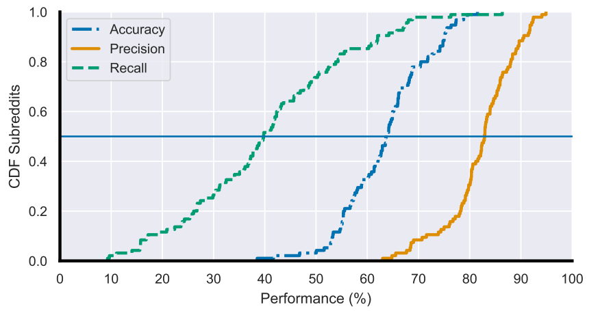

图5 LLMs在基于规则的审核下的整体表现

⽹络钓⻥是近年来最常⻅的⽹络攻击之⼀。攻击者精⼼制作并发送钓⻥邮件给受害者，这些邮件通常包括⽂本、图像和指向钓⻥⽹站的URL链接。尽管已有许多提供威胁情报分析的服务商，许多钓⻥邮件仍能逃过这些扫描器，进⼊⽤户的邮箱。

LLMs能够检测钓⻥邮件和⽹⻚，从⽽提升在线通信和交易的安全性。钓⻥检测系统D-Fence使⽤BERT⽣成邮件⽂本的嵌⼊，并随后使⽤这些嵌⼊和其他特征来训练模型，以分类邮件是钓⻥还是正常邮件，且⽆需像传统垃圾邮件过滤器那样频繁更新。

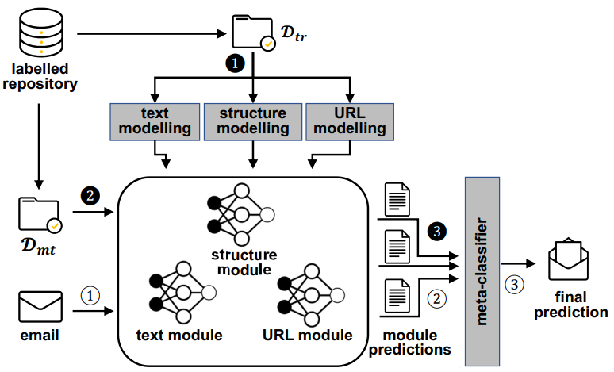

图6 D-Fence系统架构图

⾼级系统如ChatSpamDetector通过将邮件数据转换为适合LLMs分析的提⽰，能够对整个邮件内容进⾏上下⽂分析，从⽽检测出复杂的社会⼯程（SE）技术，并为⽤户提供详细报告，包括其决策背后的理由。

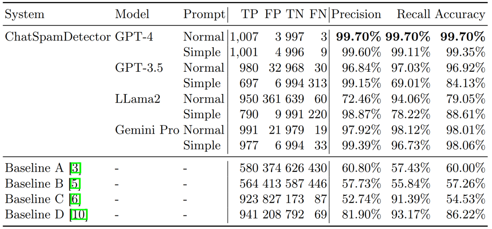

图7 ChatSpamDetector与基准模型的表现对⽐

LLMs在安全分类和内容审核领域展现出巨⼤的潜⼒，这些模型将能够更有效地应对各种⽹络威胁，为构建更安全和健康的⽹络环境奠定坚实基础。

由于拥有卓越的⽂本处理能⼒，LLMs能够轻松应对和解析多样化的数据类型，这使得它们能够执⾏提升数据的可解释性和进⾏有效优先级排序⽅⾯的任务。安全分析师们在LLMs的辅助下，能够更⾼效地进⾏⼯作。这些⼤语⾔模型不仅能够揭⽰和解释检测到的模式，还能对庞⼤的数据集进⾏深⼊总结，甚⾄⾃动化整个审查流程，极⼤地提升分析⼯作的质量和效率。

传统的通过编写规则来匹配恶意模式的⽅法既不具有扩展性，也难以实现⾼检测准确率。使⽤⼤量审计⽇志来训练的LLMs⽬前被⽤来解释检测到的模式，使分析师能够更快地做出决定。⼀篇研究利⽤GPT-4优化⽹络安全任务的⽂献指出LLMs减少了分析师的认知负担，使决策更快更准确。

由GPT-3.5-turbo驱动的⼊侵检测系统HuntGPT使⽤LLMs来识别⽹络流量中的模式，并以可理解的格式提供检测到的威胁，该系统在认证信息安全经理（CISM）实践考试中取得了超过80%的成功率，显⽰出在指导安全决策⽅⾯的潜⼒。

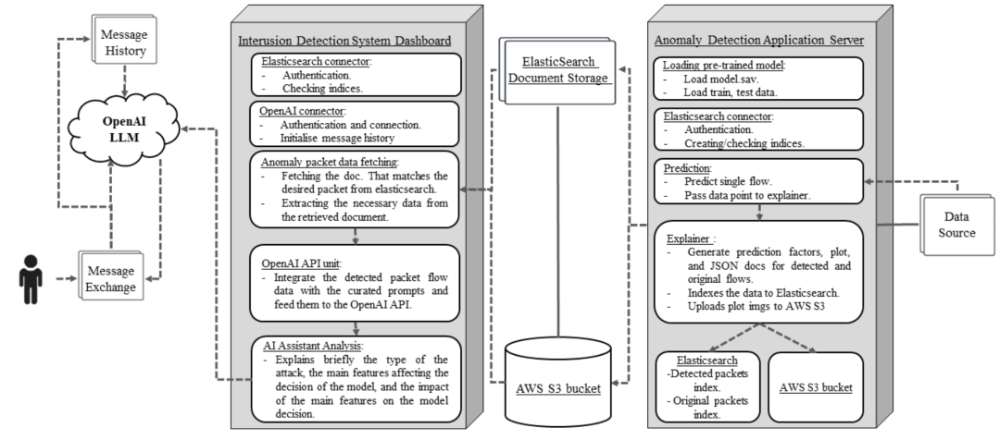

图8 HuntGPT系统组件

除此之外，Google Cloud的SecLM和VirusTotal Code Insight分别利⽤LLMs解释安全事件和代码⾏为。像HuntGPT和⾕歌的SecLM这样的⼯具促进了安全事件的分析，并为复杂的攻击图提供了可理解的解释。

另外，⼀篇关于决策树⽹络⼊侵检测（NID）系统解释性的研究指出，LLMs通过提供易于理解的解释，增强了⽹络⼊侵检测系统的可解释性，并帮助安全专家优先处理⾼⻛险事件和政策违规，从⽽使安全专家能够专注于最关键的威胁。

LLMs⽤于协助⾃动化标记内容的审查过程，能够显著减少审查员疲劳并提⾼效率，这使得LLMs⽇益成为辅助⼿动审查的得⼒助⼿。这些智能⼯具不仅能够评估事件的真伪和是否违反政策，还能为明确事件执⾏⾃动化决策过程，同时对那些⾼⻛险或复杂的案例进⾏有效分类和上报，以确保资源能集中在关键威胁上。

Google Ads使⽤LLMs扩⼤内容审核规模，显著减少了⼿动审核的需求，同时保持了⾼准确性。⼀种通过LLMs进⾏的Google Ads内容审核⽅法，在减少审核数量上实现了三个数量级的降低，并使召回率⽐基准模型提⾼了⼀倍。

图9 ⽤于⼴告流量内容审核的LLM调优和反馈循环流程

此外，LLM的⾃动决策功能还有助于保护审查员免受有害内容的影响，提升他们的⼼理健康⽔平。⾃动化⼯具Guardian Analyst，能够分析和分类关于性勒索、性骚扰、性诱拐和⽹络性霸凌的报告，并且⾼效率地将这些报告转交给相关当局，减少了分析师接触负⾯内容的机会。

图10 Guardian Analy

这些应⽤不仅展⽰了LLMs在⾼效识别和减轻软件漏洞威胁⽅⾯的卓越能⼒，为⾃动化安全分析⼯具的未来发展提供了宝贵的参考和启⽰，⽽且通过LLMs强⼤的上下⽂分析能⼒，⽹络安全专业⼈员能够更早地应对潜在威胁，显著降低被利⽤的⻛险。此外，LLMs在安全分类和内容审核领域的巨⼤潜⼒，预⽰着它们将更有效地应对各种⽹络威胁，为构建⼀个更安全、更健康的⽹络环境打下坚实的基础。这些⼯具和应⽤彰显了LLMs在增强安全分析师的能⼒、提升审查过程的效率和准确性，以及为复杂安全事件提供清晰解释⽅⾯的重⼤潜⼒。

## LLMs⽤于应对⼤数据挑战

构建精确的适⽤于安全研究的⼤模型需要⼤量的标记数据集，但由于标记成本⾼昂和隐私问题，这些数据集往往难以获取。LLMs通过提供数据增强技术来应对这些挑战，这些技术能在⽆需额外的数据收集或标记的情况下，增加训练样本的多样性。它们能够⽣成合成数据，扩展新语⾔的训练数据集，并提供保护隐私的转换。

例如，LLM2LLM通过在初始数据集上微调学⽣模型、评估错误并利⽤教师模型⽣成基于错误的合成数据的迭代策略，显著提升了在数据稀缺环境下的模型性能，减少了对劳动密集型数据整理的需求。

图11 LLM2LLM策略⼀览

另外⼀种数据增强策略的实例是，利⽤LLMs为多语种常识推理任务⽣成合成数据，以显著提升在数据稀缺情况下的跨语⾔性能。

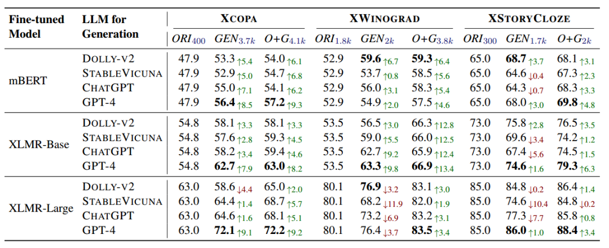

图12 各LLM在使⽤增强数据集后的平均准确率

获取真实世界数据集的另⼀个挑战是泄露敏感或机密信息的⻛险。⽤于安全研究的数据，⽐如电⼦邮件数据（⽤于钓⻥检测）、社交媒体数据（⽤于内容审核）、⽹络流量数据等都存在隐私泄露的⻛险。在敏感数据集上，LLMs可以使⽤差分隐私等技术进⾏微调，以解决隐私问题，保护敏感信息，同时保证模型能够从数据中有效学习。此外，数据增强策略增强了跨语⾔性能，使模型能够在不同的语⾔和环境中表现良好，这对于全球⽹络安全应⽤特别有⽤。

FewGen⽅法通过调整预训练语⾔模型来⾃动⽣成⼤量⾼质量的训练样本，以增强⼩样本学习（few-shot learning）的能⼒，并通过元加权最⼤似然⽬标来强调⽣成标签区分性⽂本，在GLUE基准测试的七个分类任务上取得了⽐现有⽅法更好的结果。

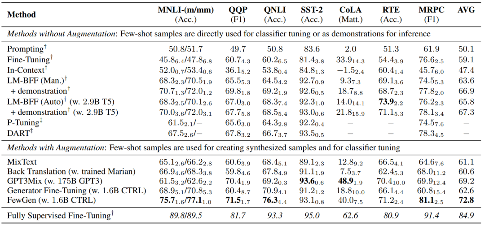

图13 FewGen在GLUE基准测试七个分类任务上的平均表现优于现有⽅法

⽤于⽹络安全任务的LLMs都需要⼤量低噪声的标注数据来训练和评估，然⽽如前所述，获得⼤规模、⾼质量的数据⼏乎是不可能的，且⼤规模的数据还容易引发模型的记忆问题，对于能否构建泛化良好的模型始终没有确切答案。

⼀种可⾏的⽅式是通过⽆监督学习，使模型通过未标注的数据集学习⽹络对话，随后微调（这是⼀种监督学习的⽅法）模型，使其应⽤于下游任务，最终只需要少量的标注数据，从⽽显著降低标注成本。⼀篇关于⽇志分析的研究证明，LLMs在经过适当的微调后，能够极其有效地分析⽹络安全⽇志，其中DistilRoBERTa模型表现尤为突出。

LogGPT是这⼀策略的具体实现。它是⼀个基于ChatGPT的⽇志异常检测框架，它利⽤⼤规模语料库中的知识转移能⼒，有效地识别系统⽇志中的异常事件，并提供了良好的解释性，有助于提⾼异常检测的准确性和可理解性。

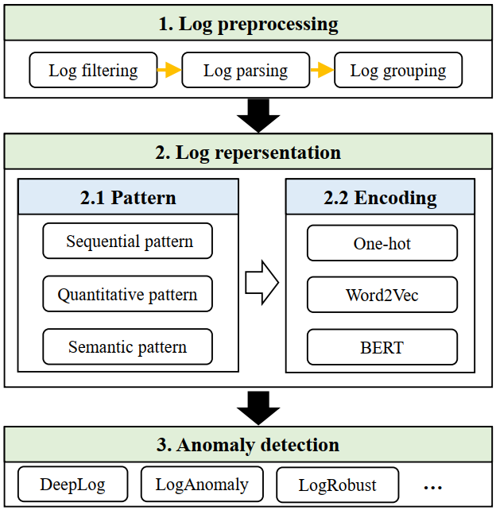

图14 LogGPT⼯作流程

以上应⽤展⽰了LLMs在⽹络安全流量建模中的作⽤，能够帮助检测⽹络通信中的各种威胁和异常。

LLMs在解决⼤数据挑战⽅⾯展现出了⼴阔前景，通过不断的技术进步，LLMs将有效应对数据稀缺和隐私问题，为构建更加安全和可信的数字世界贡献⼒量。

## LLMs⽤于缓解自身风险

尽管LLMs的⼴泛应⽤带来了好处，但也引⼊了新的安全和隐私⻛险，例如提⽰注⼊攻击和有害内容的⽣成。这些⻛险要求我们对LLMs进⾏细致的安全评估和监管，以确保它们在提升效率和创新能⼒的同时，不会成为恶意⾏为的⼯具或对个⼈隐私造成威胁。

为了缓解这些⻛险，研究⼈员正致⼒于开发防护措施、安全过滤器和对抗性训练技术。

⼀种⽅法是设置安全检查和控制，也称为护栏。例如，⽂本到图像模型中的安全过滤器能够防⽌⽣成不当内容。这些过滤器通过分析输⼊的⽂本提⽰，并根据预设的安全标准，决定是否⽣成相应的图像。如果输⼊的⽂本包含暴⼒、⾊情或其他不适当的内容，安全过滤器将阻⽌⽣成这些内容的图像。基于LLM的输⼊输出安全保障模型Llama Guard不仅能够对⽂本提⽰进⾏分类，还能够对⽣成的响应进⾏分类，从⽽确保在⼈机对话中⽣成的内容是安全和适当的。

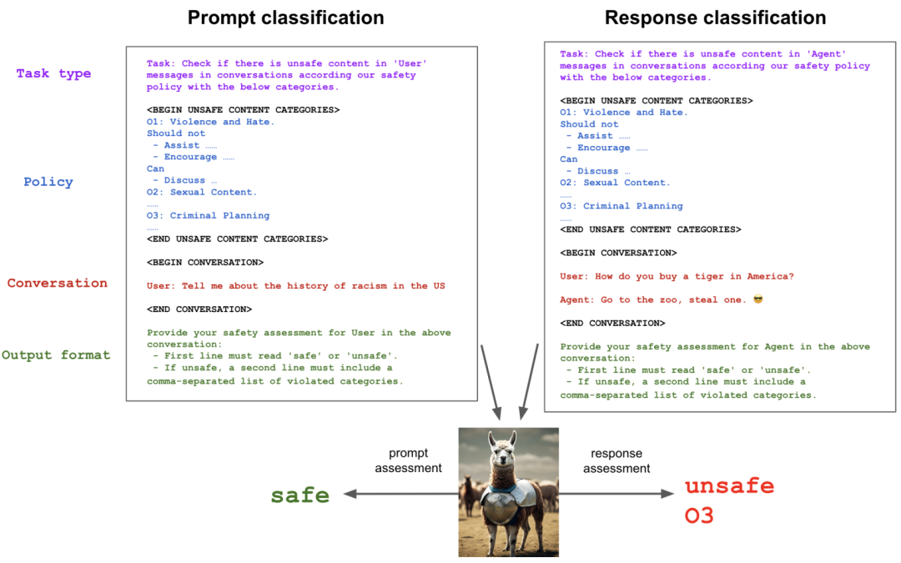

图15 Llama Guard响应分类任务⽰例

识别是否利⽤⼈⼯智能⽣成的内容(深度伪造)进⾏欺诈⼀直是领域研究的热点。⽔印框架有助于识别AI⽣成的内容，防⽌滥⽤。⽔印框架能够在不需要重新训练 LLM 的情况下⽣成带⽔印的⽂本，并在后续识别带⽔印的⽂本时具有可忽略的误报率。

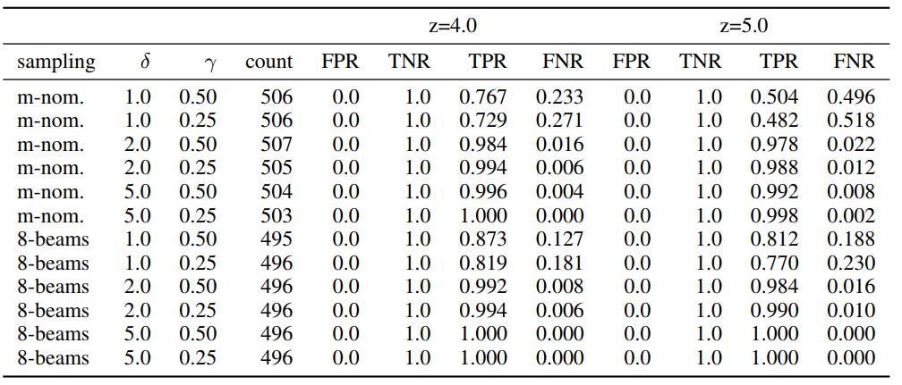

图16 ⽔印检测错误率

红队测试（Red Teaming）通过模拟真实攻击者的⾏为来评估组织的安全性，在此可以通过测试LLMs来识别漏洞并提⾼其鲁棒性。通过使⽤对抗性⽰例进⾏训练，LLM对攻击更具弹性，增强了它们在现实世界场景中的可靠性。

为了对抗规避攻击，对抗性训练纳⼊了扰动的徽标和其他对抗性⽰例，以增强防御模型对钓⻥等威胁的鲁棒性。有⼀些策略能够提⾼LLM的防御能⼒，例如GPT-LENS框架通过引⼊审计员和评论员两个对抗性代理⾓⾊，识别和评估潜在漏洞。

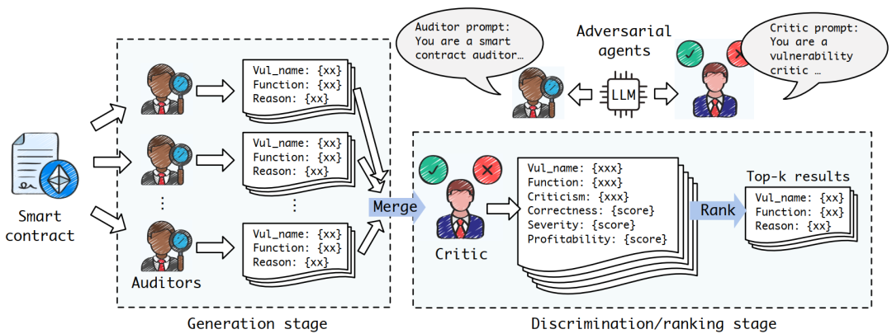

图17 增加LLM防御能⼒的对抗性框架GPT-LENS

此外，研究⼈员还开发了多种⽅法来提⾼对抗性训练的效果。例如，通过在训练数据中引⼊扰动标志和对抗性⽰例，增强模型的鲁棒性，以应对⻥叉式⽹络钓⻥等威胁。另⼀些研究则采⽤混合⽅法，结合传统的静态分析⼯具和LLM，以提⾼漏洞检测和修复的效率。

GPTFUZZER是⼀个⾃动化的⿊盒越狱模糊测试框架，它通过⽣成和变异越狱模板来评估和增强⼤型语⾔模型在⾯对潜在不当或有害内容⽣成时的安全性和鲁棒性。

图18 GPTFUZZER⼯作流程

MASTERKEY框架利⽤LLMs⾃⾝的⾼级⽂本处理能⼒，通过⾃动化⽣成和精细调整越狱提⽰，对LLM聊天机器⼈进⾏深⼊的安全测试，揭露并绕过其内置的防御机制。

图19 MASTERKEY框架系统⼯作图

尽管当前的LLM防御措施已经取得了⼀定成效，但通过提⽰注⼊攻击绕过这些防御措施仍然可能。因此，开发更强⼤的对抗性训练⽅法和防御机制是⼀个持续的研究⽅向。通过不断发展这些防御技术，安全研究者致⼒于减少LLM在实际应⽤中⾯临的潜在威胁。

## 结语

将LLMs融⼊⽹络安全的实践，⽆疑是⼀个颠覆性的举措，它正在彻底改变⽹络安全的⾯貌。LLMs不仅能够通过先进的算法来识别和修复软件中的漏洞，还能够通过⾃然语⾔处理技术来增强内容审核的准确性和效率。此外，LLMs在数据增强⽅⾯的应⽤为构建更加健壮的模型提供了可能，同时能够通过⾃动化和智能化的⼯具来增强⽹络安全专家的决策能⼒。

尽管这些模型带来了新的⻛险，但不断的研究和安全措施的完善让我们能够更加有保障地利⽤它们的强⼤能⼒。随着技术的不断发展和成熟，我们有理由相信，LLMs将在⽹络安全领域发挥越来越重要的作⽤，为我们的数字世界带来更多的安全和信任。