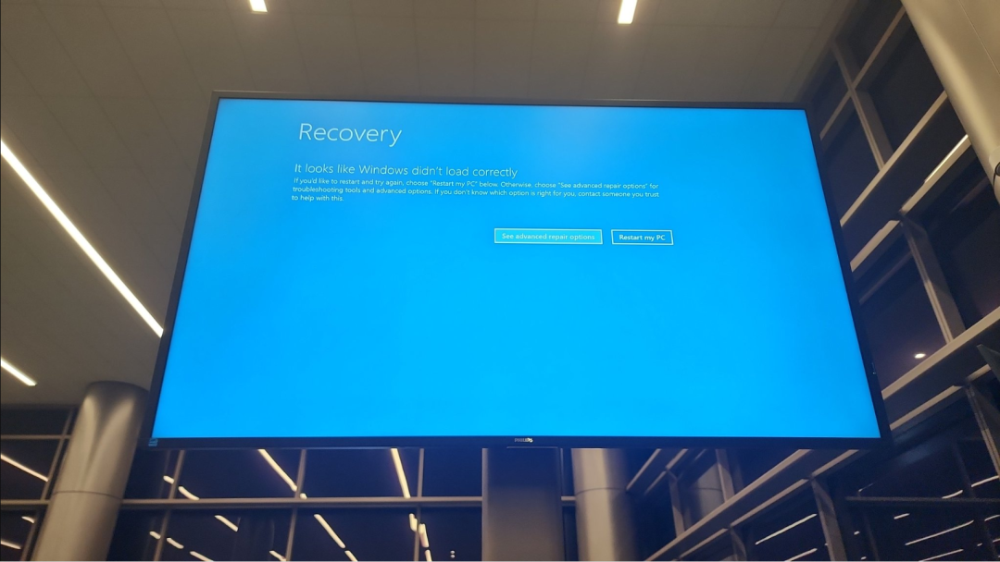
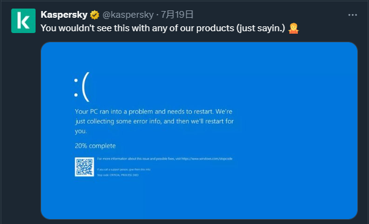
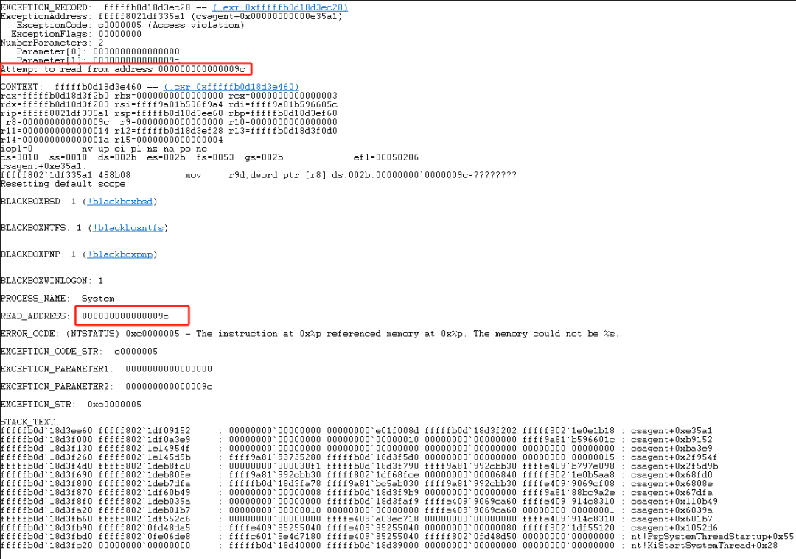
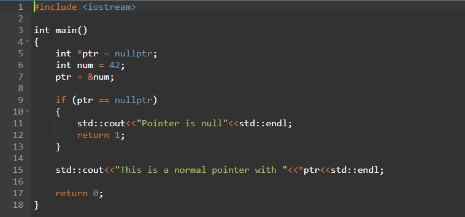

## 事件过程与影响
  

7月19日下午，大约从北京时间13点30分开始，**全球不同地方的Windows系统用户中，不少人发现自己的Windows系统出现了蓝屏错误**（BSOD，Blue Screen Of Death）。

这个故障画面会显示Recovery（恢复），并提示Windows系统没有正确加载。

之后，网络上出现许多蓝屏恶搞的图片，以此指向微软或者CrowdStrike公司。比如冰箱蓝屏导致无法打开冰箱，实际上是更换了Android系统的图片，而且冰箱显示屏故障也不影响冰箱开门。

之所以指向**CrowdStrike**公司，是因为引发此次蓝屏事件的正是这家公司。

CrowdStrike公司是美国的一家颇受欢迎的计算机安全服务提供商，该公司于2011年成立，并于2019年上市，旗下的核心产品名为Falcon（猎鹰），这是一款EDR（端点检测及响应，Endpoint Detection and Response）产品，该主要运行在用户终端，尤其是Windows系统，用于全方位检测系统安全攻击，并提供主动的安全防御能力，包括数据收集、威胁检测、事件响应、取证分析等。

2024年7月19日，北京时间12点09分，CrowdStrike向Windows系统**发布了一个Falcon产品的传感器配置（sensor content）更新**，该更新是Falcon平台保护机制的一部分，而更新内容是Windows系统的驱动文件或能够影响Windows内核的文件，虽然当天北京时间13点27分该文件的错误就得到了修正，但那一天下午许多Windows用户因为蓝屏故障都没有办法更新修复后的文件。

由于Falcon这款产品的大规模应用，即便只影响Widows系统上安装了这款产品的用户，或者严格来说在7月19日北京时间12点09分到13点27分之间系统处于联网开机状态的Falcon产品用户，其影响范围依然非常庞大。

这个故障影响了Windows 7.11以上版本的系统，**大约影响了850万台Windows设备**，占全球Windows市场的不到1%，机场、医院、交通、媒体、酒店、餐馆等不同场所的系统中有大量的Windows系统用户和Falcon产品用户，以至于出现机场停摆，如美国航空公司当天取消了3400架次航班。众多乘客无法按时起飞，甚至需要手写机票。这个故障实际上不影响飞机飞行功能，但会影响塔台、航站楼的系统。

 

同时影响的还有CrowdStrike自己的股价，事件发生当天股价跌下去11%，目前该公司的股价**已暴跌30%**，从之前的每股343美金跌至写作此文的每股264美金。

## CrowdStrike的响应

事件发生后，由于蓝屏故障导致受影响用户无法再更新正确的配置文件，官方只能通过Reddit等渠道发布**临时的恢复方案**：

1. 重启系统进入安全模式或系统恢复模式；

2. 打开C:\\Windows\\System32\\drivers\\CrowdStrike目录；

3. 找到该目录下“C-00000291\*.sys”并删掉；

4. 重启系统。

但这种方法对于启用了Windows系统BitLocker功能的用户却是无效，启用该功能后系统是无法进入安全模式或系统恢复模式的。

当天晚上，CrowdStrike公司首席执行官George Kurtz发表声明，向广大客户和用户致歉，并说明Mac和Linux系统不受影响，事件是因为一个文件更新的缺陷造成的，不是一起网络攻击事件，并告诫大家一些人可能会利用此次故障事件行不良之事。

事件发生后，也确实有阻止在利用此事作为诱饵进行恶意活动，包括向客户发送伪装成CrowdStrike支持的钓鱼邮件、冒充CrowdStrike公司员工进行电话诈骗、伪装成安全人员提供虚假的补救建议或者出售声称可以解决故障问题的恶意程序。

## Microsoft的回应

虽然事件不是由微软直接造成，但**Windows系统可以被第三方公司的产品使用系统内核级程序或文件**，引起了一些技术人员的质疑，比如参考Mac的做法，不允许第三方开发公司或人员获得内核级访问权限。

在今年1月份，CrowdStrike公司首席执行官George Kurtz也向微软提出过类似疑问，指出微软的Windows系统问题会让客户面临风险，也会使美国政府面临风险。

微软将此系统风险的问题抛给了欧盟，其发言人称，早期由于投诉问题与欧盟达成谅解，自2009年起，微软同意向第三方公司或厂商提供系统级访问权限，以方便安全软件公司可以使用Windows操作系统。

## 其他人/组织的反应

作为俄罗斯的老牌安全公司，卡巴斯基（Kaspersky）在7月19日当天发布一条贱贱的推文：

> 如果你用我们的产品，就不会看到蓝屏了。

这种坟头蹦迪的行为之后得到了许多人的愤慨，指出2020年和2023年由卡巴斯基官方发布的蓝屏故障通告，均是由于卡巴斯基的产品导致。

一名叫Vincent Flibustier的人发布图片和视频，称自己作为CrowdStrike的员工，在上班第一天因为发布了一个文件更新而被公司开除，说公司告诉他周五不发版，但他觉得自己是在周四发布的更新，算不得违反公司规定，被开除实在非常冤枉。

实际上，这个人是专门从事假新闻研究的，在其发布的图片里非常容易看到处理的痕迹。

## 故障原因分析

此次更新的配置文件通常也被称作“**通道文件（Channel Files）**”，是Falcon传感器使用的行为保护机制的一部分，这个文件每天都会更新多次，用来更新CrowdStrike发现的TTP（战术、技术和程序），也正是这种更新机制，导致文件更新之后很快影响到大范围的Windows系统。

这个通道文件在Windows系统中的路径是：

> C:\\Windows\\System32\\drivers\\CrowdStrike\\

该事件涉及一个名为“ C- ”的文件名，Falcon的每个通道文件都有一个数字作为唯一标识符。在此次事件中受到影响的通道文件编号是291，故其文件名是以“ C-00000291- ”开头，并以“.sys ”作为扩展名，CrowdStrike称这个文件并不是内核程序。

291编号的配置文件更新就是为了更新Falcon产品的监测和响应规则，用于控制Windows系统中命名管道（Named Pipe）的执行，它决定了不同系统活动中监测和响应的行为。

命名管道是Windows系统中进程之间通信的机制，可以在不同进程之间进行数据交互，由于一些C2（Command and Control）恶意软件会利用命名管道建立隐蔽的通信通道，因而EDR产品中需要监控命名管道的安全，比如阻止恶意的命名管道的建立。

网络上有人指出更新的291文件中都是空字节文件，但CrowdStrike在官方声明中否认了这点。

实际上，是更新的文件中包含了一个逻辑错误，这个错误导致内存分配出错，而验证逻辑同样存在问题，导致驱动程序继续执行，内存分配不当最终导致系统出现PAGE\_FAULT\_IN\_NONPAGED\_AREA错误，从而导致系统无法正常启动。

系统在创建命名管道时候会分配内存缓冲区，如果缓冲区分配的内存地址不合理，或者指向的地址不存在，而系统又继续执行读取这些不存在或非分页的内存区域，就会触发PAGE\_FAULT\_IN\_NONPAGED\_AREA蓝屏故障，非分页区域由于不会分页置换到物理硬盘，或者说始终使用的是物理内存部分，因而用于运行系统的核心程序，而由于系统内核拥有最高的系统权限，因而内核错误会引发系统严重的后果。

蓝屏故障实际上是Windows系统进行自我保护的一种机制，防止内核程序和数据受到更多损坏。

从上图中可以看到，更新文件中试图读取的内存地址使0x9C，而这个地址所处的内存区域是用于存放中断向量表的（0x0000-0x03FF），因此读取0x9C的地址势必会导致系统异常。

在C/C++开发中，**对于内存地址的使用是要非常谨慎和小心**，尤其是指针的使用需要做指针校验，比如：

显然，CrowdStrike的开发人员在编写程序时候可能在指针校验方面出了差错，而这个错误的文件没有被检测出来，进而发布在了用户的生产环境。

## 事件启示

从软件开发流程的角度，这个问题可以在三个方面解决：

**代码编写阶段**

TDD（测试驱动开发）、结对开发、同行评审等多种方式都可以发现上述的缺陷，问题在于，TDD需要编写大量的测试用例，整体代码编写量较大，结对开发对于许多企业而言看起来像是开发人员的浪费，同行评审又会因为开发人员的提交不规范导致评审工作量太大，因而国内许多企业都不屑或不在意代码编写阶段的质量。

笔者在早年开发Windows系统应用时候，开发的代码会通过版本控制系统交由另一个更加资深的开发人员做评审，类似同行评审中的观察者模式，区别在于这名资深开发人员会对于不合理的代码直接进行修改，实际上应该反馈给笔者，由笔者完成修改，之后笔者再拉取最新的代码继续开发。

**软件测试阶段**

有人认为在自动化单元测试和集成测试阶段不太容易发现上述的内存故障，因为需要较高水平的开发能力，需要人工进行测试。

实际不然，从故障现象看，但凡能够在自动化集成测试环境中采用与生产环境相同的Windows系统，都可以在自动化测试中立即发现蓝屏故障，这也说明CrowdStrike公司在测试过程中存在疏漏，或者对于这类常态化更新的文件没有开展更多详细的测试。

由于测试手段不足导致的问题，在2019年Cloudflare也发生过一起安全事件，这一年的7月2日，由于Cloudflare的WAF规则中存在ReDos漏洞，导致该公司全球的CDN网络和WAF产品中断半个小时，其原因在于对于日常更新的WAF规则没有采用灰度发布，集成测试中没有添加CPU占用率的遥测（参见：https://blog.cloudflare.com/details-of-the-cloudflare-outage-on-july-2-2019 ）。

由于测试环境不一致导致的问题，2022年国外一家企业的安全人员发现公司产品上线运行的版本存在路径穿越漏洞，而测试环境中却没有复现成功该漏洞，后来发现是生产环境和测试环境的负载均衡配置不同，在生产环境使用的AWS的负载均衡服务中Nginx将merge\_slashs关闭了，而实际上该配置默认是开启的。

**变更发布阶段**

对于此类安全产品的更新，且影响范围遍及全球的更新，应当采取灰度发布或者金丝雀发布的方式，即先在小范围进行发布，监测更新运行的情况，之后扩大发布范围，并持续监测更新运行情况，最后再扩大到全部用户的更新。

CrowdStrike可能和Cloudflare在2019年事故中一样，犯了没有灰度发布的错误，毕竟安全更新晚一些就有可能让客户遭受攻击，继而造成客户的损失，但错误的发布会造成公司所有客户的更大故障和影响。

国内由于使用CrowdStrike公司产品的企业和个人并不多，因而此次事件中国内用户和企业几乎不受影响，这得益于国内自有的、独立的安全厂商和产品体系多年的推广和更符合国情的应用。

但这并非意味着有独立的产品市场和体系就可以避免类似事件的发生，此次事件出现的根本原因在于CrowdStrike公司在软件质量管理和实施方面的问题，上述的三个方面在国内的众多软件企业中也未必均实施和落地，一旦国内某家大规模应用的软件公司出现类似问题，影响范围也会覆盖全国。

比如2015年9月1日，阿里云安骑士升级导致客户ECS部分正常文件被隔离（参见：https://www.infoq.cn/article/2015/09/aliyun-yundun ），那时则会因为产品未覆盖国外而让影响无法触达国外，因此这不能说明自立门户是解决这个问题的根本办法，自家榨油虽然不会吃到煤油，但也可能会吃到榨不干净的油。

**归根结底，是要从不同事件中汲取教训和经验，从研发管理、研发质量、研发安全一步一步做起，使软件开发更安全，让安全开发更放心。**