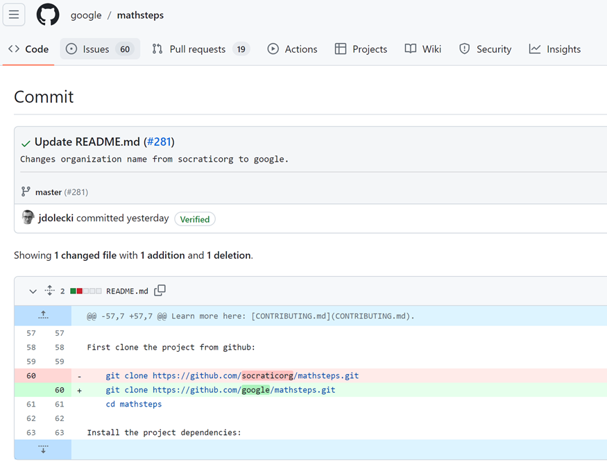
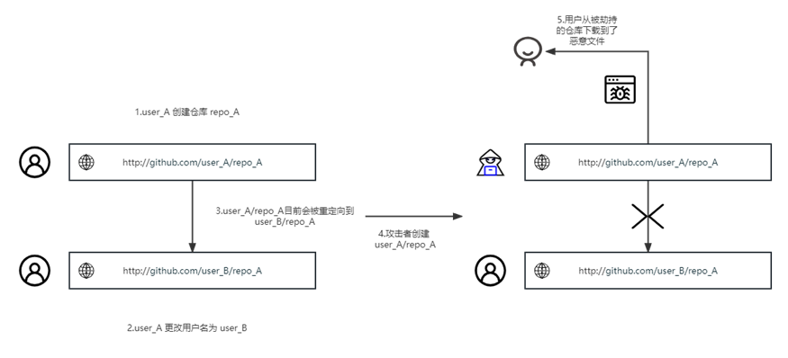
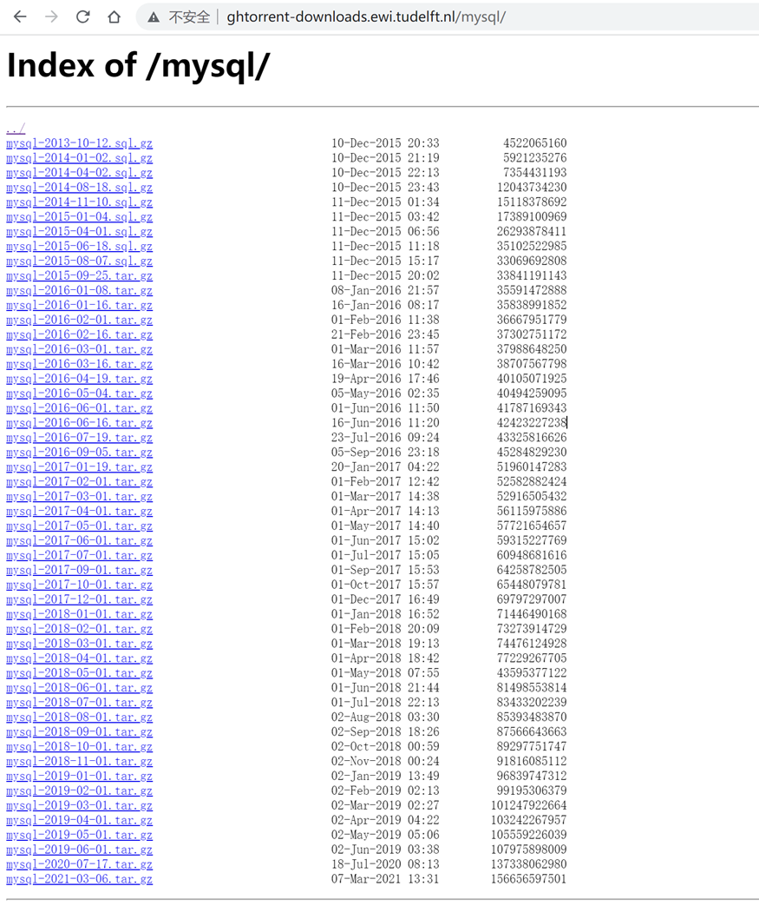
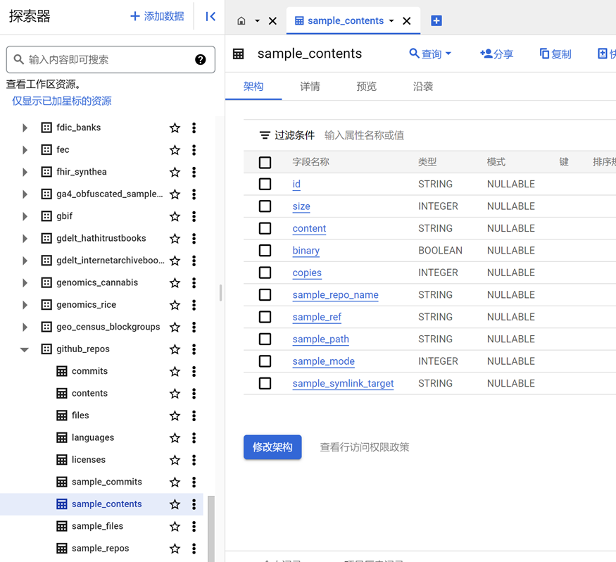
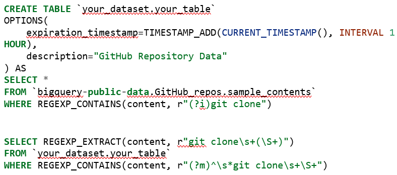
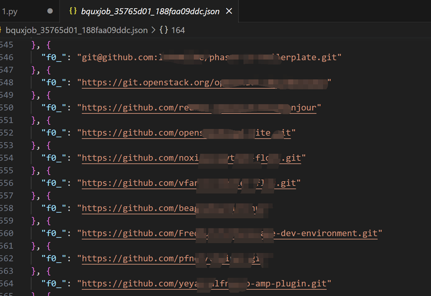
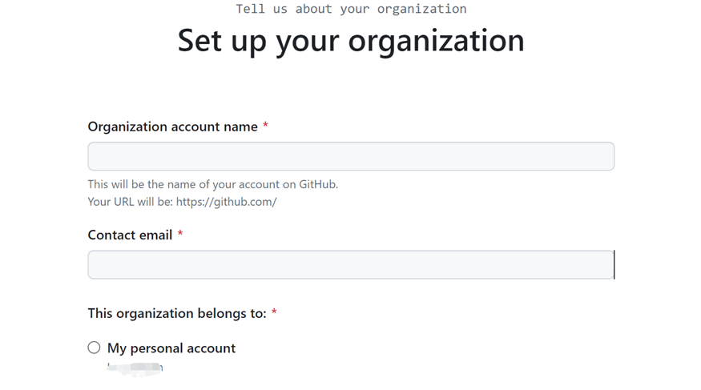
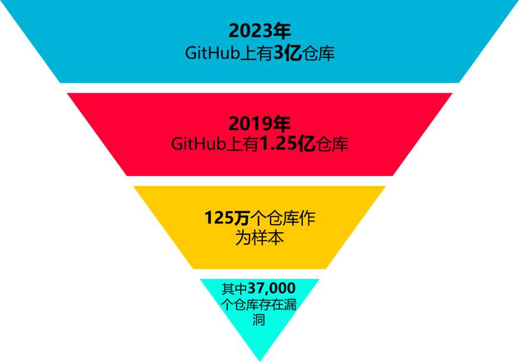
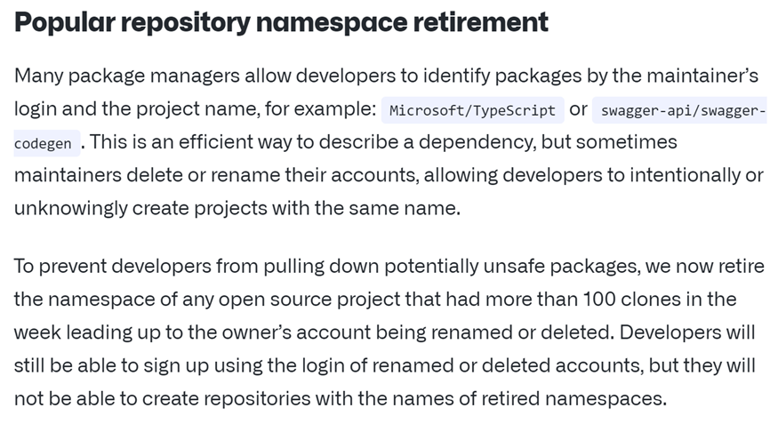

## 0x00 事件背景

GitHub是一个基于Web的代码托管平台和开发者社交网络。它提供了仓库（Repositories）用于存放代码，并提供了版本控制功能，使多人协作开发变得更加高效和便捷。GitHub允许开发者将自己的代码存储在云端仓库中，并进行版本管理。它使用分布式版本控制系统Git，使开发者可以轻松跟踪、管理和协作开发项目。

RepoJacking（仓库劫持）是指攻击者通过获取对原始仓库的控制权来替换或篡改代码库的行为。这种攻击通常发生在代码托管平台（如GitHub）上。

## 0x01 历史事件

**2021年10月**

JavaScript 库UAParser.js作者的npm账户被劫持，攻击者上传了具有挖矿以及信息窃取功能的恶意版本。

**2022年5月**

Python包CTX所有者的电子邮件域过期，攻击者上传恶意版本的CTX，在十天内被下载超过2700次。

**2023年6月28日**

Google对可能被劫持的仓库进行修复。

## 0x02 技术分析

### 2.1 RepoJacking 攻击流程

RepoJacking的一种常见形式是攻击者在代码仓库的所有者不注意的情况下，注册一个与原始仓库名称相似的仓库，并将其公开或发布到公共代码库中。攻击者可能会从原始仓库中复制代码，或者修改并添加恶意代码，以引诱用户下载或使用受感染的代码。另一种常见形式是在原始仓库更名或被删除的情况下，攻击者注册一个与原始仓库相同命名空间的仓库，使得用户下载恶意代码。

对于GitHub仓库进行RepoJacking攻击，大致流程如下：

**01** user\_A创建了repo\_A。

**02** user\_A更名为了user\_B。

**03** 在有人创建user\_A之前，GitHub将user\_A/repo\_A指向user\_B/repo\_A（访问之前的user\_A/repo\_A仓库会跳转到user\_B/repo\_A）。

**04** 攻击者创建user\_A/repo\_A，RepoJacking攻击产生。

**05** 用户从攻击者掌控的仓库下载恶意文件，遭受攻击。

导致用户从攻击者掌握的仓库下载恶意文件的原因有三个：

1.  现有仓库的安装脚本install.sh文件指向的是旧仓库。
    
2.  自述文件README.md或构建文件指向的是旧仓库。
    
3.  发布的下载链接指向的是旧仓库。
    
### 2.2 RepoJacking攻击示例

从2.1节可知，攻击者为了进行RepoJacking攻击，首先需要做的就是获取更名用户的仓库，或是已删除/已改名的组织名的仓库。该数据的获取渠道如下：

1\. 通过ghtorrent.org网站可以访问GitHub上用户名和组织名的历史记录。数据集在http://ghtorrent-downloads.ewi.tudelft.nl/mysql中

该数据集更新日期为2021年3月6日。

2\. 通过托管在Google Cloud Platform（GCP）上的BigQuery数据集。其中有GitHub的所有开源内容。

本文以GCP上的GitHub数据集为例。对GitHub的文件内容进行sql查询。

结果如下图：

随后使用GitHub REST API查询组织名是否存在。最后根据查询到的不存在的组织名，通过GitHub->New organization注册。

可以看出，RepoJacking攻击的实现并不困难。对2019年6月的GitHub数据分析，**125万**个GitHub仓库中，有**36,983**个仓库容易受到RepoJacking攻击，占比为**2.95%**。如果放在所有的GitHub仓库中，大约有**数百万**个仓库可能遭受RepoJacking攻击。这是较为庞大的数据。

## 0x03 相关反应

2018年8月18日，GitHub推出相关手段防止类似攻击行为。具体如下：

**许多软件包管理器允许开发者通过维护者的登录名和项目名称来标识软件包**，例如：Microsoft/TypeScript或swagger-api/swagger-codegen。这是一种描述依赖关系的高效方式，但有时维护者会删除或重命名他们的帐户，使得其他开发者可以有意或无意地创建具有相同名称的项目。

为了防止开发者下载潜在不安全的软件包，**GitHub现在会停用在拥有者的帐户重命名或删除之前一周内克隆次数超过100次的任何开源项目的命名空间**。开发者仍然可以使用被重命名或删除的帐户的登录名进行注册，但他们将无法创建与被停用命名空间相同的仓库名称。

## 0x04 事件启示

RepoJacking攻击源于部分安装脚本对软件的安装使用的是GitHub仓库的命名空间进行下载，而在命名空间的所有者更名或是删除后，该命名空间会被攻击者劫持。

尽管GitHub近年来一直尝试阻止RepoJacking，但是这些保护仍然会存在一些问题，如上述第三节，GitHub对一周内克隆超过100次的命名空间进行了保护，使得已删除用户能被重建，却无法创建与被停用的仓库名称相同的仓库。该保护通过创建仓库后，再更名为所想劫持的原用户名即可绕过。如想要劫持的仓库命名空间为user\_A/repo\_A，此时我们随意创建一个用户user\_B/repo\_A，随后改名为user\_A即可绕过保护。

故而，对于RepoJacking攻击的防范不能完全依靠代码托管平台的防护，开源项目的开发者以及其使用者同样需要对RepoJacking攻击进行防范。对于开源项目的开发者来说，建议**定期检查仓库是否从外部GitHub仓库获取资源**，并且**使用专用的包管理器（npm，pip，maven等）来管理依赖**，当然这些依赖同样可能通过GitHub仓库获取资源，因此并非绝对安全。同时**发布时锁定版本并计算哈希**，这样就算依赖的组件被劫持，哈希的更改也会导致安装的失败。对于使用这些开源项目的使用者，应**检查其安装文件中或自身克隆下来的仓库是否被劫持，并使用终端安全工具对下载的资源进行检查**。