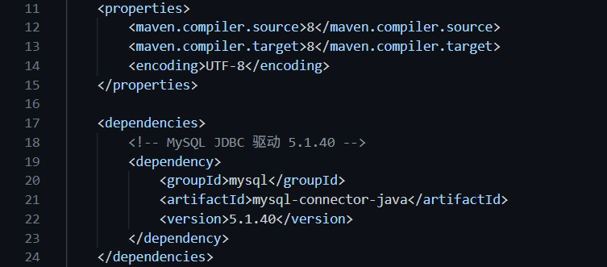
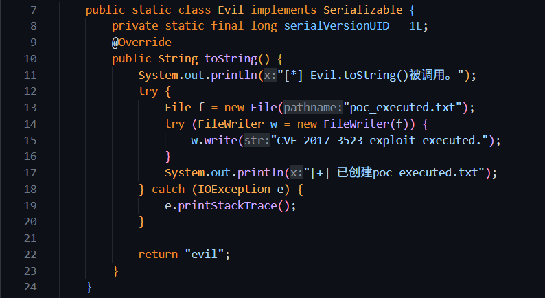
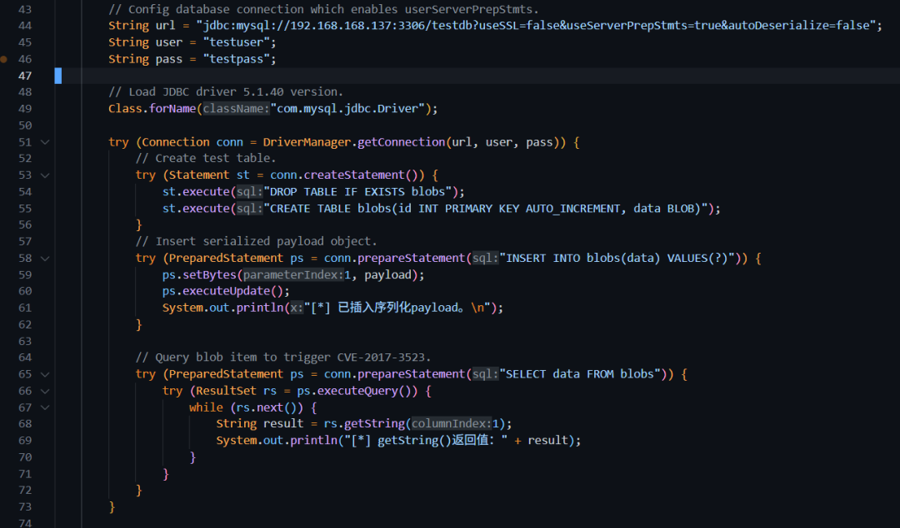
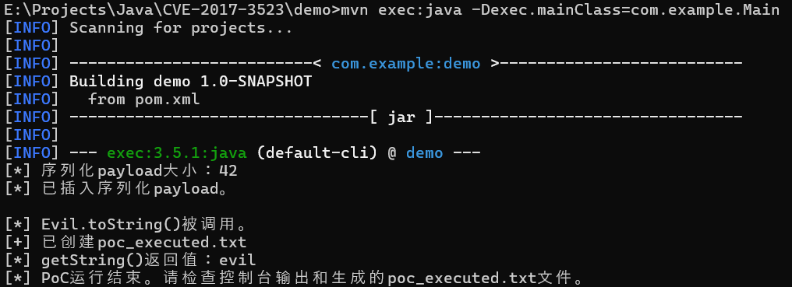
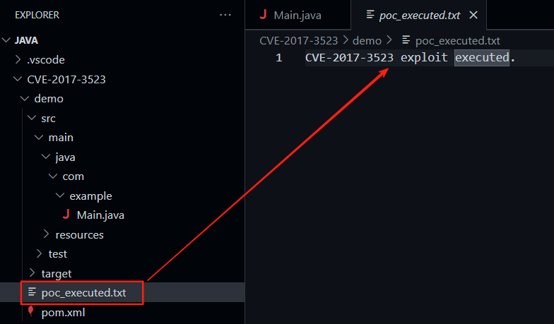
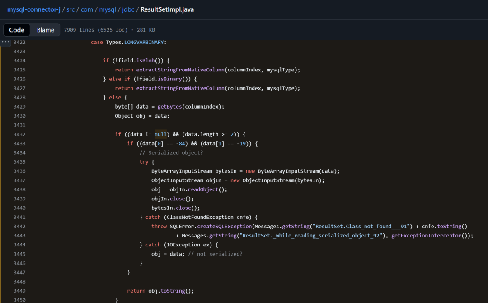
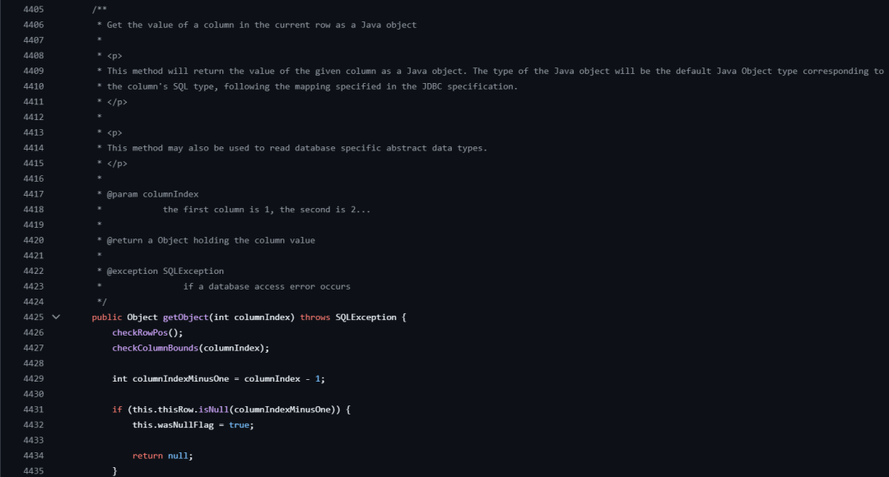

本文是是根据《从Top20开源组件漏洞浅谈开源安全治理困境》中，我们梳理的最常见组件漏洞制作的漏洞分析系列。

本篇是该系列的第二篇分析报告。

## 一、漏洞概述

### 1.1 漏洞基本信息

漏洞编号：CVE-2017-3523

漏洞类型：CWE-502不受信任数据的反序列化

CVSS评分：8.5（CVSS 3.1）

危害等级：高危

影响组件：mysql-connector-java

影响版本：<=5.1.40

披露时间：2017年

修复状态：已修复（2017年2月份发布的5.1.41及之后版本）

### 1.2 背景介绍

JDBC（Java Database Connectivity）是 Java 平台提供的一套标准 API，用于在 Java 程序中连接并操作各种数据库，它由一组用Java编写的类和接口组成，通过统一的编程接口屏蔽不同数据库的差异。JDBC为数据库应用开发人员、数据库前台开发人员提供了一种标准的应用程序设计接口， 使开发人员可以用纯 Java语言编写完整的数据库应用程序。

在具体实现上，JDBC依赖各数据库厂商提供的JDBC驱动程序。以 MySQL 为例，常用的驱动是MySQL Connector/J，它是由MySQL官方提供的纯Java实现，遵循JDBC规范，负责将JDBC调用转换为MySQL协议数据包，与数据库进行通信。

## 二、漏洞详情

### 2.1 漏洞成因

在该版本的mysql-connector-java驱动中，提供了一个可选的autoDeserialize属性，当属性设置为true时，可以方便地将数据库中的Java对象自动反序列化。但由于程序设计和编写的缺陷，导致在某些条件下，即使未启用autoDeserialize，驱动仍会把某些列的内容当成序列化对象解包，并返回其toString()值。这使得攻击者可以向数据库写入恶意序列化对象，在客户端利用反序列化链执行任意代码。

### 2.2 漏洞影响

攻击者可搭建恶意MySQL服务器，并在响应中嵌入精心构造的Java序列化对象（包含可利用的Gadget Chain），当受害客户端连接该恶意服务器并触发反序列化逻辑时，即可在客户端环境中执行任意代码。

## 三、漏洞利用分析

### 3.1 漏洞利用前提

根据该下文的漏洞成因分析，可知CVE-2017-3523漏洞的利用存在三个前提条件：

1.JDBC串中启用了useServerPrepStmts=true，该属性通过缓存预准备SQL语句提高数据库查询性能；

2.应用从数据库的BLOB、TINYBLOB、MEDIUMBLOB或LONGBLOB类型的列中读取数据；

3.读取数据时使用ResultSet.getString()或其它将二进制先转成字符串/数字的方法，而不是getBytes()或 getObject()。

### 3.2 漏洞复现步骤

首先创建一个Maven项目，在pom.xml文件中写入漏洞组件的版本mysql-connector-java 5.1.40。



接着，在MySQL数据库中创建复现的数据库和用户。

``` SQL
CREATE DATABASE testdb;
CREATE USER 'testuser'@'%' IDENTIFIED BY 'testpass';
GRANT ALL PRIVILEGES ON testdb.* TO 'testuser'@'%';
FLUSH PRIVILEGES;
```

在Maven项目中编写对应的BLOB数据生成和漏洞触发程序，主要构成包括PoC执行的动作：



其次还有数据库建立连接的JDBC串（数据库IP地址是192.168.168.137）和写入的BLOB数据，并将写入的BLOB通过getString()方法进行读取，注意这里JDBC串中设置的autoDeserialize=false和useServerPrepStmts=true，useSSL设置为false是避免数据库连接时候提示证书验证错误。



以上程序执行后返回的结果和生成的文件内容分别是：





## 四、漏洞原理

该漏洞的问题出在src/com/mysql/jdbc/ResultSetImpl.java的第3432行代码（https://github.com/mysql/mysql-connector-j/blob/402933ef52cad9aa82624e80acbea46e3a701ce6/src/com/mysql/jdbc/ResultSetImpl.java#L3422-L3450 ），这段代码位于getNativeConvertToString方法中，这个方法作用是用来转换数据库中存储的原生数据，并将它展示返回给应用，所以在数据转换前需要做数据类型判断。

这漏洞所在的代码用来做长二进制数据的转换，可以看到在3433行代码对数据的前两个字符做了判断，检测是否是-84 和 -19（十六进制就是0xAC 0xED），这正是序列化对象的魔数，如果匹配，则说明读取的数据是序列化对象。

但是问题在于，在判断序列化对象后，程序没有做任何进一步净化，直接在3438行调用readObject()反序列化读取的对象，这就造成了反序列化的漏洞。



通过getNativeConvertToString方法一路向上寻找调用关系，会发现有诸多方法都引用了它的唯一调用方法getNativeString()，其中getStringInternal()方法和getStringForClob()方法在isBinaryEncoded变量为true时都会触发getNativeConvertToString方法，而isBinaryEncoded根据文件注释是需要通过useServerPrepStmts=true来声明，否则默认为false。

getStringInternal()方法的调用方法是getString()，该方法的作用是将数据库中的值当作Java字符串读取，getStringForClob()方法的最终调用者之一是同文件下位于4425行的getObject()方法，但后者在调用前做了数据类型判断，只有当数据类型不是二进制类型时候才会触发调用，这就导致反序列化漏洞无法被触发。因此在该漏洞的触发条件上需要在JDBC串中声明useServerPrepStmts=true，同时读取数据的方法需要是getString()方法。

需要注意的是，ResultSetImpl.java文件的另外一处4564行也存在反序列化漏洞，程序通过autoDeserialize来进行限制，但在JDBC中如果显示声明该变量为true，也会触发该漏洞，这造成CVE-2017-3523的漏洞修复方式并不彻底，或者说修复者没有真正理解这个漏洞的触发条件。



## 五、漏洞修复方案

2017年2月28日发布的5.1.41版本已修复该漏洞，但其后续版本在特定JDBC串设置下依然存在反序列化漏洞，因此建议：

1.升级mysql-connector-java到最新版；

2.如果JDBC串可编辑，则限制JDBC属性只包含useUnicode、characterEncoding、autoReconnect、useSSL等常用属性，禁用autoDeserialize、useServerPrepStmts、statementInterceptors、queryInterceptors属性。