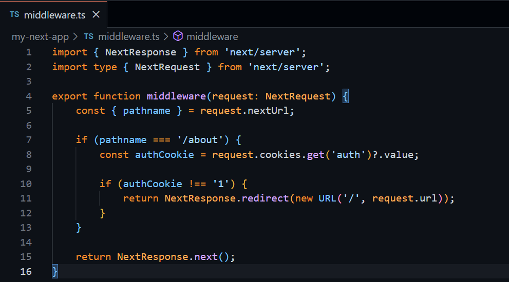
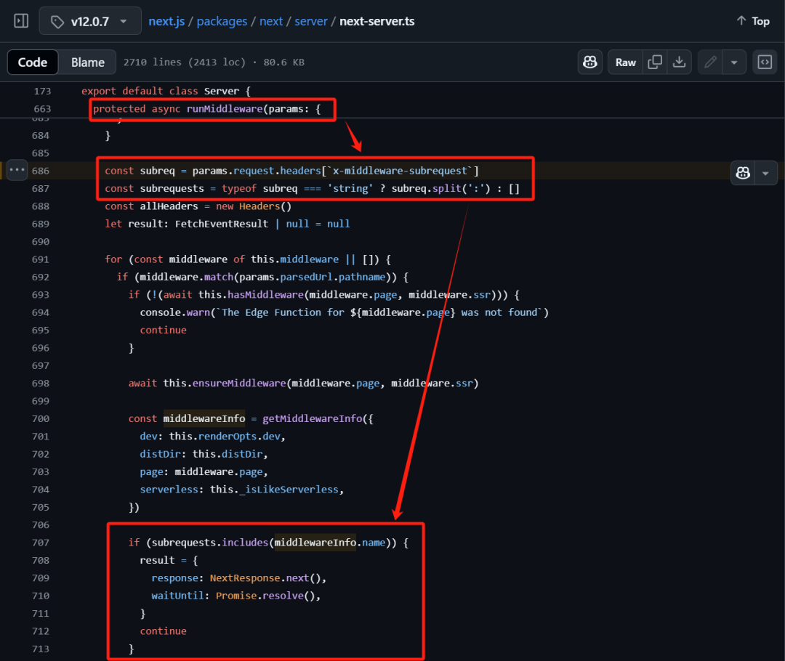
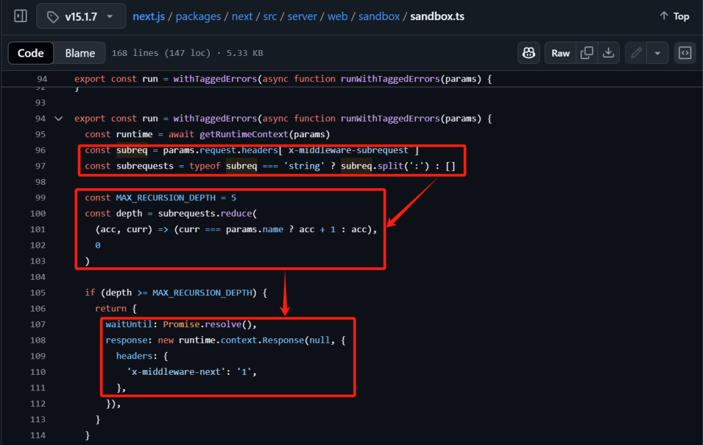
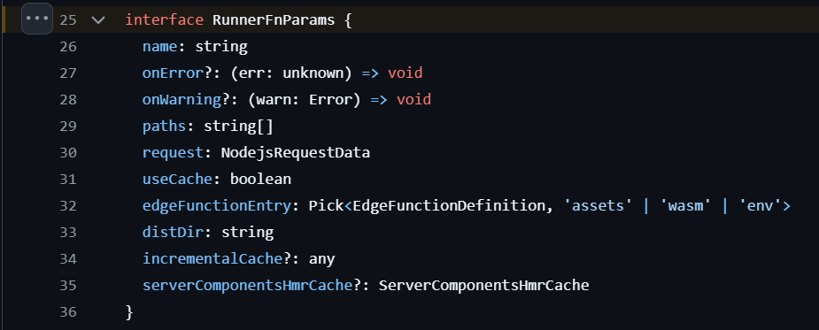
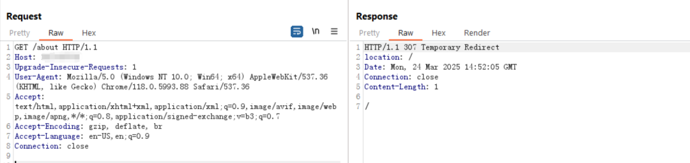
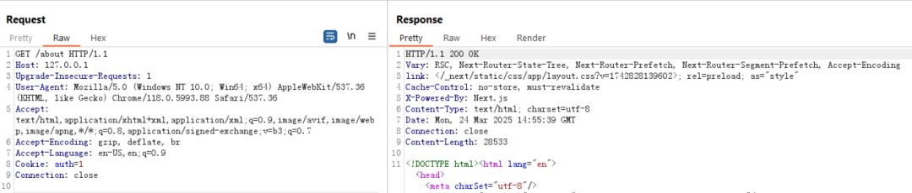
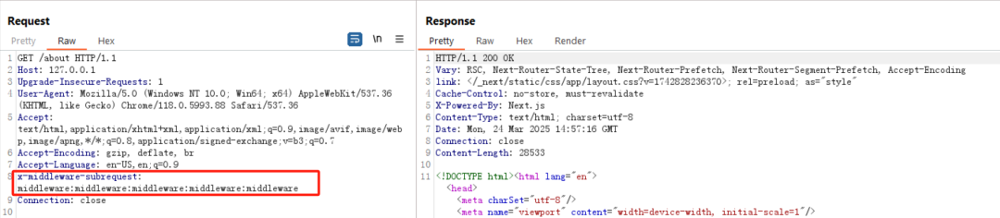
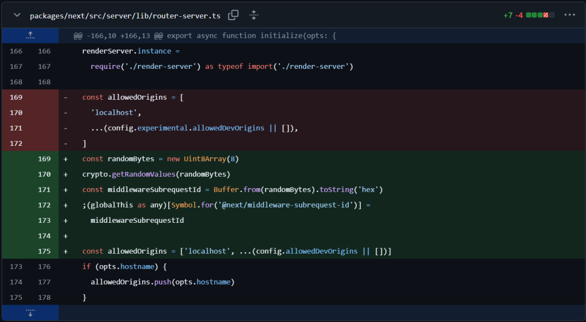
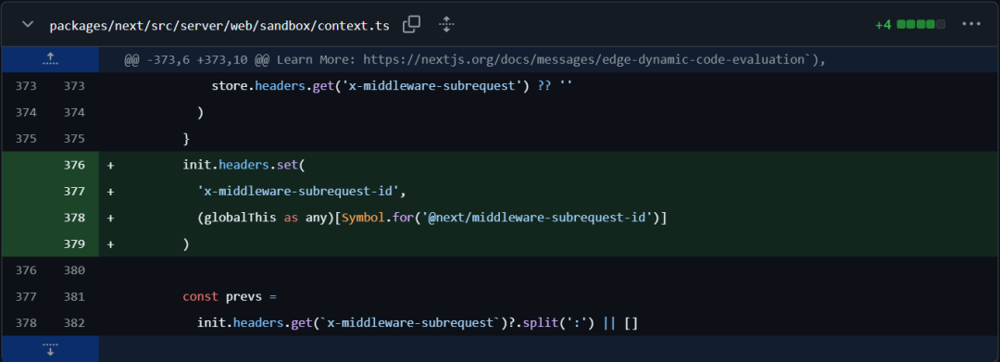
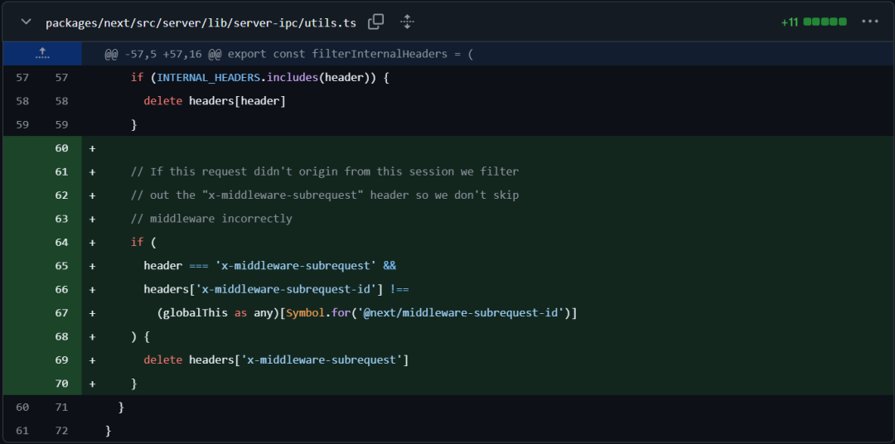

几天之前（2025年3月21日），Next.js开发框架被爆出存在一个身份验证绕过检查的漏洞，漏洞编号是CVE-2025-29927，漏洞的报告者是Allam Rachid（zhero;）和Allam Yasser（inzo\_），且漏洞影响的版本较大。

## 影响版本

**\>=11.1.4，<=13.5.6**

**\>=14.0，<14.2.25**

**\>=15.0，<15.2.3**

## 修复版本

**14.2.25**

**15.2.3**

## 技术背景

Next.js是一个基于React前端开发库的开源Web开发框架，由于开发和运行环境是基于同是JavaScript的Node.js，因此该框架备受欢迎，尤其是前端开发人员（意味着万能的JS可以做前端、后端和框架），当然更重要的原因是该框架的服务器端渲染能力、静态站点生成能力、内置路由系统等特点，使得开发过程能够更加轻便、简洁和干净。

根据官方的漏洞描述，CVE-2025-29927漏洞影响的部分是Next.js框架中的Middleware，中文通常叫做“中间件”（这个叫法是直译的结果，在IT领域有多种解释），但与其他开发框架（如Laravel）中的Middleware类似，这里的Middleware是在HTTP请求完成之前执行或运行的函数，它不仅能够过滤、拦截HTTP请求，也可以过滤和拦截HTTP响应，就像高速公路的收费站。

Middleware在应用程序开发中的作用有很多，其中很重要的一项是身份验证（否则需要在每个路由的页面进行单独处理，处理会非常繁琐，且无法保证权限管控统一，同时容易造成越权问题），除此之外还能够用来处理服务器端重定向、路径重写（确保不同版本的路径统一或进行A/B Test），以及业务安全的处理等等。如下图，通过验证操作来判断是否允许访问/about页面（这只是示例，并非最佳安全开发实践）。

## 漏洞原理

两位漏洞发现者没有花费太多时间便发现了Next.js老版本v12.0.7（4年前发布的版本）的一处漏洞，如下图所示，这处漏洞实在太过明显。这个版本的Next.js的Middleware运行中会检查请求头中的x-middleware-subrequest的值，而后用冒号对这个请求头的值做分割，最后检查分割后的值是不是包含middlewareInfo.name，如果是，则继续执行下一步。所以攻击者只需要能够构建x-middleware-subrequest请求头是middlewareInfo.name即可绕过这部分的身份验证检查。而v12.0.7版本的Next.js在Middleware开发中，middlewareInfo.name几乎是固定的，或者是非常容易推测的，事实上，在v12.2版本之前，Middleware文件名固定必须是\_middleware.ts，路由文件指定是pages（v13版本后改为了app）所以在该版本中middlewareInfo.name的确切名称就是pages/\_middleware，这大大降低了漏洞利用的难度。

即便是嵌套路由（Next.js是使用目录结构作为路由结构，以省去路由结构的维护，这也是该框架的优点之一），也可以根据请求路径猜测出正确的middlewareInfo.name，

比如pages/dashboard/\_middleware

和pages/dashboard/panel/\_middleware。

但漏洞提交后不久，漏洞发现者又发现在更新版本中也存在类似的漏洞，尽管Next.js的路由结构和文件结构在新版本中有了变化，但依然可以找到x-middleware-subrequest请求头的不恰当应用。

以v15.1.7为例，该漏洞位于

next.js/packages/next/src/server/web/sandbox/sandbox.tx文件中。

在这段代码中，关于x-middleware-subrequest初始处理没有变，但之后增加了针对MAX\_RECURSION\_DEPTH的判断或则对最大嵌套深度的判断，这个设计应该是为了避免请求死循环，但代码逻辑中只做了5次以内的判断假如x-middleware-subrequest请求头分割后的params.name的数量超过5次，也会继续执行响应，而params.name实际上还是middleware文件的路径。根据官方约定，middleware文件的名称是middleware.ts，路径要么是在项目根路径，与pages或app目录同级别，要么是在/src目录下，即params.name的值或者是middleware，或者是src/middleware。

那么，构造恶意的x-middleware-subrequest请求头无外乎两种类型，一种是：

x-middleware-subrequest: middleware:middleware:middleware:middleware:middleware

一种是：

x-middleware-subrequest: src/middleware:src/middleware:src/middleware:src/middleware:src/middleware

## 漏洞复现

文章开头的代码为例，通过middleware，正常情况下访问/about页面会重新跳转至首页，如下图所示。

而正常访问的情况下，如果需要通过身份验证，需要进行某些页面交互进行身份验证，以设置Cookie中auth的值为1（这个设计也不安全），如下图所示。

而如果Next.js版本使用的是v15.2.3以下版本，则可以通过恶意的请求头

x-middleware-subrequest: middleware:middleware:middleware:middleware:middleware达到绕过身份验证的目的。

## 漏洞修复

以15.2.3为例，官方对于该漏洞的修复是引入了x-middleware-subrequest-id，其依赖关系如下图顺序所示，即先在router-server.ts中存储全局Symbol注册信息@next/middleware-subrequest-id，这个值是一个随机的十六位字符串，而后context.ts中设置网站的x-middleware-subrequest-id，并将该值初始化为全局Symbol注册信息，最后在utls.ts中判断请求头中是否存在x-middleware-subrequest请求头，以及x-middleware-subrequest-id值是否与网站存储的x-middleware-subrequest-id一致，如果存在请求头但id不一致，则会删除x-middleware-subrequest请求头。

在WAF的检测规则中，则更加简单，以CloudFlare为例，是判断请求头中是否存在x-middleware-subrequest，如果存在则阻断，但这样可能会造成部分应用自身设计的同名请求头被阻断，因此这条规则在发布之后很快修改为了Opt-in，即用户需要主动开启规则。

## 参考链接

1. https://github.com/advisories/GHSA-f82v-jwr5-mffw

2. https://zhero-web-sec.github.io/research-and-things/nextjs-and-the-corrupt-middleware