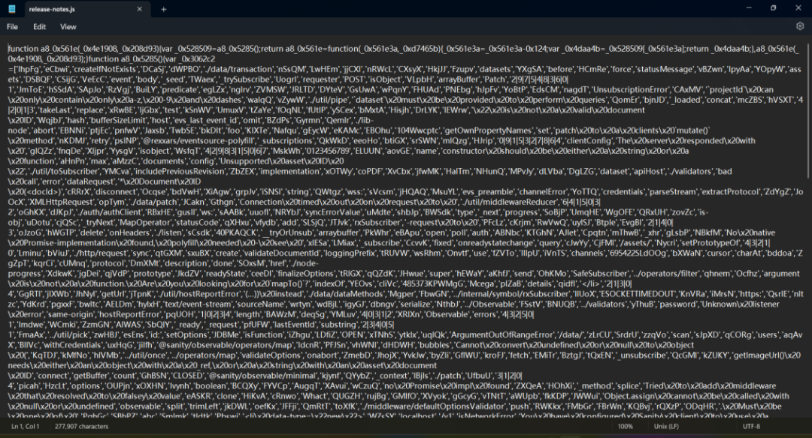
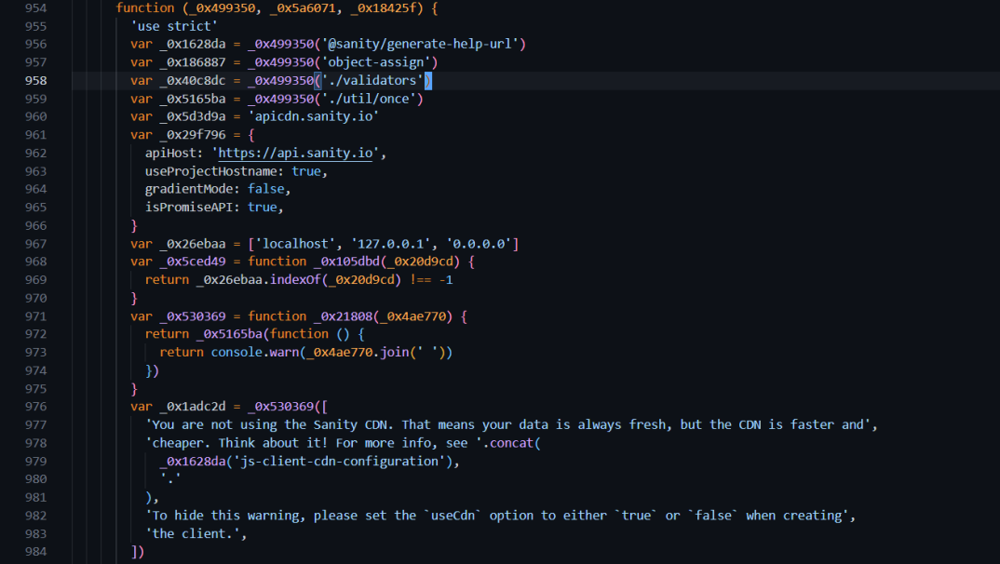
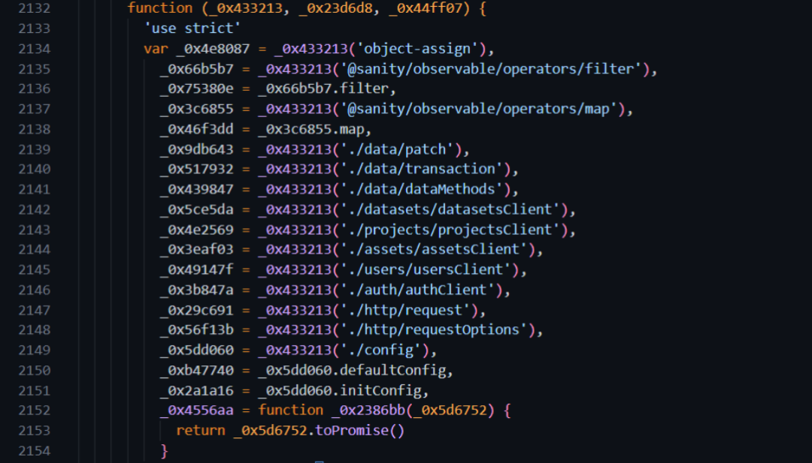
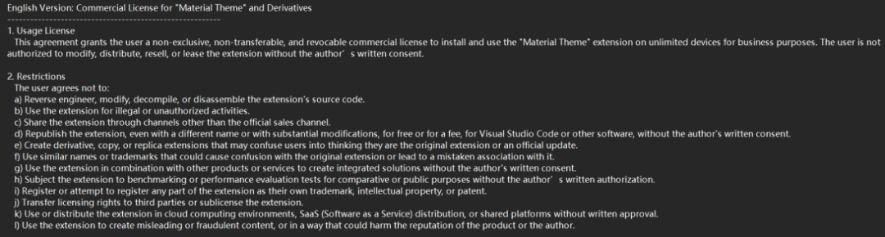

在半个多月前，来自VS Code团队的成员在Hacker News中发帖称，VS Code的社区成员向微软汇报说有一个VS Code的扩展程序有安全风险和隐患，并且经过微软的安全研究人员分析和确认，在这个扩展程序中发现了可疑的代码，于是团队很快禁用了VS Code扩展市场中这个扩展程序的作者账户，同时移除了这个作者发布的所有扩展程序，也从VS Code的运行实例中卸载了正在运行的这个扩展（是的，微软竟然通过VS Code进行远程控制扩展程序的卸载），这些响应的原因都指向这个扩展程序中存在潜在的可疑代码。

VS Code是全球最为开发人员熟知的IDE软件，因为其简洁、轻便和扩展能力而被广泛使用（至少相对于微软的另一个著名IDE软件Visual Studio），而这个因为安全隐患被移除和禁用的扩展程序就是Material Theme，严格来说，这个扩展程序只是VS Code的主题扩展，对于VS Code而言通通都是扩展，只是扩展的作用不同而已，主题扩展会改变VS Code的颜色、字体等呈现的效果，而Material Theme也因为其美观的风格，从2016年发布后被许多开发人员所使用，目前有超过900万次的下载。因为这个新闻被科技媒体广为报道后，产生了轩然大波，许多开发人员紧急卸载了Material Theme，而同时GitHub上的Material Theme项目也被原作者删除，所有的迹象都指向Material Theme项目确实是有个有安全隐患的程序。

但也有一些人在质疑，到底是什么样的问题让大家都认为Material Theme不再可信的，几乎所有的科技报道中都未实际提及这个项目被质疑的技术原因，至多只是说该项目下的release-notes.js文件有可疑，同时贴了一个这个文件的截图，截图中是经过混淆的JS代码。这个事件中，一个网名是Theo的人专门写了一篇文章，文章标题直接用了《Mattia Astorino (equinusocio) Is Dangerous》，同时根据其他人早前fork的Material Theme项目做了一个无害版本的主题程序【vsc-material-but-i-wont-sue-you】，Theo指认该项目的作者Mattia Astorino（网名equinusocio）是一个极端危险的程序员，这个人利欲熏心，不仅起诉之前所有抄袭他项目的人，而且还在最近几年推出会员版本收费，是一个掉进钱眼里的贪心鬼，但Material Theme用的是Apache License Version 2.0的许可协议，该协议是允许其他人基于原项目进行修改再发布的，无论是否用于商业用途，因此起诉他人的做法显然不符合这个Apache 2.0的协议约定，因此Theo才在无害的项目版本中称【i wont sue you】（我不会起诉你）。

**所以，这个事件中大家争议的点事实上有两个，一个是关于开源协议的争议，一个是恶意代码的问题。**

对于微软而言显然开源协议并不是问题，但恶意代码是，那么到底这个恶意代码是什么呢？好在作者Mattia Astorino依然活跃在GitHub，虽然当时账户和项目被VS Code官方禁用，但还在不遗余力推广自己的项目，如果真的是图谋不轨，这个做法确实令人害怕，这同样也是Theo指责Mattia Astorino的问题之一。好在网页还有快照，于是笔者找到原作者发布的Material Theme扩展程序，查看了这个文件，想一探究竟，它的问题到底是什么。

Material Theme扩展程序由vsc-material-theme-34.7.9.vsix和vsc-material-theme-icons-3.8.12.vsix两个文件构成，vsix本质上是zip压缩包，存疑的release-notes.js文件位于vsc-material-theme-34.7.9\\extension\\build\\ui路径下，这个文件如媒体报道的截图，是下图的样子。

这个272Kb大小的JS文件的代码经过了混淆和加密，格式化后有8314行代码，对于一个开源的项目和VS Code的扩展文件，这样的混淆和加密确实可疑，VS Code团队成员的措辞也是suspicious code（可疑代码），对于这样的扩展文件而言，大家的疑惑是有什么事情不能大大方方的展示出来，而是需要用这种方式，因此当一些安全检测工具或平台检测到混淆代码时会对文件报警。那么客观上这个文件有什么样的后门行为或危害用户的行为么？

从代码中可以很清晰的看到，程序行为中调用了Sanity的接口，通过Sanity平台的API接口与Sanity平台（一个可以用来存储结构化内容的CMS平台）通讯，同时还有诸如addEventListener、removeEventListener这样的事件监听函数，虽然经过混淆，但这些敏感的接口和函数还是可以在文件中轻易找到，无论是开发人员还是安全人员都会对于这样的文件保持非常高的警惕，怀疑它的合理性和合法性是情理之中的。但除此之外，并没有实际上可以称为后门行为的代码存在，因此也有许多研发人员发现这个文件中的代码没有找到任何有害的代码，因此好奇微软的处置依据是什么。

对于这个事情的局面，项目作者Mattia Astorino在删除项目前在Issue中发表了下面的说明：

> “Unfortunately, all our extensions have been censored and pulled down without any possibility of appeal, notice, or apparent reason. A really sad day. The main reason is due to a stupid and ignorant person who shared a fake and defamatory video on YouTube, spreading false and invented information without knowing the real facts. Unfortunately, this cancer has spread and people have reported all extensions “as viruses” regardless, relying on the false information disclosed and repeating it like parrots.”

> “不幸的是，我们所有的扩展程序都被审查并下架了，没有任何申诉的机会、通知或明显的原因。真是令人难过的一天。主要原因在于一个愚蠢无知的人在 YouTube 上分享了一段虚假且诽谤性的视频，传播了不实和捏造的信息，而他并不了解真实的情况。不幸的是，这种毒瘤已经蔓延开来，人们不管三七二十一，都根据披露的虚假信息举报所有的扩展程序“为病毒”，像鹦鹉学舌般地重复着。”

作者说明中所说的那条YouTube视频应该指的正式Theo发布的视频【This VS Code theme is threatening people?】，关于这个项目的视频Theo共发布了两条，关于恶意代码的部分，Theo指出的理由是三条：请求不需要请求的地址、引入不需要引入的依赖和混淆了开源的代码，但可惜并没有从release-notes.js文件的恶意代码角度进行深入分析，并指出该文件的恶意行为，这恰恰是VS Code官方在处置这个项目时候唯一关心的问题。Theo指控的是Mattia Astorino无视开源社区规则的肆意妄为，比如修改项目许可协议，将项目原来的Apache 2协议修改成为作者自己的商业许可“Commercial License for "Material Theme" and Derivatives”，该许可中声明未经作者授权禁止其他用户进行复制、修改和传播，而这项许可的变更发生在去年的11月份。

所以，这个事件的冲突实际上分成两条线，一条是针对项目的恶意代码，这是作者与微软之间的分歧，一条是许可协议以及项目复制和分发的冲突，毕竟开源许可协议是自愿遵守的，作者只能依靠声明来应对其他人的复制、分发甚至售卖，而作者之所以删除项目，应该是原本想通过开源项目赚钱，但改变许可协议后面临诸多冲突和纠纷，于是索性删除开源项目将它变成闭源的项目，release-notes.js文件也是为收费功能做的铺垫和准备，避免其他人免费使用，而其他人认为即便改变了许可协议，但根据Apache 2的许可内容，参与到该项目的贡献者都可以免费获得授权进行复制、修改和分发该项目的衍生项目，同时原作者删除了自己的Git提交记录，企图掩盖自己修改许可协议的事实，这些行为对于开源社区而言都是不真诚、不坦诚的做法。就像一个孩子搭了篮球架，其他孩子也来帮忙一起搭，说好了搭好之后所有帮忙的人都可以带人来玩，结果第一个搭篮球架的孩子突然不干，更改了约定，要求不管是谁来玩，要么出钱，要么再找地方，还给篮球架上了一道锁，这就相当不厚道了。

冲突归冲突，争议归争议，就文章开头恶意代码的事情总算是有了结论，几天前微软终于更新了声明，说经过一番研究发现这个项目所谓的恶意文件是误报，即日起恢复项目作者在VS Code市场的账户和项目，经历过之前的XZ-Utils事件之后，这样谨慎的态度值得为微软点赞。

## 参考

1. https://news.ycombinator.com/item?id=43181591

2. https://t3.gg/blog/post/equinusocio

3. https://archive.ph/5hZyK

4. https://www.reddit.com/r/vscode/comments/1iy571t/lost\_material\_theme/

5. https://web.archive.org/web/20250226072435/https://github.com/material-theme/vsc-material-theme/discussions/1314