## 0x00 事件背景

PyPI（Python Package Index）是Python官方的包索引和分发平台。它是一个公共的、全球性的存储库，用于存储、发布和安装Python包和模块。

PyPI允许开发者将他们编写的Python代码打包为可重用的模块或库，并将其发布到PyPI上供其他开发者使用。开发者可以通过使用pip工具（Python的包管理工具）从PyPI上安装所需的模块或库。PyPI提供了一个广泛的Python包，涵盖了各种用途和领域的功能。

## 0x01 事件过程

2023年4月17日ReversingLabs公司的安全团队向PyPI团队报告了名为fshec2的恶意包。同一天该包从PyPI存储库中删除。

## 0x02 技术分析

该包安装后，会产生\_\_init\_\_.py，full.pyc，main.py三个文件。

\_\_init\_\_.py从main模块中导入load\_path函数。

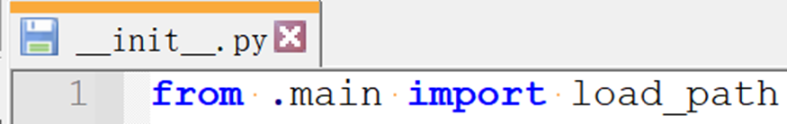

main.py中的load\_path函数通过importlib库加载full.pyc文件并将其作为模块对象，最后调用该对象的get\_path函数。

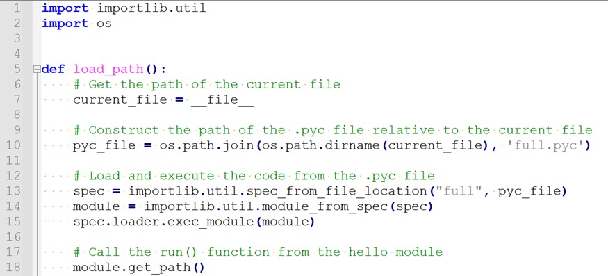

从full.pyc的文件头中可知，该文件是3.10b版本Python编写的，部分工具如pycdc，uncompyle6无法完整的反编译出py源码。手动反编译结果如下：

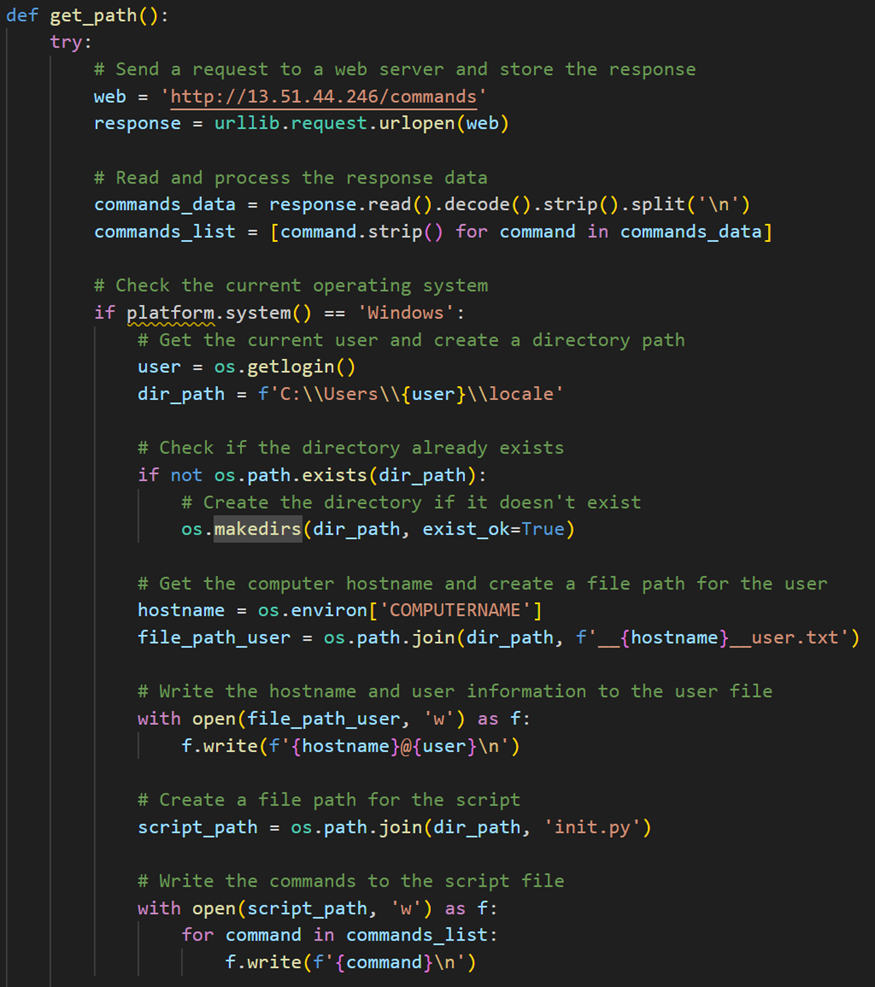

get\_path函数首先会根据宿主的系统决定相关的行为，在Windows下，该函数会向C2服务器发送自己的hostname和user信息，并且将C盘用户根目录下的目录结构发送给C2服务器。同时还会将从C2服务器上获取的commands写入本地。

随后会通过create\_windows\_task函数获取Python路径和恶意脚本路径，再使用命令：

``` bash
schtasks /create /tn "{task\_name}" /tr "{python\_path} {script\_path}" /sc minute /mo {trigger\_interval} /F /RL HIGHEST /NP
```

添加Windows计划任务。这个命令将创建一个计划任务，定期以最高权限运行指定的 Python 脚本。

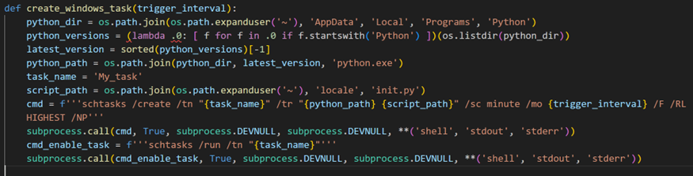

在Linux下，同样会向C2服务器发送自己的hostname和user信息，随后将当前的计划任务写入到了\_\_crontabl\\\_default.txt文件下。

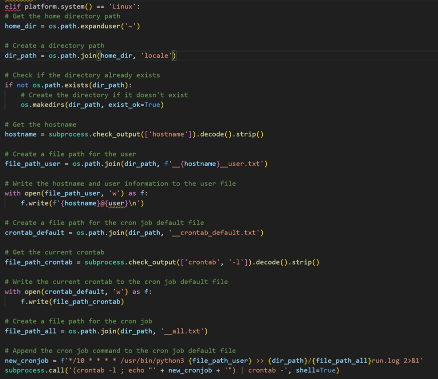

最后会用subprocess.call添加计划任务，任务为：

``` bash
\*/10 \* \* \* \* /usr/bin/python3 {file\_path\_user} >> {dir\_path}/{file\_path\_all}run.log 2>&1
```

含义是每隔 10 分钟执行一次 /usr/bin/python3 {file\_path\_user} 命令，并将输出结果追加到 {dir\_path}/{file\_path\_all}run.log 文件中。

send\_file函数会向C2服务器的uploads目录上传文件。

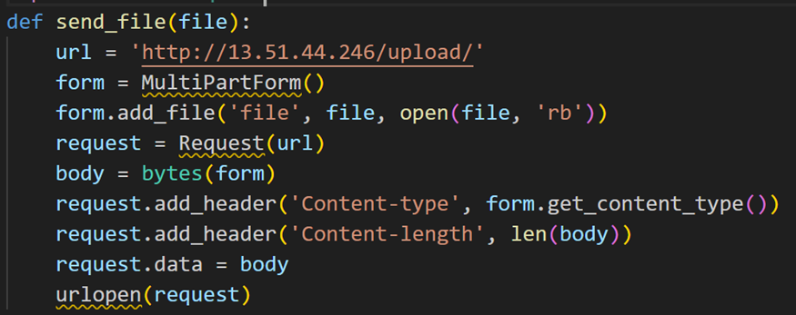

通过以上的函数结合，该恶意库的攻击行为可以进化。

第一阶段会从C2下载的新的Python文件，通过其中的execute\_commands\_as\_per\_url函数进行第二阶段的payload下载。

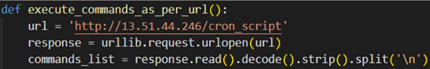

随后的攻击行为是多变而且可控的，由于在本文章编写的2023年6月5日，C2服务器的相关目录已删除，无法获取后续的payload，分析结束。

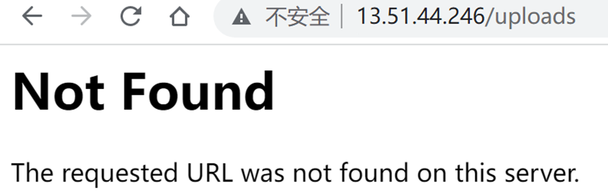

## 0x03 相关反应

2023年4月17日，该恶意包从PyPI存储库中删除。

2023年6月5日，仍能从国内镜像网站上下载到该恶意包。

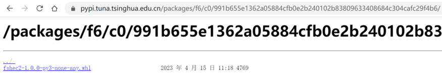

至2023年6月6日，微步未对该IP进行标记，VirusTotal上ADMINUSLabs，CRDF，CyRadar，ESET，ESTsecurity，Kaspersky共6家安全公司对该IP进行了标记。

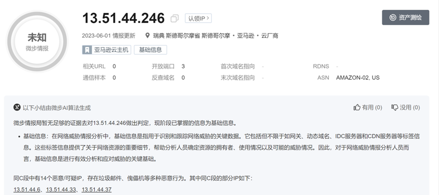

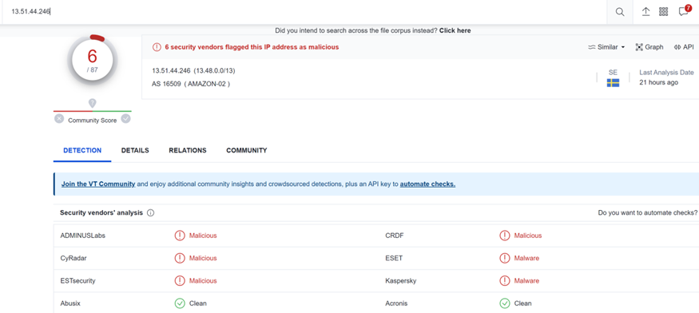

## 0x04 事件启示

如今，基于第三方库的攻击事件变得非常普遍，对于Python来说，即使PyPI对发布的软件包进行了源码检测，仍然会有一些恶意软件包能够逃脱检测并被上传。例如pyrologin、easytimestamp、discorder、discord-dev等恶意Python库，它们采用了与通用库相似的名称，导致程序员在使用pip install命令时意外安装这些恶意库，最后在调用恶意库的导出函数时进行了恶意操作。

本次的fshec2攻击示例，尽管没有采用先进的攻击技术，但它却成功地利用了pyc文件绕过了PyPI对源代码的检测以及杀毒软件的检测。这种可以简单复现的攻击手法需要引起安全相关人员和互联网公司的重视。

这种攻击手法提醒我们，尽管PyPI等开源库平台已经采取了一系列安全措施，但我们仍然需要保持高度警惕。作为开发者和用户，我们应该对第三方库的使用持谨慎态度，并采取一些预防措施来减少潜在的风险。具体措施如下：

*   仔细验证和核实要安装的库的来源及可信度。确保库的作者是可信赖的，并检查库的下载来源是否是官方渠道；
    
*   避免在生产环境中直接安装不受信任的库。使用库时，可以先在开发环境中进行测试和评估，确保库的功能和安全性符合预期；
    
*   及时更新已安装的库。随着安全漏洞的不断发现和修复，开源库的更新版本通常会修复已知的漏洞和安全问题；
    
*   在使用任何第三方库之前，应仔细阅读其文档、查看其社区反馈和评价，了解库的使用方式、功能和潜在风险。