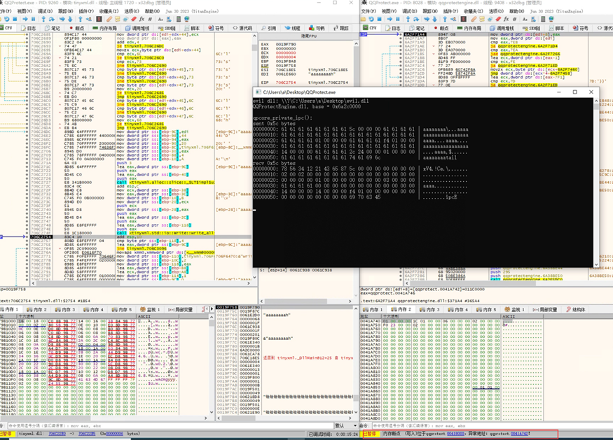

## 0x00 漏洞背景

QQ 是一款广泛使用的即时通讯软件，由腾讯公司开发和运营。它提供在线聊天、语音通话、视频通话、在线游戏等功能，成为了许多人日常沟通和社交的重要工具之一。QQ 拥有庞大的用户基础，并且其用户群体遍布全球。

TIM（腾讯即时通信）是腾讯公司推出的另一款即时通讯软件，旨在为企业和个人提供高效的即时沟通和协作平台。TIM支持文字聊天、语音通话、视频通话、群组聊天、文件传输等功能，并提供了企业级的团队协作工具和云服务。TIM在商务和工作场景中广泛应用，帮助用户提升工作效率和沟通效果

QQProtect（Q盾）是QQ安全防护进程，设计于对QQ程序进行完整性检查，以防止恶意软件对QQ的注入和篡改行为。其可执行文件QQProtect.exe通常位于C:\\Program Files (x86)\\Common Files\\Tencent\\QQProtect\\Bin处，它会在系统启动时以NT Authority\\SYSTEM权限作为名叫QPCore的Windows服务安装。

## 0x01 漏洞信息

**2023年5月27日**

GitHub上的用户vi3t1创建了关于QQ&TIM提权漏洞的PoC仓库qq-tim-elevation。

**2023年5月27-2023年6月13日**

i3t1发布了漏洞PoC。由于GitHub上commit时间可以修改，具体发布时间不详，其当前显示PoC的commit时间为2023年1月1日。

**2023年6月1日**

CVE创建该漏洞记录，编号为CVE-2023-34312。

## 0x02 漏洞影响

该漏洞影响软件为：

*   QQ 9.7.1.28940 ~ 9.7.8.29039
    
*   TIM 3.4.5.22071 ~ 3.4.7.22084

该漏洞影响组件为：

*   QQProtect.exe 4.5.0.9424 (in TIM 3.4.5.22071)
    
*   QQProtect.exe 4.5.0.9426 (in QQ 9.7.1.28940)
    
*   QQProtectEngine.dll 4.5.0.9424 (in TIM 3.4.5.22071)
    
*   QQProtectEngine.dll 4.5.0.9426 (in QQ 9.7.1.28940)
    
该漏洞由于QQProtect.exe与QQProtectEngine.dll未进行进程间通信的指针校验，导致了"Write-What-Where"（WWW，“Write”表示写入的行为。"What"表示要写入的数据，可以是任意的二进制值。"Where"表示要写入的目标内存地址）的情况。通过WWW攻击，低权限攻击者可以获得NT Authority\\SYSTEM权限的shell。

## 0x03 漏洞分析

笔者选择的QQ安装包版本为9.7.6.28989，其QQProtect的版本为4.5.0.9426。

### 3.1 成因分析

**3.1.1 QQProtect.exe**

漏洞位于QQProtect.exe+0x40c9f8处。dword\_41A740为一个全局变量，如果QQProtect正常运行其值为1。a2是一个攻击者可以控制的指针，因此攻击者可以在任意地址写入DWORD(1)。

该段代码存在于函数sub\_40C950内。函数sub\_40C950会在QQProtect.exe执行时作为QPCore的回调函数。

查看SetQPCoreCallback函数，其位于QQProtectEngine.dll文件中。发现QPCore的回调函数被保存在了全局变量dword\_1012662C中。

**3.1.2 QQProtectEngine.dll**

漏洞位于QQProtectEngine.dll+0x3B4F6处。v3是一个攻击者可以控制的指针，因此攻击者可以在任意地址写入其地址+4的值。

v3传入的值来源于从管道读取的数据。

**3.1.3 总结**

至此，如果我们能控制传入回调函数的参数，就能改变程序的执行流程。

所以我们应该首先更改dword\_41A740的值，随后将回调函数的地址修改，也就是修改dword\_1012662C的值，最后我们就能通过ROP（Return-Oriented Programming，是一种利用程序中已存在的代码片段"gadgets"来构造恶意代码执行路径的技术）实现攻击。

### 3.2 PoC分析

PoC链接：GitHub - vi3t1/qq-tim-elevation: CVE-2023-34312

**3.2.1 tinyxml.dll**

首先通过以下代码获取evil.dll的路径和QQProtectEngine.dll的基址，由于QQProtectEngine.dll开启了ASLR，所以建议使用虚拟机保存快照进行漏洞复现，不然可能会造成利用成功一次便无法再次复现。这里加载QQProtectEngine.dll并非是为了使用，而是为了获取其基址编写真正我们需要攻击的QQProtect.exe的exp。

随后通过以下代码改变0x0041A740处的值，也就是上述的全局变量DWORD的值。这里write\_addr\_plus\_4\_at内部代码处理地址-8，是为了对应上述的v3\[2\]=(unsigned int)(v3+3)。于是0x0041A742开始的DWORD变成了0x0041A746，由于intel是小端序，所以0x0041A740处变成了01 00 46 A7。

在这之后就是触发QPCore的回调函数，来覆盖QPCore的回调函数地址。如下述代码，qqprotectengine\_dllbase + 0x12662C - 3为了只让A7一个字节覆盖，这时候QPCore的回调函数地址为0x0040C9A7。

最后再次向命名管道写入数据使得QQProtect.exe加载了evil.dll文件。

**3.2.2 evil.dll**

该dll在加载的时候会执行以下操作：

*   打开当前进程的访问令牌（token）。
    
*   创建一个新的访问令牌（token2），通过复制当前进程的访问令牌，并设置相关属性。
    
*   获取当前会话的会话ID，并将其设置为访问令牌（token2）的会话ID。
    
*   初始化一个STARTUPINFOW结构体（用于创建新进程的启动信息）。
    
*   创建一个新的进程（cmd.exe）作为用户会话（token2）的一部分。
    

由于当前进程QQProtect.exe的权限为NT Authority\\SYSTEM，故而获取的是最高权限的shell。

### 3.3 漏洞复现

如下图，PID：8836是攻击端，PID：8028是系统自启开启的受害端。

随后进行write\_addr\_plus\_4\_at函数覆盖0x0041A742。在0x0041A742处打一个写入断点。向命名管道写入数据后，断点被触发。触发EIP为00418000。

执行完后0x0041A740处DWORD被修改。

再触发回调函数，使得回调函数地址被DWORD\_41A740修改。此时回调函数地址为0x0040C9A7。

再通过ROP，使得QQProtect.exe加载evil.dll。启动SYSTEM权限的shell。

## 0x04 修复方法

在腾讯官网下载最新版本的QQ。

QQ版本9.7.10.29074已无 QQProtect.exe。

