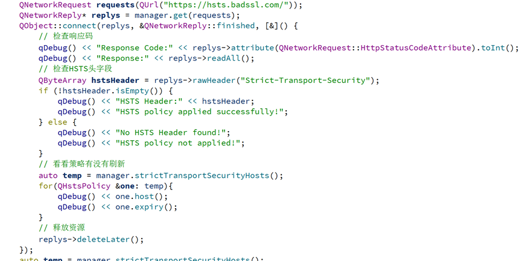
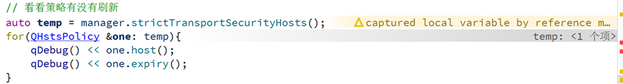
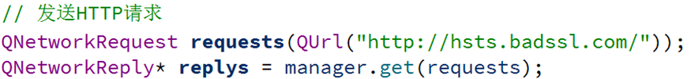
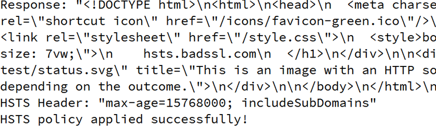
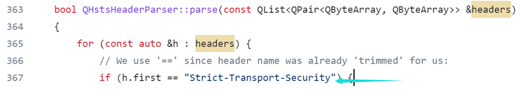
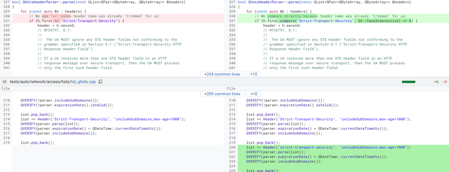

## 0x00 漏洞背景

Qt是一个跨平台的C++应用程序开发框架，用于创建图形用户界面（GUI）应用程序、命令行工具、嵌入式系统和网络应用等各种类型的应用。

Qt框架包含的Qt Network（网络模块），提供了QNetworkAccessManager 类，该类允许应用程序发送网络请求和接收回复。其在处理响应时，会根据服务器发送的“Strict-Transport-Security”的响应头来更新HSTS策略。

## 0x01 漏洞信息

5月9日：Qt开发人员Mårten Nordheim提交漏洞修复的源码合并。

5月10日：Qt漏洞修复相关的代码合并通过。

5月28日：该漏洞被CVE收录，其编号为CVE-2023-32762。

## 0x02 漏洞影响

该漏洞存在Qt 5.15.14版本之前；6.2.9之前的6.X版本以及6.5.1之前的6.3.X-6.5.X版本。成因是Qt错误的解析了HSTS header，当大小写不匹配的时候，即使服务器明确禁止，客户端也会使用未加密的连接。

## 0x03 漏洞分析

首先需要介绍HSTS（HTTP Strict Transport Security），这是一种WEB安全策略。用来防止中间人和SSL/TLS剥离攻击。HSTS通过强制客户端（如Web浏览器）始终使用HTTPS来保护通信，即使用户手动输入的是HTTP网址。它通过在服务器的响应头中添加"Strict-Transport-Security"字段来实现。一旦浏览器收到带有HSTS头的响应，它将记住该网站必须通过HTTPS进行访问，并在未来的请求中自动将所有HTTP请求重定向到HTTPS。这样可以防止攻击者利用恶意重定向将用户导向不安全的HTTP连接。

随后进行漏洞分析与验证，笔者选择的是Qt6.2.4版本。

用来进行HSTS测试的网址为：_hsts.badssl.com_。

下述代码为使用QNetworkAccessManager对象发起HTTPS请求，该网站以HTTPS请求的时候会返回Strict-Transport-Security响应头。Qt会隐式的调用QHstsHeaderParser类解析HSTS header随后更新QHstsCache中的策略。

manager.strictTransportSecurityHosts函数能获取当前的HSTS策略。当执行到QObject::connect内时，可发现temp中添加了一项策略。

随后我们使用的http://hsts.badssl.com/ 会自动换成https://hsts.badssl.com/ 。由于本身QNetworkAccessManager发送多个网络请求的异步性，这里我们使用如下代码手动添加策略：

_// 添加HSTS策略  
 QListhstsPolicies;  
 QHstsPolicy policy;  
 policy.setHost("hsts.badssl.com");  
 policy.setIncludesSubDomains(true);  
 QDateTime expiry = QDateTime::currentDateTime().addYears(1); // 设置过期时间为1年后  
 policy.setExpiry(expiry);  
 hstsPolicies.append(policy);  
 manager.addStrictTransportSecurityHosts(hstsPolicies);_

之后发送HTTP请求：

此时的响应头是HTTPS请求的响应头。

后续客户端对该域名服务器的任何HTTP请求都将被隐式的转换成HTTPS请求。

但是当服务器返回的响应头的HSTS头部是Strict-Transport-security，此时Security的S变成了s。这时客户端便不会引入新的策略，从而导致了继续使用明文协议HTTP。

Qt是一个开源的软件，可以去定位相关的代码，笔者在netword/access/qhsts.cpp中发现了产生漏洞的代码。代码使用了==将响应头字段与Strict-Transport-security进行了比较，导致了大小写不匹配时，HSTS策略引入失败。

## 0x04 修复方法

Qt开发者对源码的修复如下：

*   当匹配Strict-Transport-Security字段的时候，使用大小写不敏感进行匹配。
    
*   引入全小写的测试用例进行测试。

用户可以通过使用新版本的Qt预编译库进行漏洞修复。