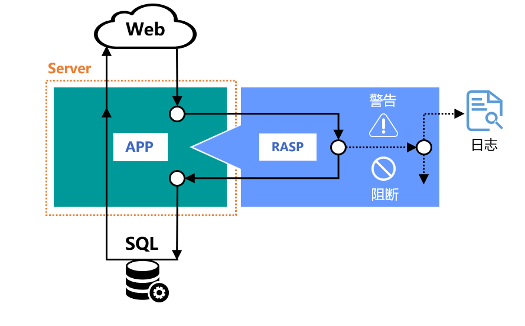
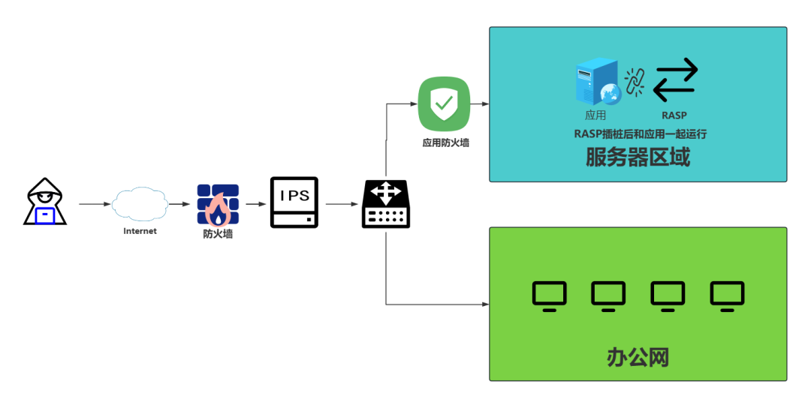
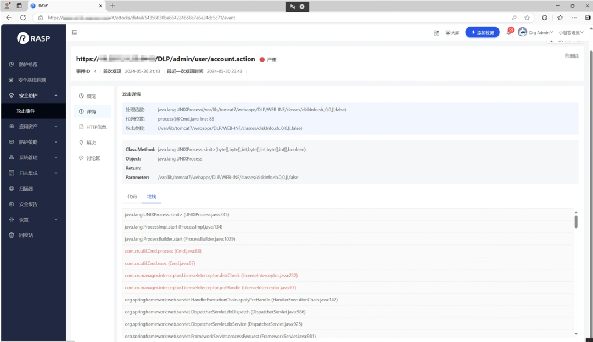
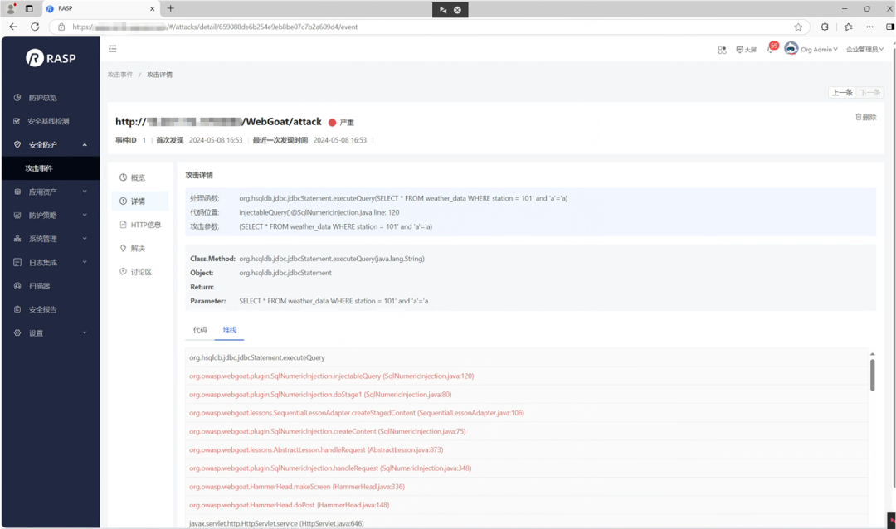
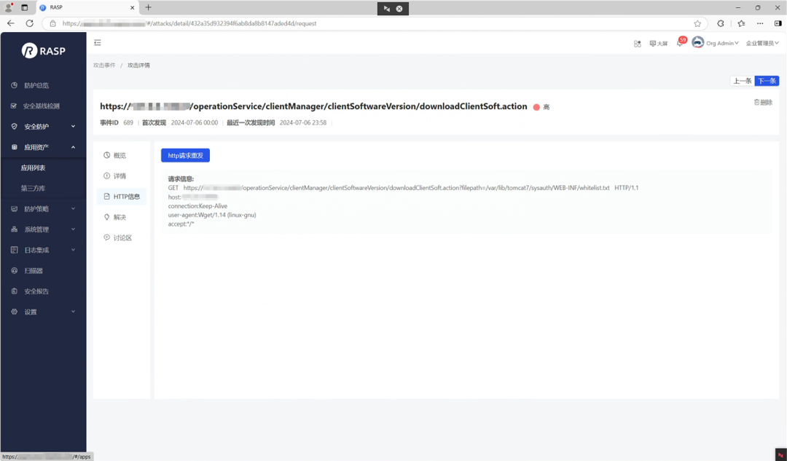

从2016年至今，每年在不同地域都会举办网络安全攻防演练，起初只是小规模的试点项目，到如今它已经发展成为一场大规模的红蓝对抗演练。随着演练规模不断扩大，红队攻击手段也在不断升级，攻击面也在持续扩大，对于蓝队而言，防护工作也面临越来越大的挑战。

总结过去几年的攻防演练，我们可以发现红队在攻击手段上的几个趋势：

首先，供应链攻击成为红队的重点手段。攻击方开始将目光转向软件供应链的系统或平台，尤其是已经被广泛使用的国产商业软件，包括安全产品、OA系统、办公软件以及内容管理系统（CMS）在内都成为了重点攻击目标。

其次，攻击手段多样化。社会工程学和鱼叉式钓鱼攻击手法不断翻新，例如通过供应链投放带毒补丁，或发送内容以假乱真的钓鱼邮件或微信链接，攻击渠道更是扩展到了云环境、微信公众号、小程序、APP等多个维度。

再者，开源软件漏洞成为重要的攻击利用漏洞类型。开源软件漏洞和开源组件漏洞的0day挖掘和利用成为了目前攻防演练中防不胜防的攻击方式。同时，一些国内流行的低代码开源项目也成为新的攻击目标。

最后，API接口安全问题日渐突出。API接口逐渐成为主要的攻击目标，这直接导致数据安全风险加剧。针对API自身系统的攻击，如Swagger文件利用、撞库、批量数据爬取等层出不穷，API本身的漏洞如未授权访问、重放攻击等也备受关注。

面对这些攻击，负责防守的蓝队也会采取多层次、互为补充的纵深防御策略，在防御体系中通常会包括：

* **作为首道防线的边界防火墙**，控制进出流量，过滤潜在威胁。

* **网络入侵检测/防御系统（NIDS/IPS）**，进一步监测和拦截可疑行为。

* **Web应用防火墙（WAF）**，专门防御如SQL注入、跨站脚本（XSS）攻击等针对Web应用的攻击。

* **主机入侵检测系统（HIDS）**，实现主机层面的安全防护。

* **态势感知系统**，基于各类不同部署节点和层次的监测和防御系统，构建实时监控网络中各种威胁的运营感知能力。

作为Web应用的主要防御手段之一，WAF虽然能有效拦截常见的Web攻击，但它主要依赖已知攻击模式的特征来识别威胁，面对未知的0day漏洞可能束手无策，攻击者也在不断寻找绕过WAF的攻击方法和技巧。

在此背景下，一些企业开始引入运行时应用自我保护（RASP）技术，以弥补现有防御体系的不足。RASP与应用程序紧密相连，能够在应用运行时实时防御攻击，无需额外组件支持。对于常见的OA系统厂商，一旦爆出0day漏洞，RASP可在WAF防护盲区提供额外的安全保障。尽管RASP不是银弹，但它对攻击方而言无疑大大提高了攻击难度和成本。

另外，RASP支持细粒度的策略配置和热补丁，可以基于企业的实际应用部署情况进行量体裁衣，对个别应用进行针对性防护，也让RASP成为WAF之外的另一种防御手段。

## 什么是RASP技术

早在2014年，Gartner公司就提出了“运行时应用自我保护（Runtime Application Self-Protection，RASP）”的概念，这是一种创新的应用安全防护技术，其核心理念是将保护机制以类似疫苗注射的方式注入到应用程序内部，使之与应用程序融为一体。这使得应用程序具备了自我保护的能力，能够实时检测和阻断针对自身的攻击，在遭受实际攻击时能够自动启动防御，而无需人工干预。

相比之下，Web应用防火墙（WAF）的防护思路是在应用程序之前设置一道防线，阻挡针对应用程序的攻击。

RASP的核心思想是将安全防护逻辑嵌入到应用程序的运行时环境中，使其成为应用程序不可分割的一部分。这样，RASP能够在应用程序运行过程中从内部实时监控和控制应用程序的行为，并提供持续的安全防护。

其防护特点有以下四个方面：

1. **代理和插桩：** RASP通常以代理（Agent）的形式部署，或者通过在应用程序的代码中插入安全检测逻辑（即插桩，Instrumentation）来实现。通过代理或插桩作为RASP的感知组件，能够捕获应用程序的运行中的控制流和数据流。

2. **行为分析：** RASP利用行为分析技术来识别和评估应用程序的行为。它通过定义一系列“正常行为”基线，并将实时监测到的行为与这些基线进行比对以发现异常行为。

3. **上下文感知：** 与基于网络流量的防御措施（如WAF）不同，RASP能够通过分析应用程序的控制流和数据流感知应用程序的上下文信息，包括用户的身份、应用程序的状态和正在执行的操作。这使得RASP能够更准确地判断一个行为是否存在威胁。

4. **实时干预：** 当RASP检测到可疑的攻击行为时，它可以立即采取措施，例如阻止恶意输入、终止会话或向管理员发出警报。这种实时干预能力是RASP区别于其他安全措施的显著特点。



如上图所示，拥有以上防护特点的RASP作为一个安全防护组件与应用程序并行运行，这使它能够观察所有的控制流和数据流，以评估应用程序执行的安全性。

如果攻击者试图进行恶意操作，如代码注入、未授权访问等，RASP可以立即识别这些异常行为并采取阻断、告警等应对措施。

## RASP的部署结构

RASP可以作为现有网络安全防护体系的有益补充，与其他安全措施（如Web应用防火墙，WAF）协同部署，形成多层次、立体化的纵深防御。

在这种部署模式下，WAF作为网络边界的第一道防线，负责检查和过滤所有进出Web应用的流量，主要应对来自外部的常规性Web攻击，如SQL注入、跨站脚本（XSS）等。而RASP则作为第二道防线，专门保护Web应用内部，提供更细粒度的控制和实时监测。RASP紧密集成在应用程序内部，能够洞察应用程序的执行流程和数据流动，对恶意行为进行准确识别和阻断。

这种“WAF+RASP”的协同防御，可以有效弥补单一安全措施的局限性（如下图所示）：

* **WAF善于防范常规的外部攻击，** 但对应用内部的逻辑漏洞和特定攻击无能为力，而RASP恰恰能够补上这一短板。

* **RASP能够发现WAF难以检测的复杂攻击，** 如业务逻辑漏洞利用、重放攻击等，但RASP需要一定的资源开销，不适合大流量的初步过滤，而这正是WAF的长项。



此外，在云环境下，由于基础设施的虚拟化和动态调配，传统的网络边界防护变得困难，而RASP以软件形态与应用程序共生，不依赖于特定的网络部署，因此可以轻松地集成到云服务和应用中，为云上资产提供安全保障。

现代Web应用的安全防护已不再是“二选一”的问题，而是需要不同层次、不同维度安全措施的联防协同。WAF和RASP的有机结合，将大大提升Web应用抵御各种威胁的韧性，也是实现纵深防御战略的关键一环。

## RASP防护技术的适用性

在我们参与的多次攻防演练中，RASP技术凭借其独特的内部监控能力和对应用程序行为的深度理解，在攻防演练中展现出以下优势：

**1. 精准的威胁检测：** 得益于其在应用内部的位置优势，RASP能够洞悉应用程序的正常行为模式，从而实现对各类恶意行为的精准识别，显著降低误报率。

**2. 未知威胁防御：** RASP不依赖于已知攻击的特征码，而是基于应用执行过程中的异常行为来识别威胁，因此能够有效应对0day漏洞或变种载荷等未知漏洞攻击或攻击载荷。

**3. 细粒度访问控制：** 借助上下文感知能力，RASP能够基于用户身份、访问来源等多维度信息，对不同的应用模块实施差异化的安全策略，实现更细粒度的权限控制，从而避免一刀切的安全防护对应用产生稳定性影响。

**4. 虚拟补丁：** 当应用程序出现漏洞时，RASP能够在不修改源代码的情况下实现快速防护，为开发团队修复漏洞争取宝贵的时间窗口。这种“虚拟补丁”能力对于缩短攻击暴露窗口期至关重要。

当然，以上良好的效果更加适用于为记录型应用提供安全防护，对于实时性要求极高的交互型应用，RASP的适用性则需要更审慎的评估。

所谓记录型应用，是类似OA系统、ERP系统等系统，此类应用通常涉及大量数据的存储和处理，但其对实时性的要求相对较低。RASP在这类场景中表现出色，能够有效识别和阻断针对核心数据的攻击企图。

而对于实时交互性要求极高的交互型应用，如实时交易平台、在线游戏服务端等，RASP的接入则需要更谨慎的设计和评估。这类应用通常对响应延迟有苛刻的限制，任何额外的处理耗时都可能影响用户体验。不恰当的RASP部署可能带来显著的性能开销，因此需要精细的配置和持续的性能测试，以达到安全与性能的最佳平衡。

因此，RASP技术在实际应用程序的防护中仍面临以下挑战：

**1. 兼容性问题：** RASP的部署需要与应用程序进行深度集成，这对目标平台和应用代码有较强的依赖性。考虑到应用程序可能采用多样的技术栈和架构，这进一步加大了RASP部署和维护的复杂度。要实现无缝支持，RASP产品需要对主流开发语言和框架提供全面覆盖。

**2. 性能影响：** 在注重高可用性的生产环境中，RASP的接入可能对服务器性能造成一定影响。由于RASP需要对应用程序的关键执行路径进行实时监控和干预，这不可避免地会引入额外的计算开销。此外，RASP的威胁检测和防护动作也会占用CPU和内存资源。这就要求RASP产品在功能完备性和性能优化上进行精细的权衡，尽量减少对应用服务质量的影响。

## 某头部快递公司在攻防演练中的应用

作为国内头部快递公司，该公司有着体量巨大的业务，因而对安全防护提出了极高的要求。为了强化整体网络安全能力，该公司决定将RASP技术纳入其纵深防御体系，作为关键的一环。

经过精心规划和实施，在今年的某次攻防演练中，RASP技术在该公司的部分应用系统进行部署，其部署范围涉及79个应用程序、1361台服务器，同时部署了1143个Agent，并在整个攻防演练期间截获攻击事件14767次（含自动化安全测试触发的事件），即便剔除自动化安全测试过程中触发的警报，真实的攻击事件数量也相当可观。这表明即使是在已经部署了传统安全防线（如WAF、IDS等）的情况下，应用层面仍然存在大量的攻击风险，而RASP能够有效补齐这一防护短板。

此次攻防演练期间通过RASP技术拦截的漏洞类型包括但不限于：

**命令执行漏洞：**（下图仅作示例，非实际截图）



**SQL注入漏洞：**（下图仅作示例，非实际截图）



**目录遍历漏洞：**（下图仅作示例，非实际截图）



**不安全的文件上传漏洞：**（下图仅作示例，非实际截图）


除此之外，RASP可以检测和阻断的漏洞类型还包括：

1. 不安全的文件操作漏洞

2. 反射型XSS漏洞

3. XML外部实体注入（XXE）漏洞

4. 远程代码执行（RCE）漏洞

5. 不安全的反序列化漏洞

6. 服务器端请求伪造（SSRF）漏洞

7. 敏感信息泄露漏洞

8. DNS攻击漏洞

9. URL跳转漏洞

下面我们以其中的三次拦截作为RASP防护原理和效果的示例。

### **Log4j远程代码执行漏洞防护**

在对某系统的攻击中，攻击者尝试利用Log4j漏洞对某系统进行远程代码执行攻击。攻击者构造了一个恶意的HTTP GET请求（如下），其中包含了利用JNDI进行远程代码执行的参数。

> GET http://xxxx.com/bi/?action=%24%7Bjndi%3Adns%3A%2F%2Fi-5407cf-ubbh-d574.dns.xxx.com%7D&proc=%24%7Bjndi%3Adns%3A%2F%2Fi-5407cf-ubbh-d574.dns.xxx.com%7D&resource=%24%7Bjndi%3Adns%3A%2F%2Fi-5407cf-ubbh-d574.dns.xxx.com%7D

**RASP的防护过程：**

**1. 请求拦截：** RASP探针监控所有进入应用程序的请求。当上述恶意请求到达时，RASP立即对其进行分析。

**2. 行为识别：** RASP通过其内置的检测逻辑，识别出请求中的参数符合远程代码执行攻击的特征。

**3. 上下文分析：** RASP进一步分析请求的上下文环境，确认这不是一个正常的业务请求，而是一个潜在的安全威胁。

**4. 阻断攻击：** 一旦确认请求具有恶意性，RASP立即阻断该请求，防止其到达后端服务。

**5. 告警通知：** RASP生成安全告警，并将相关信息发送给安全团队，以便进行进一步的分析和响应。

**6. 日志记录：** RASP记录详细的日志信息，包括攻击的时间、来源IP、攻击载荷等，为后续的安全审计和攻击溯源提供数据支持。

### **FastJson反序列化漏洞防护**

攻击者尝试利用FastJson的反序列化漏洞对系统进行攻击。构造了一个精心设计的JSON请求（如下），其中包含了利用FastJson反序列化特性进行DNS请求的恶意代码。

``` TEXT
{
    "\\u0040\\u0074\\u0079\\u0070\\u0065": "\\u006a\\u0061\\u0076\\u0061\\u002e\\u006e\\u0065\\u0074\\u002e\\u0049\\u006e\\u0065\\u0074\\u0034\\u0041\\u0064\\u0064\\u0072\\u0065\\u0073\\u0073",
    "\\u0076\\u0061\\u006c": "ginpowslxu.xxx.cn"
}
```

解码后的内容如下：

``` TEXT
{ "@type": "java.net.Inet4Address", "val": "ginpowslxu.xxx.cn" }
```

**RASP的防护过程：**

**1. 请求拦截：** RASP探针监控所有进入应用程序的请求。当上述恶意JSON请求到达时，RASP立即对其进行分析。

**2. 行为识别：** RASP通过其内置的检测逻辑，识别出请求中的JSON数据符合FastJson反序列化攻击的特征。

**3. 上下文分析：** RASP进一步分析请求的上下文环境，确认这不是一个正常的业务请求，而是一个潜在的安全威胁。

**4. 阻断攻击：** 一旦确认请求具有恶意性，RASP立即阻断该请求，防止其到达后端服务。

**5. 告警通知：** RASP生成安全告警，并将相关信息发送给安全团队，以便进行进一步的分析和响应。

**6. 日志记录：** RASP记录详细的日志信息，包括攻击的时间、来源IP、攻击载荷等，为后续的安全审计和攻击溯源提供数据支持。

### **系统敏感信息泄露防护**

攻击者尝试通过访问特定的JSP页面（MonitorStatusForServer.jsp）来获取系统的属性信息（如下）。在没有适当的安全措施的情况下，该页面可能会调用System.getProperties()方法，从而泄露敏感信息。

> GET /security/monitor/MonitorStatusForServer.jsp

**RASP的防护过程：**

**1. 请求拦截：** 当攻击者的请求到达服务器并被应用程序接收时，RASP探针立即开始监控这个请求。

**2. 行为识别：** RASP探针分析请求的目的和行为，识别出该请求是针对MonitorStatusForServer.jsp页面的。

**3. 上下文分析：** 进一步分析请求的上下文环境，确认这不是一个正常的业务请求，而是一个可能的敏感信息泄露风险。

**4. 方法调用监控：** RASP探针监控JSP页面的执行过程，特别是检测到对System.getProperties()方法的调用。

**5. 阻断攻击：** 一旦RASP代理检测到调用System.getProperties()可能导致敏感信息泄露，它立即阻断该请求的进一步执行。

**6. 告警通知：** RASP代理生成安全告警，并将详细信息发送给安全团队，以便进行进一步的分析和响应。

**7. 日志记录：** RASP代理记录详细的日志信息，包括攻击的时间、来源IP、请求URL等，为后续的安全审计和攻击溯源提供数据支持。

从以上示例可以看出，在攻防演练的实际应用中，RASP技术可以成功拦截多种类型的攻击，包括Log4j和FastJson漏洞攻击，以及敏感信息泄露的尝试。通过请求拦截、行为识别、上下文分析、阻断攻击、告警通知和日志记录等步骤，RASP可以有效提升系统整体安全防护能力。

总的来说，**RASP在安全防护体系中的位置是作为现有防护措施的补充，而不是替代。** 它与WAF等其他安全措施配合使用，可以充分发挥各自的技术优势，实现纵深防御策略。

同时，通过国内快递行业的头部企业的实战应用，该公司对RASP技术的大规模应用无疑是一次成功的尝试，通过在纵深防御框架中合理嵌入RASP可以有效提升整体安全防护水平，为其核心业务运营保驾护航。