日常开发过程中，开发人员经常需要从一大段复杂的字符串中快速匹配特殊规律的字符串，比如，在用户输入手机号、身份证号等字符后，提醒用户是否输入规范。通常，**这些功能的实现需要依赖叫做“正则表达式”的方法**，当在它在处理一些复杂的、嵌套的或者具有多个重复的模式字符串时就**会造成程序卡死，即造成ReDoS**。

## 正则表达式简介

**正则表达式是一种用单个字符串来表示各种字符串的表达方式**，通常用于在文本中搜索和提取字符串。例如，在工作中需要编写一个从文章中提取电话号码的程序，可以使用图1所示的正则表达式来表示“电话号码”这个字符串的特征，就可以方便快速地进行检查。

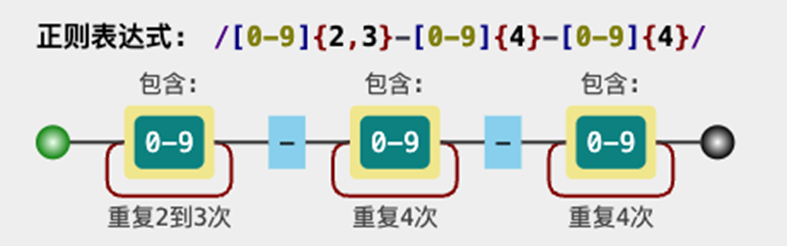

图1 表示电话号码的正则表达式字符串

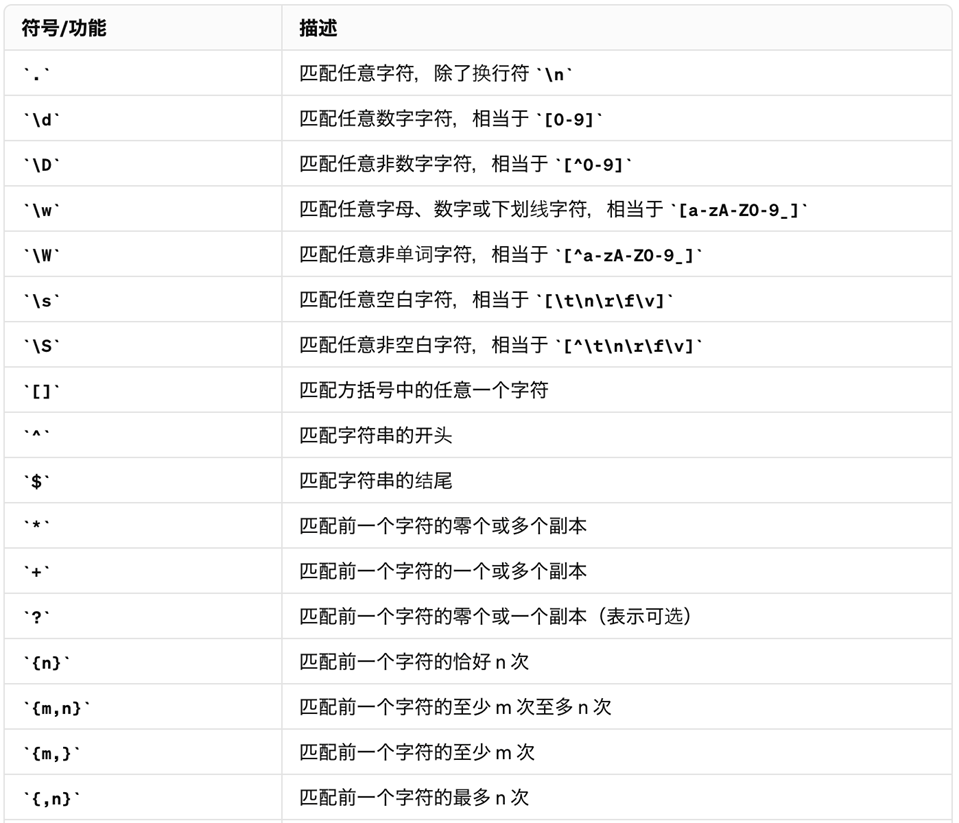

表1 正则表达式基础语法

图1中，第一个\[0-9\]表示数字0到9中的一个字符，紧接着的{2,3}表示重复出现两次或三次的字符串，短横杠字符后是\[0-9\]{4}-\[0-9\]{4}，表示电话号码的“中间4位数-后4位数”的正则表达式。

正则表达式的语法有很多种，本文内容基于Python语言编写，所以笔者使用Python中使用的正则表达式语法来进行解释。

基于以上正则表达式可以写一个简单的匹配电话号码的Python程序：

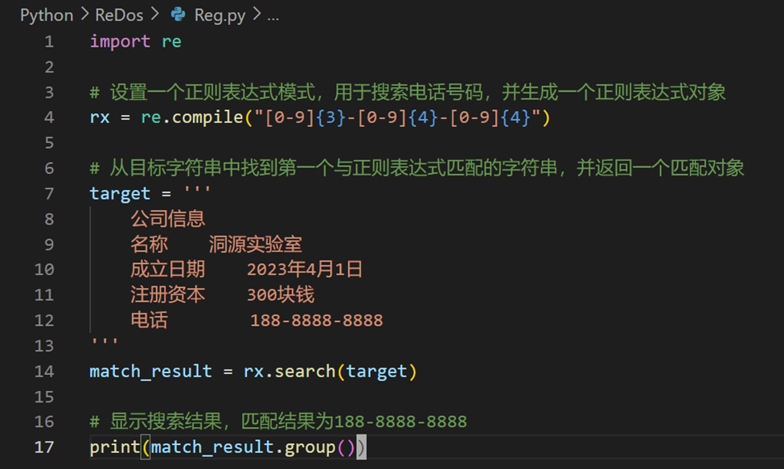

图2 Python电话号码的正则表达式字符串

这段代码导入的re正则模块，使用compile定义正则表达式\[0-9\]{3}-\[0-9\]{4}-\[0-9\]{4}并赋予rx对象，然后使用search方法查找目标字符串target中匹配的手机号，最后成功匹配到188-8888-8888。

## ReDoS的基础原理及示例

正则表达式在匹配字符串时会使用到大量的“回溯”，比如正则表达式ab{1,3}c匹配字符串ababbbcbbbccc的过程：

当前字符a与正则匹配成功，继续；

当前字符b尝试匹配b{1,3}贪婪模式的1个b，匹配内容是ab，继续；

当前字符a尝试匹配正则的c，匹配失败；

回到字符串第3个字符a重新匹配正则，与a匹配成功，继续；

连续匹配成功b{1,3}贪婪模式的3个b，捕获abbb字符串，继续；

当前字符c匹配成功，捕获abbbc字符串，继续；

后续六个字符均无法与正则中的a匹配，退出。

也就是，正则表达式会在字符串匹配中尝试所有可能的匹配，直到匹配失败。而当正则中出现类似{}、+、\*这类表示匹配数量的含义时会发生回溯（backtracking），如果正则表达式在匹配字符串的时候发生数量巨大的回溯，便会导致灾难性回溯（catastrophic backtracking），从而消耗程序大量的计算资源，造成拒绝服务攻击（Denial of Service）。同时也说明，相同匹配规则的正则表达式用不同的写法有不同的匹配次数，良好的正则表达式可以降低匹配次数，提升匹配效率，比如相比上述正则的一种更差写法a(b|bb|bbb)c。

下图中的代码是利用回溯消耗计算资源的一个示例。由于正则解释器是不同的开发语言内置的，因此选择不同开发语言做正则匹配的效率也不同，下图中代码如果用Python 2.\*运行，可能需要将近一个小时才能完成这个匹配。

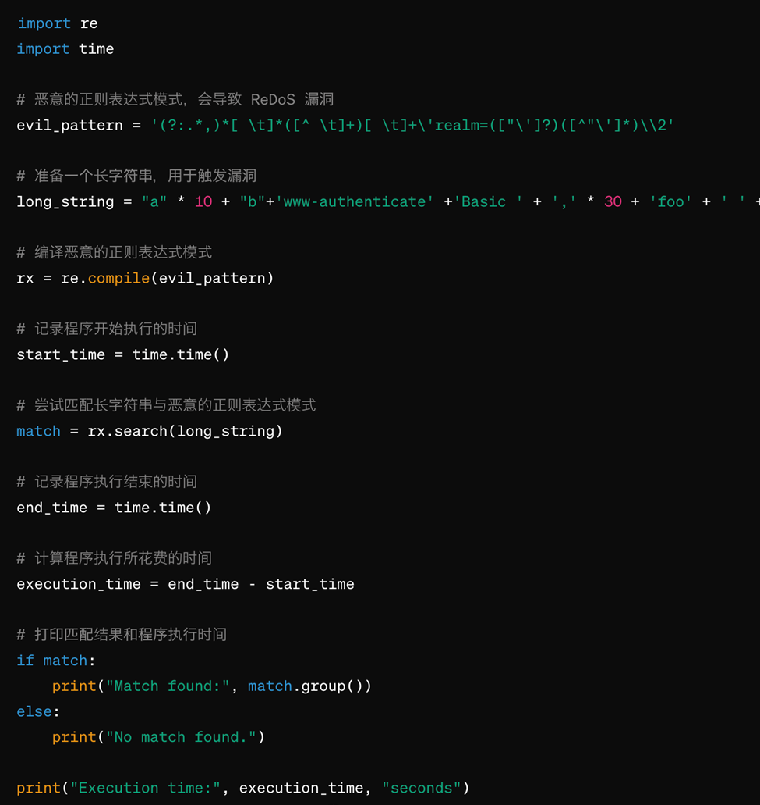

图3 通过控制“回溯”数量来控制匹配时间

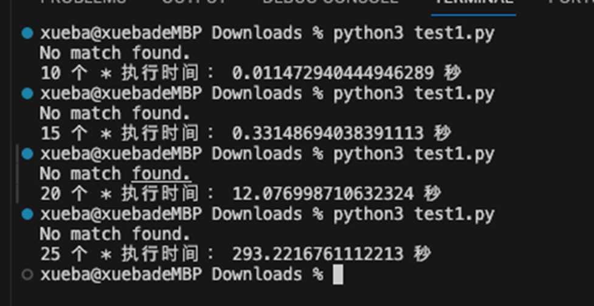

图4 通过控制“\*”数量来控制回溯数量来增加匹配时长

通过改变逗号的数量来查看程序运行的时长，结果见图4。如果有10个逗号，程序执行0.011秒，而逗号的数量改为25，则需要293秒(4.8分钟)才能完成运行。

## 攻击Python服务示例

笔者以图3的正则表达式为基础，构建了一个有Web Basic身份验证机制的Python服务，并使用该正则表达式检测HTTP响应中的身份认证信息。

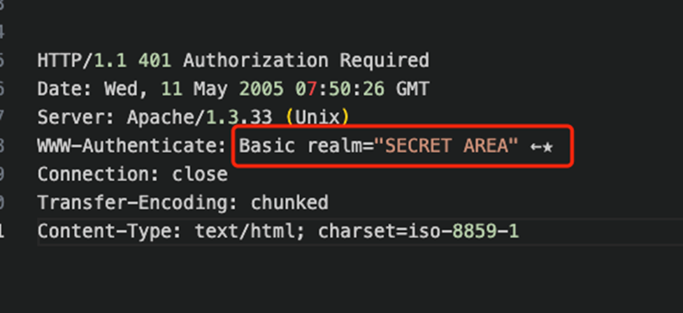

图5 通过HTTP响应代码中的WWW-Authenticate值验证用户身份

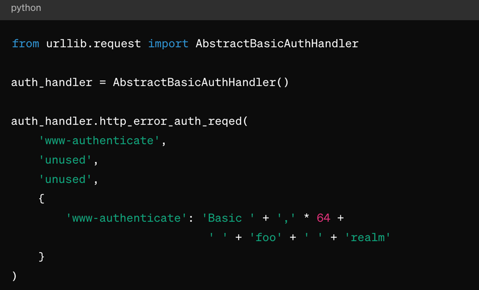

图6 构造一个虚假的请求头信息，在其中添加正则匹配的部分

该请求可以让正在运行的Python服务中的urllib.request去校验登录请求，从而对其请求头信息进行正则匹配，造成无限制的正则表达式的回溯匹配，达到拒绝服务的效果。

另外，某些应用在用户登录功能逻辑中，会在后端检测用户口令中是否有包含用户名，从而检测口令的强度。

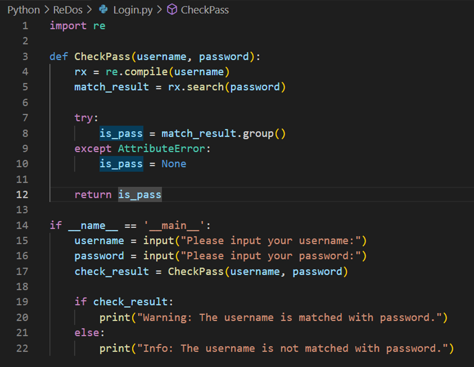

图7 登录过程中判断口令是否包含账户名

上述逻辑中，由于用户名和口令是由用户输出，且用户名被当作正则表示编译和匹配，那么假如攻击者输入的用户名是^((\[a-z\])+.)+\[A-Z\](\[a-z\])+$，口令是aaaaaaaaaaaaaaaaaaaaaaaaaaaaaaaaaaaaaaaaaaaaaaaaaaaaaaaaaaaaaaa，会导致该程序的匹配次数飙升，从而造成CPU占用率的上升。

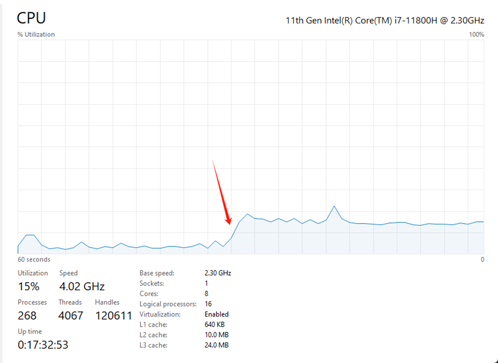

图8 CPU占用率在程序执行后上升到15%

  
## 正则匹配的原理

正则表达式的“解释正则表达式字符串”和“判断输入字符串是否匹配的部分”是利用有限状态机来实现的。

有限状态机（FSM，Finite State Automaton）是指对于给定的一系列输入序列，内部状态根据其输入转换，并根据输入结束时的状态(接受还是拒绝)输出(确定)的数学模型。有限状态机的特征之一是它内部定义的状态数，顾名思义，限定为有限的状态。

比如，要查看二进制数中是否有偶数数量的0，则可以使用有限状态机。下方的图9用状态转换图表示确定是否有偶数数量0的有限状态机。

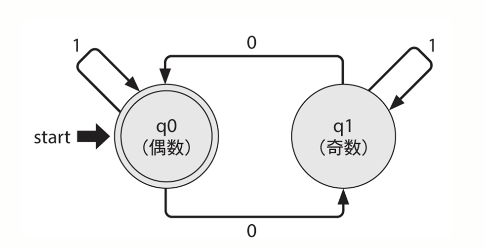

图9 二进制中检测0的数量是否为偶数的有限状态机的状态转换图

状态转换图中每个圆圈表示一种状态，圆圈中的“q0(偶数)”和“q1(奇数)”表示这些状态中的一种。粗箭头所指的圆圈是开始时的状态，双圈表示“受理”的状态（本例中受理状态是指偶数个0的状态）。然后，从每个圆圈延伸出来的细箭头上的数字表示每个输入，箭头指向的方向是与该输入相对应的转换目标的状态（本例中输入是0和1）。

如果输入是1010，从左到右读取字符，第一个输入字符是1，它从q0指向q0，下一个输入是0，状态机从q0指向q1。接下来是1，从q1指向q1，最后一个输入是0，从 q1指向q0。

开始状态q0→q0→q1→q1→q0（结束: 接受结果，偶数个0）

最终结果如上所述，用双圈表示的q0成为此次处理的受理状态（偶数），因此判定“1010中有偶数个0”。

## Cloudflare的ReDoS攻击事件

2019年7月2日，Cloudflare在WAF管理规则中部署一条新规则，该规则中的正则表达式能够产生灾难性回溯，造成HTTP/HTTPS服务所在服务器CPU资源消耗剧增，同时也影响了Cloudflare的核心代理、CDN和WAF功能。

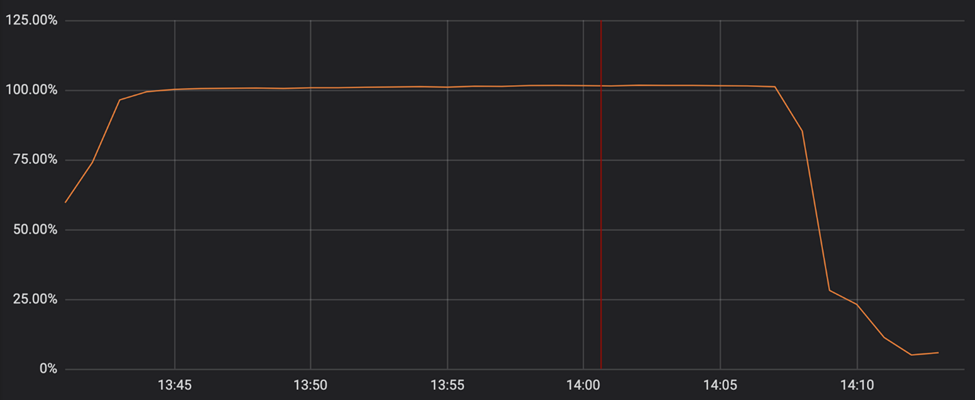

图10 事件发生的半个小时内，CPU占用率飙升至100%

产生的后果是，包括Cloudflare公司在内的所有使用Cloudflare域名解析服务的网站访问页面都是502 Bad Gateway。而在此之前，Cloudflare已经6年未发生过全球性事故了，对于公司的品牌和声誉影响可见一斑。

事故是当天的13:42一名工程师提交的WAF规则变更导致，由于WAF规则更新的及时性特性，WAF规则更新无需经过灰度发布，且集成测试中也无关于CPU性能的测试，故导致错误的规则被发布上线。事故处理时Cloudflare一度将全球的WAF功能停用，最终在14:52修复问题并恢复WAF。其中涉及的正则表达式如下：

    (?:(?:\"|'|\]|\}|\\|\d|(?:nan|infinity|true|false|null|undefined|symbol|math)|\`|\-|\+)+[)]*;?((?:\s|-|~|!|{}|\|\||\+)*.*(?:.*=.*)))

问题出自该正则中非捕获分组（non-capturing group）.\*(?:.\*=.\*)，简化之后事.\*.\*=.\*，上文说过在诸如\*出没的正则中要注意回溯的问题，这里的连续三个.\*表达式，意味着字符串越长，回溯的次数越多，正则匹配需要花费的时间越长。比如下图中的匹配时间对比。

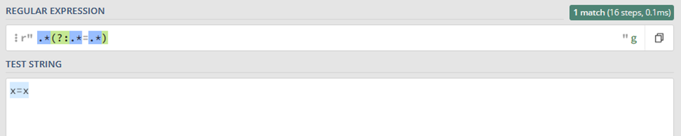

图11 x=x字符串的匹配步骤是16步，耗时0.1ms

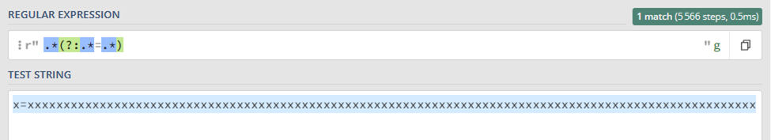

图12 更换字符串之后匹配步骤是5566步，耗时0.5ms

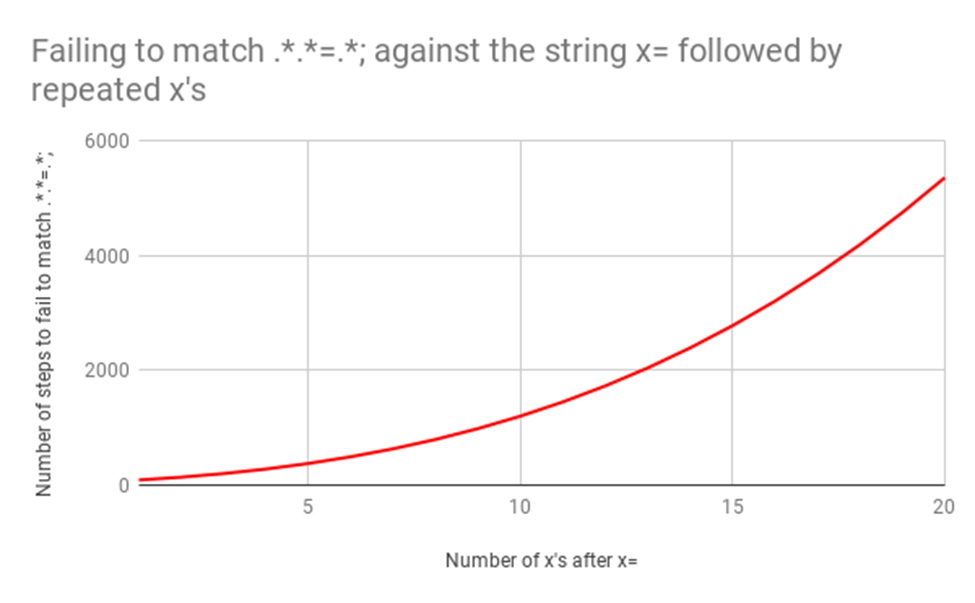

图13 x的数量与执行步骤之间的关系

## 如何避免ReDoS漏洞

在设计和开发过程中，避免ReDoS漏洞的方法有多种，包括：

输入验证和消毒（sanitization）：确保用户输入在用于生成正则表达式之前经过验证和消毒。

*   **输入长度限制：** 实施输入长度限制，限制可处理的用户输入长度。
    
*   **利用超时设置：** 使用超时值来限制单个正则表达式匹配所能花费的时间。
    
*   **检查正则表达式：** 检查正则表达式设计的合理性和灾难性回溯问题。
    
*   **使用安全的库：** 使用维护良好、文档齐全的最新安全正则表达式库。
    
*   **更换安全的正则匹配引擎：** 如Cloudflare事后更换了re2或Rust正则引擎。
    
以下是基于上文开头示例代码修改的ReDoS攻击防御代码，该代码会在正则表达式匹配超过1秒时候停止执行：

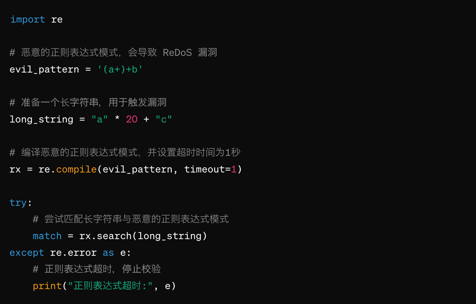

图14 函数校验正字符串产出ReDoS后停止

## 参考资料

1. https://blog.cloudflare.com/details-of-the-cloudflare-outage-on-july-2-2019/