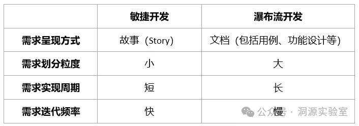

## 前言

信息行业的实践有诸多借鉴现实世界，软件工程之所以称为“工程”，是早期借鉴土木工程的原因，直到后来人们才认识到软件开发本质上是无法精确衡量的，这与现实世界中的工程有着天壤之别，保罗·格雷厄姆用画家来比喻软件开发工程师，用画画来比作软件开发，软件开发与工程类的差异由此可见一斑。

由于软件开发和工程行业的差异，在软件开发过程中强化安全能力、解决安全问题便无法纯粹使用工程手段或技术手段解决，而土木工程领域，安全能力可以通过检查工人装备（安全绳，安全帽，安全灯）、设备部署及状态（防护栏，防护网）、操作方式（砂轮切割机操作）等等来体现。因此，相比工具的使用，软件开发安全更强调流程管理及协作。

另外，安全损失的影响不同造成软件开发安全会不同于工程作业安全，多数行业中前者的安全问题不大会造成人身伤亡，且不易评估损失，而后者的安全损失则往往直接和人身安全、健康相关，且损失更为直观。因此，软件开发过程中的安全工作，期望所有参与人员对于安全有足够重视、理解和配合是一种奢望。

无论是工程领域，还是软件开发，都需要安全工作在立项之初介入，以最大程度降低安全问题造成的危害；无论是敏捷开发，还是DevOps，都希望将前置时间尽可能降低，通过快速反馈、快速迭代、快速学习将问题快速暴露、快速解决。

因此，SDL过程的安全要求对应的是软件开发过程中的需求阶段，且在整个过程中，安全工作需要尽可能地降低对于产品、UI、研发、测试、运维等原有人员工作习惯和流程的影响。安全是产品属性，软件安全开发的前提是安全部门或人员需要能够同步收到产品研发的立项信息，安全工作对于原有工作流程和人员习惯的过度影响，会导致产品侧对于安全工作的忽视甚至敌视，结果是，安全部门不知道产品立项，安全工作无从着手，安全开发无法落地。

## 安全要求对应过程

当前的软件开发流程，多以敏捷开发为主，部分行业和公司还有使用瀑布流开发，或双模IT（即敏捷开发和瀑布流开发并行）。敏捷开发和瀑布流开发在需求部分工作的区别如下：

无论是现实世界，还是信息世界，安全工程在宏观上都由四部分组成：策略（Policy）、机制（Mechanism）、保障（Assurance）、激励（Incentive）。SDL模型的安全要求阶段，主要围绕策略展开，并细分为三个部分：确定安全要求、创建质量门/bug栏、安全及隐私风险评估。在实践SDL前，需要熟悉产研过程，软件开发中的安全工作需要贴着产研过程，才能达到最理想的结果：安全工作落地无阻碍、产品安全漏洞及风险降低。本文以敏捷开发中需求阶段的工作为例，说明SDL实践中安全要求阶段的工作内容。

敏捷开发过程中，需求工作的主要参与角色是产品经理或产品负责人（Product Onwer），产品需求是从少到多、由粗到细的过程，产品经理作为客户/用户的代表，从客户/用户角度提炼描述用户故事（Story），即“作为用户……，我希望……，以达到……目的”，并将产品故事列入需求池（backlog），在需求尚未实现前，用户故事逐渐细化和明确，行程最终可供开发人员明确需求内容和评估工作量的需求。因此，用户故事和产品需求没有明确的界限，故事即需求，需求即故事，是用户和需求实现者之间沟通的桥梁。需求工作中关键的节点是：

*   Scrum of Scrums：或称信使会，是由产品负责人共同参与，目的是明确产品、团队分工，以及用户故事的合理性，即“要不要做”。
    
*   迭代任务会：即IPM（Iteration Planning Meeting），是由产品负责人和需求实现者（包括UI、开发、测试、安全等）共同参与，目的是解决需求的不明确、不清晰，并由开发团队评估需求，根据需求优先级，选择本次迭代周期内的需求，解决需求“怎么做”的问题。
    
根据SDL模型，安全要求需要尽可能早的在立项初期介入，对应到上文研发过程的需求阶段，即是IPM会之前的阶段，介于backlog与IPM之间，在这期间，用户故事逐渐完善和细化，安全要求也因此可以同步进行。如果在IPM开始或即将开始时，安全工作才介入，会导致安全人员数量捉襟见肘，安全要求仓促完成，没有充分的时间了解和熟悉需求内容，很容易在IPM后因为安全要求需要修订产品需求，且在需求修订之后还需要再次召开IPM，导致需求及实现延期，影响到正常的迭代周期甚至产品开发进度，对于产品负责人和其他技术角色而言，安全工作要么会流于形式，要么不愿主动配合。

一个完整的用户故事（产品需求），会至少包含以下内容：

*   需求背景
    
*   需求意义/目的
    
*   目标用户
    
*   功能描述
    
*   原型UI
    
*   验收标准
    
*   需求优先级
    

安全顾问或安全工程师在着手安全要求的工作时，至少需要了解其中的背景、意义/目的、目标用户、功能描述，前三者构成最终实现后需求的使用场景，而安全漏洞及风险的评估需要基于场景考虑，一把放在菜市场供肉贩子剁肉的剁肉刀，和一把放在家庭厨房供家里人做饭用的剁肉刀，潜在的风险和漏洞是完全不同的，防止风险发生的措施也是不同的。

## 安全要求确定方法

在获取到产品需求后，安全人员需要进行评估和确定，需求“应该做到什么”才能够确保在不影响需求目的和实现的前提下，降低安全问题发生的概率及损失。在IPM之前尽可能早地设立安全要求，有助于产品经理即时修订需求内容，将安全要求融合到需求的功能描述中，并最终在IPM上，让参与的技术人员尽早了解后续需求的安全功能及安全目标。安全要求的设定中，可以从需求和安全两个方向共四个维度考虑。

从需求的功能描述角度，有两个维度可以考虑：

*   **功能安全（security of function）**：功能描述中存在的安全风险和漏洞，比如输入框的XSS；
    
*   **安全功能（security function）**：基于功能描述，需要额外增加的增强安全的功能，比如登录验证码；
    

从安全漏洞的角度有两个维度考虑：

*   **安全合规**：从法律法规角度分析，比如等级保护中安全计算环境对身份鉴别、访问控制、数据保密性都有相应的要求，比如对于一个登陆功能，安全要求可以是“用户口令应该加密存储，无法碰撞或破解”；
    
*   **业务安全**：根据需求背景、目的、用户及功能描述，分析潜在的业务风险，比如对于一个抽奖功能的需求，安全要求可以是“每人每天只能抽一次”；

技术安全之所以没有在考虑范围内，是因为产品需求大多不涉及具体的技术设计，安全要求是对产品需求宏观层面的安全策略设计。如果负责安全要求设立的安全顾问或安全工程师有足够强的安全技术能力，可以将安全要求从技术层面设立的更加具体，比如“用户口令应该使用SHA1(SHA1(PASS)+SALT)，SALT长度和口令长度相同且随机”。

**安全要求的设立需要是合理且积极描述**，不合理的要求既无法实现，也会损害安全顾问对于其他人员的印象和信任，特别是会引起技术人员对于安全顾问能力的质疑，合理包括安全要求从需求引出、安全要求可以达到，比如，对于管理系统需求，提出的安全要求是“任何人都不能访问该系统”。积极的安全要求指描述上是“要如何如何”，而非消极的“不要如何如何”，后者犹如黑名单，或无法让其他人员清晰的理解安全要求，或会造成安全要求实现时的要求降低或绕过，比如“用户口令应该加密存储，无法碰撞或破解”和“用户口令不能明文存储”的差异，后者在实现中很可能只是用编码变形解决。

**安全的本质是一种经济考量，或投入产出比（ROI）**，安全损失 ✖ 发生概率 ＞ 安全投入，**因此并非每一个安全问题都需要解决**，比如现实世界中信用卡公司允许坏账的发生就是这种考量。在软件开发的需求阶段，安全要求需要在不影响需求实现和效果的前提，设立最低的门槛，可以减少后续安全工作对于产研过程的影响，过多的安全要求意味着更多的安全投入，意味着产品收益/成本比的降低，用户因安全牺牲便捷的抱怨。

虽然一些软件的bug可能造成安全漏洞，但软件开发过程中安全工作更侧重于安全问题的发现和解决，软件质量问题往往会由QA部门负责，因此SDL模型中的质量门在实践中往往不会是重点，甚至不考虑。由于软件开发的不精确、不标准（即修复A漏洞可能会出现B漏洞，甚至所有漏洞都修复后，存在新的漏洞），迭代开发的结果不太可能完全没有安全漏洞，或者，如果要达到安全漏洞数量和危害降低到极致，需要花费巨大的时间、精力和资金，对于产品整体是不划算的。因此创建bug栏的目的是为了设定需求能够上线的最低安全漏洞门槛，门槛的设立可以从技术和业务两个角度设立，比如没有中危以上的安全漏洞，低危漏洞不超过10个，或者某个重要功能没有任何安全漏洞。

对于重要的需求，安全风险评估是在安全要求的基础上，对于安全要求的实现进行确认的机制，重点关注需求安全性的评估，在业务线较多的企业中，核心的业务线的核心需求可以额外通过安全评估检查需求实现结果的安全性，比如增加威胁建模、代码安全审计、渗透测试等等，从不影响、不干扰研发流程整体进度考虑，惯常的做法是采用代码安全审计和渗透测试，因为不需要开发人员参与，也不影响研发进度。

隐私风险评估需要结合企业内部的数据安全等级划分，以及国家隐私保护相关的法律法规，将需求中存在的隐私相关的风险进行评估和定级，并最终能够从业务和安全角度提出对于隐私处理的建议和要求，业务角度是指，在理解需求背景和目的的基础上，通过改变功能描述将原本存在隐私风险降低或消除，比如某个投票功能的需求，是人力部门为了了解员工对于公司及部门的满意度，面向公司内部员工进行调查，功能描述中需要记录参与投票人员的姓名、工号、部门、手机。基于该需求的背景和目的，匿名投票可以达到更好的效果，因此姓名、工号、手机是没有必要搜集和存储的。

实践中，确定安全要求、设立bug栏、安全和隐私评估并不会有明确的工作界限，隐私评估往往是和安全要求同时考虑，最终，针对产品需求内容，形成对应的安全要求及上线标准，后者通常并不会针对每个需求都特意加以考虑，而是形成公司内部整体的标准，比如：所有需求上线不能包含中危以上安全漏洞，漏洞级别由安全部门评估。因此，安全要求阶段的工作更多是针对需求中安全风险的评估及安全要求的设立，同时，过程中也需要对于需求本身有足够的认识，并非不能干涉或修改需求描述，对于产品负责人而言，背景和目的是关键，由于多数产品经理没有相关技术背景，在需求描述中通常都会缺乏对于技术可行性的考虑。另外，并非每一个需求都需要进行安全评估和要求设定，比如修改文字或更换图片，因此从用户故事创建到IPM，安全部门越早同步用户故事，便能越早地评估是否需要进行安全要求设定，但难点也恰恰在此。

有产品意识的开发人员难得一见，能够既熟悉业务、又熟悉安全技术，同时具备安全设计能力，跨部门协调和沟通能力的人员更是难得一见，因此，SDL实践中能够进行安全要求设计的安全顾问或安全工程师往往是资深的安全技术人员，甚至是安全负责人。