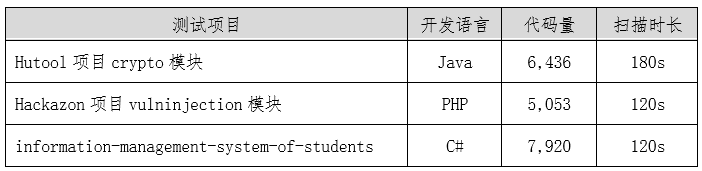

## 测评背景

随着数字技术的进步，网络安全行业日益发展，企业对于DevSecOps的应用和落地的需求日益增加，静态源代码安全扫描工具已成为其中的关键产品或工具。  

2023年5月30日，OWASP中国基于目前行业内的相关调研报告以及行业共识发布了 **《静态源代码安全扫描工具测评基准》v2.0** 版本，对于静态源代码安全扫描工具的测评基准进行了升级。

在此基础上，【洞源实验室】联合【武汉金银湖实验室】邀请国内外各大厂商以部署环境、安全扫描、漏洞检测、源码支持、扩展集成、产品交互以及报告输出七个维度为基准，开展“静态源代码安全扫描工具测评活动”。

## 测评详情

**产品名称：** Checkmarx CxEnterprise（Static Code Analyzer）

**版本选择：** Checkmarx CxEnterprise 9.5

**测评依据：** 《静态源代码安全扫描工具测评基准》 v2.0

**基准测评项：** 部署环境、安全扫描、漏洞检测、源码支持、扩展集成、产品交互、报告输出

**部署环境：** 处理器：Inter(R) Core(TM) i5-7200U / 内存：16 GB / 硬盘：500 GB

## 测评结果

**测评结果总览**

本次测评从七个维度对产品进行测评，根据测评详情描述，测评结果分为：满足、部分满足和不满足。

**平均扫描速率（单位：秒）**

千行级样本扫描速度

万行级样本扫描速度

百万行级样本扫描速度

**平均漏洞误报率/漏报率**

漏洞误报率/漏报率结果汇总

## 报告下载

完整版报告下载：[点击下载](./assets/静态源代码安全分析工具-Checkmarx测评报告（终版）.pdf)

> 版权所有 © 洞源实验室 2023
>
> 未经授权，禁止用于商业用途。
>
> 如需授权使用，请联系：repoog#gmail.com