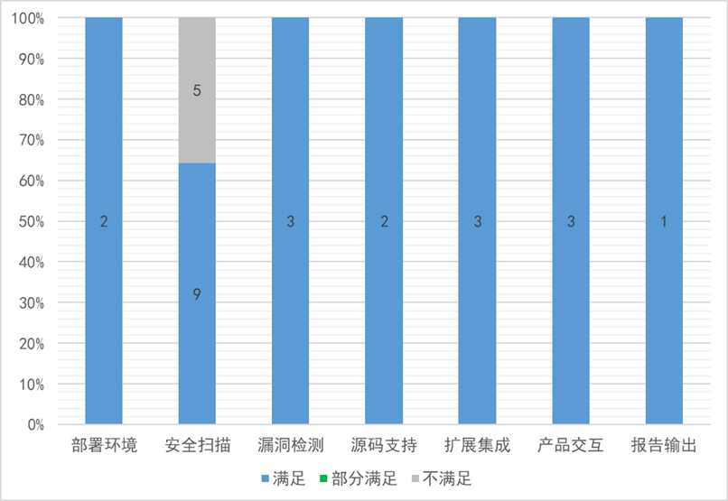

## 测评背景

随着数字技术的进步，网络安全行业日益发展，企业对于DevSecOps的应用和落地的需求日益增加，静态源代码安全扫描工具已成为其中的关键产品或工具。同时，在代码安全审计或检测过程中，也需要选择一款合适的、好用的代码安全扫描工具作为人工辅助。

2023年5月30日，OWASP中国基于目前行业内的相关调研报告以及行业共识，发布了《静态源代码安全扫描工具测评基准》v2.0版本，对于静态源代码安全扫描工具的测评基准进行了升级，基准涵盖部署环境、安全扫描、漏洞检测、源码支持、扩展集成、产品交互以及报告输出七个维度。

在基准发布的基础上，【网安基地供应链安全检测中心】联合【武汉金银湖实验室】邀请国内各静态源代码安全扫描产品或工具的厂商开展了“静态源代码安全扫描工具测评活动”。

本次测评经过前期准备、宣传、厂商征集、产品沟通、产品测评、报告编写等环节，历时四个多月，共有六款产品参与测评，其中国内厂商的测评结果和报告已单独和厂商沟通，测评详情不对外发布。

经过严格的测评程序，现公布测评对比结果如下（其中一款产品的测评结果按照厂商要求不参与对比结果发布）。

## 参与厂商

（按拼音首字母排序，排名不分先后）

## 测评详情

**基准测评项：**

部署环境、安全扫描、漏洞检测、源码支持、扩展集成、产品交互、报告输出

**部署环境：**

处理器：Inter(R) Core(TM) i5-7200U

内存：16 GB

硬盘：500 GB

## 测评结果

本次测评从七个维度对产品进行测评，根据测评详情描述，测评结果分为：**满足、部分满足和不满足**。

### Checkmarx

从七个维度进行测评，结论为：

**部署环境：** 共2个分项，全部满足

**安全扫描：** 共14个分项，其中9个满足，5个不满足

**漏洞检测：** 共3个分项，全部满足

**源码支持****：** 共2个分项，其中1个满足，1个部分满足

**扩展集成：** 共3个分项，全部满足

**产品交互：** 共3个分项，全部满足

**报告输出：** 共1个分项，全部满足

**总计：满足22个，部分满足1个；不满足5个**

### Fortify

从七个维度进行测评，结论为：

**部署环境：** 共2个分项，全部满足

**安全扫描：** 共14个分项，其中8个满足，6个不满足

**漏洞检测：** 共3个分项，全部满足

**源码支持：** 共2个分项，其中1个满足，1个部分满足

**扩展集成：** 共3个分项，全部满足

**产品交互：** 共3个分项，全部满足

**报告输出：** 共1个分项，全部满足

**总计：满足21个，部分满足1个；不满足6个**

### SonarQube

从七个维度进行测评，结论为：

**部署环境：** 共2个分项，全部满足

**安全扫描：** 共14个分项，其中7个满足，1个部分满足，6个不满足

**漏洞检测：** 共3个分项，其中2个满足，1个不满足

**源码支持：** 共2个分项，其中1个满足，1个部分满足

**扩展集成：** 共3个分项，其中2个满足，1个不满足

**产品交互：** 共3个分项，全部满足

**报告输出：** 共1个分项，1个不满足

**总计：满足17个，部分满足2个；不满足9个**

### CodeSec

从七个维度进行测评，结论为：

**部署环境：** 共2个分项，全部满足

**安全扫描：** 共14个分项，其中9个满足，5个不满足

**漏洞检测：** 共3个分项，全部满足

**源码支持：** 共2个分项，全部满足

**扩展集成：** 共3个分项，全部满足

**产品交互：** 共3个分项，全部满足

**报告输出：** 共1个分项，全部满足

**总计：满足23个，部分满足0个；不满足5个**
  

### Xcheck

从七个维度进行测评，结论为：

**部署环境：** 共2个分项，全部满足

**安全扫描：** 共14个分项，其中9个满足，5个不满足

**漏洞检测：** 共3个分项，全部满足

**源码支持：** 共2个分项，其中1个满足，1个部分满足

**扩展集成：** 共3个分项，全部满足

**产品交互：** 共3个分项，全部满足

**报告输出：** 共1个分项，其中1个部分满足

**总计：满足21个，部分满足2个；不满足5个**

## 总结

*   在**部署环境**方面，所有5个产品均满足了全部要求。
    
*   在**安全扫描**方面，CheckMarx、CodeSec和Xcheck表现最佳，满足了14个分项中的9个；Fortify满足了8个；SonarQube满足了7个，部分满足1个。
    
*   在**漏洞检测**方面，CheckMarx、Fortify、CodeSec和Xcheck均满足了全部3个分项的要求，而SonarQube只满足了2个。
    
*   在**源码支持**方面，CheckMarx部分满足，Fortify和SonarQube各满足1个和部分满足1个，而CodeSec完全满足，Xcheck满足1个，部分满足1个。
    
*   在**扩展集成**方面，CheckMarx、Fortify、CodeSec和Xcheck均完全满足了全部3个分项的要求，但SonarQube只满足了2个。
    
*   在**产品交互**方面，所有5个产品均满足了全部3个分项的要求。
    
*   在**报告输出**方面，CheckMarx、Fortify和CodeSec均满足了唯一的1个分项，SonarQube没有满足，而Xcheck部分满足。
    
综上可见，国内外产品在部署环境和产品交互等基础方面无明显差距，但在关键的安全扫描、漏洞检测、源码支持、扩展集成和报告输出等核心功能上，国内产品CodeSec和Xcheck有领先优势。其中，CodeSec产品在源码支持和报告输出两个维度上表现最为突出，Xcheck产品的整体功能和表现也较为均衡。相比之下，国外产品SonarQube在多个维度上有所欠缺，与其他产品存在一定差距。

**总的来说，国内代码安全审计产品与国外同类产品平分秋色，在部分领域甚至略有领先。**