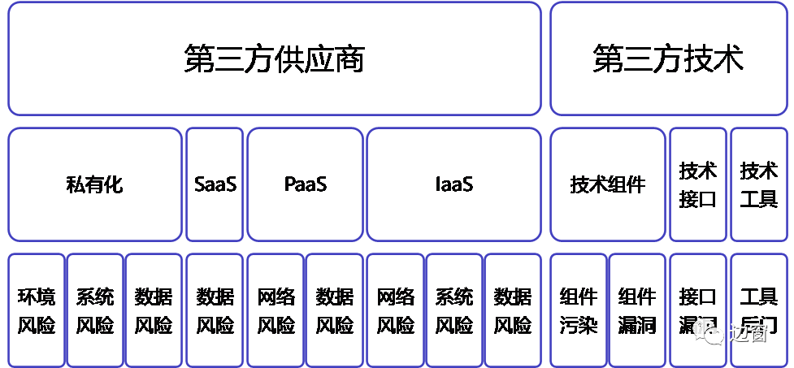

2015年9月，有人爆出XCode编译器中存在植入的第三方代码，非官方渠道下载的XCode编译发布的iOS应用可能存在后门，后经证实，有上千款iOS应用存在恶意代码注入，该事件被称之为XCodeGhost。

2017年5月，国外的安全人员发现惠普多个系列笔记本电脑的音频驱动中存在内置键盘记录器，能够监控用户的按键输入，并保存在可读文件中。之后，惠普回应称这是调试驱动的代码，并发布了更新驱动程序。

2020年12月，FireEye发布了SolarWinds供应链攻击的报告，报告称网络管理软件供应商SolarWinds的Orion软件中存在后门，受影响客户包括北美、欧洲，涉及18000多个客户。该攻击可以追溯到2019年10月份，并疑似与SolarWinds一名实习生使用弱口令“solarwinds123”有关。

2020年12月，有文章爆出有产业巨头的系统源代码在网上兜售，由于SonarQube未授权访问接口的漏洞，导致攻击者可以利用该接口获取相关企业的代码管理凭据，从而获得经SonarQube扫描的项目源代码。

2021年3月，PHP官方Git仓库被发现有人以维护者的身份提交了两次含恶意代码的变更，好在官方及时发现并恢复了代码，避免了进一步的影响。

2021年12月，Apache Log4j组件被爆出存在远程代码执行漏洞，所有使用该组件的系统均存在漏洞被远程利用的风险，之后该组件虽经过多次升级，但依然没有彻底修复所有漏洞，而该组件只是由Apache基金会一名成员在业余时间开发和维护的，作者Ralph Goers几年前曾发帖请求赞助全职维护Log4j，但只有3个人捐赠。

## 一、供应链安全概述

供应链安全事件在最近几年频发，供应链安全也越来越被政府和企业重视，原因在于在供应链管理中可能导致安全风险的因素非常复杂，如果没有良好的供应链安全管理和风险控制，由于供应链导致的安全风险会急剧增加，甚至自始至终不知道攻击是如何发生（如SolarWinds事件中，发现者FireEye公司是在追查另一起APT攻击时发现Orion产品被植入后门的），且如何避免和防范下一次类似的攻击。

因此，当企业在考虑自身信息安全的时候，不得不考虑供应链安全，同时，每个企业作为经济活动中的一个环节，自身也是供应链中的一环，有着自己的上游和下游供应商，在安全愈加被重视的环境下，企业自身的客户和上游供应商都会要求企业具有一定的安全能力，这也是SOC2认证在最近几年大火的原因，SOC2被称为最难的企业安全认证，是基于美国注册会计师协会 (AICPA) 现有信托服务标准 (TSC) 审计标准委员会的报告，报告的目的是评估与安全性、可用性、处理完整性、机密性和隐私相关的组织信息系统。比如，SaaS服务厂商在给律师事务所提供产品和服务时，律师事务所服务的政府机构又会要求律所自身具有一定的安全能力和安全成熟度，这便需要律所的供应商也要具有一定的安全能力以及安全能力证明，即SaaS服务厂商需要具有相关的安全资质，如果该厂商能够出具SOC2 Type2的报告，则可以作为最有力的安全管理和安全技术证明。

与企业信息安全管理相同的是，供应链安全不是纯粹的IT问题，而是人、流程和知识的问题，在供应链庞杂的环境中，企业完全不被攻击或攻陷是不可避免的，因此需要从攻击者的角度进行安全防御建设。与传统的信息安全不同的是，供应链安全涉及到物理世界与信息世界的交互，两者之间并无间隙，且相互影响，比如上文提到的惠普笔记本事件，如果企业在办公设备采购中恰好选择了相关系列的设备，那么便需要进行资产排查和驱动升级等应对。

供应链安全涉及到的方面包括企业供应链管理中的：

*   采购  
    
*   供应商管理
    
*   供应链连续性
    
*   供应链质量
    
*   运输安全
    

从与供应商的商务关系到供应商的技术管理和实践，相关的风险又依次包括：

*   第三方供应商：供应商企业健康状况和企业实力
    
*   供应商安全实践：供应商内部安全管理和安全实践
    
*   被攻陷的软件、硬件：供应商提供的产品可能被攻击者掌握
    
*   软件、硬件的安全漏洞：供应商提供的产品本身存在安全漏洞
    
*   软件、硬件的恶意代码：供应商提供的产品被植入了后门、木马
    
*   第三方数据泄露或数据聚合：供应商存储的客户数据泄露或供应商通过数据分析获取客户机密/秘密
    

除此之外，还包括企业自身在技术活动中引入的技术角度的第三方技术，比如开发人员在编程中引用的第三方开源或商业组件、调用的免费SDK（Software Development Kit）、使用的开发工具或运维工具（IDE、IDE插件、数据库连接管理工具、服务器连接管理工具）等。这些技术角度的第三方供应链可能没有供应企业，可能早已无人维护，也可能只是个人业余时间维护（如Log4j）。

当下很多企业在从事诸如驻场服务、驻场咨询、现场交付等等活动的过程中，还会涉及到与供应商或供应商人员的身份认证、授权、权限管理以及数据分享的问题，比如企业在财务审计中需要将财报信息同步给事务所人员、安全公司驻场为企业提供渗透测试服务、供应商交付人员在企业办公场所进行产品交付、配置工作。

所以供应链安全本质上是企业管理自身管理范围之外的一系列相关企业、产品、技术、人员、流程，并期望相关企业和人员具备不低于企业自身安全水平的安全成熟度。

从技术供应的角度，企业供应链安全的风险来源如下图：

## 二、供应商管理和采购

当前没有哪家企业可以实现完全的自产自足，每家企业都需要借助其他供应商的能力完善自身的生产能力，在选择供应商和进行采购活动之前，企业自身需要完善相关的供应商管理制度或机制。

根据ISO27002（信息安全控制实用规则），涉及到供应商安全的规范包括：

*   供应商关系的信息安全：供应商遵守的信息安全策略、供应商协议的安全问题、信息和通信技术供应链；
    
*   供应商服务交付管理：监视和评审、变更管理；
    
与供应商关系的信息安全是指企业应当与供应商就供应产品或服务过程中，供应商人员应当遵守的最低安全要求和安全策略，确保供应商对于企业资产的访问是安全可控的，并明确双方合作中安全风险的处置原则和要求。供应商服务交付管理是为保障供应商的交付物保持一定的安全和质量水准，并确保交付变更不会带来新的安全风险。

根据SOC2（服务性机构控制体系鉴证）的合规要求，企业在供应商管理中需要具备：

*   供应商管理制度
    
*   供应商准入机制及资质审核
    
*   供应商的服务质量定期评估
    
*   供应商名单库
    
供应商管理中可能存在的风险，例如：SaaS厂商提供的产品自身存在安全漏洞，可被攻击者利用产生安全威胁，造成企业数据泄露；供应商产品设计存在安全风险，可以在客户不知情的情况下，由供应商内部员工任意访问客户的数据和记录；企业在采购某个供应商的产品前未了解供应商的企业状况，采购之后供应商倒闭造成企业的供应链维护缺失甚至企业经营损失。

在选择和评估供应商时，需要评估供应商的商务信息和技术能力，商务信息包括：法人、注册地、员工规模、注册资本、股权结构、融资信息、企业资质、过去三年工商变更信息或工商处罚信息，技术能力包括：安全资质、安全白皮书、安全实践描述（基础安全、数据安全、漏洞管理、人员管理等）、开发实践描述（开发团队、开发流程等）。

商务信息可以通过被动调查的方式从诸如天眼查、企查查获取供应商的相关信息，技术能力可以通过问卷调查的方式由供应商主动提供，调查的方式除供应商自述之外，还可要求提供相关的系统截图或代码截图证明相关的能力。

更进一步，可以在供应商的授权下，采用穿行测试、漏洞测试的方法，对于供应商系统进行安全审查和评估，范围包括安全合规、安全要求、安全设计、安全漏洞，确保供应商的提供的产品符合企业的安全要求。

供应商评估的目的是为了让企业了解供应商的以下信息：

*   供应商的软件/硬件研发过程有文档么，可复制么，可衡量么；
    
*   产品研发过程中有缓解漏洞的措施和手段么；
    
*   供应商的漏洞管理能力是怎样的，有发现、跟踪、验证、关闭漏洞能力么；
    
*   供应商的配置管理和质量管理是怎样的，如何确保不会因配置导致安全风险，以及确保质量符合要求；
    
*   恶意软件/后门是如何检测、防护、清理的；
    
*   数据管理生命周期中数据采集、存储、使用、销毁是如何的，包括保护、加密、留存、销毁；
    
*   人员安全是如何实践的，包括人员背景审查和审计、关键岗位保密协议和能力验证等等；
    
*   产品发布过程是如何保障安全的，是否有发布审核、批准和验证流程；
    
在设定供应商的准入门槛，评估供应商符合要求之后，相关的供应商应当进入企业的供应商名单。在与供应商进行合同签约过程中，依然要考虑合同内容中的安全要求、责权信息，明确双方的义务与权利，以及SLA中的产品、服务等级、质量以及赔偿方式和赔偿内容。例如：有的供应商在合同中将“黑客攻击”造成的损失写明由甲方承担，这样的条款是不仅不合理，还违反了《网络安全法》。所以采购合同的拟定与修订，需要在企业法务部门、安全部门的指导下进行评估。

## 三、供应商的连续性

供应链中相同的第三方产品或服务不应当只有当前已采购的，还应当维护一定量的备用供应商和后备产品服务。这需要企业在供应链管理中考虑以下三点：

*   供应商的合作等级：取决于供应商的实力，比如钻石级、白金级、白银级；
    
*   供应链的安全风险等级：供应商提供的产品或服务在保密性、完整性、可用性方面对企业造成的风险级别；
    
*   安全风险的缓解措施：包括企业自身的替代能力，和其他供应商的替代能力；

比如，企业的官方网站托管在某家PaaS平台上，该PaaS平台由于合规问题或网络攻击导致不可用，且短时间内无法恢复，企业则需要考虑尽快启用自己的备用站点恢复访问，或具备其他供应商的同类平台和托管内容，能够实现站点切换。

企业自身供应链风险的评估内容包括：

*   供应链评估项
    
*   评估内容
    
*   现状描述
    
*   风险级别
    
*   相关厂商
    
*   风险控制措施
    
在风险识别过程中，有很大的机会能够发现企业内部的重复采购或无效采购，尤其是没有统一的采购部门，或采购部门没有记录和管理采购内容的情况下，比如：不同事业部采购了不同供应商的电子签名产品，且供应商质量和产品价格不一；企业采购的某供应商的产品或服务已经支付了全款，但没有业务或部门使用。

在没有统一采购部门的情况下，安全部门可以和财务部门进行协作，安全部门的供应链风险评估结果与财务部门进行同步，前者把握风险关，后者把控资金关，避免无效采购或重复采购。

## 四、供应商的质量

对于已经合作的供应商，企业应当每年进行一次供应商评估，定期评估可以让企业掌握供应商的企业风险和产品/服务风险，避免由于供应商风险造成的企业自身风险。定期评估的内容可参考上文供应商管理和采购部分的内容。

对于在产品使用和服务过程中出现的安全事件，企业应当进行验证、记录、反馈，并督促供应商整改，对于事件的严重等级按照风险进行划分，并基于供应商准入门槛以及合同中的要求评估是否继续采用该供应商的产品或服务。对于发生严重事件并影响到企业安全的供应商，或持续不符合供应要求的供应商，企业可以采用供应商降级或解约的方式将供应商从供应商名单中剔除。

质量不佳的供应商不仅无法维持企业供应链安全的质量和要求，而且会消耗企业大量的管理成本、运营成本与供应商进行反复沟通、整改、验证工作，最终的结果可能依然不符合要求，勉强的合作让企业的采购得不偿失。

## 五、第三方技术管理

第三方技术指的是围绕技术引用和实现的技术工具、接口和组件，由于更偏向技术应用，因此往往不在企业的采购清单和计划中，由部门或员工自行进行选择和使用，如上文中提到的XCodeGhost事件。

### 技术工具

技术工具在企业采购中属于小众需求，或不被企业重视的采购需求，在国内多数企业依靠员工自行解决相关的工具需要，除了供应链的安全风险，技术工具还会引起知识产权纠纷，比如：企业收到某某产品公司发来的律师函，称企业内部有使用盗版产品。随着知识产权意识的提高以及相关法律风险的提高，越来越多企业开始统一采购技术工具或产品，比如IDA Pro、Burp Suite、XShell、Windows、Office等等。

对于技术工具带来的供应链风险和影响，常见的方案有三种：

*   **终端管控**
    
企业通过采购终端管控系统来实现对于所有员工电脑终端的管理，需要在员工电脑端安装管控软件（员工无法自行卸载，需要管理员密码），管控系统通常还带有网络准入功能，与企业内部的员工账户体系打通可以实现电脑终端的身份认证，同时通过管理端可以检查、限制甚至操作电脑终端的软件运行情况，从而可以对员工使用的应用情况进行统一检查和管理，这也是企业统一采购办公电脑的原因（不会因为人员入职和离职引入终端安全风险或造成终端管理密码泄露，如果是个人电脑，则面临离职后不知道管理员密码，需要重装系统才能卸载管控软件的问题）。在面临知识产权纠纷时，这种方式可以快速对涉及的应用进行排查，同时有利于终端设备统一管理。但该方案需要专门的岗位对终端管控系统进行管理和运营，人员的疏忽和运营的疏忽都会造成该方案形同虚设。

*   **软件白名单**
    
通过设立软件白名单库，结合企业内网的限制（无法从外网下载软件安装包），可以实现软件来源的限制，确保员工使用的软件都是来自白名单库。白名单库提供日常办公中不同岗位常用的软件，且每款软件都经过安全部门或相关部门的检查和评估，确保每个软件使用的是稳定版本和安全版本。但可能存在，白名单库中软件更新后，员工电脑的软件迟迟未更新所带来的风险，或者员工私自安装其他版本软件造成的安全风险，因此也可以采取终端管控+软件白名单的方式，通过终端监控软件的使用，通过软件白名单库提供安全可靠的软件。

*   **云桌面**
    
目前越来越多企业开始采用云桌面的方式来彻底解决终端工具风险的问题，即轻终端、重云端。企业员工通过身份验证访问云端桌面进行日常办公，包括研发工作，可以确保所有的软件在云端都是可控且安全的，但缺陷是会由于网络不稳定或网络延迟造成办公效率降低。

### 技术接口

无论是企业自研的软件，还是采购的第三方软件或硬件，都可能会存在和需要调用第三方技术接口或使用第三方SDK的情况，由于接口或SDK可能是个人开发，或接口服务提供，因此很难对供应商进行评估和管理。对于接口和SDK的安全评估除了安全检测之外，无法更进一步对接口实现、处理、分析、存储、传输做更多评估，比如：调用物流接口查询快递单号的物流信息，物流接口提供方可能泄露相关的快递单号和物流信息；调用文档格式转换接口，接口提供方可能存储原始文档并泄露相关信息。因此，企业应当对于技术接口和SDK的调用进行梳理和安全评估，确保即便接口提供方出现的安全风险，也在企业可承受范围之内。

对于不得不用的接口调用，可以通过网络边界的流量限制和流量监测确保接口不会被滥用。比如：限制网络出口，或仅允许必要的接口出网，并监测接口调用记录。上文中提到的SolarWinds事件发生后，采取的应急处理办法就是限制Orion软件（后门采用DGA算法生成与C2连接的域名）部署环境的出口，或限制出口访问。

### 技术组件

开发过程中必不可少的会用到不同开发语言的组件或库，这些组件大多是由个人开发者开发并开源的，虽然方便了开发过程，加速了开发进度，但个人维护的组件常常因为种种原因无法及时更新或升级，以至于一旦被人发现存在某种漏洞，使用组件的企业便需要快速响应和处理，如上文中提到的Log4j的例子。

因此SCA（Software Composition Analysis）工具应运而生，SCA是一类工具的统称，可以通过分析源代码识别其中引用的开源组件信息（名称、版本、校验值）、组件漏洞、开源协议等信息，从而帮助开发人员和安全人员快速对于企业代码中的开源风险进行识别，本质上是对源代码庖丁解牛，现如今的SCA工具能够根据源代码、二进制文件、镜像文件生成SBOM（Software Bill Of Materials）清单，更全面和深入地分析软件构成，比如供应商信息、作者信息、间接引入的组件信息等等，就像食品袋上的配料表，对于软件构成一目了然。上文中提到的Log4j组件漏洞被曝出后，国内的SCA厂商也很快跟进更新了组件漏洞数据，客户可以在短时间内快速排查涉及相关组件的项目、代码以及对应的部门，而在之前安全部门在应急响应中最花费时间的是排查漏洞涉及的项目、部门和人员，而负责项目的研发人员自身也未必全面了解组件的构成情况，因而容易有漏网之鱼。

全面、清晰、深入地掌握软件成分和物料清单，有助于在出现新的安全漏洞时进行快速响应和排查，实际开发过程中，企业常常需要花很长时间排查漏洞影响的组件涉及的业务、部门、项目、代码、人员，并协同相关人员进行漏洞修复或组件升级，而实际上开发人员自己也不见得能够全面了解软件的构成，尤其是组件引用的组件或更深层次的组件。

SCA工具从开发阶段到部署阶段都可以运用，典型的应用场景如下图：

*   **企业私服安全管控**

私服仓库中的组件安全是开源治理中重要一个环节，只有从源头来杜绝安全问题才能从后期的开源治理中有更好的收获。SCA工具支持多种类型的私服防火墙功能，根据配置的安全策略，实现对私服引入外部组件的实时检测，一旦发现存在风险的组件被引入则执行阻断，做到私服仓库中组件的安全可控。

*   **研发流程**

研发人员在编码过程中，可以从企业私服仓库调用安全组件，也支持从中央仓库调用开源组件，编码完成后，代码提交至软件版本库，之后通过Jenkins构建持续集成，并将软件制品存入制品库中，等待上线发布。

*   **SCA开源组件检测**

安全人员可以使用SCA工具对软件版本库中的源码和Jenkins构建中生成的二进制文件和容器镜像进行软件成分检测，发现漏洞组件和不合规组件后，告知开发人员修复至与当前版本差异最小的无漏洞版本。

*   **新漏洞预警**

SCA工具通过不断更新组件漏洞信息获取新的组件漏洞情报，发现新漏洞后可以及时预警，定位影响的组件、项目等信息，帮助企业在最短时间内掌握信息系统中的开源组件资产和漏洞情报信息。

## 六、软件供应链框架

上文提到，供应链安全问题是人、流程和知识的问题，而非纯粹的技术问题。在解决软件研发过程的供应链安全问题时，需要贴合SDLC（软件开发生命周期）考虑供应链安全风险。为此，Goolge提出了SLSA（Supply-chain Levels for Software Artifacts）框架，微软提出了SCIM（Supply Chain Integrity Model）框架以及CNCF（云原生计算基金会）的软件供应链最佳实践，三种框架都强调对于源代码、第三方依赖、构建系统、制品、发布、部署的安全性。

以SLSA框架为例，SLSA是一个标准清单和控制框架，用于缓解软件项目中的代码和软件包的供应链风险。SLSA框架从三个方面评估软件供应链的安全等级，分别是源码、构建和依赖，等级分为4个级别：

*   Level 1：构建过程是完全脚本化或自动化，且能够基于结果识别来源源码；
    
*   Level 2：使用有身份认证能力的版本控制和托管服务，确保构建来源是可信的；
    
*   Level 3：源码和构建平台符合可审计标准，且有成品完整性保证；
    
*   Level 4：所有变更均有双人评审，且有封闭的、可重复的构建过程；

典型的软件发布流程如下：

开发者提交代码变更到源码控制管理仓库（SCM），提交动作触发构建流程，构建服务接收源代码并进行编译，之后编译打包的软件包分发到最终用户进行使用，或者进入到私服仓库作为其他项目的依赖包使用。

在SLSA框架中，上图中的发布流程对应的安全风险如下：

以Level 4为例，在软件构建过程中需要实践以下4点：

*   **可验证的版本控制**

开发人员提交代码变更需要多因子身份认证（如用GPG签名commit）及提交时间戳，必须采用类似GitLab或GitHub的版本控制系统，确保能够跟踪每次变更、代码分支/标签/Ref或提交人；

*   **双人评审**

每一个进入最终版本的提交都必须经过至少一个其他合格的审查员的评审，确保代码的正确性、安全性、需求吻合和代码质量等等；

*   **安全的自动化构建流程/环境**

构建流程应当是完全自动化的，且构建环境应该具有隔离性（构建过程不受其他构建影响）、封闭性（构建过程应包含所有依赖关系）、无参化（构建结果只受源代码影响）和短暂性（每次构建都在专门的容器或虚拟机中进行）。

*   **可重复构建的流程**

相同的源代码构建每次构建的结果总是相同的，并且构建流程是可以验证的。

不足的是，对于最终用户而言，虽然可以使用哈希值进行软件包来源校验，但无法确保软件包的构建来源是可靠的，仅仅通过校验哈希值无法解决这个问题。因此，构建安全的软件供应链构建流程便尤为重要。

## 附、供应链安全最佳实践

英国国家网络安全中心（NCSC）提出了供应链安全管理准则，分为4个部分的12条：

*   **理解风险（Understand the risks）**

1.  理解哪些需要被保护以及为什么；
    
2.  知道你的供应商是谁，并了解它们的安全状况；
    
3.  了解供应链带来的安全风险；
    
*   **建立控制（Establish Control）**

1.  和供应商沟通你的安全需求
    
2.  为供应商设立和沟通最低安全要求
    
3.  将安全考虑纳入合同流程，并要求供应商也如此
    
4.  履行你作为供应商和客户的安全责任
    
5.  在供应链内部提升安全意识
    
6.  为供应链提供安全事件支持

*   **检查安排（Check your arrangements）**

1.  建立保障措施确保供应链管理能够实现

*   **持续改进（Continuous improvement）**

1.  鼓励供应链持续改进和提升安全能力
    
2.  与供应商建立互信关系