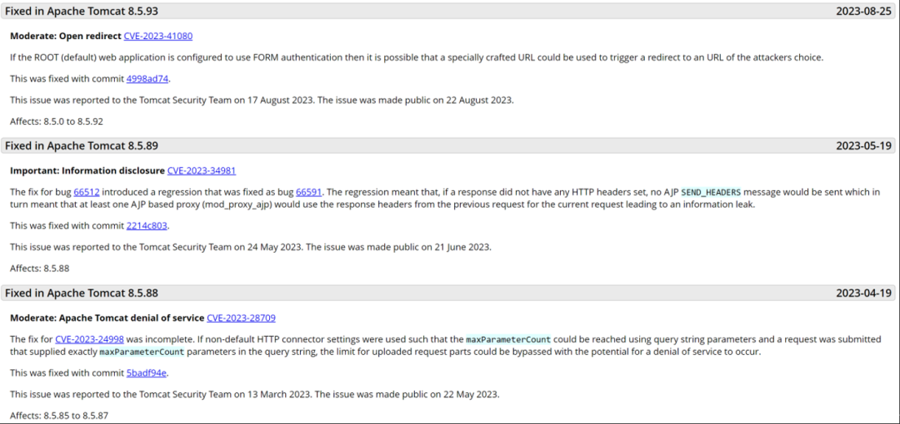
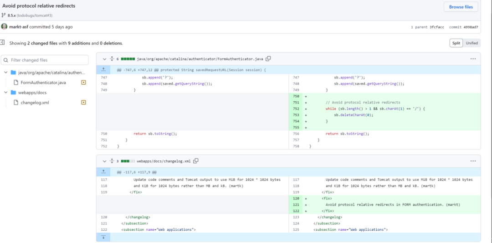
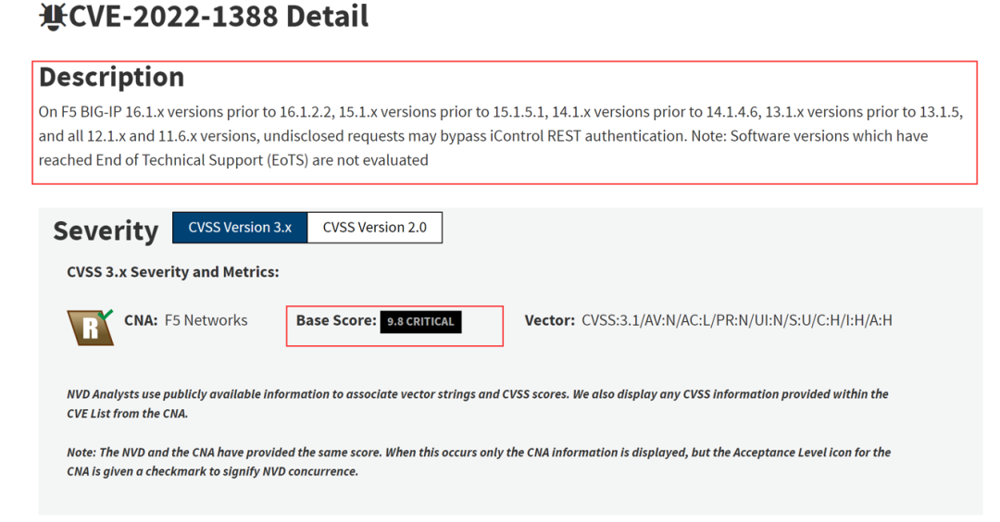
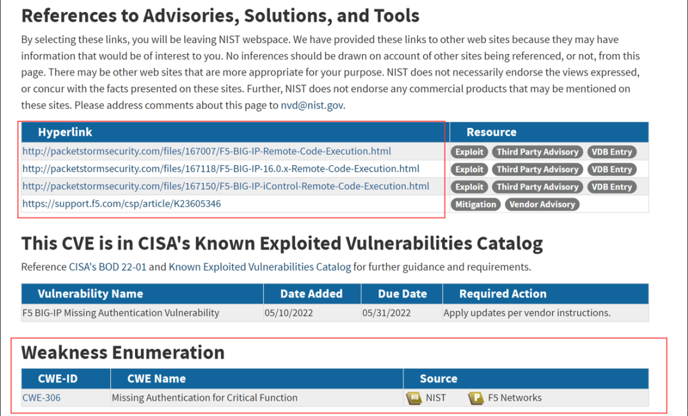
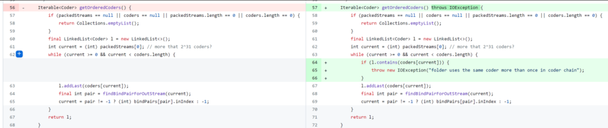
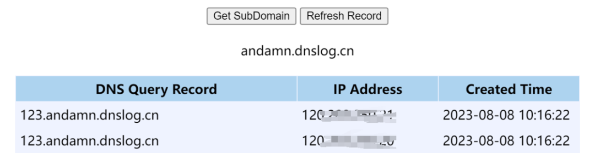
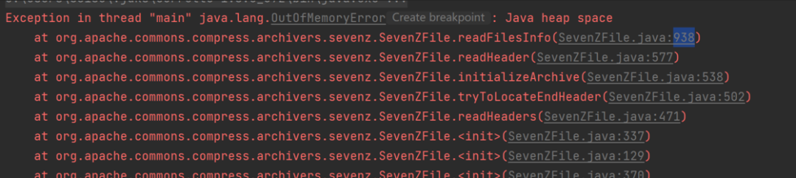
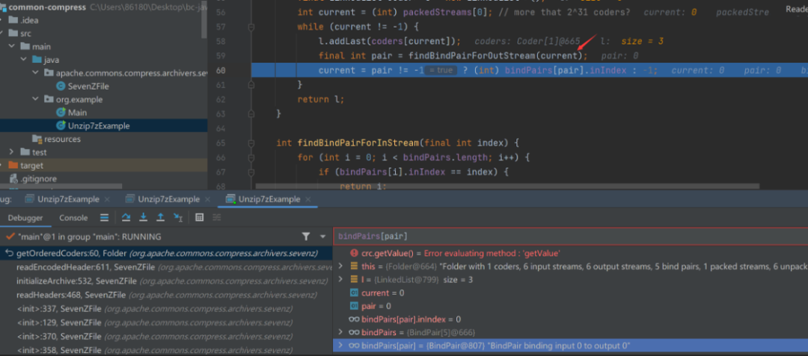

在漏洞研究中，缺乏公开的PoC（Proof of Concept）或Exp（Exploit）的Nday漏洞往往成为安全分析的难点，这类漏洞可能因未公开细节、修复迅速或利用条件苛刻而被忽视，比如面对大量的CVE漏洞，而又对漏洞的简短描述一头雾水，但其中许多漏洞的潜在风险不容小觑。本文旨在系统化拆解无PoC/Exp漏洞的分析方法，尤其是开源软件的安全漏洞分析，覆盖漏洞挖掘、补丁逆向、PoC构造及修复方案设计，为安全研究人员提供一套可落地的实战思路和方法。

## 漏洞信息搜集：情报跟踪和信息扩展

漏洞分析的前提是针对漏洞基本信息做进一步的信息搜集，这个阶段的工作和漏洞情报工作几乎如出一辙，可以采用自行收集的漏洞信息来源，也可以采用自动化工具配合收集。

漏洞信息收集的信息来源分为四类：

**1.官方渠道，负责任的软件官方都会及时披露自己的漏洞修复情况和版本对应关系。**

* 软件官网的“安全公告”页面通常记录CVE编号、影响版本及修复Commit。

* 订阅官方邮件列表或RSS，实时获取漏洞动态。



**2.代码托管平台，针对开源项目的CVE漏洞提交基本都是通过Issue通告维护者，负责的维护者也会在版本发布或PR中披露漏洞修复的情况，通过commit的具体内容（即漏洞补丁）可以逆向分析漏洞的原理和修复的方式，依此可以逆推出漏洞成因，以便编写PoC。另外，也会有人专门分享已经分析后的CVE漏洞的PoC或Exp，但需要注意部分所谓PoC存在恶意后门，所以要谨慎使用。**

* GitHub：当前世界上最大的代码托管平台，也是主流的开源托管平台。

* GitLab/Gitee：部分企业级开源项目可能选择其他平台托管。



**3.漏洞数据库扩展，即基于官方的漏洞信息做的进一步的漏洞信息补充，比如漏洞描述、漏洞评分、第三方链接、CWE-ID，从漏洞描述和CWE-ID可以看出该漏洞是什么类型，部分描述可以看出漏洞产生的文件、函数或者原因（也取决于漏洞提交者的态度），第三方链接可能连接到了利用链接或者修复通告。**

* NVD：重点关注“漏洞描述”中的代码片段和“CWE-ID”分类（如CWE-125越界读取）。

* Exploit-DB/Packet Storm：搜索未公开的利用代码或技术讨论。

* CVE Details：分析漏洞的CVSS评分及历史关联漏洞，推测攻击面。





**4.社区与暗网情报，当然也可以直接通过Google检索漏洞编号，会有安全人员通过自己的博客或官网做漏洞信息的补充，或者进一步的漏洞分析。**

* Reddit的netsec频道：安全人员通常会在该频道做漏洞预警和分析分享。

* Twitter：安全研究人员常在此分享初步分析或者做0-day漏洞预警。

* Telegram/Discord漏洞频道：部分灰产论坛会泄露未公开Exp片段。


除了以上的漏洞信息来源，也可以结合CVE-Search等开源工具来帮助进行漏洞情报和信息跟踪。

## 补丁分析：逆向工程与逻辑推演

补丁分析的本质是代码安全审计和逻辑推演，以漏洞CVE-2021-35515为例，补丁分析可以分为三个步骤。

**1. 代码比对**

可以使用git diff提取补丁内容，并尤其要关注新增的条件判断（如空指针检查、循环终止条件）。



**2. 漏洞根因定位**

根据上图的代码差异，发现漏洞补丁是对于数组的成员进行了校验，校验语句是l.contains(coders\[current\])，而漏洞信息说明该漏洞是一个无限循环漏洞，可以猜想，其漏洞成因可能是该while循环会无限制的迭代，也就是通过逆向推导，该漏洞因current未校验导致无限循环。

观察代码，想要该循环无线循环就需要让current的值始终大于或等于0，且current不能一直增长，所以current最好能恒等于0。

根据代码中current的赋值代码分析，我们发现只要让bindPairs\[pair\].inIndex恒等于0即可。

``` Java
final int pair = findBindPairForOutStream(current);
current = pair != -1 ? (int) bindPairs[pair].inIndex : -1;
```

**3. 漏洞逻辑验证**

如果后续要编写PoC进行漏洞验证，那么我们需要构造能够让其无限循环的数据。但前提是需要对上述的漏洞分析和推导结果进行验证，这个过程可以是实际部署后通过观察和理解程序的功能结构执行，也可以通过常用的请求变更观察响应结果，又或者通过CodeQL做详细的漏洞代码跟踪，如果是二进制文件，则可以使用Ghidra/IDA Pro进行逆向验证，或使用该工具对二进制的补丁进行补丁分析。

## PoC编写：从理论到实战验证

为了验证漏洞的存在，需要进行PoC的编写（PoC的核心是模拟攻击，验证漏洞的可利用性，但并非攻防中实际利用的方式），通过PoC验证漏洞的效果是否符合预期，不同的漏洞利用的效果差异很大，但通过都会基于漏洞原理利用最简单的效果展现作为漏洞存在的证明，比如，对于Java反序列化，XXE或是任意的命令执行漏洞，可以通过touch命令创建文件，或者通过calc命令弹出计算器，又或者访问dnslog生成的网址来判断命令执行是成功（比如CVE-2021-44228）。但这些现象只是漏洞存在的证明，并非是漏洞本身，比如笔者曾经见过因为使用弹框证明XSS漏洞的存在，开发人员使用禁用alert方法的方式来做漏洞修补。



部分漏洞的产生原因只是在于一个函数的使用或不恰当使用，这种情况下，将构造好的数据传入漏洞函数便可以验证效果，其步骤大概分为以下三步：

1. 编写调用漏洞函数的Java代码；

2. 执行该Java文件并传入构造好的恶意数据；

3. 查看漏洞利用效果。

对于DoS等拒绝服务的漏洞可以通过调用函数查看是否Java出现异常来判断，下图是一个内存耗尽漏洞的报错示例。



对于无限循环的漏洞可以通过源代码调试进行分析和验证，比如，下图中程序使用一个参数Count记录代码的执行次数，执行次数过大的时候程序出现了异常。也可以通过软件调试进行逻辑分析，观察循环过程中的变量情况，推理是否存在无限循环漏洞。



## 漏洞修复：从应急到根治

通常一个漏洞得到及时反馈和厂商响应，会有针对漏洞的产品更新或版本更新，对于受影响的企业而言，通用修复方案是将漏洞版本的提升至漏洞不存在的版本，修复版本一般可以从NVD或组件官网上得知。

但许多漏洞并没有这样的待遇（主要取决于漏洞发现者的态度），或者漏洞虽然被通报，但产品更新和升级需要一个很长的时间，因此会产生漏洞爆出后的漏洞利用窗口期（平均是1.5年左右），这时可以利用已有的安全设备或产品进行应急防护，比如防火墙、WAF或RASP等，比如，对于需要通过Web服务利用的漏洞，可以通过流量测进行检测，对传输的数据包进行一些过滤，如果是反序列漏洞的利用，其流量数据中会存在一些利用链使用到的类的字符，使用WAF，IPS对其进行过滤可以防止漏洞的利用。当然这些只是缓兵之计，如果可以的话，最重要的还是要从源码层面进行彻底的修复。

当官方没有对已有的漏洞进行修复，也就是不存在修复版本的时候，就需要手动对代码进行打补丁，这里分为两种情况：

1.在调用漏洞函数的时候对传入的参数进行一次过滤；

2.对软件代码进行修改，在内部函数进行过滤处理（即模拟官方修复漏洞过程）。

## 结语

任何新的漏洞出现后都是需要对漏洞能够进行初步的分析和复现，错误的防护方法等于没有任何防护，又或者由于错误的漏洞分析造成不必要的恐慌，通过掌握漏洞分析的方法，安全人员不仅能验证漏洞风险，更能一起推动开源生态的安全进化。最终，漏洞研究的价值便不仅在于“攻破”，更在于“防御”——为每一行代码构筑护城河。