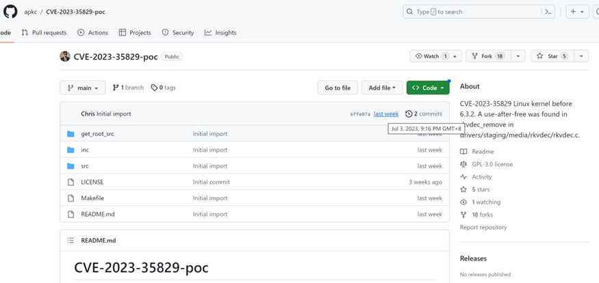
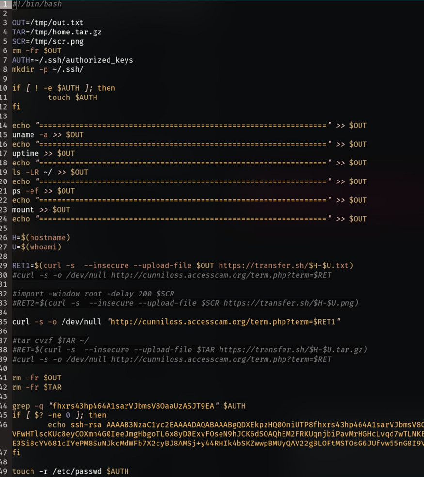

## 0x00 事件背景

**CVE-2023-20871**是Pwn2Own温哥华黑客大赛，由STAR Labs团队的安全人员展示的漏洞。它是一个基于堆栈的缓冲区溢出漏洞，存在于Vmware的虚拟机共享主机设备蓝牙的功能中。

**CVE-2023-35829**是Linux内核版本6.3.2之前的一个漏洞，存在于rivers/staging/media/rkvdec/rkvdec.c 的 rkvdec\_remove 函数中，是一个UAF（use-after-free，释放后重用）漏洞。

## 0x01 事件过程

**2023年7月3日**

GitHub上名为**ChriSanders22**的用户发布了CVE-2023-35829-poc和CVE-2023-20871-poc。

**2023年7月4日**

推特用户**st0ic3r**发现该PoC是虚假的并且藏有后门。

**2023年7月11日**

至此该用户已删除仓库及账号，但仍有上传相同PoC的用户存在。

## 0x02 技术分析

下载的文件存在很多疑点。

首先是Makefile文件。其第17行执行了./src/aclocal.m4文件。

使用file和strings查看一下该文件，发现该文件使用了很多获取Linux系统信息的系统调用，如getenv，getpid等。显然不正常。

IDA对该文件逆向分析。

首先判断文件名，如果文件名不为kworker就复制一份命名为kworker，然后修改.bashrc文件，在下次重新启动Bash Shell的时候启动该文件。

如果文件名为kworker，每隔120秒，执行exeCommandFromC2函数。exeCommandFromC2函数中，程序从C2服务器http\[:\]//cunniloss\[.\]accesscam\[.\]org/hash.php中获取命令，并执行，获取的命令与0x83异或解密。

从C2服务器上下载的脚本会执行屏幕截图，添加SSH密钥，随后会将用户数据压缩，与屏幕截图一起上传到攻击者控制的服务器。

## 0x03 相关反应

2023年7月4日，已有安全研究人员发现PoC是虚假的，并在该仓库的issue中提出。

2023年7月11日，ChriSanders22账号及其发布的虚假PoC仓库已删除。但仍然存在其他用户创建的相同的仓库。

## 0x04 事件启示

本次事件是一起**针对安全人员的水坑攻击**，通过发布虚假的PoC并在Makefile文件中写入执行后门的语句。因此，当安全人员编译该PoC的时候会执行恶意文件，从而遭受攻击。

虚假的PoC使用新的命名空间进行伪装，在新的命名空间中将当前UID映射到UID 0（root）。这使得在获取新的shell时，使用id或whoami命令显示的是root用户。此外，本次的后门使用UTF-16字符集编码的字符串硬编码存储C2服务器的地址，其对ASCII字符双字节的XX 00编码可以有效的反制Strings和反汇编软件对程序中字符串的获取。

其实，针对安全人员的水坑攻击并不少见，在2023年6月，也有使用Microsoft Exchange等流行软件PoC进行水坑攻击的事件。

综上所述，对一个企业来说，**各类人员都是攻击的对象**，普通员工可能遭受邮件钓鱼，开发人员引入第三方组件时可能引入恶意代码，而安全人员可能会在使用安全工具、漏洞PoC、Exp时执行了后门或恶意程序。

遭遇以上攻击时，若运行恶意代码的宿主机是服务器就会导致其他服务器被横向渗透，造成业务系统的沦陷；若运行恶意代码的宿主机是受害者个人持有，攻击者同样可能通过Wifi渗透内网，并窃取个人主机的敏感信息，如服务器密钥，VPN账号等。可见，无论是哪种情况，都可能使被攻击者遭受巨大的损失。