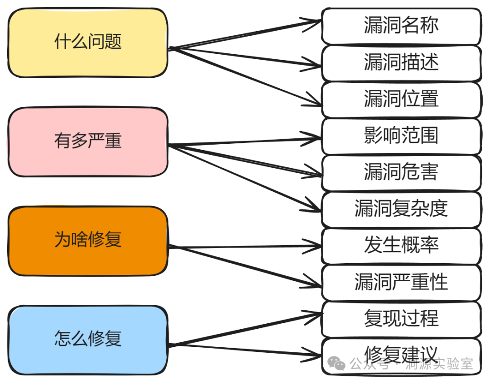

无论是做漏洞研究还是做安全测试，最终都需要以文本的方式将安全漏洞的信息呈现给需要理解漏洞的人，这个人可能是漏洞相关产品所在机构的审核人员，也可能是漏洞所属产品的研发人员，或者是产品经理之类的决策或管理人员。

一份详细且恰当的漏洞报告可以减少漏洞发现者或提交者与上述人员之间的沟通成本，尤其是描述复杂的漏洞。而现实中阅读漏洞报告的接收者对于漏洞详情与漏洞报告者之间常常产生分歧、争议，比如漏洞定级的分歧（报告者认为的定级比接收者理解的高）、漏洞复现的争议（接收者无法复现报告者的漏洞），即便漏洞报告从专业角度一切都没有问题，漏洞接收者也可能会花不少时间理解报告，因为负责修复漏洞的接收者（往往是研发人员）往往是不懂专业的安全术语的。

漏洞报告的根本目的是方便漏洞修复人员理解漏洞，并制定策略、确定优先级、执行修复、排查漏洞和预防同类漏洞再次发生，就像车辆保养时候4S店工作人员反馈车辆问题，收到问题后用户会考虑：

1.  怎么理解问题？听不懂的问题没有意义，可能会白花钱；
    
2.  理解问题之后，问题能有多严重？不严重的问题可能不用处理，可能会白花钱；
    
3.  如果问题严重，怎么证明问题的存在？只是理论上的严重也可以不用处理，可能会白花钱；
    
4.  如果问题存在且严重，需要什么代价，用什么方式处理？过高代价可能不如过段时间换一辆新车。

在一份详细的漏洞报告中，漏洞详情的部分需要体现以下部分：

*   **漏洞名称：** 简洁清晰的标题
    
*   **漏洞描述：** 漏洞的上下文关系、漏洞原理以及利用成功的影响
    
*   **漏洞位置：** 造成漏洞的URL、参数或其他资源
    
*   **影响范围：** 漏洞利用成功受影响的用户、客户或目标人群
    
*   **漏洞危害：** 漏洞利用成功危害情况的简短说明
    
*   **漏洞复杂度：** 漏洞利用条件和难度的简短说明
    
*   **发生概率：** 漏洞被利用这件事发生的概率，比如：低、中、高
    
*   **漏洞严重性：** 结合漏洞危害和发生概率评估的严重性，比如：低危、中危、高危、严重
    
*   **复现过程：** 复现漏洞的逐步操作，需足够详细以确保漏洞接收者可复现
    
*   **修复建议：** 帮助开发者或相关人员修复或缓解漏洞的具体方式
    

## 漏洞名称

**漏洞名称**是对于漏洞信息的简要说明。但简要不同于简单，过于简单的漏洞名称会导致漏洞接收者无法快速理解漏洞含义。

比如国内某品牌漏洞扫描工具导出的扫描报告中的某漏洞的名称是：

> 电话号码

这个漏洞标题简单、粗暴且不明所以，需要漏洞接收者翻阅一系列漏洞位置后，才能在漏洞描述中看到是应用程序的注释或错误信息页面中包含手机号码，可能被用于社会工程学攻击。

如此，这个漏洞名称应该改为：

> https://example.com/ 页面中存在电话号码泄露

或者

> 页面或注释存在电话号码泄露。

漏洞名称中具体的漏洞类型和简要的影响因素可以提供更为详细的漏洞信息，漏洞接收者可以快速判断漏洞情况，决定是否要进一步查看后续的漏洞详情。

## 漏洞描述

**漏洞描述**是对于漏洞名称的详细补充，介绍了漏洞的基本原理和漏洞在应用程序的上下文关系，以及漏洞利用成功的影响。结合应用程序提供的详细、精准的漏洞描述可以让漏洞接收者更准确理解应用程序中的漏洞信息。

以上文漏洞名称中的漏洞类型为例，通用的漏洞描述如下：

> Web应用程序中错误消息或者代码注释中含有电话号码，可能被用于社会工程学攻击。

这段描述中的“社会工程学”会让多数漏洞接收者困惑：社会？工程学？学术？

更为详细的漏洞描述如下：

> https://example.com 路径下包括news等地址在内的页面注释或页面信息中存在手机号码的泄露，该号码可能会被攻击者用于挖掘、检索更多关于企业和员工的信息，造成更大范围的攻击，或伪装成企业内部人员通过手机通讯诱导企业员工做出符合攻击者意图的操作。

## 漏洞位置

**漏洞位置**描述的是发现漏洞存在的应用程序的具体的地址、部分以及相应的参数。

比如：

> URL：https://example.com/news（新闻页面）
> 
> 参数：请求参数page

## 影响范围

**影响范围**从应用程序的业务角度考虑，对于安全研究人员或测试人员来说通常比较难获取，真正使用应用程序的用户或者应用程序的负责人才更清楚的了解影响范围；但从漏洞所在位置的功能，也能够获知大概的影响范围。比如上述漏洞中的电话号码泄露会影响到公司的内部员工或者公司的内部信息保密性。

## 漏洞危害

**漏洞危害**是漏洞描述中漏洞利用成功后的影响结合影响范围综合评估的危害程度。需要更简单明了的说明漏洞一旦被利用成功，对于影响范围内的用户、企业或业务潜在危害情况，危害的考虑分别包括：人身安全、业务稳定性、数据安全性、其他资产安全性、无形资产（品牌、声誉、知识产权、商标等等）。比如，某SQL注入漏洞影响范围是某应用的测试数据，而该应用是企业边缘环境的测试应用，无论漏洞类型和危害多么严重，即便漏洞利用成功，对于企业的用户、员工、业务、数据、资产影响也会非常有限。

## 漏洞复杂度

**漏洞复杂度**是漏洞利用条件和利用难度的说明。尤其是利用条件，所有的受保护对象都存在漏洞，最极端的攻击方式是物理攻击，其攻击难度的天花板是战争手段，但对于漏洞报告而言显然需要更加实际的考虑漏洞利用条件，这可以作为漏洞接收者制定漏洞修复策略的参考之一。

## 发生概率

**发生概率**是对于漏洞复杂度的更加直接表述，即漏洞被利用的可能性有多大。漏洞利用条件越低，利用难度越小，发生概率越大；反之，利用条件越高，利用难度越大，发生概率越小。在渗透测试过程中，电话号码泄露漏洞被利用的发生概率通常是高，但也需要安全人员的专业能力和经验加以判断，对于社工能力不同的安全人员利用难度会不同，因此不同人的判断结果上也可能会不同。

## 漏洞严重性

**漏洞严重性**是结合漏洞危害和漏洞发生概率综合评估的严重性描述。但通常是基于安全研究人员或安全测试人员个人经验判断，也是漏洞报告最容易产生争议的部分，如上文漏洞危害部分的描述，直接按照漏洞类型进行漏洞严重性划分并不严谨，许多个人或漏洞规则中习惯性按照漏洞类型划分漏洞严重性，因而产生争议。倘若如实描述漏洞危害和发生概率，漏洞严重性的描述也会相对客观。国外有的漏洞报告需要安全研究人员或安全测试人员同时填写CVSS评分，也是为了确保漏洞严重性的客观。

## 复现过程

**复现过程**是帮助漏洞接收者按照步骤一步一步重现漏洞发掘的过程，其重点在于描述的步骤和每个步骤的描述。

比如：

> 1\. 访问https://example.com/news?page=1。
> 
> 2\. 在页面中点击鼠标右键，选择“查看网页源代码”。
> 
> 3\. 在网页源代码页面的底部，可以看到存在两个企业员工的手机号码。

如果在复现过程的步骤中需要用到截图展示漏洞的证明（PoC），则需要在截图中通过标注等方式提示漏洞复现过程中提及的漏洞位置、请求、响应等信息。

## 修复建议

**修复建议**是从漏洞报告者对于应用程序和漏洞信息掌握的情况，对于漏洞解决的详细建议。漏洞报告中的漏洞解决思路主要是缓解（降低漏洞发生概率）和规避（避免漏洞发生）。

修复建议需要根据漏洞严重性、影响范围以及应用程序的业务和功能需要提出，一个不良做法是粗暴的写一句“你懂的”，又或者根据漏洞类型的通用修复方式给出不适用于应用程序业务和功能需求的修复方法，比如“关闭Web服务器错误提示；确保代码注释中不含有电话号码”。

企业官方网站中的电话号码信息可能是用于业务联系的，按照上述的修复方法显然是和企业业务需求冲突。因此，需要结合该业务需要编写修复建议：

> 建议将页面中的员工个人手机号码修改为企业座机号码。